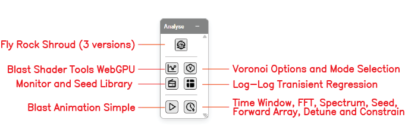

# Analyse Toolbar

The **Analyse** toolbar groups the controls for blast analytics, vibration prediction, monitor management, and timing analysis. It is one of the floating toolbars on the right side of the Kirra workspace.

---

## Toolbar Overview

*The Analyse toolbar with all eight controls labelled.*

The Analyse toolbar contains the following controls:

| Control | Type | Purpose |
|---------|------|---------|
| **Fly Rock Shroud (3 versions)** | Dialog | Generate a 3D flyrock shroud using Richards & Moore, Lundborg, or McKenzie |
| **Blast Shader Tools WebGPU** | Dialog | Open the GPU shader analytics suite — 11 PPV / damage / pressure / powder-factor models |
| **Voronoi Options and Mode Selection** | Dialog | Configure per-cell Voronoi PPV (Modes A / B / C / E / F), monitors, site-law constants, Love-wave settings |
| **Monitor and Seed Library** | Dialog | Bulk export / import of monitors and seed traces — CSV + ZIP bundles |
| **Log-Log Transient Regression** | Dialog | Fit site-law constants (K, B) from measured PPV vs scaled-distance pairs |
| **Blast Animation Simple** | Dialog | Time-stepped animation of the firing sequence |
| **Time Window, FFT, Spectrum, Seed, Forward Array, Detune and Constrain** | Dialog | Open the Time Window analysis dialog (seven tabs) |

---

## Fly Rock Shroud (3 versions)

Generates a 3D flyrock shroud — the predicted maximum throw envelope — for the loaded blast pattern.

### Available models

| Model | Best for |
|-------|----------|
| **Richards & Moore** | Empirical face burst, cratering, and stem eject (2004) |
| **Lundborg** | Diameter-based conservative upper-bound (1975/1981) |
| **McKenzie** | SDoB-based range and velocity prediction (2009/2022) |

### How to use

1. Click the **Fly Rock Shroud** button on the Analyse toolbar
2. Select the model variant
3. Configure parameters (charge mass, SDoB, face angle as required by the chosen model)
4. Click **Generate** to produce the 3D shroud overlay on the canvas

See [Flyrock Modelling](flyrock.md) for the full parameter reference and per-model formulas.

---

## Blast Shader Tools WebGPU

Opens the **Blast Analysis Shader** — the GPU shader suite for PPV, Heelan, Blair, damage, pressure, and powder-factor models.

### How to use

1. Click the **Blast Shader Tools WebGPU** button on the Analyse toolbar
2. Pick a model (11 available — see [Analytics Overview](overview.md))
3. Choose **Render On**: a loaded surface, or **Generate Analysis Plane**
4. Pick **Blast Pattern** to analyse
5. Adjust model parameters
6. Click **Apply Analysis** to render the overlay

See [PPV & Vibration Models](ppv-models.md) for the full model reference.

---

## Voronoi Options and Mode Selection

Opens the **Voronoi Options** dialog — the per-cell, receptor-aware PPV system. Configure monitors, site-law constants, Love-wave parameters, and pick between Modes A / B / C / E / F.

### Available modes

| Mode | Output |
|------|--------|
| **A — PPV Max** | Peak PPV at the cell centroid from the whole pattern |
| **B — Dominant Hole** | Each hole's impact at the binding monitor |
| **C — Compliance** | Worst per-monitor ratio (`thisHolePPV / monitorTarget`) |
| **E — Full Forward Array (PVS)** | Per-hole receptor-aware PVS using full L/T/V synthesis (v1.0.230) |
| **F — Probability of Exceedance** | Per-cell `P(V > V_β)` per Blair 2011 (v1.0.230) |

See [PPV Voronoi Modes](ppv-voronoi-modes.md) for the full reference.

---

## Monitor and Seed Library

Bulk export / import dialog for Voronoi monitors and their attached seed traces.

### Capabilities (v1.0.230)

- **Tabbed dialog** with separate Monitors and Seeds tabs
- **Per-row checkboxes** for selective export
- **Clear DB** buttons per store
- **Export / Export Selected / Import** for both stores
- Monitor export prompts *"Include linked seeds?"* — yes ships a ZIP bundle (`monitors.csv` + `manifest.json` + `seeds/*.bin`)
- Import auto-detects CSV vs ZIP

### How to use

1. Click the **Monitor and Seed Library** button on the Analyse toolbar
2. Pick the tab (Monitors or Seeds)
3. Tick rows to act on, or use the bulk select
4. Click **Export Selected**, **Export** (all), or **Import**
5. When prompted, choose whether to bundle the linked seeds in the monitor export

---

## Log-Log Transient Regression

Opens the site-law fitter — input measured PPV vs scaled-distance pairs and fit the constants **K** and **B** for the standard site law `PPV = K · (D/√W)^(-B)`.

### How to use *[VERIFY: full dialog walkthrough — screenshot needed]*

1. Click the **Log-Log Transient Regression** button on the Analyse toolbar
2. Paste or load measured pairs (distance, charge, PPV)
3. Read the fitted K, B, and the regression R²
4. Apply the fit to a monitor or save it as a site-law profile

> *[SCREENSHOT NEEDED: Log-Log Regression dialog]*

---

## Blast Animation Simple

Time-stepped animation of the firing sequence — plays the holes back in firing order at a chosen speed.

### How to use *[VERIFY: animation dialog controls]*

1. Click the **Blast Animation Simple** button on the Analyse toolbar
2. Set the playback speed
3. Click **Play** — holes light up in firing order
4. Use the scrubber to jump to a specific time

> *[SCREENSHOT NEEDED: Blast Animation Simple dialog]*

---

## Time Window, FFT, Spectrum, Seed, Forward Array, Detune and Constrain

Opens the **Time Window** dialog — Kirra's master timing-and-vibration analysis dialog. Seven tabs share a single blast-pattern scope:

| Tab | What it shows |
|-----|--------------|
| **Time Window** | Histogram of detonation events across time |
| **IDI** | Inter-Detonation Interval — Δt between consecutive events |
| **Spectrum** | FFT of the impulse train — frequency content |
| **Synthesis** | Seed wavelet + reconstructed monitor trace |
| **Forward Array** | Three-component (L / T / V) wave synthesis at a monitor |
| **Detune** | Apply a random offset to detonator timings |
| **Constrain** | Enforce a max-events-per-rolling-window rule |

See [Time Window Dialog](time-window.md) for the full per-tab reference.

---

## Related topics

- [Time Window Dialog](time-window.md) — seven-tab timing analysis
- [Analytics Overview](overview.md) — shader-model background
- [PPV & Vibration Models](ppv-models.md) — site-law and waveform models
- [PPV Voronoi Modes](ppv-voronoi-modes.md) — per-cell receptor-aware PPV
- [Flyrock Modelling](flyrock.md) — Richards & Moore, Lundborg, McKenzie
- [Interface Tour](../getting-started/interface-tour.md) — workspace overview
