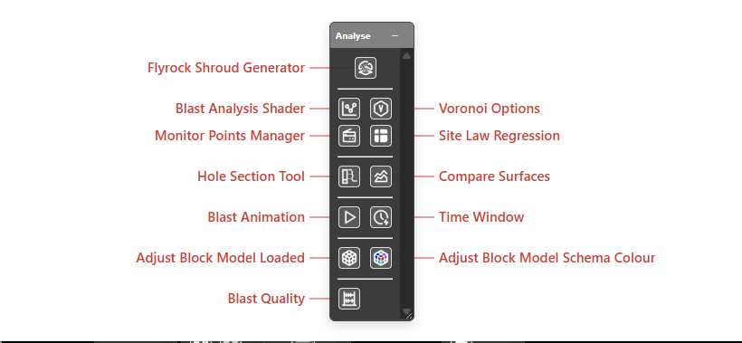
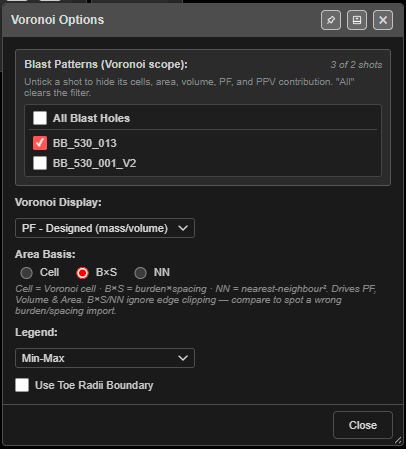
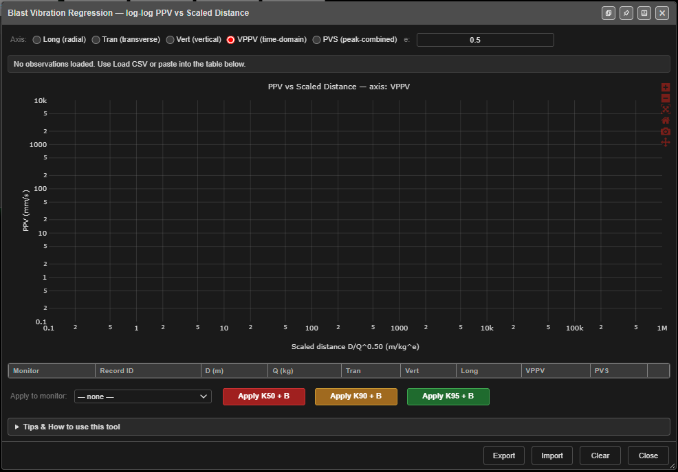
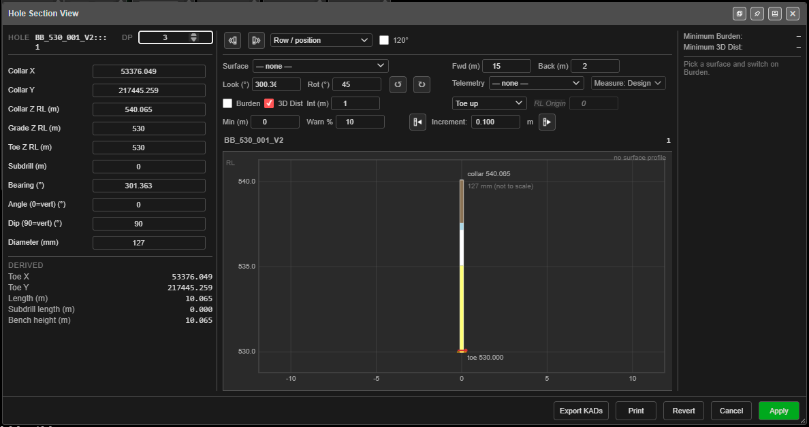
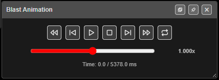
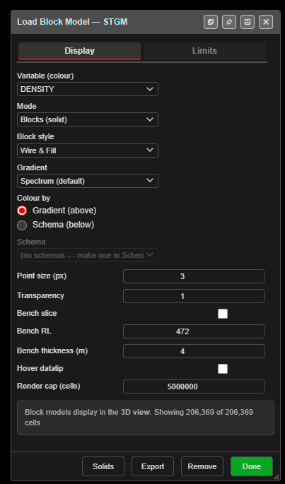
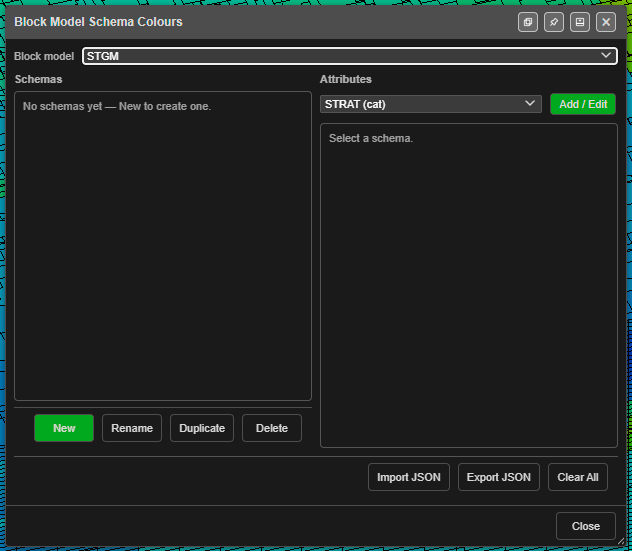

# Analyse Toolbar

The **Analyse** toolbar groups the controls for blast analytics, vibration prediction, monitor management, and timing analysis. It is one of Kirra's eight floating toolbars.

---

## Toolbar Overview

*The Analyse toolbar with its controls labelled.*

The Analyse toolbar contains the following controls (button tooltips shown in bold):

| Control | Type | Purpose |
|---------|------|---------|
| **Flyrock Shroud Generator** | Dialog | Generate a 3D flyrock shroud using Richards & Moore, Lundborg, McKenzie or Roth |
| **Blast Analysis Shader** | Dialog | Open the GPU shader analytics suite — PPV / damage / pressure / powder-factor models |
| **Voronoi Options** | Dialog | Configure per-cell Voronoi PPV modes, monitors, site-law constants, Love-wave settings |
| **Monitor Points Manager** | Dialog | Manage monitors and the seed library — add, import and export (CSV and ZIP bundles) |
| **Site Law Regression — log-log PPV vs Scaled Distance** | Dialog | Fit site-law constants (K, B) from measured PPV vs scaled-distance observations |
| **Hole Section Tool** | Dialog | Section through one hole showing its burden to the face, with staged hole edits |
| **Compare Surfaces** | Dialog | Colour a measured surface by its distance from a design surface |
| **Blast Animation** | Dialog | Play the firing sequence back in time |
| **Time Window** | Dialog | Open the Time Window analysis dialog (eight tabs) |
| **Adjust Block Model Loaded** | Dialog | Adjust the display of the block model currently loaded into the project |
| **Adjust Block Model Schema Colour** | Dialog | Manage the named colour schemas used to render block-model attributes |
| **Blast Quality** | Dialog | Distribution of any hole attribute, and holes filed in the wrong row |

---

## Flyrock Shroud Generator

Generates a 3D flyrock shroud — the predicted maximum throw envelope — for the loaded blast pattern.

### Available models

| Model | Best for |
|-------|----------|
| **Richards & Moore** | Empirical face burst, cratering, and stem eject (2004) |
| **Lundborg** | Diameter-based conservative upper-bound (1975/1981) |
| **McKenzie** | SDoB-based range and velocity prediction (2009/2022) |

### How to use

1. Click the **Flyrock Shroud Generator** button on the Analyse toolbar
2. Select the model variant
3. Configure parameters (charge mass, SDoB, face angle as required by the chosen model)
4. Click **Generate** to produce the 3D shroud overlay on the canvas

See [Flyrock Modelling](flyrock.md) for the full parameter reference and per-model formulas.

---

## Blast Analysis Shader

Opens the **Blast Analysis Shader** — the GPU shader suite for PPV, Heelan, Blair, damage, pressure, and powder-factor models.

### How to use

1. Click the **Blast Analysis Shader** button on the Analyse toolbar
2. Pick a model (see [Analytics Overview](overview.md))
3. Choose **Render On**: a loaded surface, or **Generate Analysis Plane**
4. Pick **Blast Pattern** to analyse
5. Adjust model parameters
6. Click **Apply Analysis** to render the overlay

See [PPV & Vibration Models](ppv-models.md) for the full model reference.

---

## Voronoi Options

Opens the **Voronoi Options** dialog — the per-cell, receptor-aware PPV system. Configure monitors, site-law constants, Love-wave parameters, and pick the mode from the **Voronoi Display** dropdown. You can also open it by right-clicking the **Voronoi** display toggle.

*Voronoi Options, showing the blast scope, the Voronoi Display mode, area basis and legend.*

### Available modes

| Mode | Output |
|------|--------|
| **A — PPV Max** | Peak PPV at the cell centroid from the whole pattern |
| **B — Dominant Hole** | Each hole's impact at the binding monitor |
| **C — Compliance** | Worst per-monitor ratio of the hole's predicted PPV to the monitor's target |
| **E — Full Forward Array (PVS)** | Per-hole receptor-aware PVS using full L/T/V synthesis (v1.0.230) |
| **F — Probability of Exceedance** | Per-cell `P(V > V_β)` per Blair 2011 (v1.0.230) |

See [PPV Voronoi Modes](ppv-voronoi-modes.md) for the full reference.

---

## Monitor Points Manager

Opens the **Monitor Points & Seed Library** dialog — the Voronoi monitors (receptors) and the library of measured seed traces they use.

### Capabilities

- **Tabbed dialog** with separate Monitors and Seeds tabs; the footer buttons change with the tab
- **Monitors tab:** **Add Monitor** (at the data centre), **From Points** (visible KAD points become monitors), **Import** (replace monitors from a CSV), **Export** (all monitors as CSV), **Export Selected** (ticked monitors only)
- **Seeds tab:** **Add Seed** (an Instantel CSV, which opens the clipper, or a processed time / velocity CSV), **Import** (merge a seed library ZIP), **Export** (the whole library as a ZIP), **Export Selected** (ticked rows only), **Refresh**
- Exporting monitors asks whether to include their linked seeds — **Incl. Seeds** saves a ZIP bundle, **Monitors Only** saves the CSV

### How to use

1. Click the **Monitor Points Manager** button on the Analyse toolbar
2. Pick the tab (Monitors or Seeds)
3. Tick the rows to act on
4. Click the footer button you need
5. When exporting monitors, choose whether to bundle the linked seeds

---

## Site Law Regression

Opens the **Blast Vibration Regression — log-log PPV vs Scaled Distance** dialog. It fits the site law `PPV = K · (D/Q^e)^(-B)` to your monitoring observations and plots them on a log-log chart with the fit line. Points more than two standard deviations from the fit (in log space) are flagged as outliers.

### How to use

1. Click the **Site Law Regression** button on the Analyse toolbar
2. Click **Import** and choose a CSV of observations — at least the columns `D, Q, PPV` (add Tran / Vert / Long / VPPV / PVS columns to choose between axes). At least three observations are needed
3. Choose the **Axis** and the charge exponent **e** (0.5, square-root scaling, is normal; 0.333 is cube-root)
4. Read the fit — K50 (median), K90 and K95 — and the RSQ (fit quality)
5. Choose a monitor in **Apply to monitor**, then click **Apply K50 + B**, **Apply K90 + B** or **Apply K95 + B** — the monitor's K and B update and the Voronoi map recomputes

The footer also has **Clear**, **Export** and **Close**. A collapsible **Tips & How to use this tool** panel explains the axes, percentiles and RSQ in more detail.

> K50 is exceeded by half of real shots — use it for investigation, not compliance. K95 is the usual choice for compliance prediction.

*The Site Law Regression dialog (titled Blast Vibration Regression), before any observations are loaded.*

---

## Hole Section Tool

Opens the **Hole Section View** for the selected hole — a section through one hole showing its **burden to the face**, measured against a surface. Hole edits are staged on a copy, so you can try changes and watch the section update before committing them.

### How to use

1. Select a hole (or a group of holes) — the button asks you to select a hole first
2. Click the **Hole Section Tool** button on the Analyse toolbar
3. Choose the **Surface** that represents the face, and adjust the section's **Look (°)** bearing and **Back (m)** / **Fwd (m)** reach if needed
4. Edit the hole's properties (collar, grade and toe RLs, subdrill, bearing, angle or dip, diameter) — the section redraws with the staged changes, marked *staged - not applied*
5. Use the move buttons to nudge the hole towards or away from the face along its bearing, by the set **Increment**
6. Click **Apply** to commit the changes to the hole (undoable), or **Revert** to discard them

### Other controls

- **Previous hole** / **Next hole** step through a selected group; apply or revert staged changes first
- **Min (m)** sets the minimum acceptable burden for colour banding, with **Warn %** setting the amber band above it
- **Burden** reports burden in front of the hole on its own bearing; **3D Dist** reports the shortest distance to the face in any forward direction
- **Print** builds a PDF of the section; **Export KADs** saves the burden paths as KAD entities

Every control, including telemetry and the sampling options: [Section Views — Hole Section View](../reference/section-views.md#hole-section-view).

*The Hole Section View for one hole, before a surface is picked.*

---

## Compare Surfaces

Colours a measured (survey) surface by its signed distance to a reference (design) surface — underdug, on design, or overdug.

1. Click the **Compare Surfaces** button on the Analyse toolbar
2. Choose the **Reference** and **Measured** surfaces, the direction and the **Compare within (m)** distance
3. Click **Apply**

See [Compare Surfaces](../surfaces/compare-surfaces.md) for the full reference.

---

## Blast Animation

Plays the firing sequence back in time — holes are shown as they fire.

### How to use

1. Click the **Blast Animation** button on the Analyse toolbar — the **Blast Animation** transport bar opens
2. Click **Play** — holes light up in firing order; click again to pause
3. Use the play-speed slider to change the speed (the multiplier is shown beside it)
4. Use **Rewind to start**, **Step -0.5ms**, **Step +0.5ms** and **Forward to end** to move through time; **Stop** returns to zero
5. Toggle **Loop** to repeat the playback

The current time is shown as *Time: current / total ms*.

*The Blast Animation transport bar.*

---

## Time Window

Opens the **Time Window** dialog — Kirra's master timing-and-vibration analysis dialog. Eight tabs share a single blast-pattern scope:

| Tab | What it shows |
|-----|--------------|
| **Time Window** | Histogram of detonation events across time |
| **IDI** | Inter-Detonation Interval — Δt between consecutive events |
| **Spectrum** | FFT of the impulse train — frequency content |
| **Seed** | Read-only view of the seed wavelet shape |
| **Synthesis** | Seed wavelet + reconstructed monitor trace |
| **Forward Array** | Three-component (L / T / V) wave synthesis at a monitor |
| **Detune** | Apply a random offset to detonator timings |
| **Constrain** | Enforce a max-events-per-rolling-window rule |

See [Time Window Dialog](time-window.md) for the full per-tab reference.

---

## Adjust Block Model Loaded

Adjusts the display of the geological **block model** already loaded into the project — the gridded model of ore/waste and rock attributes used to inform blast design and analysis. Block models are loaded through the **Import** dialog (**Geology** tab) or by dropping the file on the canvas; this button does not load one, and tells you if none is loaded.

Full reference: [The Load Block Model Dialog](../block-models/load-block-model-dialog.md).

### How to use

1. Click the **Adjust Block Model Loaded** button on the Analyse toolbar — the **Load Block Model** dialog opens for the first loaded model
2. On the **Display** tab, choose the **Variable (colour)**, **Mode** (**Centroids (points)** or **Blocks (solid)**), **Block style**, **Gradient** or schema colouring (**Colour by**), **Point size (px)**, **Transparency**, an optional **Bench slice** (RL and thickness), cut-offs, and the **Hover datatip**
3. On the **Limits** tab, optionally **Limit display to** a box range, above or below a surface, or inside a closed solid
4. Changes apply live — the dialog shows how many cells are displayed out of the total. Click **Done** to close
5. **Solids** builds closed solids from the shown blocks, and **Export** saves them as a block model CSV — see [Export a Section and Build Solids](../block-models/export-and-solids.md). **Remove** unloads the model

---

## Adjust Block Model Schema Colour

Manages named colour **schemas** — site or project colour standards for block-model attributes. A schema holds one colour definition per attribute (rock type, grade, domain, etc.).

### How to use

1. Click the **Adjust Block Model Schema Colour** button on the Analyse toolbar — the **Block Model Schema Colours** dialog opens
2. In the **Schemas** list, create a schema with **New**, or **Rename**, **Duplicate** or **Delete** an existing one
3. Select a schema, pick an attribute and click **Add / Edit** — choose the **Type** (**Ranges (decimal)**, **Discrete values (integer)** or **Categorical (labels)**), set the colours and click **Save**. **Remove** deletes an attribute's colours
4. Use **Import JSON** / **Export JSON** to share schemas between projects
5. To use a schema, open **Adjust Block Model Loaded** and set **Colour by** to **Schema**

---

## Blast Quality

Shows the distribution of any hole attribute across the blast, and finds holes filed in the wrong row. Click the **Blast Quality** button on the Analyse toolbar to open it.

See [Blast Quality](blast-quality.md) for the full reference.

---

## Related topics

- [Time Window Dialog](time-window.md) — eight-tab timing analysis
- [Blast Quality](blast-quality.md) — attribute distributions and row checks
- [Compare Surfaces](../surfaces/compare-surfaces.md) — design vs survey deviation
- [Analytics Overview](overview.md) — shader-model background
- [PPV & Vibration Models](ppv-models.md) — site-law and waveform models
- [PPV Voronoi Modes](ppv-voronoi-modes.md) — per-cell receptor-aware PPV
- [Flyrock Modelling](flyrock.md) — Richards & Moore, Lundborg, McKenzie, Roth
- [Interface Tour](../getting-started/interface-tour.md) — workspace overview
