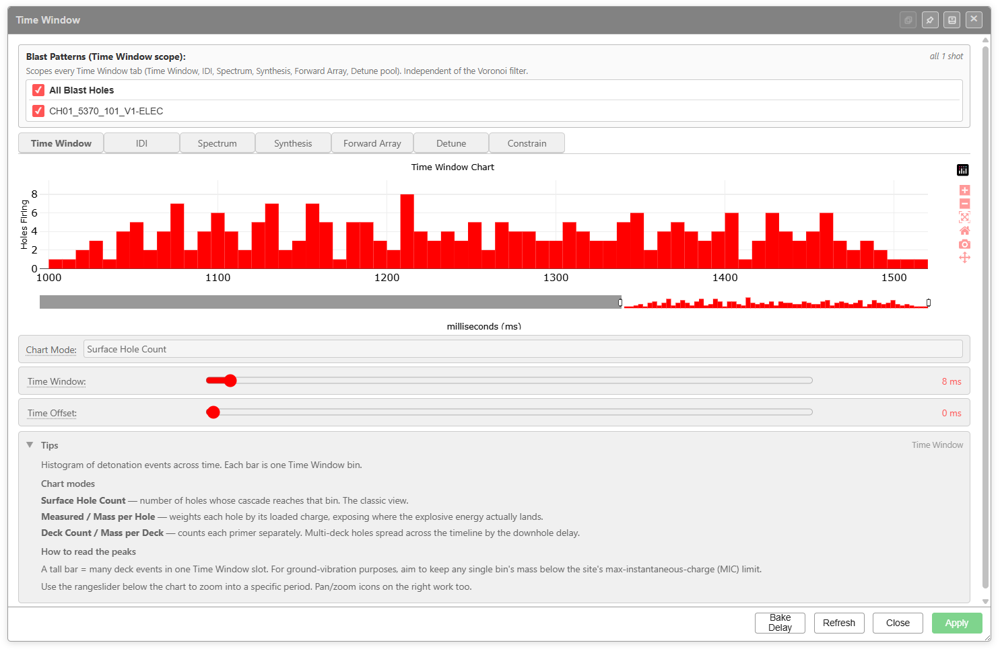
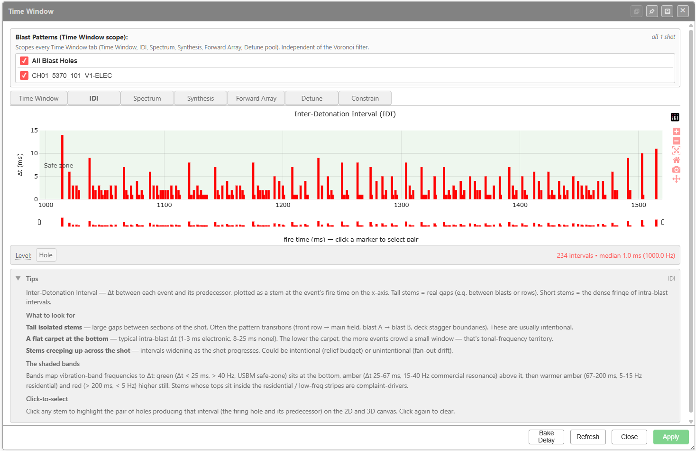
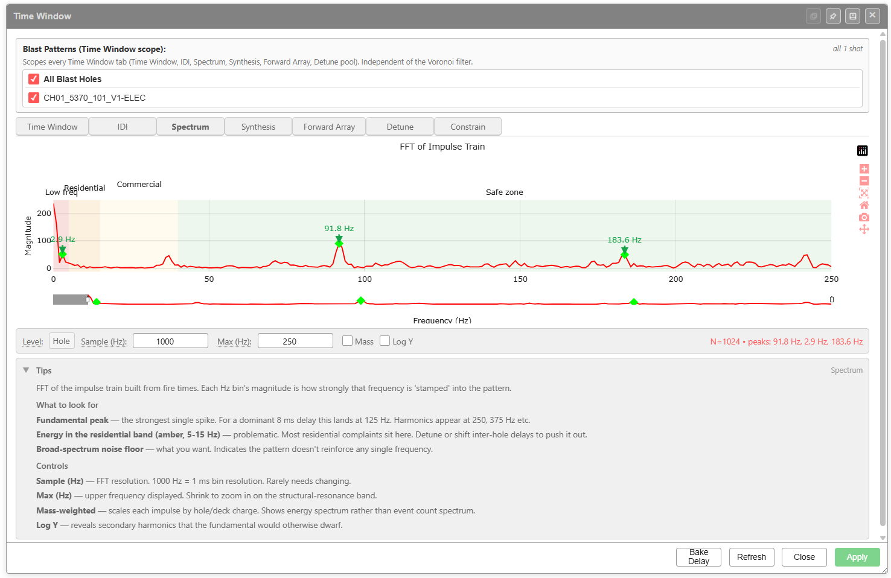
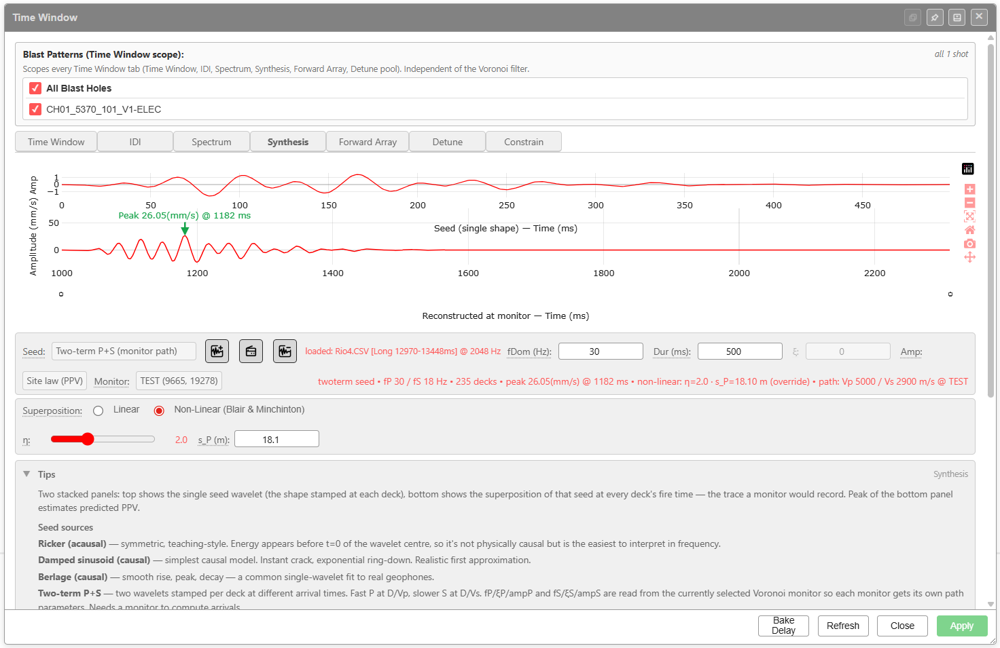
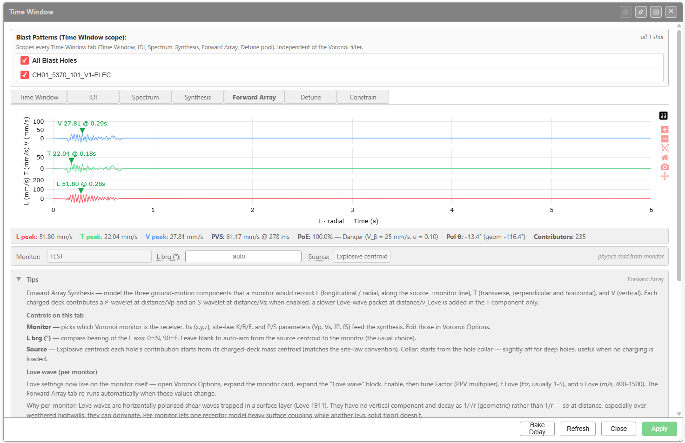
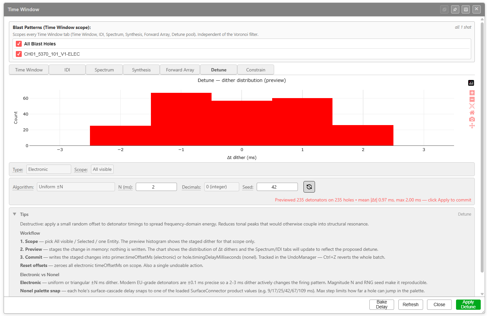
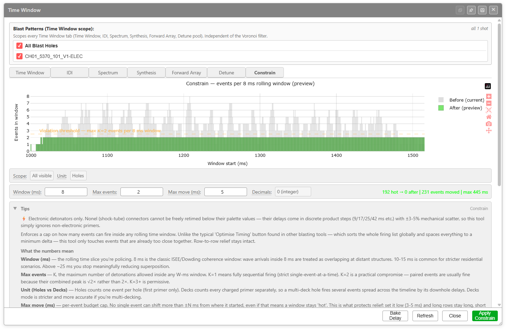

# Time Window Dialog

The **Time Window** dialog is Kirra's timing-and-vibration analysis surface. It groups seven tabs over a shared blast-pattern scope so you can move between event histograms, frequency content, waveform synthesis, and detune actions without losing the selection you're analysing.

The dialog is opened from the **Analyse** toolbar (the **Time Window, FFT, Spectrum, Seed, Forward Array, Detune and Constrain** button — see [Analyse Toolbar](analyse-toolbar.md)).

*The Time Window tab — histogram of detonation events with chart-mode selector, Time Window slider, Time Offset slider, and the in-app Tips panel.*

---

## Shared layout

Every tab shares the same wrapper:

| Region | Purpose |
|--------|---------|
| **Title bar** | Always reads **Time Window**. Dock, pin, minimise, and close controls on the right |
| **Blast Patterns (Time Window scope)** | Per-entity checkboxes — picks which blast patterns feed every tab in the dialog. The header notes *Scopes every Time Window tab (Time Window, IDI, Spectrum, Synthesis, Forward Array, Detune pool). Independent of the Voronoi filter.* |
| **Tabs** | Time Window, IDI, Spectrum, Synthesis, Forward Array, Detune, Constrain |
| **Tab body** | Chart + tab-specific controls |
| **Tips panel** | Collapsible help text written into the app, specific to the active tab |
| **Footer buttons** | **Bake Delay**, **Refresh**, **Close**, **Apply** (the Apply button is renamed **Apply Detune** on the Detune tab) |

The scope panel is independent of the Voronoi monitor filter — what you tick here is what every chart in the dialog operates on.

---

## Time Window tab

Histogram of detonation events across time. Each bar is one Time Window bin.

### Controls

| Control | Purpose |
|---------|---------|
| **Chart Mode** | Choose how each event is weighted: **Surface Hole Count**, **Measured / Mass per Hole**, or **Deck Count / Mass per Deck** |
| **Time Window** slider | Bin width in milliseconds. Default shown above is **8 ms** |
| **Time Offset** slider | Shifts the bins along the time axis. Default **0 ms** |
| Rangeslider under the chart | Zoom into a specific period; pan/zoom icons on the right work too |

### Chart modes (verbatim from the in-app Tips)

- **Surface Hole Count** — number of holes whose cascade reaches that bin. The classic view.
- **Measured / Mass per Hole** — weights each hole by its loaded charge, exposing where the explosive energy actually lands.
- **Deck Count / Mass per Deck** — counts each primer separately. Multi-deck holes spread across the timeline by the downhole delay.

### How to read the peaks

A tall bar = many deck events in one Time Window slot. For ground-vibration purposes, aim to keep any single bin's mass below the site's max-instantaneous-charge (MIC) limit.

---

## IDI tab (Inter-Detonation Interval)

Δt between each event and its predecessor, plotted as a stem at the event's fire time on the x-axis. Tall stems = real gaps (e.g. between blasts or rows). Short stems = the dense fringe of intra-blast intervals.

### Controls

| Control | Purpose |
|---------|---------|
| **Level** | Granularity of the interval calculation. The screenshot shows **Hole** |

### What to look for (verbatim from the in-app Tips)

- **Tall isolated stems** — large gaps between sections of the shot. Often the pattern transitions (front row → main field, blast A → blast B, deck stagger boundaries). These are usually intentional.
- **A flat carpet at the bottom** — typical intra-blast Δt (1-3 ms electronic, 8-25 ms nonel). The lower the carpet, the more events crowd a small window — that's tonal-frequency territory.
- **Stems creeping up across the shot** — intervals widening as the shot progresses. Could be intentional (relief budget) or unintentional (fan-out drift).

### The shaded bands

Bands map vibration-band frequencies to Δt: **green** (Δt < 25 ms, > 40 Hz, USBM safe-zone) sits at the bottom; **amber** (Δt 25-67 ms, 15-40 Hz commercial resonance) above it; then warmer amber (67-200 ms, 5-15 Hz residential); and **red** (> 200 ms, < 5 Hz) higher still. Stems whose tops sit inside the residential / low-freq stripes are complaint-drivers.

### Click-to-select

Click any stem to highlight the pair of holes producing that interval (the firing hole and its predecessor) on the 2D and 3D canvas. Click again to clear.

---

## Spectrum tab (FFT of Impulse Train)

FFT of the impulse train built from fire times. Each Hz bin's magnitude is how strongly that frequency is "stamped" into the pattern.

### Controls

| Control | Purpose |
|---------|---------|
| **Level** | Source granularity — **Hole** in the screenshot |
| **Sample (Hz)** | FFT resolution. **1000 Hz = 1 ms bin resolution**. Rarely needs changing |
| **Max (Hz)** | Upper frequency displayed. Shrink to zoom in on the structural-resonance band |
| **Mass** *(checkbox)* | Mass-weighted. Scales each impulse by hole/deck charge — shows energy spectrum rather than event-count spectrum |
| **Log Y** *(checkbox)* | Log Y axis — reveals secondary harmonics the fundamental would otherwise dwarf |

### Reading the chart (verbatim from the in-app Tips)

- **Fundamental peak** — the strongest single spike. For a dominant 8 ms delay this lands at **125 Hz**. Harmonics appear at 250, 375 Hz etc.
- **Energy in the residential band (amber, 5-15 Hz)** — problematic. Most residential complaints sit here. Detune or shift inter-hole delays to push it out.
- **Broad-spectrum noise floor** — what you want. Indicates the pattern doesn't reinforce any single frequency.

### Frequency-band colouring

| Band | Label | Typical concern |
|------|-------|-----------------|
| Pink/red | **Low freq** | Below structural resonance — building sway |
| Amber | **Residential** | 5-15 Hz residential building resonance |
| Light amber | **Commercial** | Commercial structures, 15-40 Hz |
| Green | **Safe zone** | Above structural resonance |

The peak readout at the bottom (e.g. *peaks: 91.8 Hz, 2.9 Hz, 183.6 Hz*) lists the strongest peaks across the displayed range.

---

## Synthesis tab

Two stacked panels: top shows the single seed wavelet (the shape stamped at each deck); bottom shows the superposition of that seed at every deck's fire time — the trace a monitor would record. Peak of the bottom panel estimates predicted PPV.

### Controls

| Control | Purpose |
|---------|---------|
| **Seed** | Source wavelet shape. Options include **Two-term P+S (monitor path)**, **Ricker (acausal)**, **Damped sinusoid (causal)**, **Berlage (causal)**, plus loaded seed files. The three buttons next to the dropdown are seed-library actions *[VERIFY: button labels for the three icons next to the Seed dropdown]* |
| **fDom (Hz)** | Dominant frequency of the seed |
| **Dur (ms)** | Duration of the seed window |
| **ξ** | Damping parameter (active for damped seeds) |
| **Amp** | Amplitude scale |
| **Site law (PPV)** | Site-law profile used for amplitude scaling |
| **Monitor** | The Voronoi monitor that defines the receptor position and site-law constants |
| **Superposition** | **Linear** or **Non-Linear (Blair & Minchinton)** |
| **η** *(non-linear only)* | Non-linearity exponent. Range slider with numeric readout |
| **s_P (m)** *(non-linear only)* | P-wave saturation distance override |

### Seed sources (verbatim from the in-app Tips)

- **Ricker (acausal)** — symmetric, teaching-style. Energy appears before t=0 of the wavelet centre, so it's not physically causal but is the easiest to interpret in frequency.
- **Damped sinusoid (causal)** — simplest causal model. Instant crack, exponential ring-down. Realistic first approximation.
- **Berlage (causal)** — smooth rise, peak, decay. A common single-wavelet fit to real geophones.
- **Two-term P+S** — two wavelets stamped per deck at different arrival times. Fast P at D/Vp, slower S at D/Vs. fP / ξP / ampP and fS / ξS / ampS are read from the currently selected Voronoi monitor so each monitor gets its own path parameters. Needs a monitor to compute arrivals.

### Status readout

The red line under the seed selector reports the current physics, e.g. *twoterm seed • fP 30 / fS 18 Hz • 235 decks • peak 26.05(mm/s) @ 1182 ms • non-linear: η=2.0 · s_P=18.10 m (override) • path: Vp 5000 / Vs 2900 m/s @ TEST*.

---

## Forward Array tab

Three-component (L / T / V) wave synthesis at a monitor with optional Love-wave packet in the T component. The chart stacks **L** (longitudinal / radial), **T** (transverse), and **V** (vertical) with the peak of each labelled.

### Controls (verbatim from the in-app Tips)

- **Monitor** — picks which Voronoi monitor is the receiver. Its (x,y,z), site-law K/B/E, and P/S parameters (Vp, Vs, fP, fS) feed the synthesis. Edit those in **Voronoi Options**.
- **L brg (°)** — compass bearing of the L axis: 0=N, 90=E. Leave blank to auto-aim from the source centroid to the monitor (the usual choice).
- **Source** — **Explosive centroid**: each hole's contribution starts from its charged-deck mass centroid (matches the site-law convention). **Collar**: starts from the hole collar — slightly off for deep holes, useful when no charging is loaded.

### Love wave (per monitor)

Love settings now live on the monitor itself — open **Voronoi Options**, expand the monitor card, expand the **Love wave** block. Enable, then tune **Factor** (PPV multiplier), **f Love (Hz**, usually 1-5), and **v Love (m/s**, 400-1500). The Forward Array tab re-runs automatically when those values change.

### Status readout

Bottom band reports peaks and risk metrics in this order:

> **L peak** • **T peak** • **V peak** • **PVS** (peak vector sum @ time) • **PoE** (probability of exceedance with V_β / σ) • **Pol θ** (geometric polarisation angle) • **Contributors** (number of decks summed)

The polarisation `Pol θ` is reported as `geom (signed)` — for example *Pol θ: -13.4° (geom -116.4°)*.

### Why per-monitor Love settings

Love waves are horizontally polarised shear waves trapped in a surface layer (Love 1911). They have no vertical component and decay as 1/√r (geometric) rather than 1/r — so at distance, especially over weathered highwalls, they can dominate. Per-monitor lets one receptor model heavy surface coupling while another (e.g. solid floor) doesn't.

---

## Detune tab

Apply a small random offset to detonator timings to spread frequency-domain energy. Reduces tonal peaks that would otherwise couple into structural resonance.

### Controls

| Control | Purpose |
|---------|---------|
| **Type** | **Electronic** or **Nonel** — chooses which timing field the dither writes to |
| **Scope** | **All visible**, **Selected**, or **one Entity** — limits which holes are affected |
| **Algorithm** | **Uniform ±N** or other distribution. The chart previews the staged Δt distribution |
| **N (ms)** | Magnitude of the dither |
| **Decimals** | Rounding (the screenshot shows **0 (integer)**) |
| **Seed** | RNG seed for reproducibility (default **42**) |
| Refresh icon next to Seed | Re-rolls the seed and re-previews |
| **Apply Detune** | Commits the staged dither (the right-hand footer button changes from **Apply** to **Apply Detune** on this tab) |

### Workflow (verbatim from the in-app Tips)

1. **Scope** — pick All visible / Selected / one Entity. The preview histogram shows the staged dither for that scope only.
2. **Preview** — stages the change in memory; nothing is written. The chart shows the distribution of Δt dithers and the Spectrum/IDI tabs will update to reflect the proposed detune.
3. **Commit** — writes the staged changes into `primer.timeOffsetMs` (electronic) or `hole.timingDelayMilliseconds` (nonel). Tracked in the UndoManager — `Ctrl+Z` reverts the whole batch.

**Reset offsets** — zeroes all electronic `timeOffsetMs` on scope. Also a single undoable action.

### Electronic vs Nonel

- **Electronic** — uniform or triangular ±N ms dither. Modern EU-grade detonators are ±0.1 ms precise so a 2-3 ms dither actively changes the firing pattern. Magnitude N and RNG seed make it reproducible.
- **Nonel palette snap** — each hole's surface-cascade delay snaps to one of the loaded SurfaceConnector product values (e.g. 9 / 17 / 25 / 42 / 67 / 109 ms). Max step limits how far a hole can jump in the palette.

### Status readout

After preview the dialog reports *Previewed N detonators on M holes • mean |Δt| X ms, max Y ms — click Apply to commit*.

---

## Constrain tab

Event-rate enforcement — flag events that fall inside a rolling window (preview, with **Before** and **After** counts in the legend). The current screenshot is small; the controls visible are **Scope**, **Level**, **Window (ms)**, **Max events**, and **Max move (ms)**.

> *[SCREENSHOT NEEDED: high-resolution Constrain tab so each control and its tooltip are legible]*

### What this tab does *[VERIFY: full Constrain workflow and what "constrain" writes]*

From the in-app Tips visible in the screenshot:

> Electronic detonators only. Nonel (shock-tube) connectors cannot be freely detuned below their palette values — their delays come in discrete product steps (9/17/25/42/etc) so a >50 ms mechanical solder, so the tool simply ignores non-electronic primers.

The constrain operation appears to detect and reduce window violations by rescheduling electronic detonators within an allowable jitter (**Max move (ms)**) so that no rolling-window slot exceeds **Max events**. The chart shows the rolling-window event count before and after, and tall green stems are violations.

### Suggested workflow *[VERIFY: against current build]*

1. Set **Scope** and **Level** (Hole / Deck)
2. Set the **Window (ms)** — the rolling time window inside which events are counted
3. Set **Max events** — the cap per window
4. Set **Max move (ms)** — the maximum jitter the constrainer is allowed to introduce
5. Preview reports *N violations* and *visualised before/after*
6. Click **Apply** to commit (the change is written into electronic `timeOffsetMs` and is undoable as one batch)

---

## Bake Delay

The **Bake Delay** button at the bottom of the dialog folds any active electronic offsets (`timeOffsetMs`) and detune/constrain results into the underlying timing field so the staged values become the new baseline.

This is the same Bake-onto-Electronic action used in the [Connect Toolbar](../blast-design/connect-toolbar.md).

> *[VERIFY: exact behaviour of Bake Delay button when triggered from the Time Window dialog footer vs the Connect toolbar]*

---

## Related topics

- [Analyse Toolbar](analyse-toolbar.md) — opens this dialog
- [Analytics Overview](overview.md) — GPU shader models and Voronoi PPV
- [PPV & Vibration Models](ppv-models.md) — the underlying site law and waveform models
- [PPV Voronoi Modes](ppv-voronoi-modes.md) — per-cell receptor-aware PPV
- [Electronic Timing Constructs](../blast-design/electronic-timing-constructs.md) — where `timeOffsetMs` is written
- [Connect Toolbar](../blast-design/connect-toolbar.md) — Bake onto Electronic Detonators
