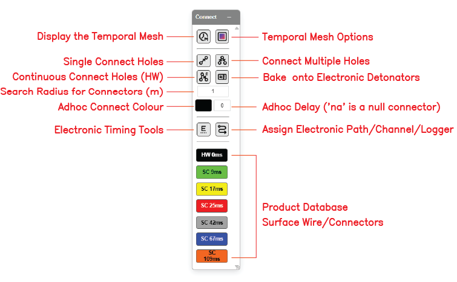

# Connect Toolbar

The **Connect** toolbar groups every control that draws, edits, or interprets timing connections between holes — surface connectors, electronic detonator timing, harness-wire assignment, and the temporal mesh display. It is one of the floating toolbars on the right side of the Kirra workspace.

---

## Toolbar Overview

*The Connect toolbar with all controls labelled.*

The Connect toolbar contains the following controls:

| Control | Type | Purpose |
|---------|------|---------|
| **Display the Temporal Mesh** | Toggle | Show / hide the universal temporal mesh (time as Z) |
| **Temporal Mesh Options** | Dialog | Configure temporal-mesh appearance and behaviour |
| **Single Connect Holes** | Tool | Draw one source → target connector at a time |
| **Connect Multiple Holes** | Tool | Cascade a chain of connectors in one operation |
| **Continuous Connect Holes (HW)** | Tool | Click-by-click chain that stays active for the next chain (v1.0.230) |
| **Bake onto Electronic Detonators** | Action | Fold surface-cascade delays into electronic primer offsets |
| **Search Radius for Connectors (m)** | Input | Snap radius used when picking source / target holes |
| **Adhoc Connect Colour** | Picker | Colour for adhoc connectors |
| **Adhoc Delay** | Input | Delay (ms) for adhoc connectors — `na` is a null connector |
| **Electronic Timing Tools** | Dialog | Open the Electronic Timing dialog and temporal-mesh construct editor |
| **Assign Electronic Path/Channel/Logger** | Dialog | Set harness wire path / channel / commander on selected primers |
| **Product Database (Surface Wire / Connectors)** | List | Pick the surface connector product used by Single / Multi / Continuous connect |

---

## Display the Temporal Mesh

Toggles the **temporal mesh** on or off. The temporal mesh is the triangulated surface in plan view where **Z represents firing time in milliseconds**, not ground elevation. When visible, it gives an immediate read of the firing order across the whole pattern.

### How to use

- Click the **Display the Temporal Mesh** button on the Connect toolbar to toggle visibility
- Mesh appearance is configured via **Temporal Mesh Options** (below)

See [Electronic Timing Constructs](electronic-timing-constructs.md) for how the mesh is built.

---

## Temporal Mesh Options

Opens the temporal mesh configuration dialog — controls for appearance and behaviour of the universal temporal mesh.

> *[SCREENSHOT NEEDED: Temporal Mesh Options dialog]*

### How to use *[VERIFY: full options list against current build]*

1. Click the **Temporal Mesh Options** button on the Connect toolbar
2. Adjust mesh display (wireframe / filled / contour-only)
3. Adjust time-to-elevation scale
4. Close the dialog

---

## Single Connect Holes

Draws **one** surface connector from a source hole to a target hole, using the currently selected product (the highlighted entry in the Product Database list at the bottom of the toolbar).

### How to use

1. Click the **Single Connect Holes** button on the Connect toolbar
2. Click the **source** hole (the hole that fires first)
3. Click the **target** hole (the hole that fires after, with the product's delay)
4. A connector line appears between the two holes
5. Repeat — the tool stays active for the next single connection

### Notes

- The source hole's coloured product chip in the Product Database list is the connector type that will be drawn
- The connector uses the snap radius set in **Search Radius for Connectors (m)**
- Each connection sets **From Hole** and **Delay** on the target hole

---

## Connect Multiple Holes

Cascades a chain of surface connectors across a set of holes in one operation.

### How to use *[VERIFY: pick-by-click vs lasso behaviour]*

1. Click the **Connect Multiple Holes** button on the Connect toolbar
2. Click successive holes to define the chain — each click adds the next link with the current product's delay
3. Right-click or press `Escape` to terminate the chain
4. The tool returns to idle (does not auto-restart a new chain)

---

## Continuous Connect Holes (HW)

Third connector mode alongside Single and Multi. Click-by-click chain continues until an explicit terminator (Escape, right-click, or double-click). The tool **stays active** for the next chain so you can snake row-by-row tie-ups without returning to the toolbar between rows.

*Introduced in v1.0.230.*

### How to use

1. Click the **Continuous Connect Holes (HW)** button on the Connect toolbar
2. Click successive holes to build the chain
3. Press `Escape`, right-click, or double-click to **terminate the current chain**
4. The tool stays active — click another source hole to start the next chain
5. Click the toolbar button again (or change tool) to exit Continuous mode

### Stadium-zone preview

A stadium-shape preview is drawn live in both 2D and 3D as you hover — showing the swept area around the proposed connector.

---

## Bake onto Electronic Detonators

Folds the current surface-cascade delays into the **electronic primer** timing fields. After baking, the firing time stored on each primer reflects the cumulative cascade so the temporal mesh and electronic detonator firing match.

### How to use

1. Make sure the pattern has both surface connectors and Electronic detonators in the charging design
2. Click the **Bake onto Electronic Detonators** button on the Connect toolbar
3. Confirm any prompt to overwrite existing electronic offsets
4. The baked offsets are written to `primer.timeOffsetMs` for every Electronic primer in scope

> **Note:** This is the same Bake-Delay action available in the footer of the [Time Window dialog](../analysis/time-window.md).

---

## Search Radius for Connectors (m)

The pick radius used by Single, Multi, and Continuous connect when snapping to source / target holes. Default shown in the screenshot is **1**.

### How to use

- Click the input box and enter the radius in metres
- Larger values are forgiving on dense patterns; smaller values force precise clicks

---

## Adhoc Connect Colour

Colour used for **adhoc** connectors — connectors drawn without a fixed surface connector product. The picker swatch shows the current colour.

### How to use

1. Click the colour swatch
2. Pick a colour
3. New adhoc connectors use this colour until changed

---

## Adhoc Delay

Delay value (ms) applied to **adhoc** connectors that don't belong to a surface connector product. Default shown is **0**.

| Value | Meaning |
|-------|---------|
| Numeric (e.g. `25`) | Adhoc connector with this delay |
| `na` | **Null connector** — draws the line but contributes zero to the timing chain (cosmetic / topology only) |

---

## Electronic Timing Tools

Opens the **Electronic Timing** dialog — the temporal-mesh construct editor where you draw timing contours, set relief or time-range parameters, and assign holes to a construct.

### Visibility rule

The Electronic Timing toolbar group is **shown automatically** when the loaded charging data includes at least one **Electronic** detonator on any hole (from v1.0.46). It stays hidden when no electronic detonators are present. There is no global "enable experimental electronics" toggle.

### How to use

1. Make sure at least one hole has an Electronic primer in the charging design
2. Click the **Electronic Timing Tools** button on the Connect toolbar
3. The dockable **Electronic Timing** dialog opens
4. Draw a timing contour (polyline or Bézier), set start time and relief (or two contours and a time range), assign holes, and click **Apply & Keep Offsets** or **Apply & Reset Offsets**

See [Electronic Timing Constructs](electronic-timing-constructs.md) for the full reference.

---

## Assign Electronic Path/Channel/Logger

Opens the **Harness Wire Assignment** dialog — set the **harness path**, **channel**, **logger**, and **commander** IDs on selected SurfaceWire / Electronic primers using `HarnessElectronicSystemSpecs`.

### Visibility rule

Same visibility rule as Electronic Timing Tools — appears when charging includes Electronic detonators.

### How to use

1. Select the holes / primers to assign
2. Click the **Assign Electronic Path/Channel/Logger** button on the Connect toolbar
3. Choose the path, channel, logger, and commander from the system specs
4. Click **Apply**

See [Harness Wire Assignment](../charging/harness-wire-assignment.md) for the full reference.

---

## Product Database (Surface Wire / Connectors)

The vertical list at the bottom of the toolbar shows the currently loaded **surface connector products** — these are the delays available to Single / Multi / Continuous connect. The labelled screenshot shows:

| Chip | Type | Delay |
|------|------|-------|
| **HW 0ms** | Harness Wire | 0 ms |
| **SC 9ms** | Surface Connector | 9 ms |
| **SC 17ms** | Surface Connector | 17 ms |
| **SC 25ms** | Surface Connector | 25 ms |
| **SC 42ms** | Surface Connector | 42 ms |
| **SC 67ms** | Surface Connector | 67 ms |
| **SC 109ms** | Surface Connector | 109 ms |

### How to use

- Click a chip to set it as the **active connector product** for new connections
- The active product is what Single / Multi / Continuous connect will draw with
- Products come from the loaded charging design — load a different products CSV to change the available chips

See [Products CSV Reference](../charging/products-csv.md) for product file format.

---

## Related topics

- [Timing Sequences](timing-sequences.md) — connector workflow and timing concepts
- [Electronic Timing Constructs](electronic-timing-constructs.md) — temporal mesh and electronic detonator timing
- [Harness Wire Assignment](../charging/harness-wire-assignment.md) — path / channel / commander IDs
- [Time Window Dialog](../analysis/time-window.md) — timing analysis (FFT, IDI, Detune, Constrain)
- [Holes Toolbar](holes-toolbar.md) — placing and editing holes
- [Interface Tour](../getting-started/interface-tour.md) — workspace overview
