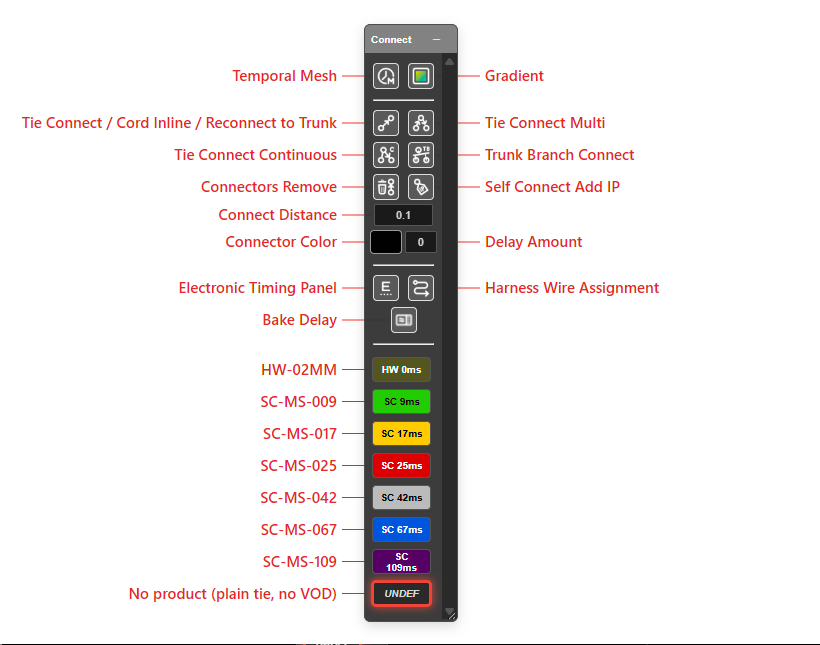

# Connect Toolbar

The **Connect** toolbar groups every control that draws, removes, or interprets timing connections between holes — surface ties, trunks, initiation points, electronic timing, harness-wire assignment, and the temporal mesh display. It is one of the floating toolbars in the Kirra workspace.

---

## Toolbar Overview

*The Connect toolbar with all controls labelled.*

The controls appear in this order (button names are the tooltips you see when you hover):

| Control | Type | Purpose |
|---------|------|---------|
| **Temporal Mesh** | Toggle | Show / hide the temporal mesh (firing time drawn as height) |
| **Gradient** | Toggle | Open the **Temporal Mesh Gradient** dialog — colours, height exaggeration and transparency of the mesh |
| **Tie Connect / Cord Inline / Reconnect to Trunk** | Tool | Tie one hole to another, one pair at a time; also works on trunk runs |
| **Tie Connect Multi** | Tool | Tie every hole along a line between two clicked holes |
| **Tie Connect Continuous** | Tool | Click a zig-zag run through holes or free ground; stays active for the next run |
| **Trunk Branch Connect** | Tool | Walk a trunk line; every hole in the swath is tied in with a branch to the trunk |
| **Connectors Remove** | Tool | Click a tie to delete it |
| **Self Connect Add IP** | Tool | Add or remove an initiation point (the hole or cord run the blast is lit from) |
| **Connect Distance (m)** | Input | Capture distance used by the Multi, Continuous and Trunk Branch tools. Default **2.0** |
| **Connector Color** | Picker | Colour of new ties. Default red |
| **Delay Amount (ms)** | Input | Delay of new ties. Default **25** |
| **Electronic Timing Panel** | Toggle | Open the **Electronic Timing** dialog |
| **Harness Wire Assignment (Channel / Commander)** | Tool | Click a hole to set its harness path, unit, channel colour and primer order |
| **Bake Delay (electronic + nonel→electronic conversion)** | Action | Convert the surface timing onto electronic primer delays |
| **Connector product chips** | Buttons | One chip per surface connector product in the product list, plus **UNDEF** |

> **Tip:** Clicking the **same hole twice** with Tie Connect, Tie Connect Multi or Tie Connect Continuous makes that hole an **initiation point** (the hole the blast is lit from). The **Self Connect Add IP** tool does the same thing with a dialog for its start time.

---

## Temporal Mesh

Toggles the **temporal mesh** on or off. The temporal mesh is a triangulated surface built from every visible hole that has a firing time — nonel and electronic alike — where **height represents firing time in milliseconds**, not ground elevation. It gives an immediate read of the firing order across the whole pattern.

- Click **Temporal Mesh** to show it; click again to hide it.
- The mesh rebuilds itself whenever timing changes, so it stays in step with your ties.
- Appearance is set with the **Gradient** button (below).

See [Electronic Timing Constructs](electronic-timing-constructs.md) for how timing constructs build their own meshes.

---

## Gradient

Opens the **Temporal Mesh Gradient** dialog. Every change applies live — there is no Apply button.

| Setting | What it does |
|---------|--------------|
| **Time Gradient** | Colour stops along the time range. Drag the middle stops to move them; the first and last stops are fixed. Use the add button to insert a stop in the widest gap, and the × on a stop to remove it (at least two stops remain) |
| **Reset** | Returns the gradient to the default: blue → red, 70% opacity, Z magnification 1 |
| **Z Magnification** | Height exaggeration of the mesh, **0.1** (flat) to **5** (strong). Default **1**. Resets to 1 whenever the mesh is switched off |
| **Transparency** | Opacity from 0 (fully transparent) to 1 (fully opaque). Default **0.7** |

Footer buttons:

- **Export Mesh** — saves the current temporal mesh as a DXF of 3D faces. Height in the file is the raw firing time in ms (no exaggeration). The mesh must be built first — switch on **Temporal Mesh**.
- **Close** — closes the dialog and releases the **Gradient** button.

---

## Tie Connect / Cord Inline / Reconnect to Trunk

Ties **one** hole to another using the current **Delay Amount** and **Connector Color** (or the selected product chip).

### How to use

1. Click **Tie Connect / Cord Inline / Reconnect to Trunk**.
2. Click the **source** hole (the hole that fires first).
3. Click the **target** hole. A tie is drawn from source to target and timing recalculates.
4. The tool stays active — click the next source hole.

### Special clicks

| Click | Result |
|-------|--------|
| The same hole twice | That hole becomes an **initiation point** |
| A trunk run while a hole is held (source clicked first) | The held hole is **re-attached** to that trunk |
| A trunk run while a cord connector product chip is selected | The connector is **placed inline** on the trunk |
| A trunk run with nothing held | The trunk's end becomes the start of a new tie |

---

## Tie Connect Multi

Ties a whole line of holes in one go.

1. Click **Tie Connect Multi**.
2. Click the **first** hole of the line.
3. Click the **last** hole of the line. Every hole within **Connect Distance** of the straight line between the two is tied in order, each fed by the one before it.
4. The tool stays active for the next line. Click the same hole twice to make it an initiation point.

---

## Tie Connect Continuous

Builds a chain run by run, the way a shotfirer walks the bench.

1. Click **Tie Connect Continuous**.
2. Click a hole to start from it (it becomes the head of the chain), or click empty ground to start a run in free space.
3. Keep clicking — on holes or on free ground. Each click lays a run segment, and every hole within **Connect Distance** of that segment is tied in, in order along the run. The last hole reached becomes the head for the next segment.
4. End the current chain with **Escape**, **right-click** or **double-click**. The tool stays active — the next click starts a new chain.
5. Clicking the chain's head hole again makes it an initiation point and ends the run.

A run that captures no holes still moves the run forward, so you can step around an obstacle without breaking the chain. A stadium-shaped preview of the capture zone follows the cursor.

---

## Trunk Branch Connect

Lays a **trunk line** through free ground. Every hole in the swath is tied into the chain and a **branch** is drawn from the hole out to the trunk. The firing order is the same as a Continuous run; the difference is that the trunk is kept as its own line on the plan.

### Before you start

Select a **connector product chip** first. Trunk Branch Connect lays harness wire, detonating cord or bell wire. It refuses:

- No product selected — *"Trunk & Branch needs a surface connector product. Pick a preset first."*
- A cord connector product (a DRC-type device) — a connector is spliced into a line, not laid as one. Lay the trunk with a cord product, then place the connector on it with **Tie Connect**.

### How to use

1. Select a connector product chip.
2. Click **Trunk Branch Connect**. Connector display is switched on automatically.
3. Click to place trunk vertices. Clicks do **not** snap to holes — the trunk follows the ground you click. Landing directly on a hole collar picks that hole.
4. Holes within **Connect Distance** of each segment are tied in as you go — ties are written click by click.
5. Finish the trunk with **Enter**, **Escape**, **double-click** or **right-click**. The status bar confirms *"Trunk … complete. Click to start another."*

| Key | Action |
|-----|--------|
| **Enter** / **Escape** | Finish the current trunk |
| **Backspace** / **Delete** | Remove the last trunk segment (never the whole trunk) |

---

## Connectors Remove

Deletes individual ties. Re-tying a hole used to replace its old tie, but cord products can feed a hole from several directions, so removal is an explicit tool.

1. Click **Connectors Remove**. Connector display is switched on automatically.
2. Hover over a tie — the tie a click would remove is highlighted.
3. Click the tie line to delete it, or press **Delete** / **Backspace** to delete the highlighted tie.

If you click empty ground the status bar says *"No tie under the cursor — click on the connector line itself."* Works in 2D and 3D.

---

## Self Connect Add IP

Adds or removes an **initiation point** — the place the blast is lit from. In Kirra an initiation point is a hole tied to itself; this tool gives that a name and a dialog.

| Click on | Result |
|----------|--------|
| A hole that is **not** an initiation point | It becomes one, and the **Initiation Point** dialog opens |
| A hole that **is** an initiation point | The initiation point is removed — the hole becomes untied |
| A cord trunk run (away from a collar) | An initiation is added to the trunk at that spot, or removed if one is already there |

The **Initiation Point** dialog has:

- **Connector** — pick the surface product that lights this point, or leave **— Manual (no product) —**. Picking a product fills the time from it.
- **Start Time (ms)** — when this initiation point fires. **0** means the blast starts here.
- **Apply** sets the product and time. **Ignore** keeps the plain initiation point with its current time.

> **Note:** Removing an initiation point unties the hole, so every hole fed from it loses its firing time. The status bar reports how many downstream holes are affected.

---

## Connect Distance, Connector Color and Delay Amount

| Input | Default | Notes |
|-------|---------|-------|
| **Connect Distance (m)** | **2.0** | How far from the line or run a hole may be and still be tied in by Multi, Continuous and Trunk Branch Connect. Range 0–100 |
| **Connector Color** | Red | Colour of new ties |
| **Delay Amount (ms)** | **25** | Delay of new ties. Range −1000 to 1000 |

Notes on **Delay Amount**:

- A delay you type by hand carries **no travel time**. Only connector products chosen from the chips add the product's signal travel time.
- Type `na`, `n/a`, `null` or `nan` for a **null connector** — the tie is drawn but carries no delay value.
- The last values you used are remembered next time Kirra opens.

---

## Connector Product Chips

Below the inputs, the toolbar shows one coloured chip for each **surface connector product** in the loaded product list, labelled with a type prefix and the delay — for example `SC 25ms`.

| Prefix | Product type |
|--------|--------------|
| **SC** | Surface connector |
| **HW** | Surface wire (harness wire or bell wire) |
| **DC** | Detonating cord |
| **CC** | Cord connector (e.g. a DRC or bridging detonator) |

- Click a chip to make it the active product. It sets **Delay Amount** and **Connector Color**, and new ties carry that product (including its signal travel time).
- **UNDEF** means no product is selected. Ties made in this state draw a plain arrow and have no travel time. When Kirra opens, UNDEF is the active state — pick a chip before tying if you want product ties.
- The chips come from the product list. Load or edit products to change them — see [Products CSV Reference](../charging/products-csv.md).

---

## Electronic Timing Panel

Opens the **Electronic Timing** dialog — the timing-construct editor where you draw timing contours (polyline or Bézier), set relief or a time range, assign holes, and apply with **Apply & Keep Offsets** or **Apply & Reset Offsets**. The dialog footer also has **Bake Delay** and **Close**.

The button is always available; it does not depend on the charging design containing electronic detonators.

See [Electronic Timing Constructs](electronic-timing-constructs.md) for the full reference.

---

## Harness Wire Assignment (Channel / Commander)

Puts Kirra into harness-assignment mode (the cursor becomes a crosshair). Click a hole to open the **Harness Wire Assignment** dialog for it. Clicking a **trunk vertex** assigns the hole at the head of that trunk's chain.

The dialog shows the hole and its electronic system, and has fields for the path, unit, **Channel Colour** and **Primer Order** (**Top to Bottom** or **Bottom to Top**). The path and unit labels follow the electronic system's own terms. Click **Assign** to apply.

Click the button again to leave the mode. See [Harness Wire Assignment](../charging/harness-wire-assignment.md) for the full reference.

---

## Bake Delay

Converts the surface timing — connector delays and nonel cascade times — onto **electronic primer delays** for the visible holes. It is a one-click action: the button does not stay pressed.

1. Click **Bake Delay**.
2. If holes have no detonator, or carry nonel, electric or cord primers that cannot hold a programmed time, Kirra first offers to **Add** or **Replace** them with an electronic detonator and booster. You choose the products from the catalogue, or let Kirra create generic ones.
3. The **Bake fire time onto primers?** dialog asks what to do with the surface chain afterwards:

| Option | Result |
|--------|--------|
| **Keep surface chain** | Ties stay drawn; per-hole surface delays become 0 ms (the time is now on the primer) |
| **Reset connections** | Every hole is tied to itself; surface ties removed, surface delays set to 0 ms |
| **Build harness (rowID / posID)** | Resets connections, then rebuilds a harness chain from each hole's row and position |

4. Click **Bake**. Holes with no firing time are left alone. The bake can be undone with **Ctrl+Z**.

Kirra remembers the option you chose for next time. The same action is available from the [Time Window dialog](../analysis/time-window.md) and the Electronic Timing dialog.

---

## Related topics

- [Timing Sequences](timing-sequences.md) — connector workflow and timing concepts
- [Electronic Timing Constructs](electronic-timing-constructs.md) — temporal mesh and electronic detonator timing
- [Harness Wire Assignment](../charging/harness-wire-assignment.md) — path / channel / commander IDs
- [Time Window Dialog](../analysis/time-window.md) — timing analysis (FFT, IDI, Detune, Constrain)
- [Holes Toolbar](holes-toolbar.md) — placing and editing holes
- [Interface Tour](../getting-started/interface-tour.md) — workspace overview
