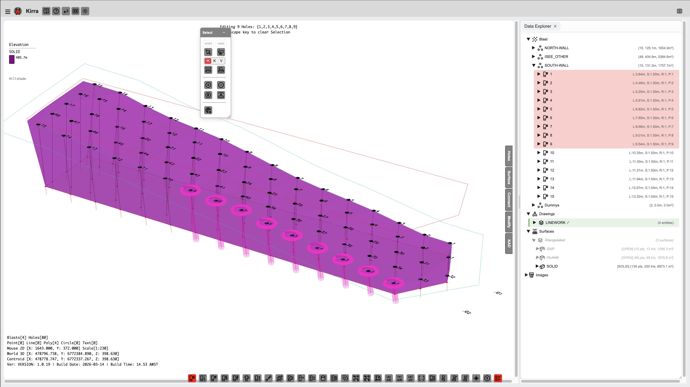
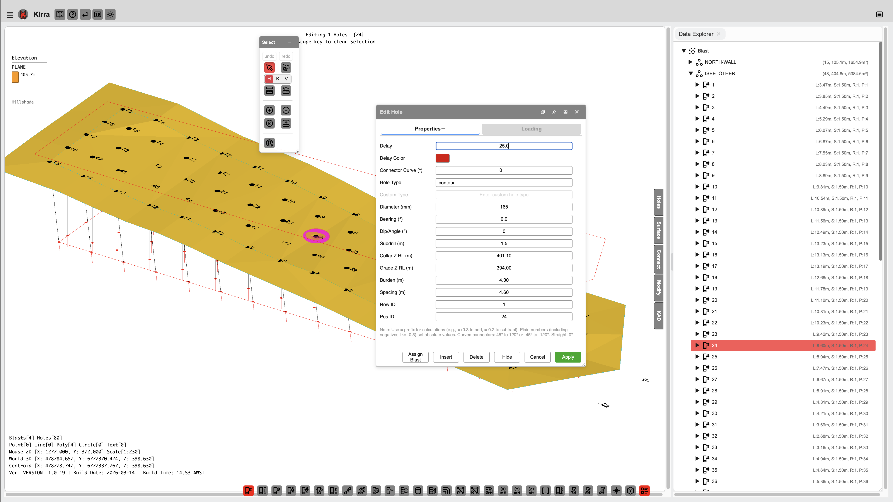

# Editing Holes

Once holes are on the canvas — whether manually placed, imported from a file, or generated as a pattern — you can select, move, modify, and delete them individually or in bulk.

*Selecting entities in the Data Explorer highlights them on the canvas.*

---

## Selecting Holes

### Single Selection

- Click any hole symbol on the canvas
- The hole highlights in the selection colour (default: orange)
- Properties appear in the right panel

### Multi-Selection

| Method | How |
|--------|-----|
| **Shift+Click** | Add individual holes to the current selection one at a time |
| **Box select** | Click and drag a rectangle on the canvas — all holes inside are selected |
| **Ctrl+Click** | Toggle individual holes in or out of the current selection |
| **Ctrl+A** | Select every hole in the project |
| **Select Row** | Right-click a hole and choose **Select Row** to select all holes sharing the same row |

### TreeView Selection

The TreeView panel on the left shows all entities (patterns) and their holes in a tree structure.

- Click an **entity name** to select all holes in that pattern
- Click an **individual hole node** to select just that hole
- Hole nodes in the TreeView use the ID format: the entity name and hole ID separated by a special delimiter

> **Tip:** Use the TreeView to quickly find and select holes by name, especially in large patterns with many overlapping holes.

### Viewing Hole Properties

Right-click a hole to access its properties and context menu:

*Right-click a hole to view and edit properties, charge details, timing, and more.*

---

## Moving Holes

### Drag to Move

1. Select one or more holes
2. Click and hold on a selected hole, then drag it to a new position
3. Release to drop at the new location
4. All coordinates (collar, toe, grade) update automatically

> **Tip:** Hold `Shift` while dragging to constrain movement to horizontal or vertical only.

### Move by Offset

1. Select the holes you want to move
2. Right-click and choose **Move by Offset** (or press `M`)
3. Enter delta Easting (dE) and delta Northing (dN) values
4. Click **Apply** — holes shift by exactly that amount

### Enter Coordinates Directly

1. Select a single hole
2. In the right panel, edit the **Easting** and **Northing** fields directly
3. Press `Enter` or `Tab` — the hole jumps to the new position

---

## Modifying Hole Properties

### Individual Hole

1. Select the hole
2. Edit any field in the right panel: ID, Depth, Diameter, Bearing, Angle, Subdrill, Elevation, Hole Type, or other attributes
3. Changes apply immediately
4. Dependent values (hole length, grade position, etc.) are recalculated automatically

Alternatively, **right-click** the hole and choose **Properties** to open the full Hole Properties dialog.

### Bulk Edit

1. Select two or more holes
2. The right panel shows a **bulk-edit form**
3. Fields that differ across the selection show `(mixed)` — type a new value to apply it to all selected holes
4. Fields left blank remain unchanged
5. Press `Enter` or click **Apply**

Common bulk-edit operations:

- Change hole type for all selected holes (e.g. Production to Presplit)
- Update diameter across a selection (e.g. 115 mm to 165 mm)
- Adjust angle for all selected holes
- Set a new colour for visualisation

---

## Deleting Holes

1. Select the holes to remove
2. Press `Delete` or `Backspace` (or right-click and choose **Delete**)
3. Undo with `Ctrl+Z` if needed

---

## Rotating a Selection

1. Select the holes to rotate
2. Click **Pattern > Rotate**, or right-click and choose **Rotate Selection**
3. Enter the rotation angle in degrees (positive = clockwise)
4. Choose the **pivot point**: centroid of the selection, or click a custom point on the canvas
5. Click **Apply**

> **Note:** Rotation adjusts the X and Y coordinates of each hole. Z elevations and hole orientations (angle, bearing) are preserved.

---

## Mirroring a Selection

1. Select the holes to mirror
2. Click **Pattern > Mirror**, or right-click and choose **Mirror Selection**
3. Choose axis: **Horizontal** (flip North/South) or **Vertical** (flip East/West)
4. Click **Apply**

---

## Scaling a Selection

1. Select all holes in the pattern
2. Click **Pattern > Scale**
3. Enter scale factors for X and Y
4. Click **Apply**

This is useful for adjusting burden and spacing across an entire pattern.

---

## Renumbering Holes

1. Select the holes to renumber (or press `Ctrl+A` for all)
2. Click **Pattern > Renumber**
3. Set the prefix, start number, and sort order (by row, by easting, by northing, or by current number)
4. Click **Apply** — Hole IDs update throughout the project, including any timing and charge references

---

## Automatic Pattern Analysis

Kirra uses HDBScan clustering to automatically determine pattern structure for your holes:

| Calculated Property | Description |
|-------------------|-------------|
| **Row ID** | Which row each hole belongs to |
| **Position ID** | Position within the row |
| **Burden** | Distance to the next row |
| **Spacing** | Distance to the next hole in the same row |

These values are calculated automatically and can be viewed in the right panel or exported with your data. They enable row-based operations, pattern statistics, and burden/spacing analysis.

---

## Undo / Redo

All editing operations support undo and redo:

- `Ctrl+Z` — undo the last action
- `Ctrl+Y` or `Ctrl+Shift+Z` — redo

---

## Related Topics

- [Adding Holes](adding-holes.md) — place individual holes manually
- [Hole Properties Reference](../reference/hole-properties.md) — every field explained
- [Pattern Generation](pattern-generation.md) — generate patterns automatically
- [Timing Sequences](timing-sequences.md) — assign initiation delays
