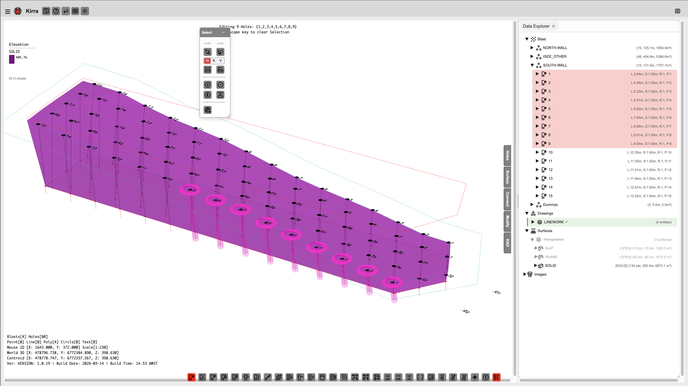
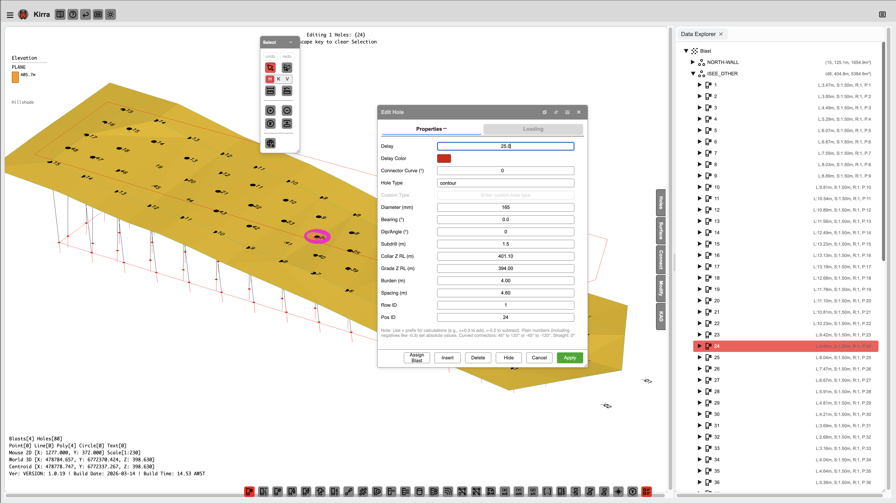

# Editing Holes

Once holes are on the canvas — whether manually placed, imported from a file, or generated as a pattern — you can select, move, modify, and delete them individually or in bulk.

*Selecting entities in the Data Explorer highlights them on the canvas.*

---

## Selecting Holes

### Single Selection

- With **Pointer Select** on (Select toolbar), click any hole on the canvas
- A plain click replaces the current selection with that hole

### Multi-Selection

| Method | How |
|--------|-----|
| **Shift+Click** | Add individual holes to the current selection one at a time |
| **Polygon Select** | Use the Select toolbar's polygon / shape selection to select every hole inside an area — see [Select Toolbar](../reference/select-toolbar.md) |

### TreeView Selection

The TreeView panel on the left shows all entities (patterns) and their holes in a tree structure.

- Click an **entity name** to select all holes in that pattern
- Click an **individual hole node** to select just that hole

> **Tip:** Use the TreeView to quickly find and select holes by name, especially in large patterns with many overlapping holes.

### Viewing Hole Properties

Right-click a hole to open the **Edit Hole** dialog for it (or for the whole selection, if the hole is part of one):

*Right-click a hole to view and edit properties, charge details, timing, and more.*

---

## Moving Holes

### Drag to Move

1. Select one or more holes
2. Click the **Move** button on the [Modify toolbar](../kad/modify-tools.md#move)
3. Click and drag on the canvas to move the selection
4. Release to drop at the new location — collar, grade and toe move together

> **Dropping on another hole:** if a moved hole lands on top of another hole **in the same blast**, Kirra shows a coincidence warning on drop and lets you **Keep** the move or **Revert** (snap the moved hole(s) back to where they started). See [Hole coincidence](#hole-coincidence) below.

---

## Modifying Hole Properties

### Individual Hole

1. Right-click the hole — the **Edit Hole** dialog opens
2. On the **Properties** tab, edit fields such as **Hole Type**, **Diameter (mm)**, **Hole Pivot Location**, **Bearing (°)**, **Dip/Angle (°)**, **Subdrill (m)**, **Collar Z RL (m)**, **Grade Z RL (m)**, **Burden (m)** and **Spacing (m)**
3. Click **Apply** — dependent values (hole length, grade and toe position) are recalculated

The dialog also has **Additional**, **Loading** and **Text** tabs, and footer buttons **Hide**, **Delete**, **Insert** and **Assign Blast**.

### Bulk Edit

1. Select two or more holes
2. Right-click one of the selected holes — the **Edit Hole** dialog opens for the whole selection (with **Properties**, **Additional** and **Text** tabs)
3. Fields that differ across the selection are left empty with a hint such as *varies (avg: 115)*; list fields are marked **(multiple)**. Type or pick a new value to apply it to all selected holes
4. Fields left unchanged stay as they are on each hole
5. Click **Apply**

Common bulk-edit operations:

- Change hole type for all selected holes (e.g. Production to Presplit)
- Update diameter across a selection (e.g. 115 mm to 165 mm)
- Adjust angle for all selected holes
- Set a new colour for visualisation

---

## Hole Colour and Shape

Holes are normally drawn to contrast with the background — white on a dark
canvas, black on a light one. You can instead give a hole a colour of its own,
and a shape.

### Setting them

1. Right-click a hole (or a selection) to open **Edit Hole**
2. Open the **Additional** tab
3. Set **Hole Colour**, and **Hole Shape**
4. Click **Apply**

The Additional tab also holds the Surface Product, Delay, Delay Colour and
Connector Curve controls.

### Hole Colour

| Setting | What you get |
|---|---|
| **Auto** | White on a dark background, black on a light one |
| **Fixed colour** | The colour you pick, on any background |

Switching back to Auto remembers your colour, so you can toggle between them
without losing the pick.

> **Hole Colour is not Delay Colour.** Delay Colour is the colour of the timing
> connectors between holes. Hole Colour is the hole marker itself. They sit
> next to each other on the Additional tab and do different jobs.

### Hole Shape

Circle (the default), Triangle, Square, Cross or Diamond.

- Triangle, square, cross and diamond **point along the hole's bearing**, and
  turn with the plan when you rotate the view.
- The cross is drawn as an **×** across the bearing, so it is not confused with
  the × already used to mark a hole with no length.
- Shapes other than the circle are drawn a little larger, each by the amount
  needed to carry the same visual weight — a triangle needs more than a square.
- The diamond is slightly narrow across the bearing, so it reads as a diamond
  rather than a square turned on its corner.

### Editing several holes at once

Select the holes first. Both controls offer **-- No Change --**, which is what
they show when the selection is mixed — so changing the shape of a selection
will not overwrite everyone's colour, and vice versa.

### On the printed plan

Colours and shapes print exactly as they appear on screen. A hole set to **Auto**
prints **black**, because the page is white.

The red grade circle and subdrill line always stay red — red means *below
grade*.

### Setting them for a whole new pattern

A [Pattern Template](pattern-templates.md) can carry a colour and a shape, and
applies them to the holes it creates.

---

## Deleting Holes

1. Select the holes to remove
2. Press `Delete` or `Backspace` (or right-click and click **Delete** in the Edit Hole dialog)
3. Kirra asks what to do with the numbering of the holes that remain:

| Choice | What happens |
|---|---|
| **Delete** | The holes go and the numbering is left alone, so there is a gap where they were — 179, 183, 184 … |
| **Renumber** | The holes go and the gap is closed up, so the numbering stays continuous |
| **Cancel** | Nothing is deleted |

4. Undo with `Ctrl+Z` if needed

Choosing **Renumber** asks for a starting value first, and renumbers the whole blast from
there.

> **Note:** If you are deleting every hole in a pattern there is nothing left to renumber, so
> Kirra deletes without asking.

---

## Renumbering Holes

1. Click **Renumber Holes** on the [Holes toolbar](holes-toolbar.md)
2. Set the options, then click **Start Selection**:

| Option | What it does |
|---|---|
| **Renumber Mode** | *Renumber Row from #* renumbers only the holes you pick. *Renumber All from #* moves those holes into the row you name, then renumbers the whole blast. |
| **Row Direction** | *Keep current* reads the direction from your existing hole names and preserves it. *Serpentine* alternates each row; *Forward & Return* starts every row at the same end. |
| **Start Renumbering #** | Also chooses the naming scheme — see below |
| **Zone Width** | How wide the selection band is, in metres |
| **Row ID to assign** | The row number the selected holes are given |

3. Click the first hole, then the last hole in the run you want
4. Hole IDs update throughout the project, including timing links and charge assignments

### The start value chooses the naming scheme

| You type | You get |
|---|---|
| `1` or `500` | **Numbers** — one running count across the blast: 500, 501, 502 … |
| `A1` or `BH1` | **Row names** — the letter is the row and advances each row: A1…A20, then B1…B18 |

The dialog previews what you will get as you type, and refuses a value it cannot read rather
than quietly renumbering from 1.

---

## How hole numbers change when you edit

Numbered holes carry **one continuous count across the blast**, so an edit in the middle
moves everything after it:

| Action | Effect on the numbering |
|---|---|
| Insert a hole **before** 179 | The new hole becomes 179; the old 179 and everything after move up one |
| Insert a hole **after** 179 | The new hole becomes 180; the old 180 and everything after move up one |
| Delete 180, choosing **Renumber** | 181 becomes 180, and so on — the gap closes |
| Delete 180, choosing **Delete** | The gap stays |

**Row-named holes work differently.** There the number is the hole's column, and a gap in it
is meaningful — it keeps A13 sitting under D13 across the pattern. So inserting into a
row-named blast renumbers **only that row**, and deleting leaves the column gap in place.

Holes you have named yourself keep their names through all of this, and nothing else is given
their number.

Serpentine patterns are preserved throughout. Inserting, deleting and renumbering all read
the direction from your existing hole names, so a blast that snakes back and forth still
snakes after the edit.

---

## Automatic Pattern Analysis

Kirra uses HDBScan clustering to automatically determine pattern structure for your holes:

| Calculated Property | Description |
|-------------------|-------------|
| **Row ID** | Which row each hole belongs to |
| **Position ID** | Position within the row |
| **Burden** | Distance to the next row |
| **Spacing** | Distance to the next hole in the same row |

These values are calculated automatically and can be viewed in the Edit Hole dialog or exported with your data. They enable row-based operations, pattern statistics, and burden/spacing analysis.

---

## Undo / Redo

All editing operations support undo and redo:

- `Ctrl+Z` — undo the last action
- `Ctrl+Y` or `Ctrl+Shift+Z` — redo

---

## Hole coincidence

Two holes in the **same blast** must never share an XY position — a duplicate on top of another causes double-charging, breaks the timing network, and corrupts volume/powder-factor calculations. Every tool that creates or moves a hole checks for this and warns you before it happens:

- **Adding / inserting / pattern tools** — if a new hole would land on an existing hole in the same blast, a proximity warning appears with **Ignore** (place anyway), **Skip** (place only the non-clashing holes), **Skip All**, or **Cancel**.
- **Move tool** — if a dragged hole is dropped on another hole in the same blast, the drop is flagged with **Keep** (allow) or **Revert** (snap the moved hole(s) back to their original positions).

Coincidence is only flagged **within a blast** (same entity). Holes from *different* blasts may overlap in plan view by design — they sit on different benches at different elevations. To find coincident holes across blasts, use **Coincident Holes Check** on the [Holes toolbar](holes-toolbar.md#coincident-holes-check).

---

## Duplicating a whole blast

*(v1.1.32.46)*

Right-click a blast in the Data Explorer and choose **Duplicate** to make a second,
separate copy of it — a **Version 2**, or a copy to try a different charge or timing
against the original.

Holes are never duplicated **into** a blast (see [Hole coincidence](#hole-coincidence)
above). The copy is always a **new blast**, sitting on the same ground as the original.

1. Right-click the blast → **Duplicate**.
2. Enter the **New blast name**. Kirra suggests `<name>_V2`; copying a `_V2` suggests `_V3`.
   A name already used by another blast is refused.
3. Leave **Hide the original** ticked unless you want both on screen — they occupy the
   same positions, so both visible will overprint.
4. Click **Duplicate**. The copy appears in the tree straight away.

**What is copied:** every hole's design, the charging, surface ties, cord links and
trunklines, blast groups, label layout, and the volume method.

**What is not:**

- **The link to the timing construct.** Fire times are kept exactly, but the copy is
  not part of the original's construct, so you can re-time it on its own without
  touching the original. It is also treated as its own firing event.
- **Links that leave the blast.** A hole tied from another blast becomes self-tied, and
  cord links or trunk knots into another blast are left out. Kirra tells you how many.
- **The trunk network name.** The copy's trunklines form their own network.

A duplicate cannot be undone with **Ctrl+Z** — delete the copy to remove it.

---

## Related Topics

- [Adding Holes](adding-holes.md) — place individual holes manually
- [Holes Toolbar → Insert Holes Tool](holes-toolbar.md#insert-holes-tool) — insert into a row before/after a hole
- [Hole Properties Reference](../reference/hole-properties.md) — every field explained
- [Pattern Generation](pattern-generation.md) — generate patterns automatically
- [Timing Sequences](timing-sequences.md) — assign initiation delays
