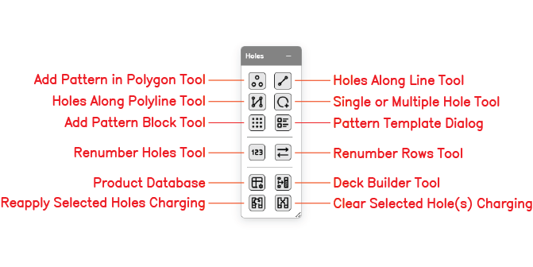

# Holes Toolbar

The Holes toolbar provides tools for placing blast holes, generating patterns, renumbering, and managing charging on selected holes. It is one of the six floating toolbars on the right side of the Kirra workspace.

---

## Toolbar Overview

*The Holes toolbar with all twelve tool buttons labelled.*

The Holes toolbar contains the following tools:

| Tool | Type | Description |
|------|------|-------------|
| **Add Pattern in Polygon Tool** | Interactive | Fill a polygon boundary with holes at a specified burden and spacing |
| **Holes Along Line Tool** | Interactive | Place holes along a straight line between two points |
| **Holes Along Polyline Tool** | Interactive | Place holes along a multi-segment polyline path |
| **Single or Multiple Hole Tool** | Interactive | Place individual holes by clicking on the canvas |
| **Add Pattern Block Tool** | Dialog | Generate a rectangular grid of holes with uniform burden and spacing |
| **Pattern Template Dialog** | Dialog | Open the template picker to apply a saved pattern configuration |
| **Renumber Holes Tool** | Dialog | Renumber the IDs of selected holes by a chosen sort order |
| **Renumber Rows Tool** | Dialog | Renumber holes by row |
| **Product Database** | Dialog | Open the explosive products database used by charging |
| **Deck Builder Tool** | Dialog | Open the deck builder to configure charge decks for selected holes |
| **Reapply Selected Holes Charging** | Action | Re-apply the current charge template to the selected holes |
| **Clear Selected Hole(s) Charging** | Action | Remove all charging data from the selected holes |

---

## Add Pattern in Polygon Tool

Fills a polygon boundary with blast holes at a specified burden and spacing. Holes whose collar positions fall outside the polygon are automatically excluded. Use this tool for irregular blast boundaries, pit-edge shapes, and selective areas inside a larger bench.

> *[SCREENSHOT NEEDED: Add Pattern in Polygon dialog]*

### How to Use

1. Click the **Add Pattern in Polygon** button on the Holes toolbar
2. Define the polygon boundary by clicking points on the canvas, or select an existing KAD polygon *[VERIFY: exact boundary-picking workflow]*
3. Enter burden and spacing
4. Set collar elevation, bench height, subdrill, angle, bearing, diameter, and hole type
5. Optionally enable stagger to offset every second row by half the spacing
6. Click **Generate** *[VERIFY: button label]*

See [Pattern Generation → Polygon Pattern](pattern-generation.md#polygon-pattern) for parameter detail.

---

## Holes Along Line Tool

Places a single straight row of blast holes between two points. Useful for presplit lines, buffer rows, and single-row production blasts.

> *[SCREENSHOT NEEDED: Holes Along Line dialog]*

### How to Use

1. Click the **Holes Along Line** button on the Holes toolbar
2. Click the start and end points on the canvas, or enter coordinates
3. Enter either the number of holes or the spacing between holes — the other value is calculated automatically
4. Set collar elevation, bench height, subdrill, angle, bearing, diameter, and hole type
5. Click **Generate** *[VERIFY: button label]*

See [Pattern Generation → Line Pattern](pattern-generation.md#line-pattern) for use cases and typical spacings.

---

## Holes Along Polyline Tool

Places holes along a multi-segment polyline path. Ideal for curved presplit lines, contour-following rows, and perimeter patterns that follow pit contours.

> *[SCREENSHOT NEEDED: Holes Along Polyline dialog]*

### How to Use

1. Click the **Holes Along Polyline** button on the Holes toolbar
2. Click points on the canvas to define the path, or select an existing polyline
3. Enter the hole spacing along the path
4. Set hole properties
5. Click **Generate** *[VERIFY: button label]*

### Bearing Options

| Option | Behaviour |
|--------|-----------|
| **Follow Path** | Each hole is angled perpendicular to its local path segment |
| **Fixed Bearing** | All holes share the same bearing regardless of path direction |

See [Pattern Generation → Polyline Pattern](pattern-generation.md#polyline-pattern).

---

## Single or Multiple Hole Tool

Places individual blast holes on the canvas by clicking. Each click places one hole using the current hole defaults and auto-increments the Hole ID.

### How to Use

1. Click the **Single or Multiple Hole** button on the Holes toolbar
2. Configure the default properties in the Hole Defaults form (diameter, bench height, subdrill, angle, bearing, hole type)
3. Click anywhere on the canvas to place a hole
4. Continue clicking to place more holes

> **Tip:** Hold `Shift` while clicking to snap to the active grid. *[VERIFY: snap behaviour]*

See [Adding Blast Holes](adding-holes.md) for the full default-property reference.

---

## Add Pattern Block Tool

Generates a rectangular grid of blast holes with uniform burden and spacing. This is the most common pattern type for bench blasting.

> *[SCREENSHOT NEEDED: Add Pattern Block dialog]*

### How to Use

1. Click the **Add Pattern Block** button on the Holes toolbar
2. Enter the pattern name, number of rows, and number of columns
3. Enter burden, spacing, and the starting position (Easting, Northing, Elevation)
4. Set bench height, subdrill, angle, bearing, diameter, and hole type
5. Click **Generate** *[VERIFY: button label]*

See [Pattern Generation → Rectangular Grid](pattern-generation.md#rectangular-grid-pattern) for the complete parameter list.

---

## Pattern Template Dialog

Opens the pattern-template picker. Templates save burden, spacing, hole properties, and charging so you can apply a familiar pattern configuration quickly.

> *[SCREENSHOT NEEDED: Pattern Template dialog]*

### How to Use

1. Click the **Pattern Template** button on the Holes toolbar
2. Select a saved template from the list
3. Adjust any parameters as needed
4. Apply the template *[VERIFY: exact apply-button label]*

See [Pattern Templates](pattern-templates.md) for creating, saving, and managing templates.

---

## Renumber Holes Tool

Renumbers the IDs of selected holes by a chosen sort order. Timing connections and charging references are updated to match the new IDs.

> *[SCREENSHOT NEEDED: Renumber Holes dialog]*

### How to Use

1. Select the holes to renumber (or press `Ctrl+A` for all holes) *[VERIFY: Ctrl+A select-all]*
2. Click the **Renumber Holes** button on the Holes toolbar
3. Enter a prefix, start number, and sort order (by row, by easting, by northing, or by current number) *[VERIFY: exact sort options]*
4. Click **Apply** *[VERIFY: button label]*

---

## Renumber Rows Tool

Renumbers holes by row. Useful when automatic row clustering has been applied but the row numbering order needs to change (for example, reversing the direction of firing).

> *[SCREENSHOT NEEDED: Renumber Rows dialog]*

### How to Use

1. Select the holes to renumber
2. Click the **Renumber Rows** button on the Holes toolbar
3. Configure the row numbering order *[VERIFY: available options]*
4. Click **Apply** *[VERIFY: button label]*

---

## Product Database

Opens the explosive products database. This is the source of the products available in the Deck Builder and in CSV charging imports.

> *[SCREENSHOT NEEDED: Product Database dialog]*

See [Product Database CSV](../charging/products-csv.md) for the data format and import/export workflow.

---

## Deck Builder Tool

Opens the Deck Builder dialog to configure charge decks — stemming, explosives, spacers, and primers — for the selected holes.

> *[SCREENSHOT NEEDED: Deck Builder dialog]*

### How to Use

1. Select the holes to charge
2. Click the **Deck Builder** button on the Holes toolbar
3. Configure the deck structure
4. Apply the configuration to the selected holes *[VERIFY: apply workflow]*

See [Deck Builder](../charging/deck-builder.md) for the full configuration reference.

---

## Reapply Selected Holes Charging

Re-applies the current charge template to the selected holes. Use this after changing hole geometry (length, bench height, subdrill) so the deck lengths and product masses recalculate.

### How to Use

1. Select the holes to reapply charging to
2. Click the **Reapply Selected Holes Charging** button on the Holes toolbar
3. The current deck configuration is re-run against each selected hole *[VERIFY: behaviour when no charge template is active]*

---

## Clear Selected Hole(s) Charging

Removes all charging data — decks, products, and mass values — from the selected holes.

### How to Use

1. Select the holes to clear
2. Click the **Clear Selected Hole(s) Charging** button on the Holes toolbar
3. All deck assignments on the selected holes are removed *[VERIFY: whether a confirmation prompt appears]*

> **Note:** This operation can be undone with `Ctrl+Z`. *[VERIFY]*

---

## Related Topics

- [Adding Blast Holes](adding-holes.md) — hole defaults and manual placement
- [Pattern Generation](pattern-generation.md) — parameter reference for each pattern type
- [Pattern Templates](pattern-templates.md) — save and reuse pattern configurations
- [Deck Builder](../charging/deck-builder.md) — charge column configuration
- [Interface Tour](../getting-started/interface-tour.md) — workspace overview
- [Modify Toolbar](../kad/modify-tools.md) — transform, offset, radii, boolean, and related tools
