# Holes Toolbar

The Holes toolbar provides tools for placing blast holes, generating patterns, renumbering, and managing charging on selected holes. It is one of the floating toolbars in the Kirra workspace.

---

## Toolbar Overview

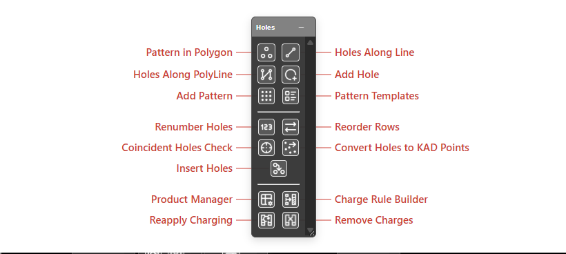
*The Holes toolbar with all tool buttons labelled.*

The Holes toolbar contains the following tools (names are the tooltips shown when you hover):

| Tool | Type | Description |
|------|------|-------------|
| **Pattern in Polygon** | Interactive | Fill a polygon boundary with holes at a specified burden and spacing |
| **Holes Along Line** | Interactive | Place a row of holes along a straight line between two clicked points |
| **Holes Along PolyLine** | Interactive | Place holes along an existing line, polyline or polygon edge |
| **Add Hole** | Interactive | Place individual holes by clicking on the canvas |
| **Add Pattern** | Interactive | Click a start point, then generate a rectangular grid of holes |
| **Pattern Templates** | Dialog | Manage saved pattern templates |
| **Renumber Holes** | Interactive | Renumber holes by picking the first and last hole of a run |
| **Reorder Rows** | Interactive | Reassign row and position numbers by picking a row direction |
| **Coincident Holes Check** | Dialog | Find holes that clash with another blast or a drawing, and optionally move them |
| **Convert Holes to KAD Points (collar / grade / toe)** | Dialog | Create KAD points at the collar, grade or toe of the selected holes |
| **Insert Holes** | Interactive | Insert one or more holes into an existing row, before or after a clicked hole |
| **Product Manager** | Dialog | Open the explosive products list used by charging |
| **Charge Rule Builder** | Dialog | Open the Deck Builder to configure charge decks |
| **Reapply Charging** | Action | Re-fit the selected holes' existing charging to their current hole length |
| **Remove Charges** | Action | Remove all charging from the selected holes |

> **Create Radii from Blast Holes** is no longer on the Holes toolbar. To draw radii around holes, use **Radii Holes/KADs** on the [Modify toolbar](../kad/modify-tools.md).

---

## Add Pattern in Polygon Tool

Fills a polygon boundary with blast holes at a specified burden and spacing. Holes whose collar positions fall outside the polygon are automatically excluded. Use this tool for irregular blast boundaries, pit-edge shapes, and selective areas inside a larger bench.

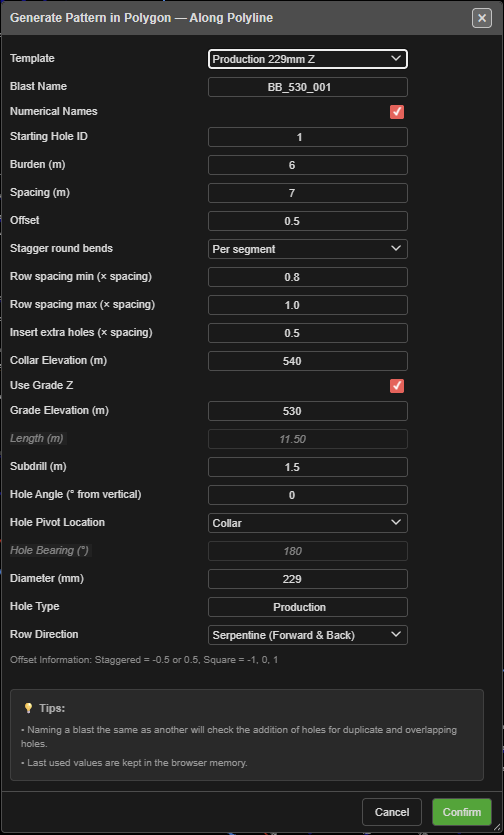

### How to Use

The button has two modes — right-click it to choose **Straight Rows** (red) or **Along Polyline** (amber).

1. Click the **Add Pattern in Polygon** button on the Holes toolbar
2. Click an existing polygon to fill
3. **Straight Rows:** click the start point, the end point (row direction), then the reference point
4. **Along Polyline:** click the reference line, then its start point and end point
5. Enter burden, spacing, collar elevation, subdrill, angle, diameter and hole type
6. Click **Confirm**

Holes added to fit the polygon are marked with their own shape and colour — set these in the right-click menu.

See [Pattern Generation → Polygon Pattern](pattern-generation.md#polygon-pattern) for parameter detail.

---

## Holes Along Line Tool

Places a single straight row of blast holes between two points. Useful for presplit lines, buffer rows, and single-row production blasts.

*Generate Holes Along Line, after clicking the start and end points.*

### How to Use

1. Click the **Holes Along Line** button on the Holes toolbar
2. Click the **start point** on the canvas
3. Click the **end point** — the **Generate Holes Along Line** dialog opens
4. Set **Spacing (m)**, **Burden (m)**, **Collar Elevation (m)**, the grade or length (**Use Grade Z** / **Grade Elevation (m)** / **Length (m)**), **Subdrill (m)**, **Hole Angle (° from vertical)**, **Diameter (mm)** and **Hole Type**
5. Tick **Bearings are 90° to Row** to set every hole square to the line, or untick it and type a **Hole Bearing (°)**
6. Click **OK**

The dialog also has a **Template** list, **Blast Name**, **Numerical Names** and **Starting Hole ID**. The last values you used are remembered.

See [Pattern Generation → Line Pattern](pattern-generation.md#line-pattern) for use cases and typical spacings.

---

## Holes Along Polyline Tool

Places holes along an existing line, polyline or polygon edge. Ideal for curved presplit lines, contour-following rows, and perimeter patterns that follow pit contours.

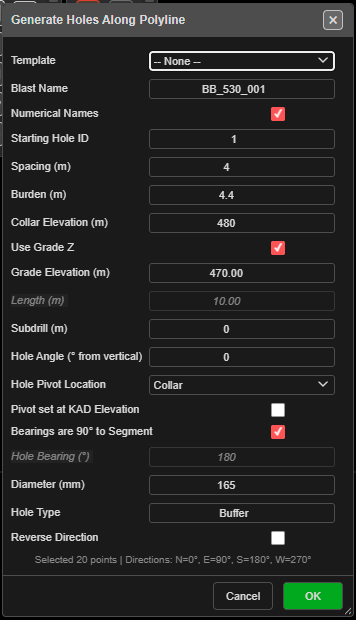
*Generate Holes Along Polyline. The footer reports how many points were selected.*

### How to Use

1. Click the **Holes Along PolyLine** button on the Holes toolbar
2. Click an existing line, polyline or polygon edge to select it
3. Click a vertex or point along it to set the **start point**
4. Click another vertex along it to set the **end point** — the **Generate Holes Along Polyline** dialog opens
5. Set the spacing and hole properties (same fields as Holes Along Line)
6. Click **OK**

### Bearing and direction options

| Option | Behaviour |
|--------|-----------|
| **Bearings are 90° to Segment** (ticked) | Each hole is set square to its local segment of the line |
| **Hole Bearing (°)** (checkbox unticked) | All holes share the bearing you type |
| **Reverse Direction** | Places the holes in the opposite direction along the line |

See [Pattern Generation → Polyline Pattern](pattern-generation.md#polyline-pattern).

---

## Single or Multiple Hole Tool

Places individual blast holes by clicking on the canvas. The toolbar button is labelled **Add Hole**.

### How to Use

1. Click the **Add Hole** button on the Holes toolbar
2. Click on the canvas where the hole should go. The click snaps to nearby objects — the status bar shows what it snapped to.
3. The **Add a hole to the Pattern?** dialog opens with the click position in **Location X** / **Location Y**. Set the blast name, hole type, diameter, bearing, angle, subdrill, grade or length, and the other fields.
4. Click **Single** to place this one hole, or **Multiple** to place it and keep the same settings — each further click on the canvas then places another hole without the dialog.
5. Click **Add Hole** again to finish.

See [Adding Blast Holes](adding-holes.md) for the full field reference.

---

## Insert Holes Tool

Inserts one or more holes **into an existing row**, before or after a hole you click — at the row spacing or a custom distance. Unlike the Single Hole tool (which drops standalone holes), Insert Holes works on the clicked hole's row: the new holes take their place in the row and the existing holes shift their position numbers outward (a gap that fits three holes takes three, pushing the rest along the row). New holes inherit the clicked hole's properties (diameter, length, type, bench, angle, bearing, colour) and the row is auto-renumbered.

The dialog is **persistent** — it stays open so you can click hole after hole.

### How to Use

1. Click the **Insert Holes** button on the Holes toolbar. The select pointer and hole mode are turned on automatically, and a small dialog opens.
2. Set:
   - **Number of holes** — how many to insert per click.
   - **Insert** — *After* or *Before* the clicked hole.
   - **Distance** — *Use the row spacing* (the clicked hole's spacing), or *Custom distance* in metres.
3. Click a hole on the canvas. The new holes are inserted along the row in the chosen direction.
4. Click another hole to repeat. Click **Close** (or toggle the button off) when finished.

### Inherited charge and timing

An inserted hole also inherits the clicked hole's **charge** (decks, products and
primers) and **timing delay**. That is a best guess, not a measurement, so the tool
says so in an **amber banner** at the bottom of its dialog *(v1.1.32.46)*:

> Hole 1483 inherits hole 1482's Design, Charge & Timing. Complete checks before issuing.

The banner stays up while you keep clicking and counts the holes inserted since the
dialog opened. Check the charge and timing of those holes before the blast is issued.
(Right-click → **Insert Hole** on a single hole shows the same notice as a pop-up.)

### Duplicate protection

If an inserted hole would land on top of another hole **in the same blast**, Kirra shows a coincidence warning before committing — you can **Ignore** (insert anyway), **Skip** (insert only the non-clashing holes), or **Cancel**. This is the same same-blast XY check every hole tool uses (see [Editing Holes → Hole coincidence](editing-holes.md)).

---

## Add Pattern Block Tool

Generates a rectangular grid of blast holes with uniform burden and spacing. This is the most common pattern type for bench blasting.

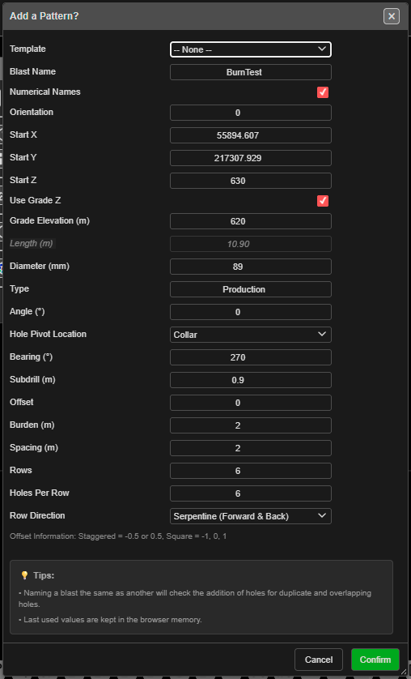
*The Add a Pattern? dialog, after clicking the pattern start point.*

### How to Use

1. Click the **Add Pattern** button on the Holes toolbar
2. Click on the canvas to place the pattern **start point** (the click snaps to nearby objects)
3. The **Add a Pattern?** dialog opens with that point in **Start X** / **Start Y**
4. Set **Blast Name**, **Orientation**, **Burden (m)**, **Spacing (m)**, **Offset**, **Rows**, **Holes Per Row** and **Row Direction**
5. Set the hole properties — **Diameter (mm)**, **Type**, **Angle (°)**, **Hole Pivot Location**, **Bearing (°)**, **Subdrill (m)**, and the grade or length
6. Click **Confirm**

See [Pattern Generation → Rectangular Grid](pattern-generation.md#rectangular-grid-pattern) for the complete parameter list.

---

## Pattern Template Dialog

Opens the **Pattern Templates** manager. Templates save burden, spacing, hole properties, text and charging so you can reuse a familiar pattern configuration.

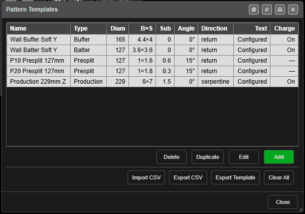
*The Pattern Templates dialog lists saved templates with their type, diameter, burden × spacing, subdrill, angle and direction.*

### How to Use

1. Click the **Pattern Templates** button on the Holes toolbar
2. Use **Add**, **Edit**, **Duplicate** or **Delete** to manage templates, or **Import CSV** / **Export CSV** / **Export Template** / **Clear All** for the whole list
3. Click **Close**

To **apply** a template, pick it from the **Template** list at the top of the Add Pattern, Pattern in Polygon, Holes Along Line, Holes Along Polyline or Add Hole dialog — its values fill the form.

See [Pattern Templates](pattern-templates.md) for creating, saving, and managing templates.

---

## Renumber Holes Tool

Renumbers holes along a run you pick on the canvas. Timing connections and charging references are updated to match the new IDs.

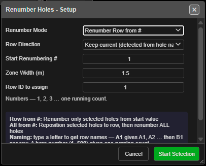
*Renumber Holes - Setup. Click Start Selection, then pick the holes to renumber.*

### How to Use

1. Click the **Renumber Holes** button on the Holes toolbar
2. In the **Renumber Holes - Setup** dialog set **Renumber Mode**, **Row Direction**, **Start Renumbering #**, **Zone Width (m)** and **Row ID to assign**
3. Click **Start Selection**
4. Click the first hole, then the last hole of the run

See [Editing Holes → Renumbering Holes](editing-holes.md#renumbering-holes) for what each option does.

---

## Reorder Rows

Reassigns the row and position numbers of a pattern from a row direction you pick. Useful when the automatic row detection has assigned an order you want to change.

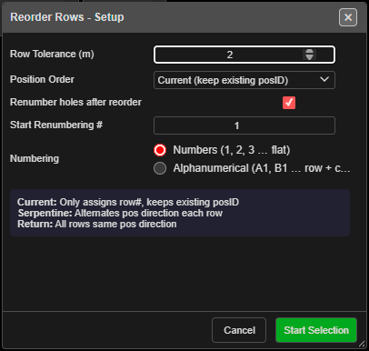
*Reorder Rows - Setup.*

### How to Use

1. Click the **Reorder Rows** button on the Holes toolbar
2. In the **Reorder Rows - Setup** dialog set:
   - **Row Tolerance (m)** — how far a hole may sit off a row and still belong to it
   - **Position Order** — *Current (keep existing posID)*, *Serpentine (alternate direction)* or *Return (same direction)*
   - **Renumber holes after reorder**, with **Start Renumbering #** and **Numbering** (*Numbers* or *Alphanumerical*)
3. Click **Start Selection**
4. Click the **first** hole in a row, then the **last** hole in that row — the line shows the row direction
5. An arrow shows the burden direction (the way row numbers increase). Click the arrow to flip it
6. Press **Enter** (or click **Apply** in the **Confirm Row Reorder** dialog) to apply, or **Escape** to cancel

---

## Coincident Holes Check

Finds holes that sit too close to another blast's holes or to a drawing, and can move them clear. This is the on-demand version of the same-blast XY check that hole tools run automatically when placing or moving holes.

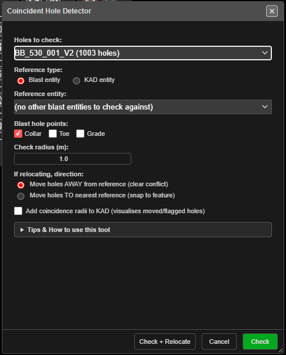
*The Coincident Hole Detector. Check reports conflicts; Check + Relocate also moves the holes.*

### How to Use

1. Click the **Coincident Holes Check** button on the Holes toolbar — the **Coincident Hole Detector** dialog opens
2. Choose the **holes to check** (a blast) and the **reference** — another **Blast entity** or a **KAD entity**
3. For a blast reference, the collar XY is tested; tick **Toe** or **Grade** to also test those positions
4. Set the search radius (default **1.0** m)
5. Click **Check** to list the conflicts, or **Check + Relocate** to move them:
   - **Move holes AWAY from reference (clear conflict)** — push each conflicting hole just past the radius
   - **Move holes TO nearest reference (snap to feature)** — snap each conflicting hole onto the nearest reference point
6. Optionally tick **Add coincidence radii to KAD (visualises moved/flagged holes)**

Holes that cannot be cleared are put back where they were and listed in the result. **Check + Relocate** can be undone with **Ctrl+Z**. The dialog's **Tips & How to use this tool** section explains each option.

See [Editing Holes → Hole coincidence](editing-holes.md#hole-coincidence) for the automatic placement-time check.

---

## Convert Holes to KAD Points

Converts hole **collar**, **grade**, or **toe** positions into standalone KAD point objects — useful for exporting hole positions as drawing geometry, or for reusing collar/toe points as inputs to other tools (triangulation, offsets, radii).

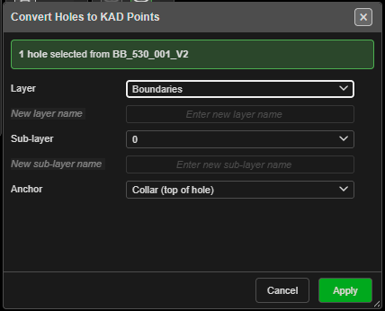
*Convert Holes to KAD Points, with one hole selected.*

### How to Use

1. Select the holes to convert
2. Click the **Convert Holes to KAD Points** button on the Holes toolbar
3. Choose the **Layer** and **Sub-layer** for the new points (or create new ones)
4. Choose the **Anchor** — **Collar (top of hole)**, **Grade (floor elevation)** or **Toe (bottom of hole)**
5. Click **Apply** — a KAD point is created at that position of each selected hole

---

## Product Manager

Opens the **Product Manager** dialog — the explosive products list. This is the source of the products available in the Deck Builder, in CSV charging imports, and of the connector chips on the [Connect toolbar](connect-toolbar.md#connector-product-chips).

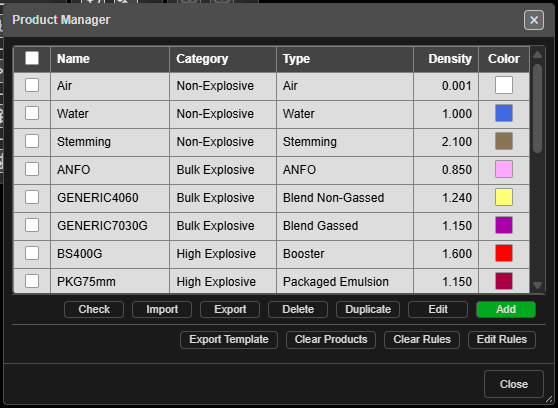
*The Product Manager.*

See [Product Database CSV](../charging/products-csv.md) for the data format and import/export workflow.

---

## Charge Rule Builder

Opens the **Deck Builder** dialog to configure charge decks — stemming, explosives, spacers, and primers.

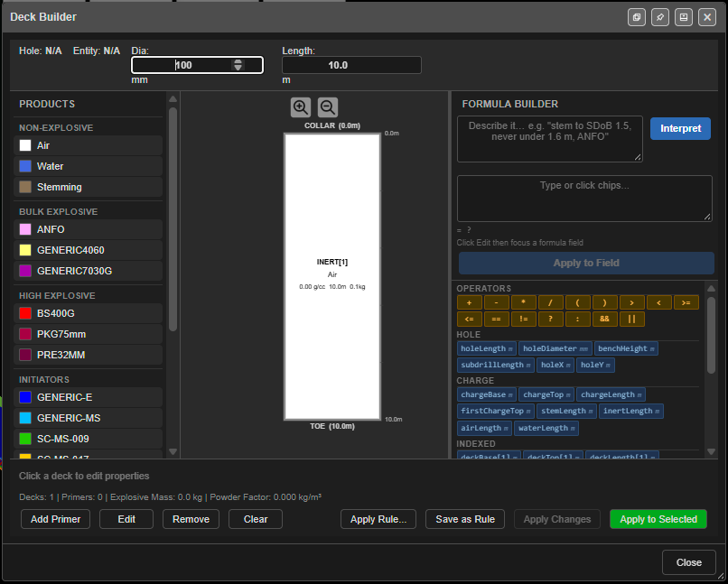
*The Deck Builder, opened from Charge Rule Builder: products on the left, the deck column in the centre, the Formula Builder on the right.*

See [Deck Builder](../charging/deck-builder.md) for the full workflow, including applying a configuration to holes.

---

## Reapply Charging

Re-fits each selected hole's **existing** charging to the hole's current length. Use this after changing hole geometry (length, bench height, subdrill) so the deck lengths and product masses recalculate.

### How to Use

1. Select the holes
2. Click the **Reapply Charging** button on the Holes toolbar
3. Confirm **Apply** in the **Reapply Charging** prompt. Timing constructs are re-assigned at the same time so detonator times are kept.

Holes that have no charging are skipped. If none of the selected holes has charging, Kirra says so and does nothing.

---

## Remove Charges

Removes all charging data — decks, products, and primers — from the selected holes.

### How to Use

1. Select the holes to clear
2. Click the **Remove Charges** button on the Holes toolbar
3. Confirm **Remove** in the **Remove Charging** prompt

If no holes are selected, Kirra shows *"No holes selected."*

---

## Related Topics

- [Adding Blast Holes](adding-holes.md) — hole defaults and manual placement
- [Pattern Generation](pattern-generation.md) — parameter reference for each pattern type
- [Pattern Templates](pattern-templates.md) — save and reuse pattern configurations
- [Deck Builder](../charging/deck-builder.md) — charge column configuration
- [Interface Tour](../getting-started/interface-tour.md) — workspace overview
- [Modify Toolbar](../kad/modify-tools.md) — transform, offset, radii, boolean, and related tools
