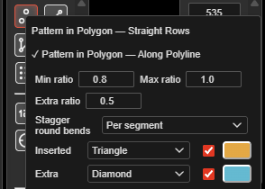
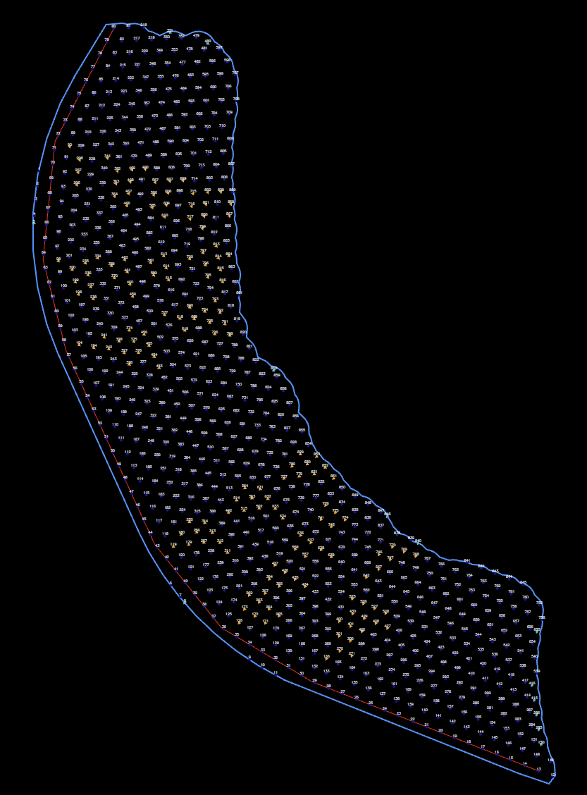
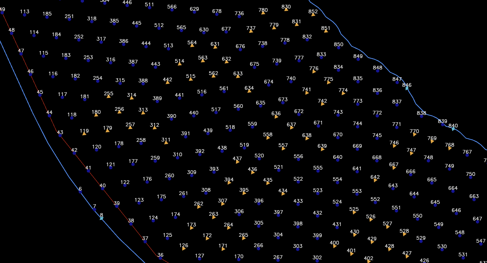

# Pattern Generation

Kirra can automatically generate blast patterns in several geometric configurations. Pattern generation is the fastest way to lay out a new blast from scratch when you know your burden, spacing, and bench geometry.

---

## Choosing a Pattern Method

| Method | Best For | Tool |
|--------|----------|------|
| **Rectangular Grid** | Standard bench blasting with uniform rows and columns | Holes toolbar → Add Pattern Block |
| **Polygon Pattern** | Irregular blast boundaries, pit edges, complex shapes | Holes toolbar → Add Pattern in Polygon |
| **Line Pattern** | Single-row presplit, buffer, or production lines | Holes toolbar → Holes Along Line |
| **Polyline Pattern** | Curved or multi-segment rows following contours | Holes toolbar → Holes Along Polyline |

See the [Holes Toolbar](holes-toolbar.md) reference for each button.

> *Screenshot coming soon*

---

## Rectangular Grid Pattern

Creates a regular grid of blast holes with uniform burden and spacing. This is the most common pattern type for bench blasting.

**Tool:** Holes toolbar → Add Pattern Block

### Parameters

| Parameter | Description | Typical Value |
|-----------|-------------|---------------|
| **Pattern Name** | Name for this group of holes | `Bench_150_North` |
| **Number of Rows** | Rows perpendicular to the free face | 5 to 10 |
| **Number of Columns** | Holes per row, parallel to the free face | 10 to 20 |
| **Burden** | Distance between rows (metres) | 5.0 m |
| **Spacing** | Distance between holes within a row (metres) | 6.0 m |
| **Collar Elevation** | Starting Z elevation for all holes (metres) | 150.0 m |
| **Bench Height** | Vertical distance from collar to grade (metres) | 10.0 m |
| **Subdrill** | Vertical distance below grade (metres, positive = downhole) | 1.5 m |
| **Hole Angle** | Angle from vertical (0 = vertical) | 0 degrees |
| **Hole Bearing** | Direction of hole angle (0 = North, clockwise) | 0 degrees |
| **Hole Diameter** | Diameter in millimetres | 115 mm *[VERIFY: typical value]* |
| **Hole Type** | Classification | Production |
| **First Hole Position** | Easting and Northing of the pattern origin | Site coordinates |

### Pattern Layout

```
Rows (Burden direction)
 |
 v
 *  *  *  *  *   <-- Row 1
 *  *  *  *  *   <-- Row 2
 *  *  *  *  *   <-- Row 3
    --> Spacing
```

### Steps

1. Click **Add Pattern Block** on the [Holes toolbar](holes-toolbar.md)
2. Enter the pattern name (e.g. `Bench_150`)
3. Set the starting position (Easting, Northing, Elevation)
4. Configure the number of rows and columns
5. Set burden and spacing distances
6. Enter hole specifications (bench height, subdrill, angle, bearing, diameter)
7. Click **Generate**
8. Holes appear immediately on the canvas

### Hole Naming

Generated holes are numbered sequentially: `H001`, `H002`, `H003`, etc. Row-based naming is also available: `R1-H01`, `R1-H02`, `R2-H01`, etc.

The **Starting Hole ID** field accepts both numbers and alphanumeric seeds. Type `500` to start at 500, or `A1` to start an alphabetical series (`A1, A2, A3 …`) — the letter prefix is preserved and the trailing number increments. If the blast already has holes in the same series, new holes continue from the highest existing ID + 1; switching to a new prefix starts a fresh series.

---

## Polygon Pattern

Fills a polygon boundary with holes at the specified burden and spacing. Holes that fall outside the boundary are automatically excluded.

**Tool:** Holes toolbar → Add Pattern in Polygon

### Two modes — right-click the button

Right-click **Add Pattern in Polygon** to choose how the rows run. Choosing a mode also switches the tool on.

| Mode | Button colour | Rows |
|---|---|---|
| **Straight Rows** | Red | A straight grid at the bearing you set, trimmed to the polygon |
| **Along Polyline** | Amber | Every row follows a reference line — a crest, a toe, or the polygon's own edge — stepped out by the burden |

Hover the button to see which mode is set.



### Steps — Straight Rows

1. Click **Add Pattern in Polygon** on the [Holes toolbar](holes-toolbar.md)
2. Click the polygon to fill
3. Click the pattern start point, then the end point — this sets the row direction
4. Click the reference point
5. Enter the burden, spacing and hole properties, then click **Confirm**

### Steps — Along Polyline

1. Right-click **Add Pattern in Polygon** and choose **Along Polyline** — the button turns amber
2. Click the polygon to fill
3. Click the reference line — a drawn line, or the polygon's own edge
4. Click the start point on that line, then the end point. The chosen stretch is highlighted in amber, and its direction sets the hole numbering order
5. Enter the burden, spacing and hole properties, then click **Confirm**

Rows are placed on both sides of the reference line until the polygon is filled. Each hole's bearing is set square to its own row, so the bearing field is greyed out in this mode.




### Settings in the right-click menu

| Setting | Mode | Default | What it does |
|---|---|---|---|
| **Min ratio / Max ratio** | Along Polyline | 0.8 / 1.2 | Keeps every step along a row between these multiples of the spacing. Holes that are too close are removed, and long steps get evenly placed extra holes. A gap where a row leaves the polygon is never filled. 0 turns it off |
| **Extra ratio** | Both | 0 | At each end of a row, tries one more hole this multiple of the spacing past the last hole. It is kept only if it falls inside the polygon. 0 turns it off |
| **Stagger round bends** | Along Polyline | Per segment | **Per segment** keeps spacing and stagger exact on every straight, and the min/max range tidies each bend. **Along row** keeps spacing exact along every row, but the stagger drifts round bends |
| **Inserted** | Along Polyline | Amber triangle | How holes added by the min/max range are marked |
| **Extra** | Both | Cyan diamond | How the extra row-end holes are marked |

The same values appear in the pattern dialog, so changing one changes both.

### Marked holes

Holes that Kirra adds or moves to fit the polygon are marked so you can review them:

- **Inserted** holes come from the min/max spacing range
- **Extra** holes are the additional holes at the row ends

For each, pick a **shape**, a **colour**, or both. Choose **Unchanged** for the shape, or untick the colour, to leave that part alone. The mark is saved with the hole, appears on screen and in prints, and can be changed afterwards like any other hole colour or shape.



### Edge Handling

- Holes are included if their collar position falls inside the polygon
- A concave polygon can split a row into pieces; the pieces stay in the same row
- Round an inside bend, rows close up — the min ratio thins them out
- Perimeter holes can be detected for presplit applications

### Use Cases

- Irregular blast boundaries following pit design
- Curved benches and ramps, with rows following the crest (Along Polyline)
- Selective blast areas within a larger pattern

---

## Line Pattern

Creates a single straight row of holes between two points.

**Tool:** Holes toolbar → Holes Along Line

### Steps

1. Click **Holes Along Line** on the [Holes toolbar](holes-toolbar.md)
2. Define the start point and end point by clicking on the canvas or entering coordinates
3. Enter the number of holes or the spacing between holes:
   - If you specify hole count, spacing is calculated automatically
   - If you specify spacing, hole count is calculated automatically
4. Set hole properties (collar elevation, bench height, subdrill, angle, bearing, diameter, type)
5. Click **Generate**

### Pattern Layout

```
Start --> *  *  *  *  *  *  * <-- End
          |<-- Spacing -->|
```

### Use Cases

- Presplit lines with tight spacing (1 to 2 metres)
- Buffer rows with intermediate spacing (3 to 4 metres)
- Single-row production blasts
- Test patterns

---

## Polyline Pattern

Creates a curved or multi-segment row of holes following a polyline path. This is ideal for contour-following patterns.

**Tool:** Holes toolbar → Holes Along Polyline

### Steps

1. Click **Holes Along Polyline** on the [Holes toolbar](holes-toolbar.md)
2. Click multiple points on the canvas to define the path, or select an existing polyline
3. Enter the hole spacing along the path (metres)
4. Set hole properties (collar elevation, bench height, subdrill, angle, bearing, diameter, type)
5. Click **Generate**

### Pattern Layout

```
        *--*--*
       /       \
      *         *--*--*
     /               \
    *                 *
```

### Bearing Options

| Option | Description |
|--------|-------------|
| **Follow Path** | Each hole is angled perpendicular to its local path segment |
| **Fixed Bearing** | All holes use the same bearing regardless of path direction |

### Use Cases

- Curved presplit lines following pit contours
- Non-linear buffer rows
- Complex perimeter patterns along bench edges

> *Screenshot coming soon*

---

## Collar Elevation Options

When generating any pattern type, you can set collar elevations in several ways:

| Mode | Description |
|------|-------------|
| **Constant Elevation** | All holes use the same Z value that you enter |
| **From Surface** | Collar Z is interpolated from a loaded terrain surface at each hole's Easting/Northing position |
| **From Grade + Bench** | Collar Z is calculated as Grade Elevation + Bench Height |

Using the **From Surface** mode enables adaptive patterns that follow terrain topography.

---

## Common Settings for All Patterns

All pattern types share these hole-level settings:

| Setting | Description |
|---------|-------------|
| **Default Depth / Bench Height** | Vertical bench height (metres) |
| **Default Subdrill** | Subdrill below grade (metres) |
| **Default Diameter** | Hole diameter (mm) |
| **Default Angle** | Drill angle from vertical (degrees) |
| **Default Bearing** | Drill azimuth (degrees) |
| **Default Hole Type** | Production, Presplit, Buffer, etc. |
| **ID Prefix** | Prefix for generated Hole IDs |
| **Starting Hole ID** | First ID in the sequence — number (`500`) or alphanumeric seed (`A1`); auto-continues from existing same-series holes |

---

## Modifying a Generated Pattern

After generation, holes behave like any manually placed hole. You can:

- Select and drag individual holes to adjust positions
- Bulk-edit properties via the right panel
- Add or delete holes
- Rotate the entire pattern *[VERIFY: tool location — may be via right-click Rotate Selection or the Modify toolbar]*
- Mirror the pattern *[VERIFY: tool location]*
- Renumber IDs with **Renumber Holes** on the [Holes toolbar](holes-toolbar.md)

---

## Duplicate Detection

When creating or importing patterns with names that already exist:

1. Kirra checks for duplicate Hole IDs
2. It detects overlapping hole positions (within tolerance)
3. A warning is displayed listing the conflicts
4. You can choose to: Skip duplicates, Rename automatically, or Overwrite

---

## Pattern Statistics

After pattern creation, view statistics via **View > Pattern Statistics** *[VERIFY: menu path]* or by selecting the entity in the TreeView:

- Total hole count
- Total drilled length (sum of all hole lengths)
- Average burden and spacing
- Burden and spacing range (min, max, mean)
- Total rock volume

---

## Related Topics

- [Adding Holes](adding-holes.md) — place individual holes manually
- [Editing Holes](editing-holes.md) — selection, movement, and property editing
- [Timing Sequences](timing-sequences.md) — assign initiation delays after pattern creation
- [Interface Tour](../getting-started/interface-tour.md) — canvas navigation
