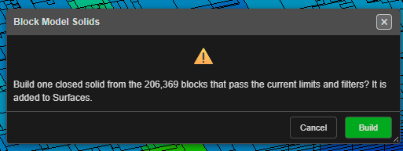

# Export a Section and Build Solids

Once a block model is limited to the part you care about — a blast, a bench, the blocks
inside a design solid — you can take that part out of Kirra in two ways:

- **Export** saves the blocks as a block model CSV.
- **Solids** turns them into closed solids, one per rock type or grade class.

Both buttons are in the footer of the [Load Block Model dialog](load-block-model-dialog.md),
and both use exactly the blocks the dialog is showing.

---

## Which blocks are used

Both buttons use the blocks that pass everything on the **Limits** tab and the
**Bench slice** on the **Display** tab: cut-offs, ticked categories or values, and the
**Limit display to** box, surface or solid.

The **Render cap (cells)** is not a filter. It only limits how many blocks are drawn,
so a capped display still exports, or builds solids from, every block that passes.

---

## Export a section as CSV

1. Set the limits so the dialog shows the blocks you want.
2. Click **Export**.
3. Choose where to save the file.

You can also export from the **Export** dialog: open the **Geology** tab and click **Save**
on the **Block Model — Vulcan CSV** row. It writes the same blocks — those the model's
Load Block Model limits show. With more than one model loaded, Kirra asks which one.

The file is a Vulcan-style block model CSV, which Kirra reads straight back (see
[Importing Block Models](importing-block-models.md)). It has no `IJK` column unless the
original model had one.

| Detail | Behaviour |
|---|---|
| File name | The model's name, with `_section` added when the model is limited, for example `STGM_section.csv`. |
| Header | The original model's origin, cell sizes and number of cells, so each block keeps its place in the parent grid. |
| Columns | Block centre (XC, YC, ZC), block size (XINC, YINC, ZINC), then every loaded attribute. |
| Categories | Written as their names, for example `BIF`, not as codes. |
| Empty values | Written as empty fields. |
| Rotated models | CSV has no field for rotation. Block centres stay exact, but the blocks draw unrotated when the file is loaded again. Kirra tells you when this applies. |

---

## Build solids

**Solids** builds closed solids from the shown blocks. What you get depends on the
**Variable (colour)** on the **Display** tab:

| Attribute | Result |
|---|---|
| A category, for example STRAT | One solid per category |
| A whole-number code, for example a stratigraphy number | One solid per value |
| A continuous value, for example DENSITY or FE | One solid of all the blocks shown — for example, set **Cut-off: ignore below** to 58 on FE for an ore shell |

1. Choose the **Variable (colour)** and set the limits.
2. Click **Solids**. Kirra says how many solids it will build and from how many blocks:

   

3. Click **Build**.

The solids are added to **Surfaces** on a layer named **Block Model Solids**, each in the
colour its blocks are drawn in. They are saved with the project like any other surface,
and one **Undo** removes them all.

### About the solids

- **Closed.** Each solid is watertight: it reads as **Closed** in its properties, shows
  its volume, and can be used as an **Inside a closed solid** limit.
- **Stepped.** The solids follow the block edges exactly. They are not smoothed.
- **Exact volume.** A solid's volume equals the total volume of its blocks, sub-blocks
  included.
- **Shared edges.** Where two blocks of the same class touch only along an edge, that
  edge belongs to four faces rather than two. Mesh checks report these as
  non-manifold edges; the solid is still closed.
- **Rotated models** give rotated solids that match the drawn blocks.
- **Very large selections** are built on a coarser grid so they fit in memory. Kirra
  tells you when this happens and the grid size it used; limit the model further for
  exact solids.
- More than 256 classes is refused. Untick categories, or limit the model first.

---

See also: [Importing Block Models](importing-block-models.md) ·
[The Load Block Model Dialog](load-block-model-dialog.md) ·
[Trimesh Boolean & Solid Boolean](../surfaces/boolean-csg.md)
