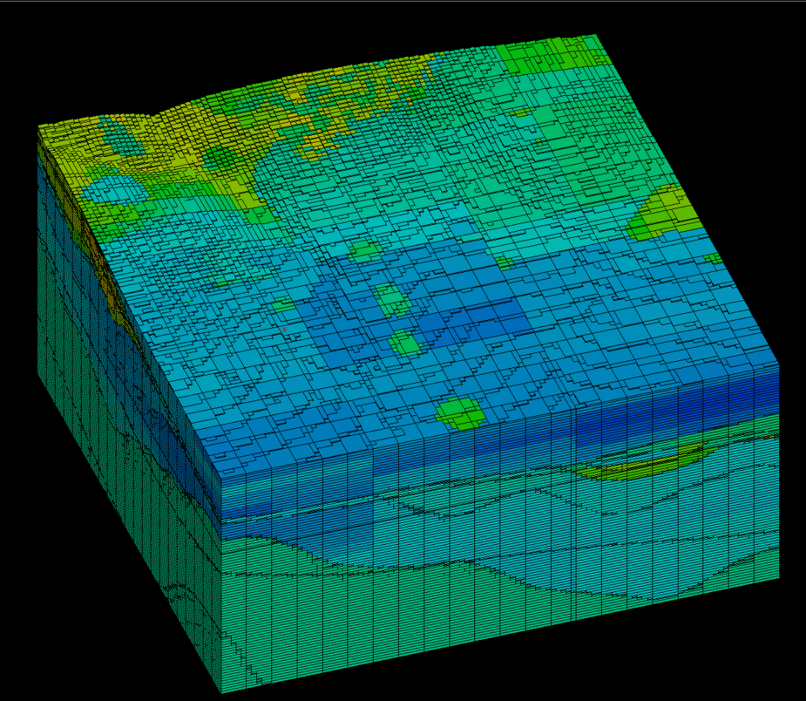
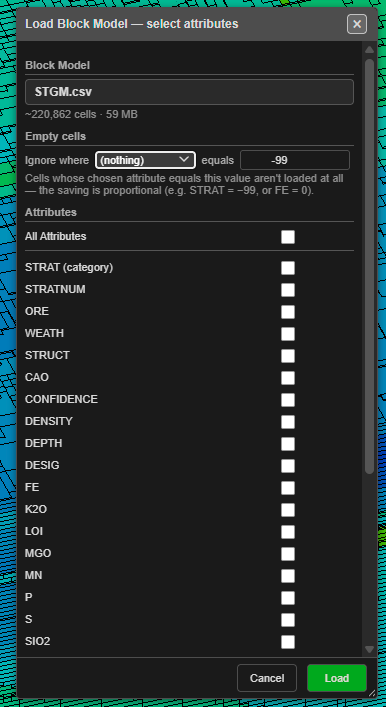

# Importing Block Models

A block model is a 3D grid of blocks, each carrying the geology at that location: rock
type, stratigraphy, grades, density, hardness and so on. Kirra loads block models from
the major mine-planning packages so you can see the geology you are blasting into, in
both the 2D and 3D views.

---

## Supported formats

| Format | Extensions | Notes |
|---|---|---|
| **Block Model — Datamine** | `.dm` | Datamine block model. Large files are streamed. |
| **Block Model — Vulcan CSV** | `.csv` / `.txt` | Vulcan CSV export, with its **Model Origin / Cell Sizes / Number of Cells** preamble. Large files are streamed. |
| **Block Model — Vulcan BMF** | `.bmf` | Vulcan's native block model, regularised or sub-blocked. Read only. |
| **Block Model — Micromine** | `.dat` | Micromine Extended Data block model, including rotated and sub-blocked models. Large files are streamed. |

Sub-blocked models load with every sub-block at its own size. Rotated models (Vulcan
bearing, Micromine rotation) draw their blocks turned to match.

---

## How to import

**From the Import dialog**

1. Open the **Import** dialog and choose the **Geology** tab.
2. Click **Open** on the row for your format and pick the file.

**By drag and drop**

Drop the file onto the canvas. `.dm`, `.bmf` and `.dat` files are recognised by their
content. A `.csv` or `.txt` file could hold blast holes, drawing geometry or a block
model, so Kirra always asks:

Click **Block** for a Vulcan block model CSV.

---

## Large models: choose what to load

Block models are often hundreds of megabytes. For a file larger than about 25 MB,
Kirra asks what to load before reading it:

| Setting | What it does |
|---|---|
| **Block Model** | The file, with an estimate of its cell count and size. |
| **Empty cells — Ignore where … equals …** | Cells whose chosen attribute equals the value are not loaded at all, for example STRAT = −99 or FE = 0. The memory saving is in proportion to the cells dropped. |
| **Attributes** | Tick only the attributes you need. **All Attributes** ticks them all. Each block's position and size always load. |
| **Max cells (0 = all)** | Loads only the first N cells. Useful for a quick look at a very large model. |
| **Memory** | The estimated memory the selection needs. It turns red, with *Exceeds free heap*, when the selection will not fit — untick attributes or set a cell cap. |

Click **Load**. The model is decoded in the background with a progress bar.

---

## After the import

- The model appears in the **Data Explorer** under **Geology**, showing its cell
  count, attribute count and the attribute it is coloured by. The eye icon shows and
  hides it.
- The **Load Block Model** dialog opens so you can choose how it is drawn — see
  [The Load Block Model Dialog](load-block-model-dialog.md).
- Models of more than a million blocks open on a single bench slice so the import
  stays quick. Untick **Bench slice** to see the whole model.

---

## Troubleshooting

| Symptom | Cause | Fix |
|---|---|---|
| *Exceeds free heap* in the select dialog | The ticked attributes will not fit in browser memory | Untick attributes, use **Ignore where**, or set **Max cells** |
| A dropped `.dat` file is offered as a Surpac string | The file is not a Micromine Extended Data file | Check it is a block model export, not a string file |
| *Block Model Import Failed* | The file is damaged, or is a variant Kirra does not read yet | Send the error text to support with a description of where the file came from |

---

See also: [The Load Block Model Dialog](load-block-model-dialog.md) ·
[Export a Section and Build Solids](export-and-solids.md) ·
[Supported File Formats](../reference/supported-formats.md)
