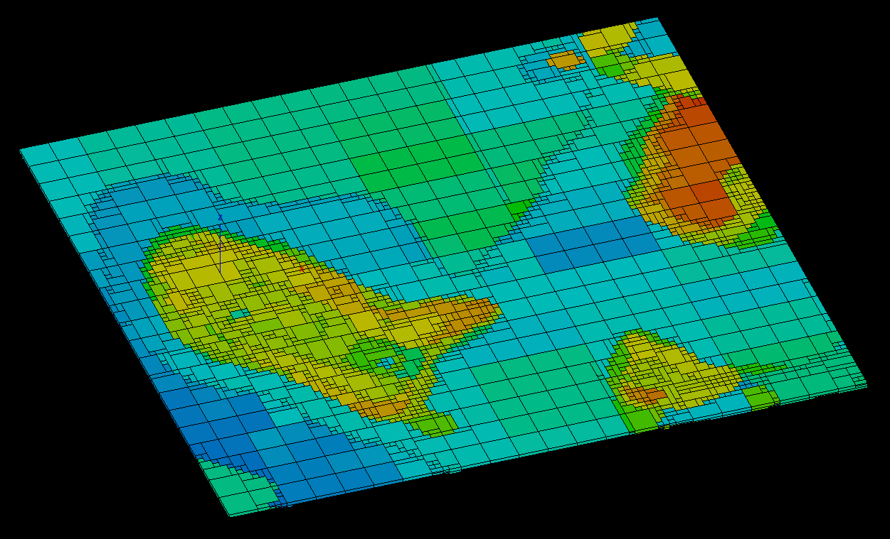
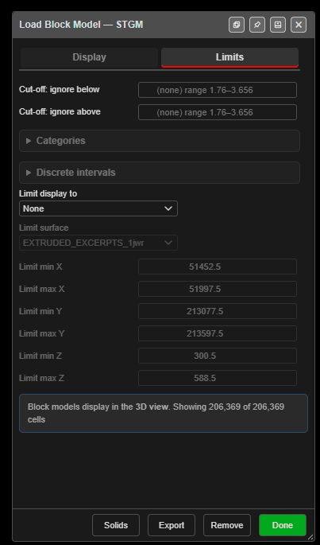

# The Load Block Model Dialog

The **Load Block Model** dialog controls how a block model is drawn: which attribute
colours it, whether you see points or solid blocks, and which part of the model is
shown. Every change applies straight away, so you can adjust it while watching the
view. Block models are drawn in the 3D view, and in plan in the 2D view.

The dialog opens when a model is imported. To open it again, click **Adjust Block Model
Loaded** on the [Analyse toolbar](../analysis/analyse-toolbar.md#adjust-block-model-loaded).

---

## Display tab

| Setting | What it does |
|---|---|
| **Variable (colour)** | The attribute that colours the blocks, for example DENSITY, FE or STRAT. |
| **Mode** | **Centroids (points)** draws a point at each block centre: fast for a first look. **Blocks (solid)** draws every block at its true size, sub-blocks included. |
| **Block style** | For **Blocks (solid)**: **Wire & Fill** (solid with black outlines), **Fill only**, or **Wire only** (outlines in the block colour). |
| **Gradient** | The colour ramp for a numeric attribute: Turbo, Viridis, Parula, Cividis, Terrain or Spectrum (default). |
| **Colour by** | **Gradient (above)** uses the ramp. **Schema (below)** uses a saved colour schema — your site's standard colours for each rock type or grade range. |
| **Schema** | The schema to colour by. Schemas are made in **Adjust Block Model Schema Colour** — see the [Analyse toolbar](../analysis/analyse-toolbar.md#adjust-block-model-schema-colour). |
| **Point size (px)** | Point size in **Centroids (points)** mode. |
| **Transparency** | 1 is opaque. Lower values let you see into the model. |
| **Bench slice** | Show only the blocks in one horizontal slice. |
| **Bench RL** / **Bench thickness (m)** | The centre elevation and thickness of the slice. |
| **Hover datatip** | When ticked, hovering over a block in the 3D view lists its attribute values. |
| **Render cap (cells)** | The most blocks drawn at once, to protect the graphics card. If the count is capped the note at the bottom says so — raise the cap or tighten the filters. |

The note at the bottom of the dialog counts the blocks being drawn, for example
*Showing 206,369 of 206,369 cells*.

### Bench slices

A bench slice shows the geology at one blasting level. Set **Bench RL** to the bench
elevation and **Bench thickness (m)** to the bench height.

---

## Limits tab

Limits hide blocks without changing the model. Clear a limit and the blocks come back.

### Cut-offs and classes

| Setting | What it does |
|---|---|
| **Cut-off: ignore below** / **Cut-off: ignore above** | For a numeric attribute, hide blocks below or above a value. Leave a box empty for no limit. The hint shows the attribute's range. |
| **Categories** | For a category attribute such as STRAT, tick the categories to show. |
| **Discrete intervals** | For a whole-number attribute such as a stratigraphy code, tick the values to show. **Select all** ticks them all. |

### Limit display to

| Option | Shows |
|---|---|
| **None** | The whole model. |
| **Box range (min/max X Y Z)** | Blocks inside the box set by **Limit min X** to **Limit max Z**. |
| **Below a surface** | Blocks below the surface chosen in **Limit surface**, for example below the topography. |
| **Above a surface** | Blocks above the chosen surface. |
| **Inside a closed solid** | Blocks inside a closed solid, for example a blast solid or a pit shell. |

**Limit surface** lists the loaded surfaces. For **Inside a closed solid** it lists
closed solids only; if none is loaded, Kirra says so and leaves the limit off. A solid
made while the dialog is open appears in the list straight away. To make a blast solid,
see [Extrude KAD to Solid](../kad/advanced-tools.md#extrude-kad-to-solid).

---

## Footer buttons

| Button | What it does |
|---|---|
| **Solids** | Builds closed solids from the blocks currently shown — see [Export a Section and Build Solids](export-and-solids.md#build-solids). |
| **Export** | Saves the blocks currently shown as a block model CSV — see [Export a Section and Build Solids](export-and-solids.md#export-a-section-as-csv). |
| **Remove** | Removes the block model from Kirra and frees its memory. |
| **Done** | Closes the dialog. The model stays loaded, drawn as you left it. |

---

See also: [Importing Block Models](importing-block-models.md) ·
[Export a Section and Build Solids](export-and-solids.md)
