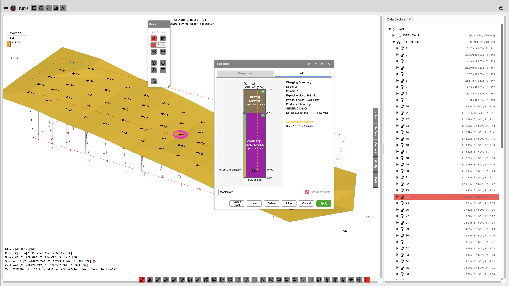

# Charging Overview

The Kirra Charging module lets you design explosive charge configurations for every hole in your blast. You can build multi-deck charge columns with stemming, bulk explosives, packaged explosives, air decks, and boosters — then apply them across your pattern with a single click.

*Charge details for a blast hole showing deck configuration, product assignment, and mass calculations.*

---

## What the Charging System Does

| Capability | Description |
|-----------|-------------|
| **Deck design** | Build multi-deck charge columns with stemming, explosives, spacers, and primers |
| **Four deck types** | Inert (stemming), Coupled (bulk explosive), Decoupled (packaged explosive), and Spacer (air bags) |
| **Formula-driven sizing** | Use formulas to calculate deck lengths automatically based on hole properties |
| **Mass-based calculations** | Specify a target mass in kilograms — Kirra calculates the required deck length for each hole's diameter |
| **Product database** | Maintain a CSV-based catalogue of your site's explosive products |
| **Charge templates** | Save and reuse charge designs as named rules |
| **Swap conditions** | Automatically substitute products for wet, damp, reactive, or high-temperature holes |
| **Downhole timing** | Calculate detonation timing for each deck within a hole |
| **Electronic timing mesh (optional)** | Draw timing contours and interpolate fire times for **Electronic** detonators — see [Electronic Timing Constructs](../blast-design/electronic-timing-constructs.md) |
| **Visualisation** | View charges in 2D radial, 2D section, or 3D spatial views |
| **Export** | Include charge data in CSV, XML, and PDF reports |

---

## Deck Types

Every deck in a charge column belongs to one of four types:

### Inert (Stemming)

Non-explosive material placed at the collar or between charge decks. Common products include crushed aggregate, drill cuttings, clay, and water.

**Purpose:** Confine the explosive energy and prevent venting.

### Coupled (Bulk Explosive)

Bulk explosive in direct contact with the hole walls. Common products include ANFO, emulsion, and slurries.

**Purpose:** The main charge providing the energy to break rock.

### Decoupled (Packaged Explosive)

Cartridge or packaged explosive with an air gap between the package and the hole wall. Common products include packaged emulsion and boosters.

**Purpose:** Controlled-energy applications such as presplit or trim blasting.

### Spacer (Air Deck)

Air bags, gas bags, or inert separators placed between charge decks. These create a deliberate void in the charge column.

**Purpose:** Modify energy distribution and fragmentation by decoupling charge zones.

> *Screenshot coming soon*

---

## Formula-Driven Deck Positioning

One of Kirra's most powerful features is the ability to use formulas to calculate deck lengths and primer positions. Instead of entering fixed numbers, you write expressions that reference the hole's properties — so a single charge rule adapts automatically to holes of different depths and diameters.

**Example formulas:**

| Formula | What It Does |
|---------|-------------|
| 30% of hole length for stemming | Stemming length scales with hole depth |
| Hole length minus 3.5 metres | Charge fills everything below 3.5 m of stemming |
| 50 kg at hole diameter | Calculates the deck length needed to deliver exactly 50 kg of explosive |

Formulas are covered in detail in the [Deck Builder](deck-builder.md) and [Products CSV Reference](products-csv.md) pages.

---

## Mass-Based Calculations

When you specify a deck by mass (e.g. 50 kg) instead of length, Kirra calculates the required deck length using the product density and the hole diameter. This means the same charge rule produces:

- A longer deck in a narrow hole (e.g. 115 mm)
- A shorter deck in a wide hole (e.g. 250 mm)

The explosive mass stays constant at 50 kg regardless of hole size.

---

## Scaling Modes

When a charge rule is applied to holes of different lengths, each deck's scaling mode controls how it adapts:

| Mode | Behaviour | Use Case |
|------|-----------|----------|
| **Proportional** (default) | Deck length scales proportionally with hole length | General-purpose decks |
| **Fixed Length** | Deck keeps its exact metre length regardless of hole length | Stemming stays at 3.5 m whether the hole is 8 m or 15 m |
| **Fixed Mass** | Deck recalculates its length to maintain the same mass at the new hole diameter | Toe charge must always be exactly 50 kg |
| **Variable** | Formula is re-evaluated using the current hole's properties | Automatic for formula-based decks |

---

## Downhole Timing

Kirra calculates detonation timing for each explosive deck within a hole, accounting for:

- Surface connector travel time (based on the connector product's velocity of detonation)
- Downhole delay of the initiating primer
- Travel time along the charge column

This lets you verify that decks detonate in the correct order and at the expected times.

---

## Charging Visualisation

| View | Description |
|------|-------------|
| **2D Radial View** | Colour-coded deck layout for all holes in the pattern, displayed radially around each collar |
| **2D Section View** | Detailed deck-by-deck breakdown for a single hole, showing lengths, masses, products, and scaling mode badges |
| **3D View** | Charge columns rendered as coloured cylinders in the 3D scene, shown in spatial context with the pattern |

---

## Charging Workflow

Here is the typical workflow for applying charges to a blast design:

### 1. Import or Build Your Charge Configuration

- **Import a charge config ZIP** containing your products and charge rules (File > Import Charging Config)
- Or **build a new configuration** in the Deck Builder

### 2. Select Holes

Select the holes you want to charge — individually, by entity, or by drawing a selection box.

### 3. Apply the Configuration

Choose a charge rule from the Charging tab dropdown and click **Apply to Selected**. Kirra evaluates all formulas, calculates deck lengths and masses, and renders the charge columns.

### 4. Review

Select any charged hole to see its deck layout in the Section View. Check that stemming, charge, and primer positions look correct.

### 5. Export

Charge data is automatically included when you export to Kirra CSV, Epiroc XML, or PDF.

You can also export just the charging data in four CSV formats:

| Format | Content |
|--------|---------|
| **Summary** | Total mass, deck count, primer count per hole |
| **Deck Detail** | Depths, product name, density, and mass per deck per hole |
| **Primers** | Detonator, booster, and downhole delay details |
| **Timing** | Surface delay, downhole delay, and total fire time per deck |

---

## Terminology Reference

| Term | Definition |
|------|-----------|
| **Collar** | Top of the blast hole (start point) |
| **Toe** | Bottom of the blast hole (end point) |
| **Grade** | Floor elevation where the hole intersects the bench floor |
| **Stemming** | Inert material at the top of the hole |
| **Coupled** | Explosive in direct contact with the hole wall |
| **Decoupled** | Packaged explosive with an air gap to the wall |
| **Spacer** | Air bag or inert separator between charge decks |
| **Primer** | Detonator assembly (detonator + optional booster) |
| **Booster** | High-explosive cartridge used to initiate the main charge |
| **Deck** | One loading zone in the hole (one material or product) |
| **Multi-Deck** | Configuration with multiple charge zones separated by inerts or spacers |

---

## Related Topics

- [Deck Builder](deck-builder.md) — design charge columns with the visual builder
- [Products CSV Reference](products-csv.md) — CSV format for charge configurations and products
- [Charge Rules](charge-rules.md) — automatic charge assignment rules
