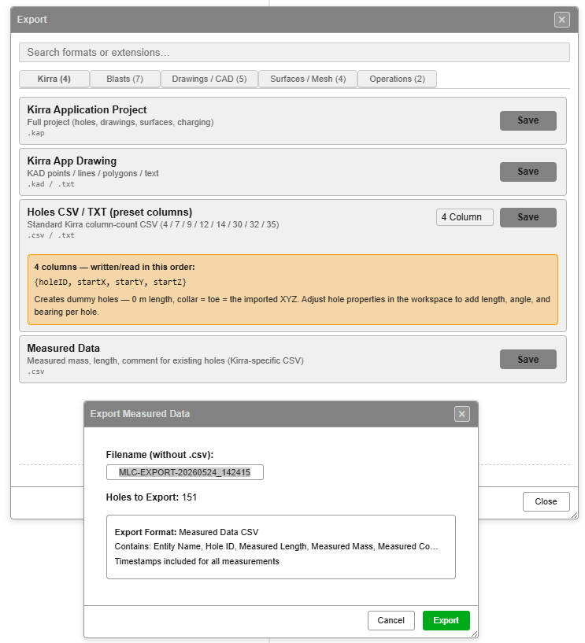
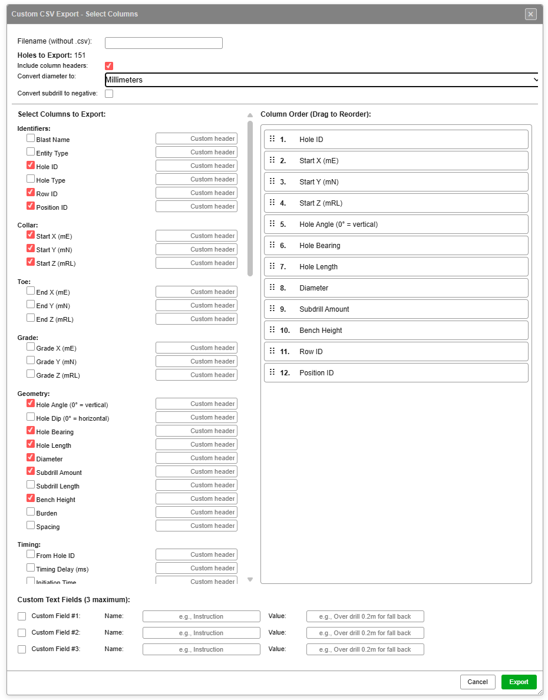
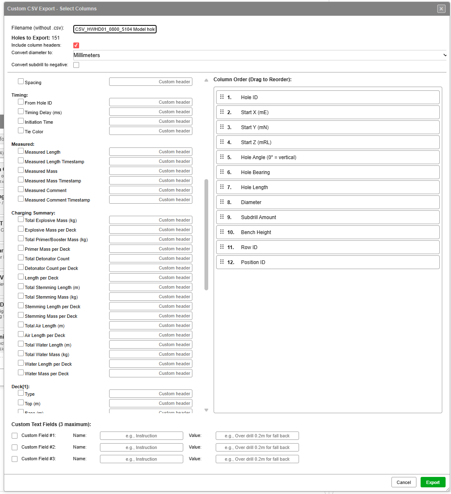
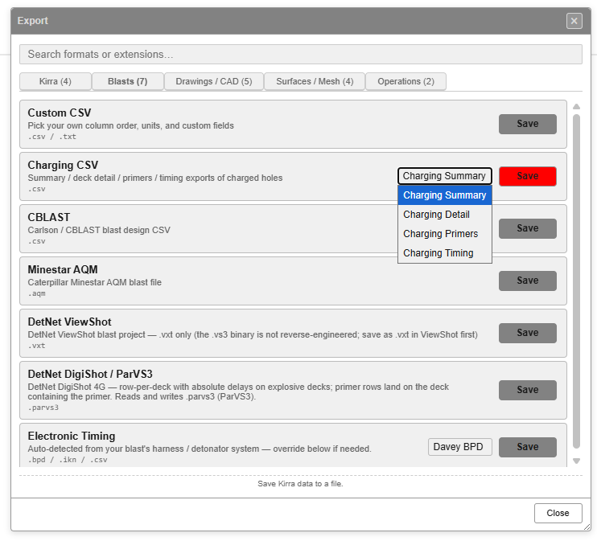

# CSV Export

Kirra writes blast holes to CSV in three flavours:

| Flavour | Where | Best for |
|---------|-------|----------|
| **Preset BlastHole CSV** | Kirra tab → *Holes CSV / TXT (preset columns)* | Round-trip with another Kirra session or a system that expects a fixed Kirra column layout |
| **Measured Data CSV** | Kirra tab → *Measured Data* | Sending as-built / as-loaded data back to a corporate system or back into another Kirra project |
| **Custom CSV** | Blasts tab → *Custom CSV* | Matching any downstream system's column layout — pick fields, units, order, custom headers, custom text columns; supports **charging round-trip** (v1.0.270+) |

> *Source of truth: `src/fileIO/TextIO/BlastHoleCSVWriter.js`, `CustomBlastHoleTextWriter.js`, and the Kirra wiki page [Custom CSV Format](https://github.com/brentbuffham/Kirra/wiki/Custom-CSV-Format).*

---

## How to Open the Export Dialog

1. Open the **Left Sidenav** (☰ in the App Navigation Bar)
2. Under **File Management**, click **Export**

The Export dialog is tabbed by file family — identical layout to the Import dialog.

*Export dialog on the Kirra tab — KAP, KAD, Holes CSV / TXT (preset columns), Measured Data. The Measured Data confirmation sub-dialog is shown.*

| Tab | Counts | What's on it |
|-----|--------|--------------|
| **Kirra** | 4 | KAP project, KAD drawing, Holes CSV / TXT, Measured Data |
| **Blasts** | 7 | Custom CSV + vendor formats (CBLAST, ShotPlus, DigiShot, etc.) |
| **Drawings / CAD** | 5 | DXF, Vulcan ARCH_D, Surpac, KML/KMZ, ESRI Shapefile |
| **Surfaces / Mesh** | 4 | GeoTIFF, OBJ/GLTF, Point Cloud, LAS |
| **Operations** | 2 | Epiroc Surface Manager, Wenco NAV |

---

## Holes CSV / TXT (preset columns)

The Kirra tab shows a **single row** for `Holes CSV / TXT (preset columns)` with a **column-count dropdown** — picking the preset is how you choose between the eight variants (4 / 7 / 9 / 12 / 14 / 30 / 32 / 35).

When you select a preset in the dropdown, an orange info bubble shows the column list and a description of what that preset produces. The descriptions visible in the screenshot:

| Preset | In-app description |
|--------|--------------------|
| **4 columns — written/read in this order** | `{holeID, startX, startY, startZ}` — Creates dummy holes (0 m length, collar = toe = imported XYZ). Adjust hole properties in the workspace to add length, angle, and bearing per hole. |
| **7** | + `endX, endY, endZ`. Length, angle, and bearing are derived from the geometry. Diameter is left at 0 (a valid no-diameter hole). |
| **9** | + `holeDiameter, holeType`. Holes default to connecting to themselves with zero delay — set tying via hole properties. |
| **12** | + `fromHoleID, delay, color`. Single default entity (no entity name in file). |
| **14** | `entityName, entityType, …` prepended. **Default for Kirra round-trip exports.** |
| **30** | Standard round-trip without rowID / posID / burden / spacing / connectorCurve. Preserves grade points, subdrill, bench, timing, and measured fields. |
| **32** | 30-column + `rowID` + `posID` for full row/position bookkeeping. |
| **35** | **Complete** — every blast hole property the parser reads back (design + measured + row/pos + burden / spacing / connector). |

For the full column-by-column order of each preset, see [CSV Import — preset variants](../importing/csv-formats.md#blasthole-csv--eight-preset-variants). The writer and parser share the same column order — round-trip is lossless when both ends use the same preset.

> **`safeToFixed`** writes `0.0000` for any `NaN` numeric value so the file stays parseable in non-tolerant CSV readers.

> **Visible holes only.** Hidden holes are filtered out at export — toggle visibility in the Data Explorer to control what gets written.

---

## Measured Data CSV

Picks the measured / as-built fields out of the visible holes and writes a compact CSV. Useful for handoff to a corporate or QA system that only cares about as-loaded data.

*The Measured Data confirmation sub-dialog (visible inside the Export dialog).*

| Field | Value |
|-------|-------|
| **Filename (without .csv)** | Auto-suggested as `MLC-EXPORT-<YYYYMMDD>_<HHMMSS>` (e.g. `MLC-EXPORT-20260524_142415`); editable before Export |
| **Holes to Export** | Live count of visible holes (e.g. `151`) |
| **Export Format** | `Measured Data CSV` (fixed) |
| **Contains** | 9 columns in this order: `entityName`, `entityType`, `holeID`, `measuredLength`, `measuredLengthTimeStamp`, `measuredMass`, `measuredMassTimeStamp`, `measuredComment`, `measuredCommentTimeStamp` |
| **Timestamps** | Included for every measurement (one timestamp column per value) |

Footer: **Cancel** / **Export** *(green)*.

The writer key for this preset is **`blasthole-csv-actual`**.

---

## Custom CSV Export

The Custom CSV export — accessed from the **Blasts** tab in the Export dialog — is the escape hatch when you need a non-Kirra column layout. It opens the **Custom CSV Export — Select Columns** dialog.

*Left: field picker grouped by category. Right: column order (drag to reorder). Bottom: custom text fields and Export button.*

### File header controls

| Control | Purpose |
|---------|---------|
| **Filename (without .csv)** | Output filename — `.csv` is appended automatically |
| **Holes to Export** | Live count of visible holes that will be written (e.g. `151`) |
| **Include column headers** | When ticked, the first row of the CSV is the column names |
| **Convert diameter to** | Unit conversion for the diameter column — dropdown with three options: **Millimeters**, **Meters**, **Inches**. `mm → in` divides by 25.4; `mm → m` divides by 1000 |
| **Convert subdrill to negative** | When ticked, subdrill values are written as negatives (some downstream systems expect this) |

### Select Columns to Export

Fields are grouped by category. Tick each column you want to include. Each row has a **Custom header** input — type a name to override the default column header in the output CSV.

The Custom CSV dialog scrolls — the full field list spans four screen-heights. The screenshots below show each section.

#### Page 1 — Identifiers / Collar / Toe / Grade / Geometry / start of Timing

(See the main dialog screenshot above.)

| Group | Fields |
|-------|--------|
| **Identifiers** | Blast Name, Entity Type, Hole ID, Hole Type, Row ID, Position ID |
| **Collar** | Start X (mE), Start Y (mN), Start Z (mRL) |
| **Toe** | End X (mE), End Y (mN), End Z (mRL) |
| **Grade** | Grade X (mE), Grade Y (mN), Grade Z (mRL) |
| **Geometry** | Hole Angle (0° = vertical), Hole Dip (0° = horizontal), Hole Bearing, Hole Length, Diameter, Subdrill Amount, Subdrill Length, Bench Height, Burden, Spacing |

#### Page 2 — Timing / Measured / Charging Summary

| Group | Fields |
|-------|--------|
| **Timing** | From Hole ID, Timing Delay (ms), Initiation Time, Tie Color |
| **Measured** | Measured Length, Measured Length Timestamp, Measured Mass, Measured Mass Timestamp, Measured Comment, Measured Comment Timestamp |
| **Charging Summary** | Total Explosive Mass (kg), Explosive Mass per Deck, Total Primer/Booster Mass (kg), Primer Mass per Deck, Total Detonator Count, Detonator Count per Deck, Length per Deck, Total Stemming Length (m), Total Stemming Mass (kg), Stemming Length per Deck, Stemming Mass per Deck, Total Air Length (m), Air Length per Deck, Total Water Length (m), Total Water Mass (kg), Water Length per Deck, Water Mass per Deck |

> **Charging Summary is write-only.** The brace-packed `*per Deck` columns (e.g. `EXP{[1]0.000|[2]52.350}`) are Excel-friendly but not parsed back on import. For round-trippable charging, use the **Deck[N]** and **Primer[N]** groups below.

#### Page 3 — Deck[N] groups

![Custom CSV Export — page 3 (Deck[1] / Deck[2])](../screenshots/CustomCSVExport-3.png)

A **Deck[N]** group appears for each deck index from 1 up to the maximum deck count across the visible holes (capped at 20). Every group exposes the same 12 attributes:

| Group | Fields |
|-------|--------|
| **Deck[N]** | Type, Top (m), Base (m), Length (m), Product, Density (g/cc), Mass (kg), Scaling Mode, Top Formula, Base Formula, Length Formula, Mass Formula |

Round-trippable — `*Formula` columns carry the verbatim `fx:` string so formulas survive a re-import.

#### Page 4 — Primer[N] groups

![Custom CSV Export — page 4 (Primer[1])](../screenshots/CustomCSVExport-4.png)

A **Primer[N]** group appears for each primer index across the visible holes:

| Group | Fields |
|-------|--------|
| **Primer[N]** | Deck Index, Depth (m), Depth Formula, Detonator, Detonator Type, Detonator Delay (ms), Detonator VoD (m/s), Detonator Qty, Booster, Booster Mass (g), Booster Qty, Total Downhole Delay (ms) |

> **Hole Angle vs Hole Dip.** Both are exposed — pick the convention your downstream system uses:
> - **Hole Angle** — `0°` = vertical (Kirra's native convention)
> - **Hole Dip** — `0°` = horizontal (converted on export as `90 − holeAngle`)

> **Subdrill Amount vs Subdrill Length.** Two fields, two conventions:
> - **Subdrill Amount** — vertical Δz (m)
> - **Subdrill Length** — along-hole subdrill (m)

### Column Order (Drag to Reorder)

The right-hand panel lists every selected column with its **position number** (1, 2, 3, …). Drag rows to reorder — the output CSV writes columns in this order.

### Custom Text Fields (3 maximum)

Three Name / Value pairs at the bottom let you append arbitrary text columns to every row. Useful for tagging exports with an instruction, a designer, a project code, or any fixed value the downstream system expects.

| Field | Example |
|-------|---------|
| Name | `Instruction` |
| Value | `Over drill 0.2m for fall back` |

The Name becomes the column header; the Value is written into every data row.

### Charging round-trip (v1.0.270+)

The **Charging Summary**, **Deck[N]**, and **Primer[N]** groups on pages 2-4 only appear when at least one visible hole has **charging applied**. The exporter scans the visible holes, finds the maximum deck and primer count, and emits exactly that many groups (capped at 20 each for dialog scannability).

When a CSV with `deck*[N]` or `primer*[N]` headers is re-imported through Custom CSV, the parser auto-detects the charging columns (no manual mapping needed) and reconstructs each hole's `HoleCharging` — decks, primers, and verbatim `fx:` formula strings.

For the underlying column names (`deckType[N]`, `deckBaseFormula[N]`, `primerDetonatorDelayMs[N]`, etc.) and worked round-trip examples, see the Kirra wiki: [Custom CSV Format → Charging columns](https://github.com/brentbuffham/Kirra/wiki/Custom-CSV-Format#charging-columns-v10270).

> **Round-trip limit:** Formula strings ride along as text but only re-evaluate when the next **Apply Charge Rule** runs. The imported numeric values are the source of truth until then.

### Footer

| Button | Action |
|--------|--------|
| **Cancel** | Close without exporting |
| **Export** *(green)* | Write the CSV file using the selected columns, order, custom fields, and any charging columns |

---

## Charging CSV

On the **Blasts** tab the Export dialog has a single **Charging CSV** entry with a 4-option dropdown — picking the dropdown value selects the writer key.

*Blasts tab — Charging CSV row with dropdown showing the four sub-formats.*

| Dropdown option | Writer key | What it writes |
|-----------------|------------|----------------|
| **Charging Summary** | `charging-summary` | Per-hole charge totals (one row per hole) |
| **Charging Detail** | `charging-detail` | Per-deck breakdown (one row per deck) |
| **Charging Primers** | `charging-primers` | Primer placements |
| **Charging Timing** | `charging-timing` | Computed deck fire times |

The row description reads *"Summary / deck detail / primers / timing exports of charged holes"*.

> **Only charged holes are written.** Holes with no charging assignment are excluded. Assign charging in the [Deck Builder](../charging/deck-builder.md) first.

See [Charging Overview](../charging/overview.md) for what each charging field carries.

### Other entries on the Blasts tab

The Blasts tab in the Export dialog also includes:

| Format | Extensions | Notes |
|--------|------------|-------|
| **Custom CSV** | `.csv` / `.txt` | The flexible exporter documented above |
| **CBLAST** | `.csv` | Carlson / CBLAST blast design CSV |
| **Minestar AQM** | `.aqm` | Caterpillar MineStar AQM blast file |
| **DetNet ViewShot** | `.vxt` | `.vxt` only (the `.vs3` binary is not reverse-engineered) |
| **DetNet DigiShot / ParVS3** | `.parvs3` | Row-per-deck with absolute delays on explosive decks; primer rows land on the deck containing the primer |
| **Electronic Timing** | `.bpd` / `.ikn` / `.csv` | Auto-detected from your blast's harness / detonator system — override the target vendor format in the dropdown (default detected from system; e.g. *Davey BPD*) |

---

## Tips

- **Coordinate units** — Easting (X), Northing (Y), Elevation (Z) in metres
- **Diameter** — millimetres by default; Custom CSV lets you convert to inches or metres
- **Delays** — milliseconds, relative to `fromHoleID`. Use `na`, `n/a`, `null`, or `nan` to write a null connector (the harness-wire convention)
- **File encoding** — UTF-8 (no BOM)
- **Decimal separator** — period (`.`); 4 decimal places by default
- **Empty fields** — preset writers fill `NaN` with `0.0000` to stay parseable in non-tolerant readers; Custom CSV writes empty cells

---

## Round-trip fidelity

| Round-trip | Preserves | Loses |
|------------|-----------|-------|
| 14 → import → 14 | name, ID, collar/toe, diameter, type, tying, delay, colour | grade, subdrill, measured, row/pos |
| 35 → import → 35 | everything the parser knows about | nothing |
| 35 → import → 14 → 35 | re-derives grade from subdrill (small drift) | `rowID`, `posID`, `burden`, `spacing`, `connectorCurve` |
| Custom CSV (geometry) → re-import | the geometry fields you ticked | anything you didn't tick |
| Custom CSV with Deck[N] / Primer[N] → re-import | full charging state — decks, primers, verbatim formula strings | live formula re-evaluation until next Apply Charge Rule |

For the most faithful Kirra-to-Kirra round-trip, prefer **KAP** — it carries every project state (charging, timing constructs, drawings, surfaces, layers) instead of just the holes.

---

## Related topics

- [CSV Import](../importing/csv-formats.md) — preset variants and Custom CSV import side
- [Kirra wiki: Custom CSV Format](https://github.com/brentbuffham/Kirra/wiki/Custom-CSV-Format) — authoritative parser/writer reference
- [Kirra wiki: BlastHole CSV Format](https://github.com/brentbuffham/Kirra/wiki/BlastHole-CSV-Format) — authoritative preset reference
- [DXF Export](dxf-export.md)
- [Other Formats (IREDES, AQM, KML)](other-formats.md)
- [Charging Overview](../charging/overview.md)
- [Hole Properties Reference](../reference/hole-properties.md)
