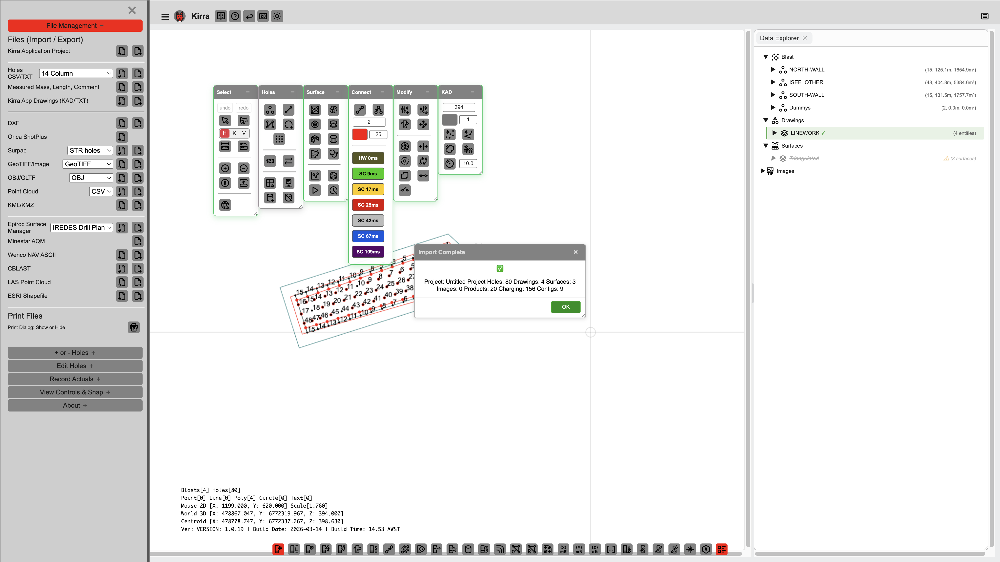
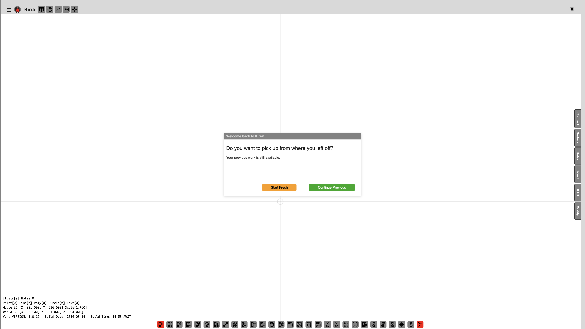

# Your First Blast — Step-by-Step Walkthrough

This guide walks you through creating a blast design from scratch — from opening Kirra to exporting a production-ready file.

---

## Before You Start

- A modern browser (Chrome recommended)
- Hole survey data (CSV, DXF, or other supported format) **or** bench coordinates to generate a pattern manually

---

## Step 1 — Open Kirra

1. Open Kirra in your browser by navigating to the application URL.
2. The **Welcome popup** appears with version info, a quick guide, and licence details.
3. Dismiss the popup to start.

*The Welcome popup on startup.*

---

## Step 2 — Import Your Data

1. Go to **File → Import**.
2. Choose your format: CSV, DXF, DTM/STR, OBJ, PLY, GLTF/GLB, IREDES, KML, SHP, or LAS.
3. Select your file and complete any import mapping if prompted.
4. The canvas **auto-centres** on your imported data.

*Kirra confirms when data has been loaded successfully.*

*If prompted, click Continue to proceed.*

> **Tip:** See the [Importing](../importing/csv-formats.md) section for format-specific guidance.

---

## Step 3 — Toggle Between 2D and 3D

- Use the view toggle to switch between **2D** (plan view) and **3D** (elevation view).
- 2D is ideal for pattern layout; 3D shows terrain and hole depths.

---

## Step 4 — Select Holes

- **Click** a hole to select it.
- **Shift+click** to add or remove holes from the selection (multi-select).
- Selected holes highlight on the canvas.

---

## Step 5 — View Hole Properties

- **Right-click** a hole to open the context menu.
- Choose **Properties** (or equivalent) to view and edit collar, toe, diameter, bearing, inclination, subdrill, timing, and charge info.

---

## Step 6 — Generate a Pattern (Optional)

If you are building a pattern from scratch:

1. Go to **Pattern → Add Pattern**.
2. Choose **Rectangular**, **Polygon**, or **Line-based**.
3. Enter burden, spacing, and hole count (or draw a boundary).
4. Click **Generate** — holes appear on the canvas.

See [Pattern Generation](../blast-design/pattern-generation.md) for full details.

---

## Step 7 — Assign Timing

1. Open the **Connect** toolbar (floating toolbar on the right).
2. Use the Connect tool to set delay sequences between holes.
3. Assign inter-hole and inter-row delays as required.

See [Timing Sequences](../blast-design/timing-sequences.md) for advanced options.

---

## Step 8 — Add Charging (Optional)

1. Open the **Charging** panel.
2. Select one or more holes.
3. Build deck configurations: stemming, boosters, explosive products.
4. Apply to selected holes.

See [Charging Overview](../charging/overview.md) for the full workflow.

---

## Step 9 — Run Analysis (Optional)

1. Open the **Surface** toolbar.
2. Click **Blast Analysis Shader** for vibration modelling.
3. View predicted PPV, Voronoi rock distribution, and blast statistics.

---

## Step 10 — Export

1. Go to **File → Export**.
2. Choose your format: CSV, DXF, GLB, GeoTIFF, IREDES, etc.
3. Configure any format-specific options.
4. Save the file to your chosen location.

---

## Step 11 — Print

- **File → Print to PDF** — Print the current view directly to PDF.
- **File → Print from Template** — Use an XLSX template for formatted reports.

---

## Summary

| Step | Action |
|------|--------|
| 1 | Open Kirra in your browser |
| 2 | Import data (File → Import) |
| 3 | Toggle 2D/3D views |
| 4 | Select holes (click, Shift+click) |
| 5 | View properties (right-click) |
| 6 | Generate pattern (Pattern → Add Pattern) |
| 7 | Assign timing (Connect tool) |
| 8 | Add charging *(optional)* |
| 9 | Run analysis *(optional)* |
| 10 | Export (File → Export) |
| 11 | Print (File → Print to PDF or Print from Template) |

---

## Screenshots

*More step-by-step screenshots coming soon.*

---

*[← Overview](overview.md) | [Interface Tour](interface-tour.md)*
