# Your First Blast — Step-by-Step Walkthrough

This guide walks through a complete blast design from a blank workspace — define a pattern template, place holes (rectangular block **or** inside a polygon), load explosive products, build a deck, draw timing connectors, and animate the blast.

If you haven't already, read the [Interface Tour](interface-tour.md) so the App Navigation Bar, side panel, and floating toolbars are familiar.

> The screenshots in this walkthrough were captured on Kirra **v1.0.240**. Some dialogs have gained fields since then — the tables below list the fields in the current version.

---

## Before You Start

- A modern desktop browser (Chrome / Edge recommended), or the Kirra desktop installer
- No data needed — we'll build everything from scratch

---

## Step 1 — Open the Pattern Templates Library

A **Pattern Template** is a reusable bundle of design defaults (diameter, burden, spacing, sub-drill, hole angle, row direction, blast-name pattern). You define it once, then drop it on the canvas as a block of holes or inside a polygon.

Open the **Pattern Templates** dialog from the highlighted button on the **Holes** floating toolbar.

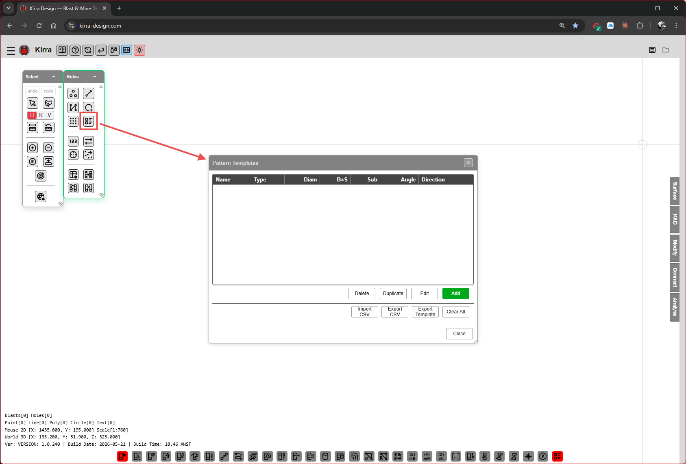
*The Holes toolbar (red-boxed button) opens the Pattern Templates dialog.*

The list is empty on first launch. Columns: **Name**, **Type**, **Diam**, **B×S**, **Sub**, **Angle**, **Direction**, **Text**, **Charge**.

Footer buttons:

| Button | Purpose |
|--------|---------|
| **Delete** | Remove the selected template |
| **Duplicate** | Copy the selected template |
| **Edit** | Open the selected template for editing |
| **Add** *(green)* | Create a new template |
| **Import CSV** | Load templates from CSV |
| **Export CSV** | Save templates to CSV |
| **Export Template** | Export a single template file |
| **Clear All** | Remove every template |
| **Close** | Close the dialog |

Click **Add** to create your first template.

---

## Step 2 — Define the Pattern Template

The **Add Pattern Template** dialog opens.

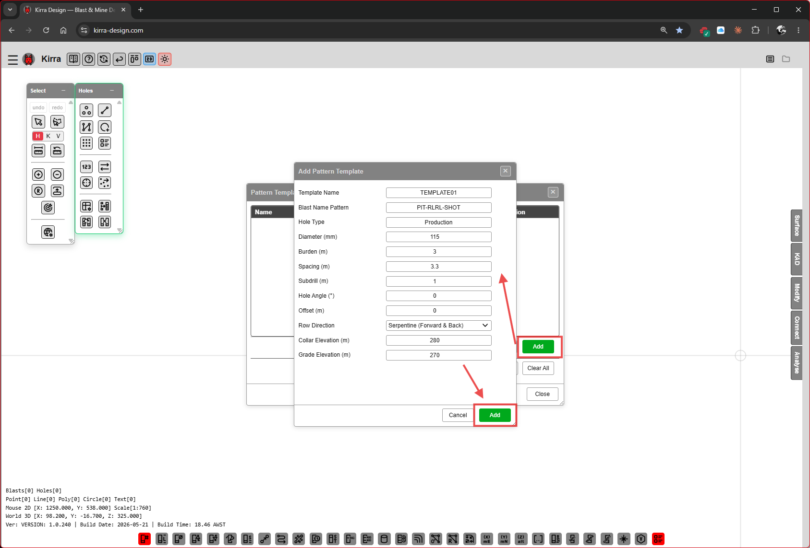
*Fill the template fields, then click the green **Add** button.*

Fields (with the values shown in the screenshot):

| Field | Example value | Purpose |
|-------|---------------|---------|
| **Template Name** | `TEMPLATE01` | Label used to pick this template later |
| **Blast Name Pattern** | `PIT-RLRL-SHOT` | Default blast-name prefix for holes placed with this template |
| **Hole Type** | `Production` | Free text — type any hole type name (e.g. Production, Buffer, Presplit) |
| **Diameter (mm)** | `115` | Hole diameter |
| **Burden (m)** | `3` | Spacing between rows |
| **Spacing (m)** | `3.3` | Spacing along a row |
| **Subdrill (m)** | `1` | Length below grade |
| **Hole Angle (°)** | `0` | 0 = vertical |
| **Offset (m)** | `0` | Row-to-row offset for staggered patterns |
| **Row Direction** | `Serpentine (Forward & Back)` | How rows alternate |
| **Collar Elevation (m)** | `280` | Default collar Z |
| **Grade Elevation (m)** | `270` | Default grade (toe) Z |

Click the green **Add** button (bottom right) to save the template.

---

## Step 3 — Verify and Close

The template now appears in the list, highlighted.

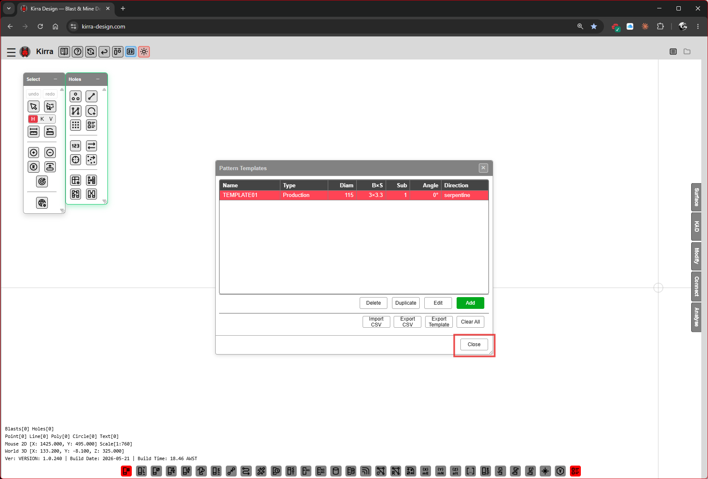
*`TEMPLATE01` saved — type Production, 115 mm, 3×3.3 BxS, 1 m sub-drill, 0° angle, serpentine direction.*

Click **Close** to dismiss the Pattern Templates dialog.

---

## Step 4 — Option A: Place a Block of Holes

The simplest layout — a rectangular grid that uses your template's burden, spacing, and direction.

Click the **Add Pattern** button (highlighted) on the **Holes** toolbar, then click on the canvas where the pattern should start. The **Add a Pattern?** dialog opens with that point filled in.

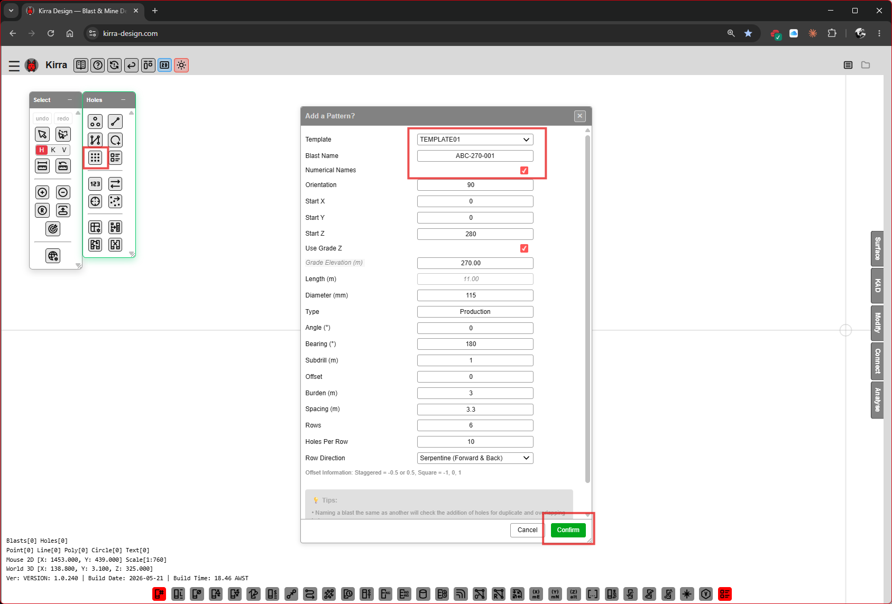
*Add a Pattern? dialog — Template dropdown locked to `TEMPLATE01`, Blast Name set to `ABC-270-001`, Numerical Names ticked.*

Fields (with the values shown):

| Field | Example | Purpose |
|-------|---------|---------|
| **Template** | `TEMPLATE01` | Pick the template defined in Step 2 |
| **Blast Name** | `ABC-270-001` | Name for this blast (the entity name in the TreeView) |
| **Numerical Names** | ☑ | Use numeric hole IDs (1, 2, 3…) |
| **Orientation** | `90` | Pattern orientation in degrees |
| **Start X / Y / Z** | `0 / 0 / 280` | Pattern origin — X and Y come from your click (collar Z = `280` from template) |
| **Use Grade Z** | ☑ | Compute toe from grade elevation |
| **Grade Elevation (m)** | `270.00` | Pulled from template |
| **Length (m)** | `11.00` | Hole length from collar to toe |
| **Diameter (mm)** | `115` | From template |
| **Type / Angle / Hole Pivot Location / Bearing** | from template | **Hole Pivot Location** says whether the clicked point is the collar, grade or toe |
| **Subdrill / Offset** | from template | |
| **Burden / Spacing** | `3 / 3.3` | From template |
| **Rows** | `6` | |
| **Holes Per Row** | `10` | |
| **Row Direction** | `Serpentine (Forward & Back)` | From template |

The dialog notes read:
> *Offset Information: Staggered = -0.5 or 0.5, Square = -1, 0, 1*
> *• Naming a blast the same as another will check the addition of holes for duplicate and overlapping holes.*

Click **Confirm** to place the block.

---

## Step 4A — Block Placed

A 6-row × 10-hole grid appears on the canvas, numbered 1 → 60 in the serpentine row direction.

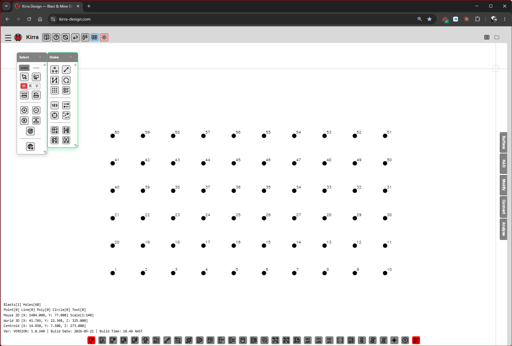
*60 holes placed in a 6×10 serpentine block. The Information Overlay (bottom-left) now reads `Blasts[1] Holes[60]`.*

If a rectangular block is all you need, skip ahead to [Step 6 — Build the Product Library](#step-6--build-the-product-library).

---

## Step 5 — Option B: Place Holes Inside a Polygon

For an irregular blast boundary, draw a polygon first and then fill it with holes.

### Step 5 — Start a drawing layer

On the **KAD** toolbar, click the **Polygon** drawing tool (highlighted in red). Kirra prompts you to **name the drawing layer** the new geometry will live in.

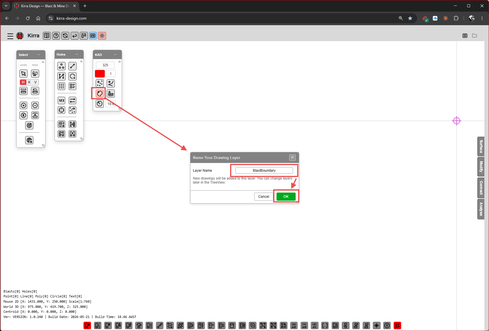
*KAD → Polygon tool → "Name Your Drawing Layer" dialog. Type a layer name (e.g. `BlastBoundary`) and click **OK**.*

> The helper text on the dialog reads: *"New drawings will be added to this layer. You can change layers later in the TreeView."*

### Step 5A — Draw the polygon

Click around the canvas to place polygon vertices. Press **Escape** (or double-click) to close the polygon.

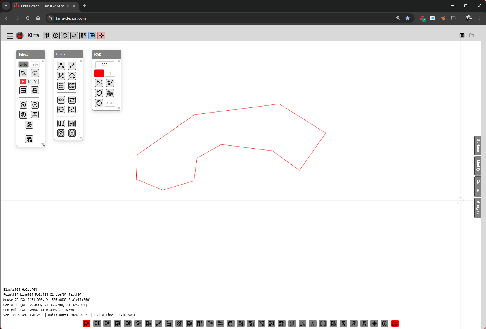
*A free-form polygon drawn on the canvas — this will be the blast boundary.*

### Step 5B — Pick the polygon with the Pattern in Polygon tool

On the **Holes** toolbar, click the **Pattern in Polygon** button (highlighted), then click the polygon you just drew. Click the **start** point and the **end** point of the first row (this sets the row direction), then click the **reference** point. Kirra labels the picks on the canvas.

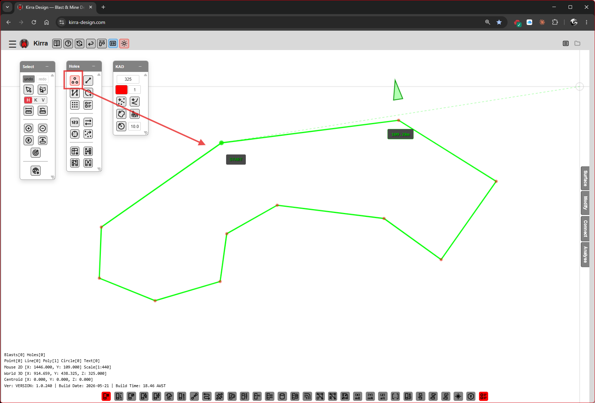
*Polygon picked. Green Start / End labels show where the row sweep begins and ends.*

### Step 5C — Configure the Generate Pattern in Polygon dialog

The **Generate Pattern in Polygon** dialog is template-driven like the block placement, with a few polygon-specific fields.

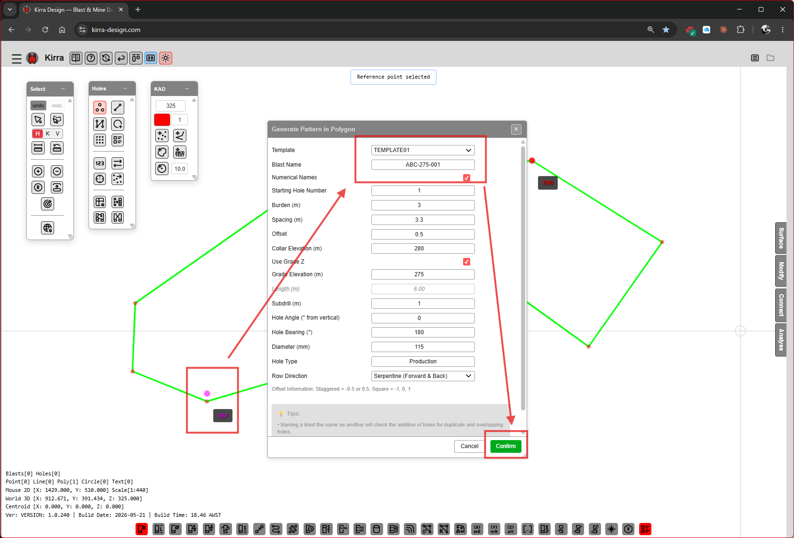
*Generate Pattern in Polygon dialog with `TEMPLATE01` selected.*

| Field | Example |
|-------|---------|
| **Template** | `TEMPLATE01` |
| **Blast Name** | `ABC-275-001` |
| **Numerical Names** | ☑ |
| **Starting Hole ID** | `1` (or `A1` for row-letter names) |
| **Burden (m)** / **Spacing (m)** / **Offset** | `3` / `3.3` / `0.5` |
| **Insert extra holes (× spacing)** | Tries one more hole this far past each row end, kept only if inside the polygon. `0` = off |
| **Collar Elevation (m)** | `280` |
| **Use Grade Z** / **Grade Elevation (m)** / **Length (m)** | ☑ / `275` / calculated |
| **Subdrill (m)** | `1` |
| **Hole Angle (° from vertical)** | `0` |
| **Hole Pivot Location** | Collar |
| **Hole Bearing (°)** | `180` |
| **Diameter (mm)** | `115` |
| **Hole Type** | `Production` |
| **Row Direction** | `Serpentine (Forward & Back)` |

Click **Confirm**.

### Step 5D — Holes generated

Kirra fills the polygon row-by-row, snapping the rows to the polygon edges using the row-direction setting.

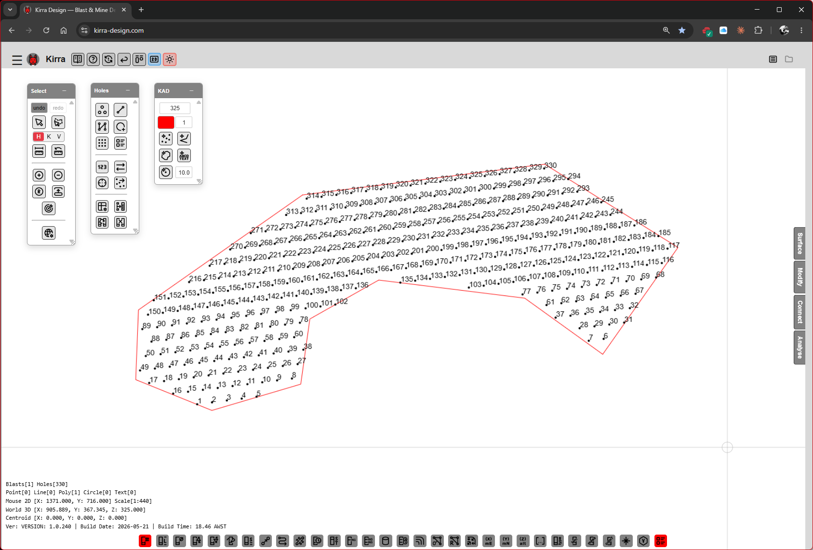
*Holes filling the polygon, numbered along the serpentine sweep.*

### Step 5E — Final polygon-filled pattern

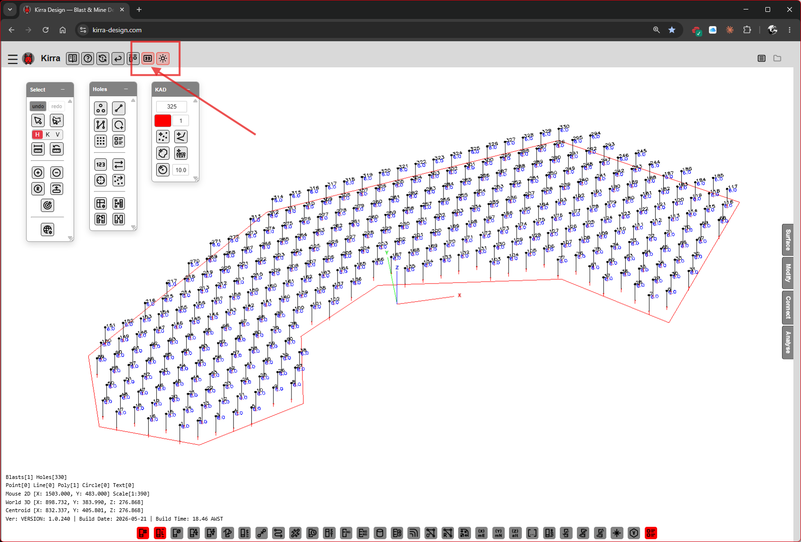
*Pattern after generation — the polygon boundary remains as a KAD layer; holes are a separate blast entity.*

---

## Step 6 — Build the Product Library

Before you can charge holes, Kirra needs to know what explosive and non-explosive products you're using. Open the **Product Manager** dialog from the highlighted button on the **Holes** toolbar.

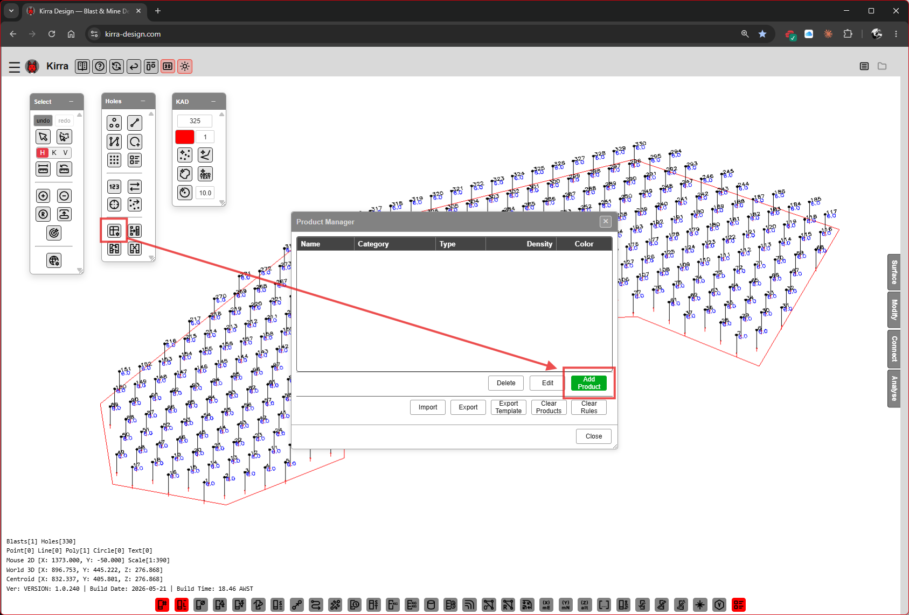
*Product Manager opens with an empty list. Click the green **Add** button to define your first product.*

The Product Manager dialog has:

| Element | Purpose |
|---------|---------|
| Columns | **Name**, **Category**, **Type**, **Density**, **Color** |
| **Add** / **Edit** / **Delete** / **Duplicate** | Modify the product list |
| **Check** | Check the products for problems |
| **Import** / **Export** | Load or save the product and charge-rule library |
| **Export Template** | Export a starter file |
| **Clear Products** / **Clear Rules** / **Edit Rules** | Wipe the products or rules, or edit the charge rules |
| **Close** | Dismiss the dialog |

You'll add four products in this walkthrough: **STEMMING**, **ANFO** (bulk), **BOOSTER**, and an initiator (**DH-400MS**).

See [Products CSV Reference](../charging/products-csv.md) for the full schema if you want to import a pre-built library instead.

### Step 6A — Add STEMMING (non-explosive)

The **Add Product** sub-dialog opens.

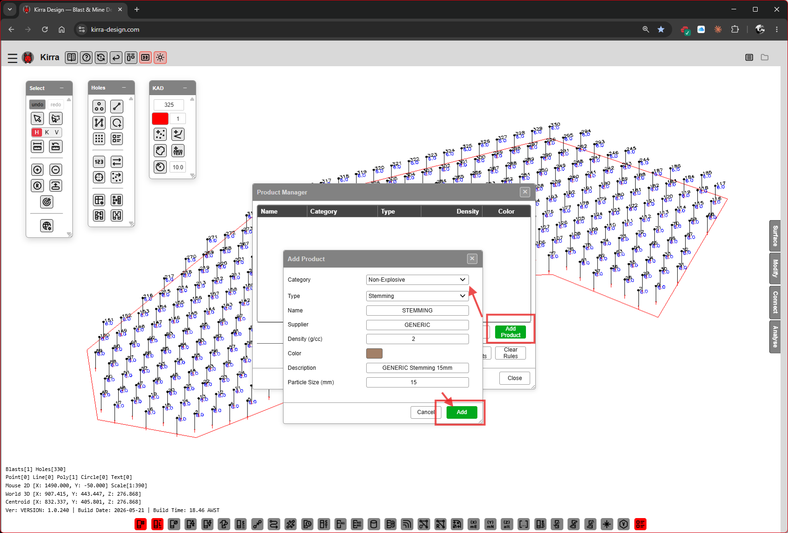

| Field | Value |
|-------|-------|
| **Category** | `Non-Explosive` |
| **Type** | `Stemming` |
| **Name** | `STEMMING` |
| **Supplier** | `GENERIC` |
| **Density (g/cc)** | `2` |
| **Color** | brown swatch |
| **Description** | `GENERIC Stemming 15mm` |
| **Particle Size (mm)** | `15` |

Click **Add**.

### Step 6B — Add ANFO (bulk explosive)

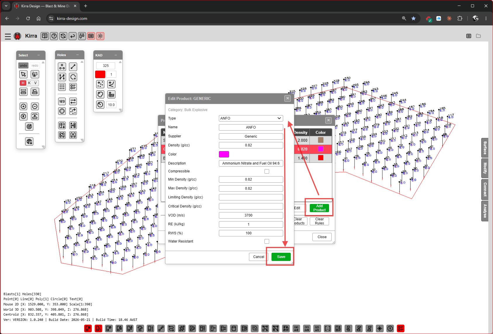

| Field | Value |
|-------|-------|
| **Category** | `Bulk Explosive` |
| **Type** | `ANFO` |
| **Name** | `ANFO` |
| **Supplier** | `Generic` |
| **Density (g/cc)** | `0.82` |
| **Color** | magenta swatch |
| **Description** | `Ammonium Nitrate and Fuel Oil 94:6` |
| **Compressible** | unchecked |
| **Min Density (g/cc)** | `0.82` |
| **Max Density (g/cc)** | `0.82` |
| **Limiting Density (g/cc)** | blank |
| **Critical Density (g/cc)** | blank |
| **VOD (m/s)** | `3700` |
| **RE (kJ/kg)** | relative energy of the product |
| **RWS (%)** | `100` |
| **Water Resistant** | unchecked |

Click **Add**. (The screenshot shows the same product being edited afterwards, so its button reads **Save**.)

### Step 6C — Add BOOSTER (high explosive)

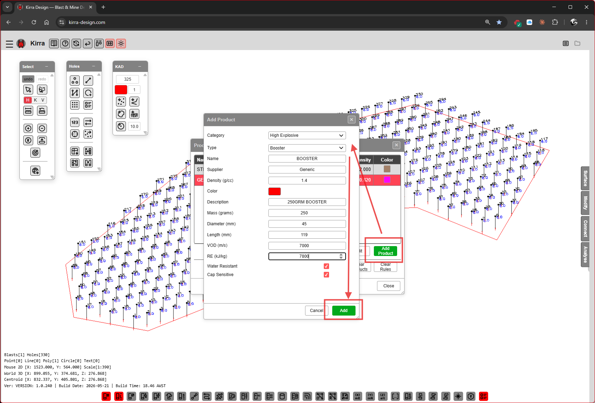

| Field | Value |
|-------|-------|
| **Category** | `High Explosive` |
| **Type** | `Booster` |
| **Name** | `BOOSTER` |
| **Supplier** | `Generic` |
| **Density (g/cc)** | `1.4` |
| **Color** | red swatch |
| **Description** | `250GRM BOOSTER` |
| **Mass (grams)** | `250` |
| **Diameter (mm)** | `45` |
| **Length (mm)** | `119` |
| **VOD (m/s)** | `7000` |
| **RE (kJ/kg)** | `7800` |
| **Water Resistant** | ☑ |
| **Cap Sensitive** | ☑ |

Click **Add**.

### Step 6D — Add an initiator (downhole detonator)

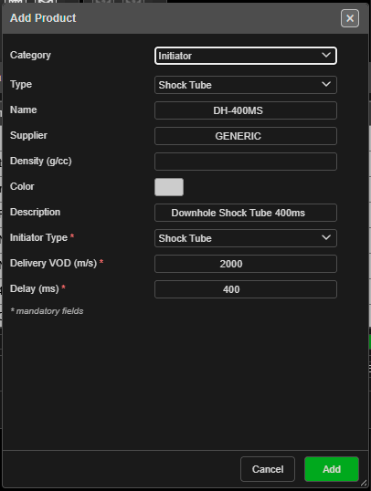
<!-- SCREENSHOT NEEDED: re-capture Add Product for DH-400MS. This image predates the Initiator Type list being limited by Type; it shows "Electronic" and delay-range fields that no longer appear for a shock tube. -->

| Field | Value |
|-------|-------|
| **Category** | `Initiator` |
| **Type** | `Shock Tube` |
| **Name** | `DH-400MS` |
| **Supplier** | `GENERIC` |
| **Density (g/cc)** | blank |
| **Color** | green swatch |
| **Description** | `Downhole Shock Tube 400ms` |
| **Initiator Type** | `Shock Tube` — the list only offers roles the chosen Type can play. For a shock-tube product these are **Shock Tube** (the downhole detonator) and **Surface Connector** |
| **Delivery VOD (m/s)** | `2000` |
| **Delay (ms)** | `400` |

Click **Add**.

### Step 6E — Product library complete

The Product Manager now lists all four products with their categories, types, densities, and colours.

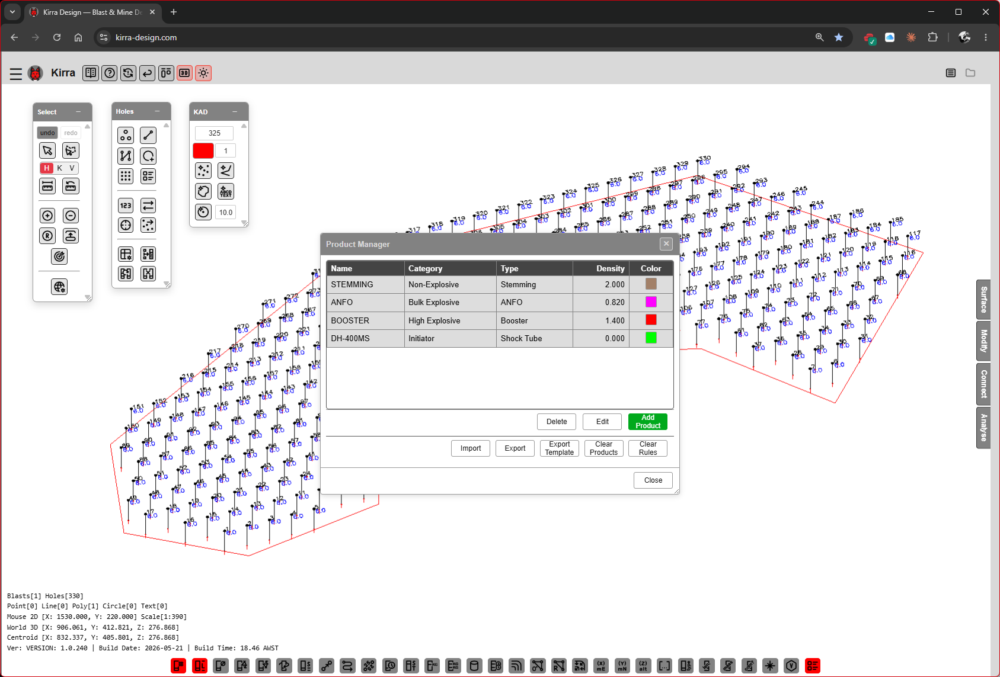
*Product list: STEMMING / ANFO / BOOSTER / DH-400MS.*

Click **Close**.

---

## Step 7 — Build a Deck in the Deck Builder

Now that products exist, you can assemble a **deck stack** — the sequence of stemming, bulk explosive, primers, and any inert spacers in a single hole — and apply it to selected holes.

### Step 7 — Open the Deck Builder

Open the **Deck Builder** dialog from the highlighted button on the **Holes** toolbar. The dialog has three columns:

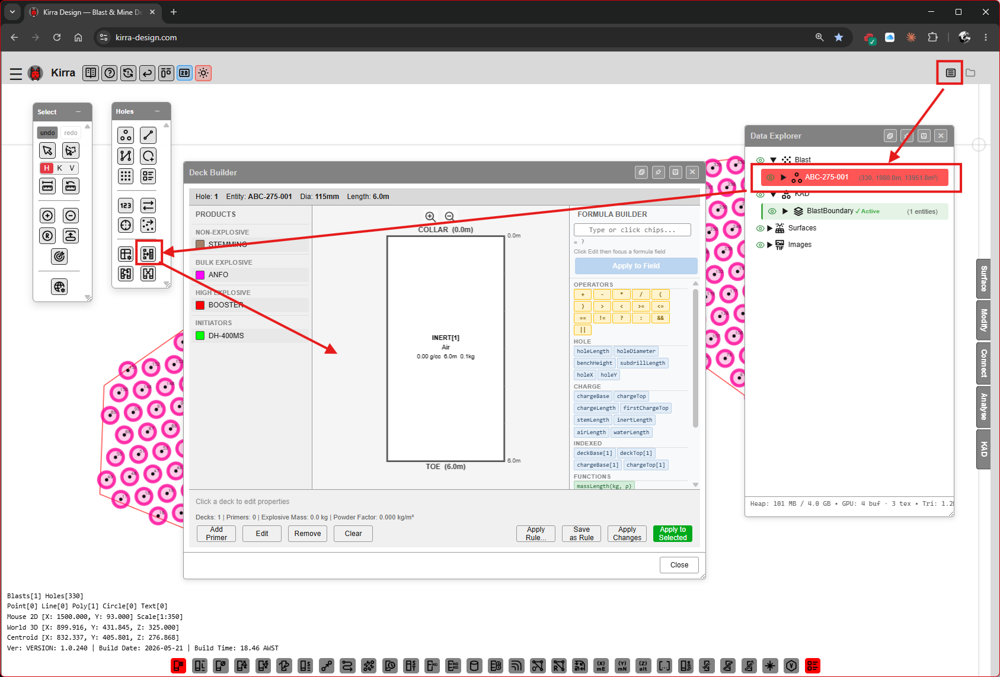

| Column | Purpose |
|--------|---------|
| **PRODUCTS** (left) | The library you built in Step 6 — drag products into the centre column |
| **COLLAR** (centre) | The deck stack visualised from collar (top) to toe (bottom). Shows hole header `Hole: ABC-275-001 / Diam: 115mm / Length: 8.0m` |
| **FORMULA BULDER** (right) | Click `fx:` formula chips to set deck base/top/length expressions |

The status row at the bottom shows the deck and primer counts, explosive mass and powder factor — for example *"Decks: 0 | Primers: 0 | Explosive Mass: 0.0 kg | Powder Factor: 0.000 kg/m³"*.

Footer buttons: **Add Primer**, **Edit**, **Remove**, **Clear**, **Apply Rule...**, **Save as Rule**, **Apply Changes**, **Apply to Selected** (green), **Close**.

The Data Explorer on the right shows the entity tree — your blast (`ABC-275-001`), KAD layers, surfaces, and images.

### Step 7A — Drag products into the deck

Drag products from the **PRODUCTS** column into the **COLLAR** column. The deck stack updates live.

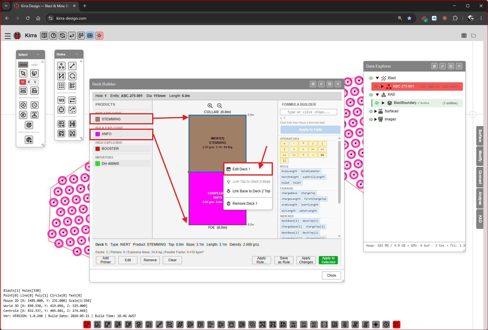
*Decks placed in the column. Right-click a deck for **Edit Deck N**, **Link Top to Deck N−1 Base** and **Remove Deck N**.*

The status row updates with the new deck count, explosive mass and powder factor.

### Step 7B — Set stemming geometry

Right-click the stemming deck and choose **Edit Deck N** to open the **Edit Deck** dialog.

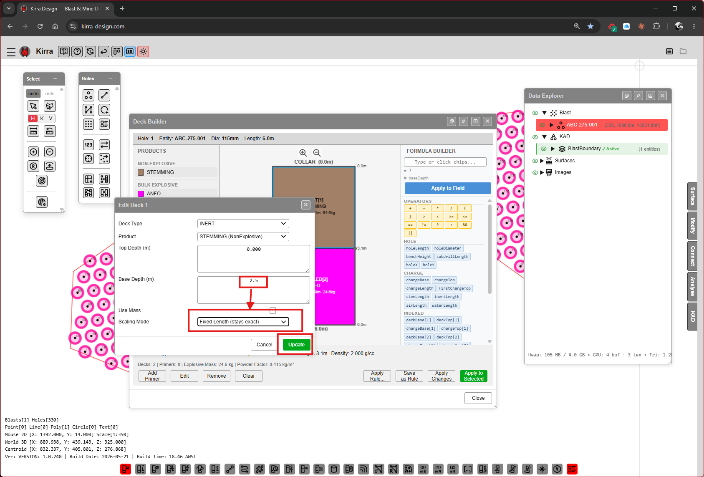

| Field | Example | Purpose |
|-------|---------|---------|
| **Deck Type** | `INERT` | Stemming is inert |
| **Product** | `STEMMING` | The chosen product |
| **Top Depth (m)** | `0.0` | Depth from collar |
| **Base Depth (m)** | `2.5` | Bottom of the stemming deck |
| **Use Mass** | unchecked | Drive by mass instead of length |
| **Scaling Mode** | `Fixed Length — exact` | How the deck scales when applied to other holes |

Click **Update**.

### Step 7C — Right-click a deck to link or edit

Right-click any deck and use **Link Top to Deck N Base** to make a deck's top depth automatically follow the base of the deck above it. This is how a coupled charge column stays continuous when scaling.

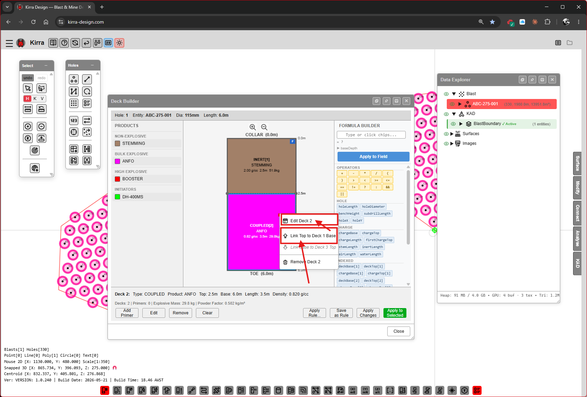
*Context menu options: **Edit Deck 2**, **Link Top to Deck 1 Base**, **Remove Deck 2**.*

### Step 7D — Set the coupled deck

Edit the coupled (ANFO) deck to set its base depth and scaling mode.

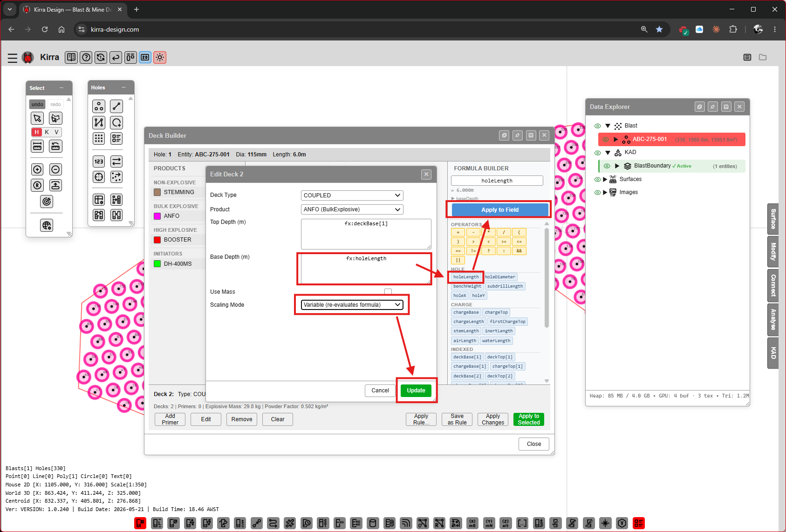

| Field | Example | Purpose |
|-------|---------|---------|
| **Deck Type** | `COUPLED` | Bulk-loaded against the hole wall |
| **Product** | `ANFO (Built-in product)` | The chosen product |
| **Top Depth (m)** | `fx:deckBase[1]` | Follows the base of deck 1 once **Link Top to Deck 1 Base** is set |
| **Base Depth (m)** | *(formula)* | E.g. `fx:holeLength` to reach the toe |
| **Use Mass** | unchecked | |
| **Scaling Mode** | `Variable — per-hole formula` | Re-evaluates the formula for each hole, so the deck stretches in a longer hole |

The four scaling modes are **Variable — per-hole formula**, **Proportional — scales w/ hole**, **Fixed Length — exact** and **Fixed Mass — from density**.

Click **Update**.

### Step 7E — Add a primer

Click the **Add Primer** button at the bottom of the Deck Builder to open the **Add Primer** dialog.

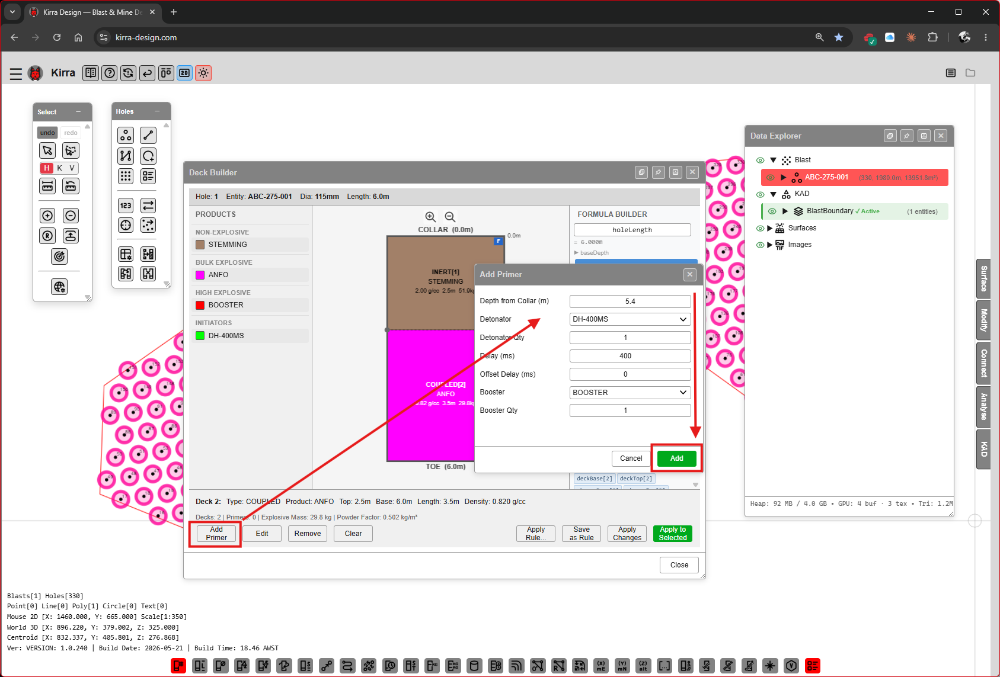

| Field | Example | Purpose |
|-------|---------|---------|
| **Depth from Collar (m)** | `5.4` | Where the primer sits — a number, or a formula such as `fx:holeLength-0.6` for base priming |
| **Detonator** | `DH-400MS` | The downhole initiator product |
| **Detonator Qty** | `1` | Detonators in this primer |
| **Delay (ms)** | `400` | Detonator delay |
| **Offset Delay (ms)** | `0` | Extra delay — only used by programmable electronic detonators |
| **Booster** | `BOOSTER` | Booster product |
| **Booster Qty** | `1` | Boosters in this primer |

Click **Add**.

### Step 7F — Apply charges to the selected holes

Select the holes to charge, then click **Apply to Selected** (green button, bottom right). A confirmation dialog appears.

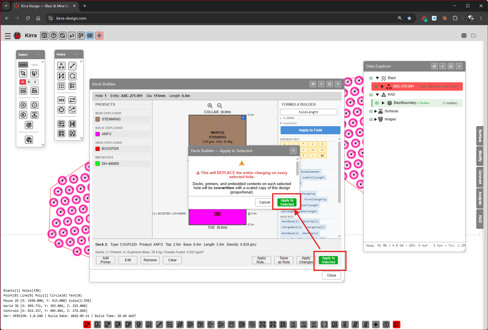
*"Deck Builder — Apply to Selected" — "This will **REPLACE** the entire charging assignment on each of the currently selected holes. Decks, primers, and properties on each selected hole will be overwritten with a scaled copy of this design."*

Click the confirmation button to commit. Variable-scaled decks are recomputed per hole length using each hole's actual length.

### Step 7G — Holes are charged

Switch to 3D (or rotate the canvas) and your pattern is now visibly loaded — magenta / pink columns show the explosive decks, brown caps show the stemming.

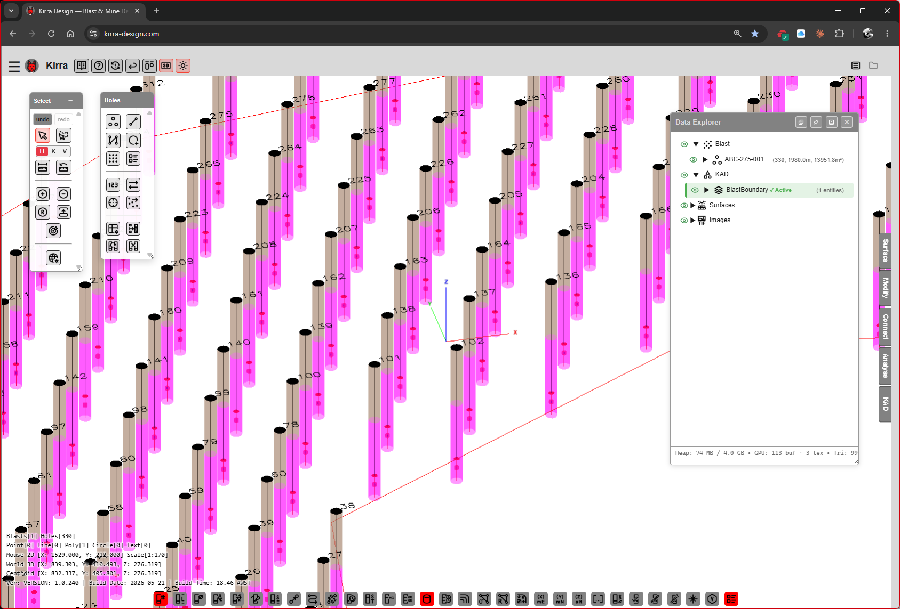
*Charged pattern in 3D. The Data Explorer shows each hole's deck breakdown.*

See [Charging Overview](../charging/overview.md), [Deck Builder](../charging/deck-builder.md) and the [Deck Builder Formula Guide](../charging/Deck%20Builder%20Formula%20Guide%20Examples.md) for advanced workflows (charge rules, formulas, conditional decks).

---

## Step 8 — Add Surface Connector Products

Connectors are themselves **Products** in the Product Manager (category `Initiator`, type `Shock Tube` with **Initiator Type** `Surface Connector`). Add the surface connectors you intend to use **before** drawing connections.

Open the Product Manager again and click **Add**.

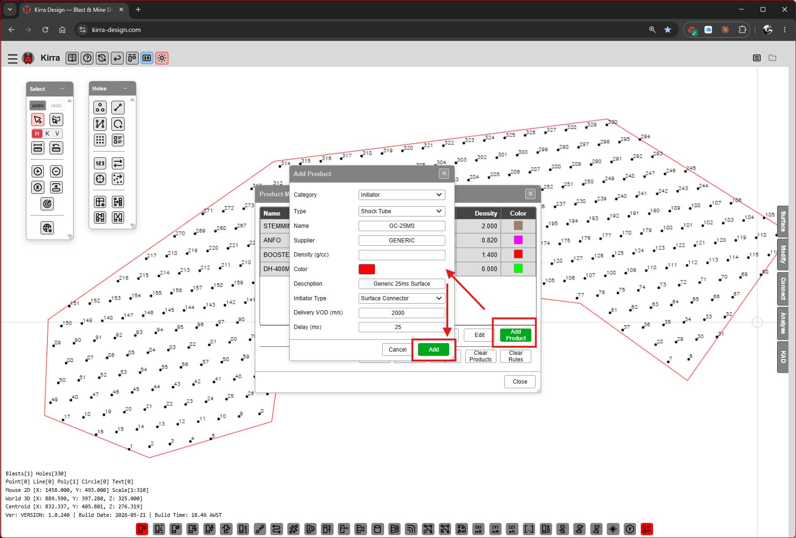

| Field | Example | Purpose |
|-------|---------|---------|
| **Category** | `Initiator` | |
| **Type** | `Shock Tube` | |
| **Name** | `GC-25MS` | |
| **Supplier** | `GENERIC` | |
| **Density (g/cc)** | blank | |
| **Color** | red swatch | Colour of the connector chip and the ties drawn with it |
| **Description** | `Generic 25ms Surface` | |
| **Initiator Type** | `Surface Connector` | This is what makes it a surface connector, not a downhole det |
| **Delivery VOD (m/s)** | `2000` | Signal speed — adds travel time along each tie |
| **Delay (ms)** | `25` | |
| **Bidirectional** | unchecked | Tick only for a connector the signal passes through both ways |

Click **Add**. Repeat for any other delays you need (e.g. 9, 17, 42, 67, 109 ms).

### Step 8B — Connector products in the library

The Product Manager list now contains your downhole det and a stack of surface connector products.

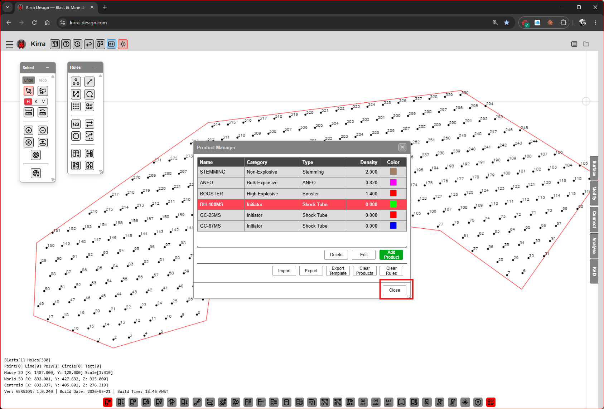

Close the Product Manager.

---

## Step 9 — Draw the Timing Connections

Open the **Connect** floating toolbar (right side of the workspace).

### Step 9A — Pick a connector and the connect tool

The Connect toolbar shows a coloured **chip** for every surface connector product (for example `SC 25ms`), plus **UNDEF** for no product. Click a chip to make it the active connector — `25ms` in the screenshot.

Pick a tie tool — **Tie Connect / Cord Inline / Reconnect to Trunk** (one tie at a time), **Tie Connect Multi** (a whole line between two holes) or **Tie Connect Continuous** (a run of clicks) — then click the source hole and the target hole to lay down a tie. Click one hole twice to make it the **initiation point** the blast starts from.

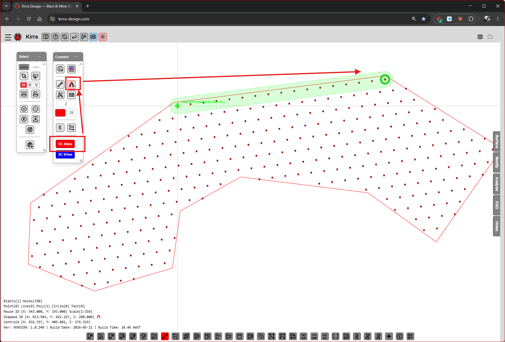
*Connect toolbar with `25ms` active. The green arrow on canvas shows a single connector being drawn from one hole to the next.*

For row-by-row tie-ups, use **Tie Connect Continuous** — click along the row (on holes, or on the ground between them) and press **Escape**, right-click or double-click to end the chain. Holes within **Connect Distance** (default 2.0 m) of each run are tied in order. The tool stays active for the next chain.

### Step 9B — Pattern fully connected

Once every hole is in a timing chain, blue arrows show the firing direction across the pattern.

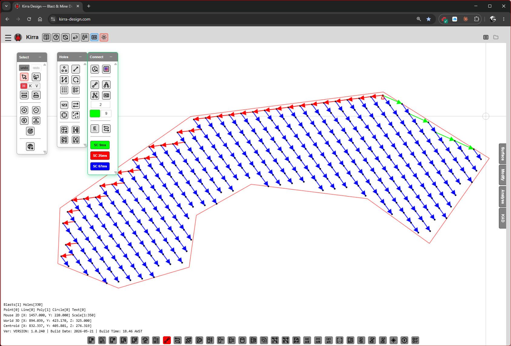
*Blue arrows indicate the surface timing cascade across the whole pattern.*

See [Connect Toolbar](../blast-design/connect-toolbar.md) for the full tool reference and [Timing Sequences](../blast-design/timing-sequences.md) for timing concepts (inter-hole / inter-row delay, echelon, V-cut).

---

## Step 10 — Animate the Blast

Open the **Analyse** floating toolbar and click **Blast Animation** (highlighted in red). The **Blast Animation** dialog opens with play controls and a speed slider.

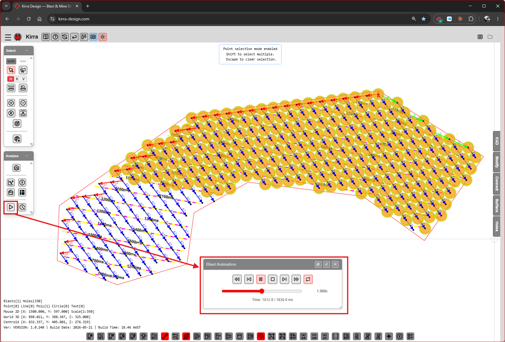
*Animation playback — holes light up in firing order; the current time shows under the slider (`Time: 1012.8 / 1830.0 ms` in this frame).*

| Control | Purpose |
|---------|---------|
| **Rewind to start** | Reset to t = 0 |
| **Step -0.5ms** / **Step +0.5ms** | Step back or forward half a millisecond |
| **Play** / **Pause** | Toggle animation |
| **Stop** | Stop playback |
| **Forward to end** | Jump to the last firing time |
| **Loop** | Repeat the animation |
| **Play Speed** slider | Playback rate, shown beside it (e.g. `1.000x`) |

The hole colour ramp reflects firing order — earlier-firing holes are cool colours, later-firing holes are warm.

For deeper timing analysis, use the **Time Window** dialog from the Analyse toolbar — see [Time Window Dialog](../analysis/time-window.md).

---

## Where to Next

You now have a complete blast: pattern from template, charged holes, timing cascade, and an animation that plays back the firing sequence. Common next steps:

| Goal | Where |
|------|-------|
| **Run vibration / PPV analysis** | [Analyse Toolbar](../analysis/analyse-toolbar.md) → Blast Shader Tools, Voronoi Options |
| **Frequency-domain / detune analysis** | [Time Window Dialog](../analysis/time-window.md) (IDI, Spectrum, Forward Array, Detune, Constrain) |
| **Flyrock shroud** | [Flyrock Modelling](../analysis/flyrock.md) |
| **Save the project** | App Navigation panel → **File Management → Export** → KAP |
| **Generate a print sheet** | App Navigation panel → **Print Management → Print Dialog** — see [Print to PDF](../printing/pdf-print.md) and [XLSX Templates](../printing/xlsx-templates.md) |
| **Export to CSV / DXF / IREDES** | App Navigation panel → **File Management → Export** — see [CSV Export](../exporting/csv-export.md), [DXF Export](../exporting/dxf-export.md), [Other Formats](../exporting/other-formats.md) |

---

## Summary

| Step | Action |
|------|--------|
| 1 | Open the Pattern Templates dialog (Holes toolbar) |
| 2 | Add a template — diameter, burden, spacing, sub-drill, direction |
| 3 | Save and close the templates library |
| 4 | Place a rectangular block of holes using the template |
| 5 | *Alternative:* draw a polygon and fill it with holes |
| 6 | Build the product library (stemming, bulk, booster, det) |
| 7 | Build a deck in the Deck Builder and apply it to selected holes |
| 8 | Add surface connector products to the library |
| 9 | Draw the timing cascade with the Connect toolbar |
| 10 | Animate the blast from the Analyse toolbar |

---

*[← Overview](overview.md) | [Interface Tour →](interface-tour.md)*
