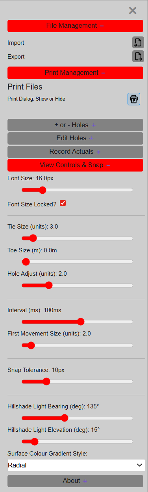
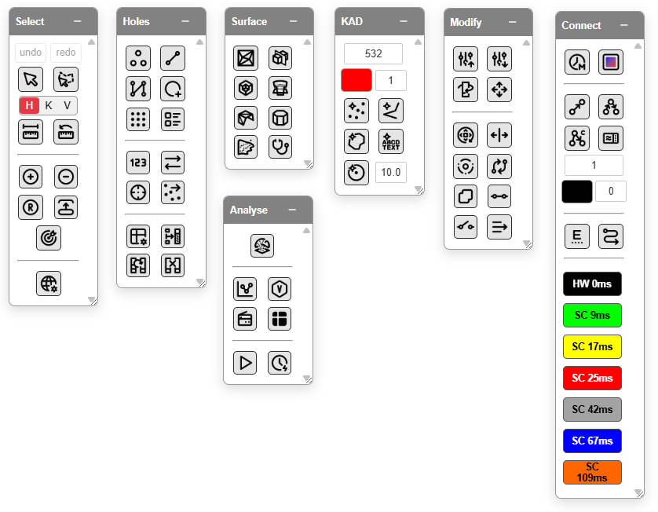
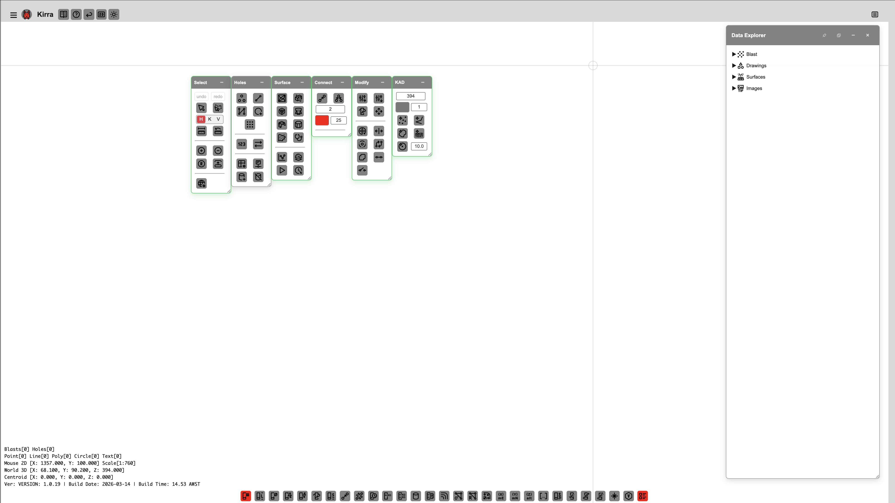

# Interface Tour

This page walks through the Kirra workspace — menus, panels, toolbars, and controls — so you can find what you need quickly.

---

## Menu Bar

The menu bar sits at the top of the window.

| Menu | Key Items |
|------|-----------|
| **File** | Import, Export, Print, KAP project save/load |
| **Edit** | Undo, Redo, Select All, Delete, Find Hole |
| **View** | Toggle panels, Zoom controls, Fullscreen |
| **Pattern** | Add Pattern (rectangular, polygon, line-based), Rotate, Mirror, Renumber |
| **Settings** | Theme (dark/light), Language, Preferences |

---

## File Menu — Import and Export

*The File Manager handles import and export across 20+ formats.*

### Import

| Format | Description |
|--------|-------------|
| **CSV** | Comma-separated hole data |
| **DXF** | AutoCAD DXF drawings |
| **DTM / STR** | Surpac surface files |
| **OBJ** | OBJ mesh (with MTL for textures) |
| **PLY** | PLY point clouds and meshes |
| **GLTF / GLB** | glTF 3D models |
| **IREDES** | Epiroc iRedes XML |
| **KML** | Google Earth KML/KMZ |
| **SHP** | Esri Shapefile |
| **LAS** | LAS point clouds |

### Export

| Format | Description |
|--------|-------------|
| **CSV** | Kirra CSV hole data |
| **DXF** | DXF drawings |
| **GLB** | glTF binary 3D export |
| **GeoTIFF** | Georeferenced raster imagery |
| **IREDES** | Epiroc iRedes XML |

### Print

- **Print to PDF** — Print the current view directly to PDF
- **Print from Template** — Use XLSX templates for formatted reports

### Project

- **KAP** — Save and load Kirra project files (holes, surfaces, drawings, layers)

---

## Dockview Panels

Kirra uses **Dockview** panels — resizable, dockable, and pop-out.

| Panel | Purpose |
|-------|---------|
| **Viewport** | Main 2D canvas or 3D view — where you design and interact |
| **Explorer** | TreeView — hierarchical list of all loaded entities (holes, surfaces, KAD drawings) |

Panels can be resized by dragging their edges, docked in different positions, or popped out into separate windows.

---

## Floating Toolbars

*Floating toolbars provide quick access to Blast Holes, Patterns, Surfaces, KAD, Modify, and Connect tools.*

Floating toolbars appear on the **right side** of the workspace:

| Toolbar | Tools |
|---------|-------|
| **Blast Holes** | Add hole, select, edit hole properties, [pattern templates](../blast-design/pattern-templates.md) |
| **Patterns** | Generate rectangular, polygon, or line-based patterns |
| **Surfaces** | Surface import, visibility, gradient options |
| **KAD tools** | Points, lines, polygons, circles, text for vector drawings |
| **Modify** | [Assign Surface/Grade, Transform, Offset, Radii, Reorder, Boolean, Join, Split](../kad/modify-tools.md) |
| **Connect** | Assign timing delays and tie-in sequences |

---

## Surface Tool Buttons

The Surface toolbar includes specialised tools:

| Tool | Purpose |
|------|---------|
| **Blast Analysis Shader** | Vibration modelling with GPU/CPU analytics |
| **Flyrock Shroud** | Flyrock trajectory visualisation |
| **Surface Intersection** | Find intersections between surfaces |
| **Boolean** | Union, subtract, intersect surface meshes |
| **Solid CSG** | Solid constructive solid geometry operations |
| **Extrude KAD** | Extrude KAD drawings to 3D |
| **KAD Boolean** | Boolean operations on KAD geometry |
| **Section Plane** | Slice surfaces with a section plane |
| **Surface Contours** | Generate contour lines from surfaces |

---

## Status Bar

The status bar at the **bottom** shows:

| Element | Shows |
|---------|-------|
| **Mouse coordinates** | Live 2D (X, Y) and 3D (X, Y, Z) position at the cursor |
| **Scale** | Current viewport scale (e.g., 1:500) |
| **Entity counts** | Number of holes, surfaces, or selected entities |

---

## TreeView (Explorer)

*The TreeView in the Explorer panel lists all loaded entities -- holes, surfaces, and KAD drawings.*

The **TreeView** in the Explorer panel lists all loaded entities in a hierarchy:

- Holes grouped by entity name
- Surfaces and KAD drawings
- Node IDs use a Braille separator (⣿) — e.g., `hole⣿Pattern_01⣿holeID` for holes, `entityType⣿entityName⣿element⣿pointID` for KAD entities

Expand and collapse nodes to navigate your data. Click a node to select it on the canvas.

### TreeView Features

- **Visibility toggle** -- Show or hide individual entities via checkbox
- **Duplicate** -- Right-click an entity to create a copy
- **Context menu** -- Right-click for options including statistics, move to layer, split/join lines, and delete
- **Dock/Popout** -- The TreeView can be docked to the side, popped out into a separate window, or collapsed

---

## 2D Canvas

The main 2D viewport shows your blast pattern in plan view.

| Action | How |
|--------|-----|
| **Pan** | Default mode — click and drag (or middle mouse drag) |
| **Zoom** | Scroll wheel |
| **Select holes** | Left-click on a hole |
| **Multi-select** | Shift+click to add to selection |

---

## 3D View

Switch to 3D for elevation and terrain context using the **2D/3D** toggle in the top bar.

| Action | How |
|--------|-----|
| **Pan** | Click and drag (default mode) |
| **Orbit** | Alt + drag |
| **Camera roll** | Alt + Shift + drag |
| **Zoom** | Scroll wheel (zooms towards cursor) |
| **Context menu** | Right-click |

The 3D view uses the same coordinate space as 2D -- no Z scaling or elevation transform.

### Orbit Focus

The **Orbit Focus** tool lets you click any point in the 3D scene to set it as the new orbit centre. This is especially useful when inspecting specific blast holes or surface features up close. See [3D View & Orbit Focus](../reference/3d-tools.md) for full details.

### 3D Settings

The **3D Settings** button opens renderer configuration options including renderer mode selection, instanced hole rendering, LOD overrides, and simplification thresholds.

---

## Theme and Language

- **Theme toggle** -- Switch between dark and light mode (Settings menu or toolbar)
- **Language selector** -- Choose from English, Chinese, French, Mongolian, Russian, or Spanish (Settings menu or top bar dropdown)

---

## Screenshots

*More annotated interface screenshots coming soon.*

---

*Next: [Your First Blast →](first-blast.md)*
