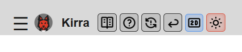
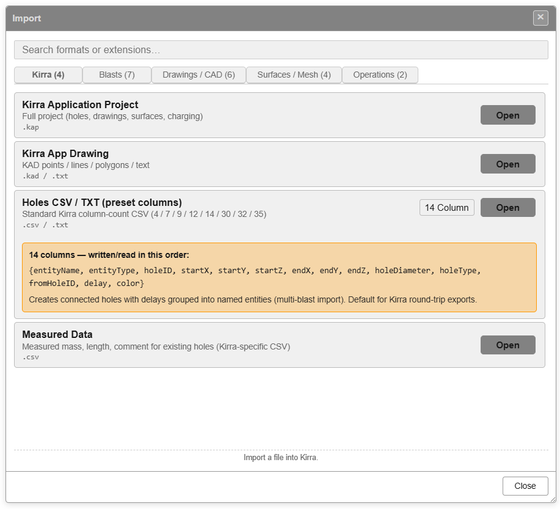
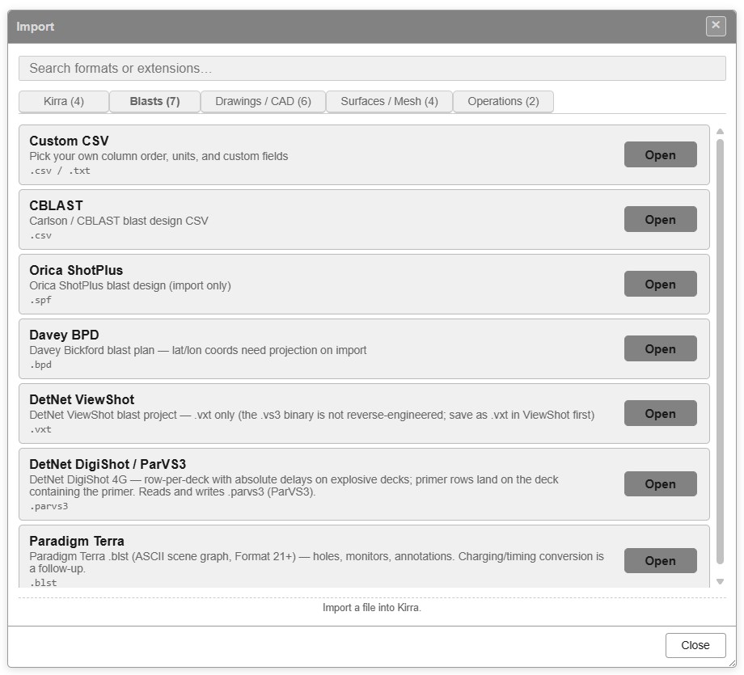
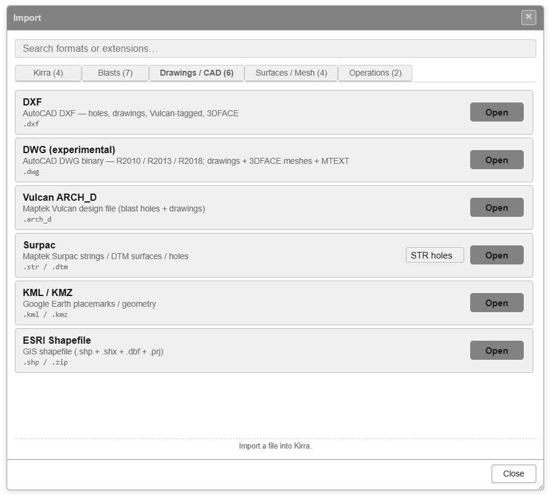
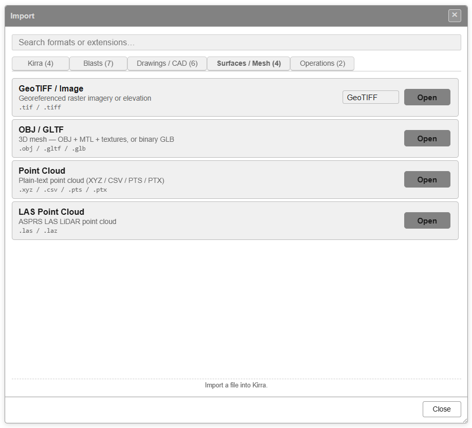
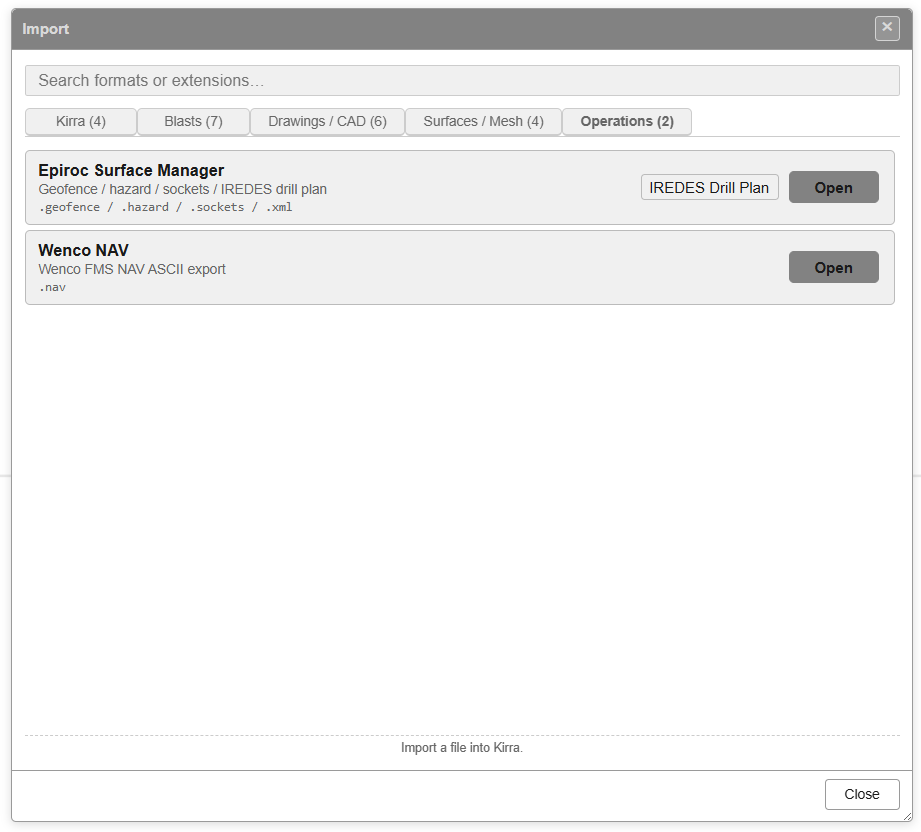
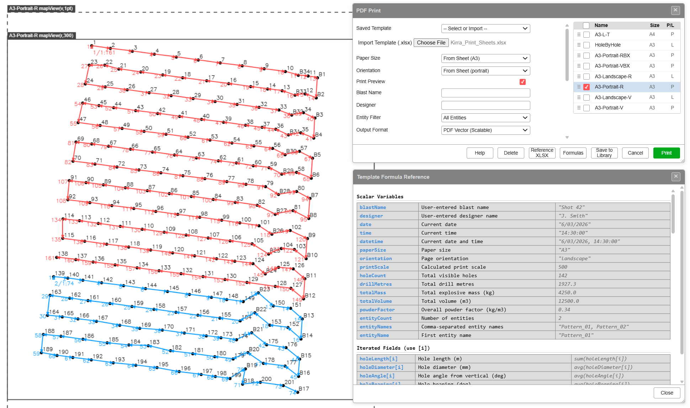
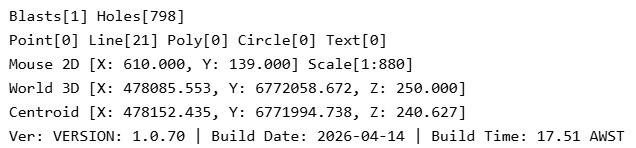

# Interface Tour

This page walks through the Kirra workspace — the top app navigation bar, the side navigation panel, floating toolbars, viewport, and overlays — so you can find what you need quickly.

---

## App Navigation Bar

The compact bar across the top-left of the window holds the global navigation controls.

*Left-to-right: hamburger menu, Kirra dog + name, Data Explorer, Help, Recent, Back, 2D / 3D toggle, theme toggle.*

| Button | Purpose |
|--------|---------|
| **☰ Hamburger** | Opens / closes the side App Navigation panel (File Management, Print, hole tools, View Controls, About) |
| **🐕 Kirra** | App identity — the dog icon and "Kirra" name. Click for the About card *[VERIFY: click target — About card or no-op]* |
| **📑 Data Explorer** | Toggle the Data Explorer (TreeView) panel |
| **? Help** | Open in-app help *[VERIFY: links to kirra-docs site or in-app popup]* |
| **↻ Recent / Reload** | Recent files / reload current project *[VERIFY: exact behaviour]* |
| **↩ Back / Return** | Return to the previous view *[VERIFY]* |
| **2D / 3D** | Toggle between 2D plan view and 3D viewport |
| **☀ Theme** | Toggle dark / light theme |

> *[SCREENSHOT NEEDED: hamburger menu expanded so the visible toggles can be confirmed against the side panel]*

---

## Side App Navigation Panel

Opened from the **☰ Hamburger** button. The panel is a vertical stack of collapsible groups — each red header expands / collapses with the **−** / **+** indicator.

*The App Navigation panel — File Management, Print Management, hole tools, View Controls & Snap (expanded), and About.*

### File Management

| Control | Purpose |
|---------|---------|
| **Import** (icon button) | Open the Import dialog (see [File Manager — Import Dialog](#file-manager--import-dialog) below) |
| **Export** (icon button) | Open the Export dialog *[VERIFY: identical layout to Import?]* |

### Print Management

| Control | Purpose |
|---------|---------|
| **Print Files** | Listed under the section header |
| **Print Dialog: Show or Hide** (icon button) | Toggle the PDF Print dialog (see [Print Dialog](#print-dialog) below) |

### + or - Holes

Collapsible group for placing and removing holes. Expand to reveal the hole-placement controls. *[VERIFY: full list when expanded]*

### Edit Holes

Collapsible group for editing properties of existing holes. *[VERIFY: full list when expanded]*

### Record Actuals

Collapsible group for recording as-drilled / as-built actuals against the design holes. *[VERIFY: full controls when expanded]*

### View Controls & Snap

The largest group — global display and snap settings. The screenshot shows it expanded with sliders for every control.

| Control | Default shown | Purpose |
|---------|---------------|---------|
| **Font Size** | 16.0px | Size of labels rendered in the viewport |
| **Font Size Locked?** | checked | When ticked, font size does not auto-scale with zoom |
| **Tie Size (units)** | 3.0 | Size of tie/connector glyphs *[VERIFY: unit meaning]* |
| **Toe Size (m)** | 0.0m | Toe marker size in metres |
| **Hole Adjust (units)** | 2.0 | Hole-marker visual adjustment *[VERIFY]* |
| **Interval (ms)** | 100ms | Time interval used for the simple blast animation playback step |
| **First Movement Size (units)** | 2.0 | First-movement arrow size |
| **Snap Tolerance** | 10px | Pixel radius for snap-to-vertex / snap-to-hole |
| **Hillshade Light Bearing (deg)** | 135° | Compass bearing of the hillshade light (0 = N, clockwise) |
| **Hillshade Light Elevation (deg)** | 15° | Elevation of the hillshade light above the horizon |
| **Surface Colour Gradient Style** | Radial | Gradient style for surface elevation colouring (dropdown) |

### About

Collapsible group at the bottom — opens the About card with version, build, and licence information.

---

## File Manager — Import Dialog

Opened from the **Import** button in the side panel's File Management group.

*Import dialog, Kirra tab — KAP, KAD, Holes CSV/TXT (with column-count dropdown), Measured Data.*

The dialog is tabbed by file family. The counts in parentheses are the format counts on each tab.

| Tab | Counts | Formats |
|-----|--------|---------|
| **Kirra** | 4 | KAP project, KAD drawing, Holes CSV/TXT, Measured Data |
| **Blasts** | 7 | Custom CSV, CBLAST, Orica ShotPlus (.spf), Davey BPD, DetNet ViewShot (.vxt), DetNet DigiShot/ParVS3, Paradigm Terra |
| **Drawings / CAD** | 6 | DXF, DWG (experimental), Vulcan ARCH_D, Surpac (STR/DTM), KML/KMZ, ESRI Shapefile |
| **Surfaces / Mesh** | 4 | GeoTIFF/Image, OBJ/GLTF, Point Cloud (XYZ/CSV/PTS/PTX), LAS Point Cloud |
| **Operations** | 2 | Epiroc Surface Manager, Wenco NAV |

### Shared controls

| Control | Purpose |
|---------|---------|
| **Search formats or extensions…** | Filter the list across all tabs by name or extension |
| **Open** (per row) | Pick a file of that format |
| **Close** (footer) | Close the dialog |

### Kirra tab

| Format | Extensions | Notes |
|--------|------------|-------|
| **Kirra Application Project** | `.kap` | Full project (holes, drawings, surfaces, charging) |
| **Kirra App Drawing** | `.kad` / `.txt` | KAD points / lines / polygons / text |
| **Holes CSV / TXT (preset columns)** | `.csv` / `.txt` | Standard Kirra column-count CSV — **4 / 7 / 9 / 12 / 14 / 30 / 32 / 35** columns (pick from dropdown). 14-column is the default round-trip format: `{entityName, entityType, holeID, startX, startY, startZ, endX, endY, endZ, holeDiameter, holeType, fromHoleID, delay, color}` |
| **Measured Data** | `.csv` | Measured mass, length, comment for existing holes |

### Blasts tab

| Format | Extensions | Notes |
|--------|------------|-------|
| **Custom CSV** | `.csv` / `.txt` | Pick your own column order, units, and custom fields |
| **CBLAST** | `.csv` | Carlson / CBLAST blast design CSV |
| **Orica ShotPlus** | `.spf` | Orica ShotPlus blast design (import only) |
| **Davey BPD** | `.bpd` | Davey Bickford blast plan — lat/lon coords need projection on import |
| **DetNet ViewShot** | `.vxt` | DetNet ViewShot blast project — `.vxt` only (the `.vs3` binary is not reverse-engineered; save as `.vxt` in ViewShot first) |
| **DetNet DigiShot / ParVS3** | `.parvs3` | Row-per-deck with absolute delays on explosive decks; primer rows land on the deck containing the primer. Reads and writes `.parvs3` (ParVS3) |
| **Paradigm Terra** | `.blst` | Paradigm Terra `.blst` (ASCII scene graph, Format 21+) — holes, monitors, annotations. Charging/timing conversion is a follow-up |

### Drawings / CAD tab

| Format | Extensions | Notes |
|--------|------------|-------|
| **DXF** | `.dxf` | AutoCAD DXF — holes, drawings, Vulcan-tagged, 3DFACE |
| **DWG (experimental)** | `.dwg` | AutoCAD DWG binary — R2010 / R2013 / R2018; drawings + 3DFACE meshes + MTEXT |
| **Vulcan ARCH_D** | `.arch_d` | Maptek Vulcan design file (blast holes + drawings) |
| **Surpac** | `.str` / `.dtm` | Maptek Surpac strings / DTM surfaces / holes — STR holes mode is selected via the dropdown |
| **KML / KMZ** | `.kml` / `.kmz` | Google Earth placemarks / geometry |
| **ESRI Shapefile** | `.shp` / `.zip` | GIS shapefile (`.shp + .shx + .dbf + .prj`) |

### Surfaces / Mesh tab

| Format | Extensions | Notes |
|--------|------------|-------|
| **GeoTIFF / Image** | `.tif` / `.tiff` | Georeferenced raster imagery or elevation. The row shows a **GeoTIFF** mode dropdown |
| **OBJ / GLTF** | `.obj` / `.gltf` / `.glb` | 3D mesh — OBJ + MTL + textures, or binary GLB |
| **Point Cloud** | `.xyz` / `.csv` / `.pts` / `.ptx` | Plain-text point cloud |
| **LAS Point Cloud** | `.las` / `.laz` | ASPRS LAS LiDAR point cloud |

### Operations tab

| Format | Extensions | Notes |
|--------|------------|-------|
| **Epiroc Surface Manager** | `.geofence` / `.hazard` / `.sockets` / `.xml` | Geofence / hazard / sockets / IREDES drill plan — row shows an **IREDES Drill Plan** mode dropdown |
| **Wenco NAV** | `.nav` | Wenco FMS NAV ASCII export |

See [Supported File Formats](../reference/supported-formats.md) for the full import / export matrix and round-trip notes.

---

## Print Dialog

Opened from **Print Dialog: Show or Hide** in the side panel's Print Management group.

*PDF Print dialog (right) over the 2D viewport (left). The lower right panel shows the Template Formulas Reference.*

### PDF Print controls

| Control | Purpose |
|---------|---------|
| **Saved Templates** | Dropdown of templates saved to the library |
| **Import Template** | Load a template file (XLSX) — file picker labelled *Choose File* |
| **Paper Size** | Paper size dropdown — selection from the loaded template *[VERIFY: dropdown options]* |
| **Orientation** | From sheet (or override) *[VERIFY]* |
| **Print Preview** | Toggle preview rendering |
| **Sheet Name** | Free-text field for the printed sheet name |
| **Designer** | Free-text field for the designer's name |
| **Output Format** | **PDF Vector** (default) or other output formats *[VERIFY: full list]* |

### Footer buttons

| Button | Action |
|--------|--------|
| **Help** | Open help / documentation for the print system |
| **Reset** | Reset all fields to template defaults |
| **Reference** | Toggle the Template Formulas Reference panel |
| **Formulas** | Insert formula at cursor *[VERIFY: button behaviour]* |
| **Save to Library** | Save current settings as a new template |
| **Print** | Generate the PDF |

### Template Formulas Reference

A panel listing every formula variable available in XLSX templates. Two sections:

- **Scalar variables** — single-value fields like `blastName`, `designer`, `date`, `time`, `scaleFromUI`, `paperSize`, `paperOrientation`, plus geometric scalars
- **Iterated fields** — per-hole / per-deck fields (e.g. `holeLength`, `holeAngle`, etc.) that iterate when used inside a repeating template region

See [Print to PDF](../printing/pdf-print.md) and [Print from Template (XLSX)](../printing/xlsx-templates.md) for the full workflow and formula list.

---

## Floating Toolbars

Floating toolbars appear on the **right side** of the workspace. Each toolbar can be docked, collapsed, or dragged into a different position.

*The seven floating toolbars — Select, Holes, Surface, KAD, Modify, Connect, and Analyse.*

| Toolbar | Purpose |
|---------|---------|
| **Select** | [Undo/redo, selection tools, H/K/V mode, ruler, protractor, zoom, reset view, section view, orbit focus, 3D settings](../reference/select-toolbar.md) |
| **Holes** | [Place holes, generate patterns, renumber, manage charging, electronic timing](../blast-design/holes-toolbar.md) |
| **Surface** | [Triangulate, intersect, boolean (CSG / Original / Trimesh), extrude, contour, mesh repair](../surfaces/surfaces-toolbar.md) |
| **KAD** | [Drawing level / colour / width, points, lines, polygons, text (with formulas), circles](../kad/kad-toolbar.md) |
| **Modify** | [Assign Surface/Grade, Transform, Offset, Radii, Reorder, Boolean, Join, Split](../kad/modify-tools.md) |
| **Connect** | [Surface connectors, continuous connect, bake to electronic, harness wire path/channel](../blast-design/connect-toolbar.md) |
| **Analyse** | [Flyrock shroud, blast shader, Voronoi options, monitor library, log-log regression, blast animation, Time Window dialog](../analysis/analyse-toolbar.md) |

Each toolbar minimises to its title bar via the **−** button in its header.

---

## Dockview Panels

Kirra uses **Dockview** for resizable, dockable, and pop-out panels.

| Panel | Purpose |
|-------|---------|
| **Viewport** | Main 2D canvas or 3D view — where you design and interact |
| **Explorer** | Data Explorer TreeView — hierarchical list of all loaded entities |

You can resize panels by dragging their edges, dock them in different positions, or pop them out into separate windows. Layout is persisted between sessions.

---

## Data Explorer (TreeView)

*The TreeView in the Explorer panel lists all loaded entities — holes, surfaces, KAD drawings, and layers.*

The TreeView is toggled by the **📑 Data Explorer** button in the [App Navigation Bar](#app-navigation-bar).

### Node naming

Node IDs use a Braille separator (⣿):

| Entity type | Node ID example |
|-------------|----------------|
| Hole | `hole⣿Pattern_01⣿holeID` |
| KAD vertex | `entityType⣿entityName⣿element⣿pointID` |

### TreeView features

- **Visibility toggle** — show or hide individual entities via the row checkbox
- **Duplicate** — right-click an entity to create a copy
- **Context menu** — right-click for statistics, move-to-layer, split/join lines, delete, and more
- **Dock / popout** — the TreeView can be docked to the side, popped out, or collapsed

---

## Information Overlay

A persistent text overlay reports counts, cursor position, scene centroid, and build info.

*The information overlay — counts, cursor position, world position, centroid, and version/build info.*

| Line | Meaning |
|------|---------|
| `Blasts[N] Holes[M]` | Number of blasts and total holes loaded |
| `Point[N] Line[N] Poly[N] Circle[N] Text[N]` | KAD entity counts by type |
| `Mouse 2D [X, Y, Scale]` | Cursor position in 2D paper-space units and current scale |
| `World 3D [X, Y, Z]` | Cursor position in world coordinates (m) |
| `Centroid [X, Y, Z]` | Scene centroid in world coordinates |
| `Ver: VERSION ...` | App version, build date, build time |

The overlay is rendered as plain text and stays visible while you work.

---

## 2D Canvas

The main 2D viewport shows your blast pattern in plan view.

| Action | How |
|--------|-----|
| **Pan** | Default mode — click and drag (or middle-mouse drag) |
| **Zoom** | Scroll wheel (direction set in 3D World Settings) |
| **Select holes** | Left-click on a hole (active H/K/V mode applies) |
| **Multi-select** | Shift+click to add or remove from selection |
| **Polygon select** | Activate the Polygon Selection tool in the [Select Toolbar](../reference/select-toolbar.md) |

---

## 3D View

Switch to 3D with the **2D / 3D** toggle in the App Navigation Bar.

| Action | How |
|--------|-----|
| **Pan** | Click and drag (default mode) |
| **Orbit** | Alt + drag |
| **Camera roll** | Alt + Shift + drag |
| **Zoom** | Scroll wheel (zooms towards cursor when Cursor Zoom is on) |
| **Context menu** | Right-click |

The 3D view uses the same coordinate space as 2D — no Z scaling or elevation transform.

### Orbit Focus

The **Orbit Focus** tool (in the [Select Toolbar](../reference/select-toolbar.md)) lets you click any point in the 3D scene to set it as the new orbit centre. See [3D View & Orbit Focus](../reference/3d-tools.md) for full details.

### 3D World Settings

The **3D World Settings** button (in the Select Toolbar) opens renderer configuration — camera damping, cursor zoom, scroll-wheel direction, plumb-line display, lighting, axis lock, gizmo display, and text billboarding. See [Select Toolbar — 3D World Settings](../reference/select-toolbar.md#3d-world-settings).

---

## Theme and Language

- **Theme toggle** — Switch between dark and light mode (App Navigation Bar, far right)
- **Language selector** — Choose from English, Chinese, French, Mongolian, Russian, Spanish, and more *[VERIFY: where in the UI — App Navigation panel or hamburger menu]*

---

## Related topics

- [Select Toolbar](../reference/select-toolbar.md) — undo/redo, selection, measurement, view
- [Holes Toolbar](../blast-design/holes-toolbar.md) — hole placement and pattern generation
- [Surfaces Toolbar](../surfaces/surfaces-toolbar.md) — triangulation, boolean, mesh repair
- [KAD Toolbar](../kad/kad-toolbar.md) — vector drawing
- [Modify Toolbar](../kad/modify-tools.md) — transform, offset, boolean, join, split
- [Connect Toolbar](../blast-design/connect-toolbar.md) — surface connectors, electronic timing
- [Analyse Toolbar](../analysis/analyse-toolbar.md) — analytics and timing analysis
- [Supported File Formats](../reference/supported-formats.md) — full import / export matrix
- [Keyboard Shortcuts](../reference/keyboard-shortcuts.md)

---

*Next: [Your First Blast →](first-blast.md)*
