# Interface Tour

This page walks through the Kirra workspace — the top app navigation bar, the side navigation panel, floating toolbars, viewport, and overlays — so you can find what you need quickly.

---

## App Navigation Bar

The bar across the top of the window holds the global navigation controls — a left-side cluster of app buttons and a right-side cluster of panel toggles.

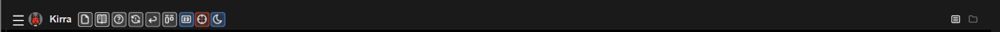
*Full-width App Navigation Bar — left cluster holds app and view controls; right cluster toggles the Data Explorer and Project Explorer panels.*

### Left cluster (left to right)

| Button | Purpose |
|--------|---------|
| **☰ Hamburger** | Opens the **side navigation panel** — File Management, Print Management, Record Actuals, Language, About |
| **Kirra** | App icon and name (no action on click) |
| **Import Export Print** (file icon) | Drop-down menu with **Import**, **Export** and **Print**. Each entry opens the same dialog as the matching button in the side panel |
| **Select Language** | Drop-down list of interface languages — English, Chinese, French (France), French (Québec), Mongolian, Russian, Spanish (Spain), Spanish (Latin America). See the [Blasting Glossary](../reference/blasting-glossary.md) |
| **Help** | Opens this help site in a new browser tab |
| **Reload** | Reloads the page. Your work is kept — it is stored in the browser as you go |
| **Go Back** | Asks **Leave Kirra?** (with a reminder to save first). **Leave** goes to blastingapps.com; **Stay** cancels |
| **Toggle Toolbars** | Click to fan every floating toolbar out to its default position; click again to dock them all back to the right edge. Use this if a toolbar has been dragged off-screen or two toolbars are stacked on top of each other |
| **2D / 3D** | Switches between the 2D plan view and the 3D view. The button has a blue tint in 2D and a red tint in 3D |
| **Snap** | Turns snapping on or off. A red tint means snapping is on (it is on by default) |
| **☀ Day / Night** | Switches between the dark and light theme. The button has a blue tint in the dark theme and a red tint in the light theme |

### Right cluster (left to right)

| Button | Purpose |
|--------|---------|
| **Data Explorer** | Shows or hides the Data Explorer (TreeView) panel |
| **Project Explorer** | Opens the **Project Explorer**, which browses a project folder on your computer. **Desktop app only** — in the browser the button is greyed out |

---

## Side Navigation Panel

Opened from the **☰ Hamburger** button and closed with the **×** at its top. The panel is a vertical stack of collapsible groups — click a red header to expand or collapse it.

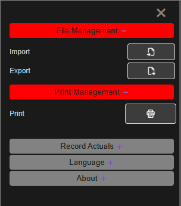
*The side navigation panel, with File Management and Print Management expanded.*

### File Management

| Control | Purpose |
|---------|---------|
| **Import** (icon button) | Opens the **Import** dialog (see [Import Dialog](#import-dialog) below) |
| **Export** (icon button) | Opens the **Export** dialog — the same layout as Import, but each row has a **Save** button and lists the formats Kirra can write |

### Print Management

| Control | Purpose |
|---------|---------|
| **Print** (icon button) | Opens the **PDF Print** dialog (see [Print Dialog](#print-dialog) below) |

### Record Actuals

Switches for recording as-drilled / as-charged values against your design holes. Turn one on, then click holes on the canvas to enter the value in a dialog. Only one switch can be on at a time.

| Switch | Records |
|--------|---------|
| **Record Length with dialog** | Measured hole length. Turning it on also shows the Hole ID and Measured Length labels |
| **Record Mass with dialog** | Measured explosive mass |
| **Record Comment with dialog** | A free-text comment |

### Language

The same eight language editions as the **Select Language** menu in the top bar.

### About

Shows the author credit. It also contains a **Developer** sub-section with diagnostic and fall-back options (Developer Mode, Performance Monitor, Vector Text (Hershey), Snake Row Angle, Screen Space Snapping, 3D renderer and level-of-detail overrides, Free CAD GPU Memory). You do not normally need to change these.

> **Where did View Controls & Snap go?** The font size, tie size, toe size, snap tolerance and hillshade controls now live on the **2D** tab of the **Settings** dialog — see [Select Toolbar — Settings](../reference/select-toolbar.md#settings). Snapping itself is switched on and off with the **Snap** button in the top bar.

---

## Import Dialog

Opened from **Import** in the side panel's File Management group, or from **Import** in the top bar's **Import Export Print** menu.

*Import dialog, Kirra tab.*

The dialog is tabbed by file family. Each tab shows how many formats it holds, e.g. **Kirra (5)**.

| Tab | Formats |
|-----|---------|
| **Kirra** | Kirra Application Project, Kirra App Template, Kirra App Drawing, Holes CSV / TXT (preset columns), Measured Data |
| **Blasts** | Custom CSV, CBLAST, Orica ShotPlus, Davey BPD, DetNet ViewShot, DetNet DigiShot / ParVS3, Paradigm Terra |
| **Drawings / CAD** | Geometry CSV, DXF, DWG (experimental), Vulcan ARCH_D, Vulcan Design Database, Surpac, Micromine STR, Deswik DUF, 12d Archive |
| **Surfaces / Mesh** | GeoTIFF / Image, OBJ / GLTF, Point Cloud, LAS Point Cloud, Vulcan .00t Triangulation, Datamine Surface |
| **Geology** | Block Model — Datamine, Block Model — Vulcan CSV, Block Model — Vulcan BMF |
| **Miscellaneous** | Borehole Telemetry, Epiroc Surface Manager, Wenco NAV, KML / KMZ, ESRI Shapefile |
| **Legacy** | Datavis DBS, ShotPlan 3 |

### Shared controls

| Control | Purpose |
|---------|---------|
| **Search formats or extensions…** | Filter the list across all tabs by name, description or extension. Tabs with no match are hidden |
| **Standard** / **Transform (reproject CRS)** | **Standard** lists the normal formats. **Transform** lists only the formats that can convert coordinates from one coordinate system to another as they import |
| **Open** (per row) | Pick a file of that format. Clicking anywhere on the row does the same |
| **Close** (footer) | Close the dialog |

### Kirra tab

| Format | Extensions | Notes |
|--------|------------|-------|
| **Kirra Application Project** | `.kap` | Everything — the blast, drawings, surfaces, libraries and work settings |
| **Kirra App Template** | `.kat` | A site's setup only — products, charge rules, pattern and print templates, seeds, monitors, schemas. Everything except the blast |
| **Kirra App Drawing** | `.kad` / `.txt` | KAD points / lines / polygons / text |
| **Holes CSV / TXT (preset columns)** | `.csv` / `.txt` | Kirra's standard column-count CSV. The importer recognises files with **4, 7, 9, 12, 14, 29, 30, 31, 32 or 35** columns. The row's drop-down lists the 4 / 7 / 9 / 12 / 14 / 30 / 32 / 35-column layouts, and a note under it shows the columns of the selected layout. 14 columns is the default: `{entityName, entityType, holeID, startX, startY, startZ, endX, endY, endZ, holeDiameter, holeType, fromHoleID, delay, color}` |
| **Measured Data** | `.csv` | Measured mass, length and comment for existing holes |

### Blasts tab

| Format | Extensions | Notes |
|--------|------------|-------|
| **Custom CSV** | `.csv` / `.txt` | Pick your own column order, units, and custom fields |
| **CBLAST** | `.csv` | Carlson / CBLAST blast design CSV |
| **Orica ShotPlus** | `.spf` | Orica ShotPlus blast design (import only) |
| **Davey BPD** | `.bpd` | Davey Bickford blast plan — latitude / longitude coordinates need projecting on import |
| **DetNet ViewShot** | `.vxt` | DetNet ViewShot blast project — `.vxt` only (save as `.vxt` in ViewShot first) |
| **DetNet DigiShot / ParVS3** | `.parvs3` | One row per deck with absolute delays on explosive decks; primer rows land on the deck containing the primer |
| **Paradigm Terra** | `.blst` | Paradigm Terra `.blst` (Format 21+) — holes, monitors, annotations |

### Drawings / CAD tab

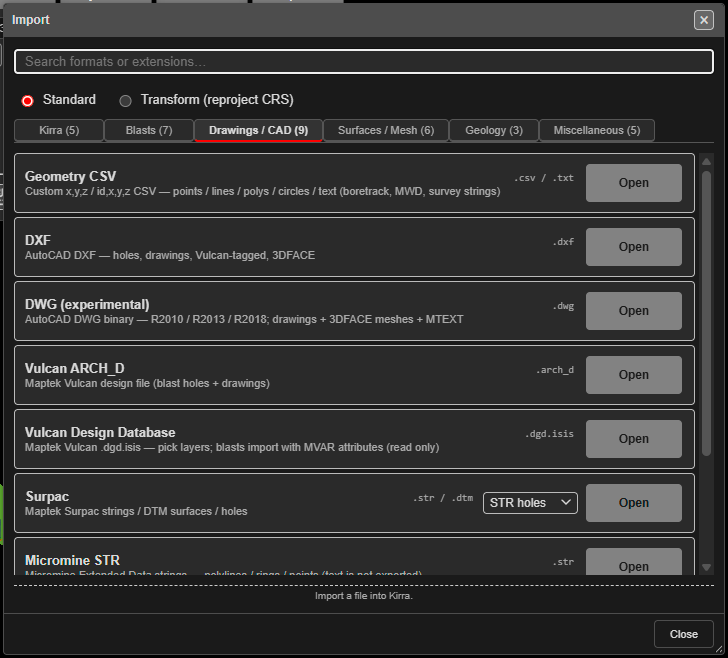

| Format | Extensions | Notes |
|--------|------------|-------|
| **Geometry CSV** | `.csv` / `.txt` | Your own x,y,z or id,x,y,z CSV — points, lines, polygons, circles, text (boretrack, MWD, survey strings) |
| **DXF** | `.dxf` | AutoCAD DXF — holes, drawings, Vulcan-tagged, 3DFACE |
| **DWG (experimental)** | `.dwg` | AutoCAD DWG — R2010 / R2013 / R2018; drawings, 3DFACE meshes and MTEXT |
| **Vulcan ARCH_D** | `.arch_d` | Maptek Vulcan design file (blast holes + drawings) |
| **Vulcan Design Database** | `.dgd.isis` | Maptek Vulcan design database — pick layers; blasts import with their attributes (read only) |
| **Surpac** | `.str` / `.dtm` | Maptek Surpac strings, DTM surfaces or holes. Pick **STR holes**, **STR** or **DTM & STR** from the row's drop-down |
| **Micromine STR** | `.str` | Micromine Extended Data strings — polylines, rings, points |
| **Deswik DUF** | `.duf` | Deswik design file — polylines and rings (import only) |
| **12d Archive** | `.12da` / `.12daz` | 12d text interchange — TINs, trimeshes, strings, polylines |

### Surfaces / Mesh tab

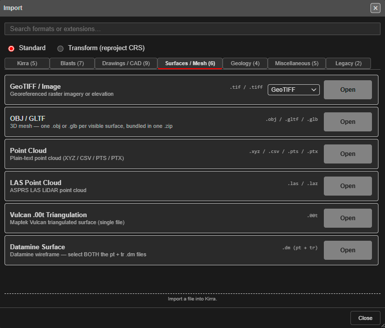

| Format | Extensions | Notes |
|--------|------------|-------|
| **GeoTIFF / Image** | `.tif` / `.tiff` | Georeferenced raster imagery or elevation. Pick **GeoTIFF** or **Elev.GeoTIFF** from the row's drop-down |
| **OBJ / GLTF** | `.obj` / `.gltf` / `.glb` | 3D mesh — OBJ with MTL and textures, or GLTF / GLB |
| **Point Cloud** | `.xyz` / `.csv` / `.pts` / `.ptx` | Plain-text point cloud |
| **LAS Point Cloud** | `.las` / `.laz` | ASPRS LAS LiDAR point cloud |
| **Vulcan .00t Triangulation** | `.00t` | Maptek Vulcan triangulated surface (single file) |
| **Datamine Surface** | `.dm` (pt + tr) | Datamine wireframe — select **both** the points and triangles `.dm` files |

### Geology tab

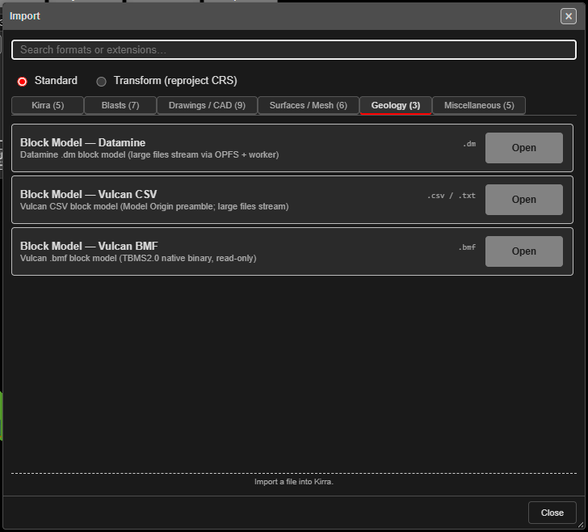

| Format | Extensions | Notes |
|--------|------------|-------|
| **Block Model — Datamine** | `.dm` | Datamine block model. Large files are streamed |
| **Block Model — Vulcan CSV** | `.csv` / `.txt` | Vulcan CSV block model. Large files are streamed |
| **Block Model — Vulcan BMF** | `.bmf` | Vulcan `.bmf` block model (read only) |

### Miscellaneous tab

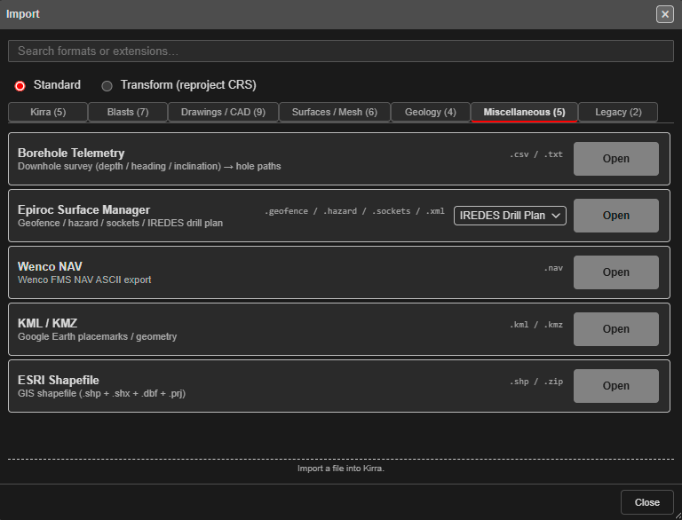

| Format | Extensions | Notes |
|--------|------------|-------|
| **Borehole Telemetry** | `.csv` / `.txt` | Downhole survey (depth / heading / inclination) turned into hole paths |
| **Epiroc Surface Manager** | `.geofence` / `.hazard` / `.sockets` / `.xml` | Pick **IREDES Drill Plan**, **Geofence**, **Hazard** or **Socket** from the row's drop-down |
| **Wenco NAV** | `.nav` | Wenco FMS NAV ASCII export |
| **KML / KMZ** | `.kml` / `.kmz` | Google Earth placemarks / geometry |
| **ESRI Shapefile** | `.shp` / `.zip` | GIS shapefile (`.shp + .shx + .dbf + .prj`) |

### Legacy tab

Formats that are no longer in use, supplied so that historic files can still be viewed. Every row carries an amber **LEGACY** note.

| Format | Extensions | Notes |
|--------|------------|-------|
| **Datavis DBS** | `.sgf` | Datavis Drill & Blast Software blasts — holes and their charging. Import only |
| **ShotPlan 3** | `.xel` | SHOTPlan v3.0 blast plans — holes, ties, benches, boundary and text |

See [Supported File Formats](../reference/supported-formats.md) for the full import / export matrix and round-trip notes.

---

## Print Dialog

Opened from the **Print** button in the side panel's Print Management group, or from **Print** in the top bar's **Import Export Print** menu. The dialog is titled **PDF Print**.

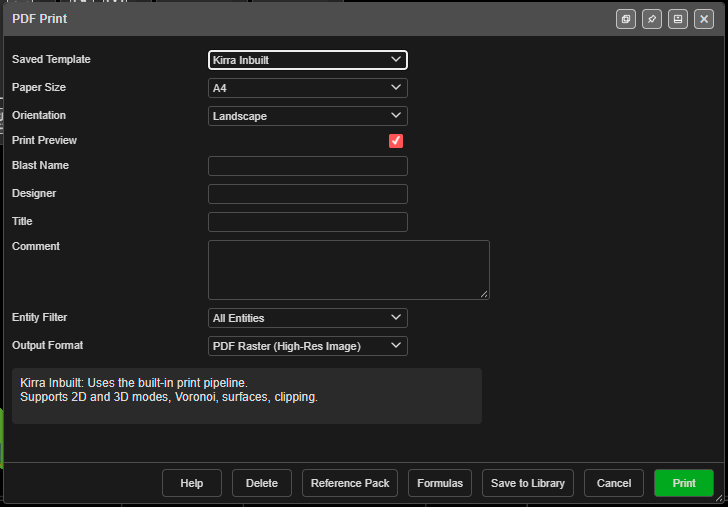
*The PDF Print dialog. Opening it switches on Print Preview, which outlines the page area on the canvas.*

### Controls

| Control | Purpose |
|---------|---------|
| **Saved Template** | Choose **Kirra Inbuilt** (the default) or a template saved to your library |
| **Import Template (.xlsx)** | Load an XLSX template file |
| **Paper Size** | **From Sheet** (the template's own size), or A4, A3, A2, A1, A0, Letter, Legal, Tabloid |
| **Orientation** | **From Sheet**, **Landscape** or **Portrait** |
| **Print Preview** | Turns the print preview on the canvas on or off. It switches on when the dialog opens |
| **Blast Name**, **Designer**, **Title**, **Comment** | Free text for the title block |
| **Entity Filter** | **All Entities**, or one blast |
| **Output Format** | **PDF Raster (High-Res Image)**, **PDF Vector (Scalable)** or **XLSX (Populated Spreadsheet)** |

### Footer buttons

| Button | Action |
|--------|--------|
| **Save to Library** | Save the loaded template to your library under a name you choose |
| **Formulas** | Open the **Template Formula Reference** |
| **Reference Pack** | Download a ZIP containing a reference template, the print skill and the formula reference |
| **Delete** | Delete the selected saved template (asks first) |
| **Help** | Open the [Template Examples](../printing/template-examples.md) help page |
| **Cancel** | Close the dialog |
| **Print** | Generate the output |

### Template Formula Reference

A panel listing every variable and function available in XLSX templates, grouped as **Scalar Variables**, **Iterated Fields (use [i])**, **Functions**, **Operators** and **Render Functions (Graphics)**.

See [Print to PDF](../printing/pdf-print.md) and [Print from Template (XLSX)](../printing/xlsx-templates.md) for the full workflow and formula list.

---

## Floating Toolbars

Kirra has eight floating toolbars. Drag a toolbar by its title bar to move it. The **−** button in a toolbar's header docks it as a vertical tab on the right edge of the viewport; click the tab to bring the toolbar back. **Toggle Toolbars** in the top bar fans them all out or docks them all at once.

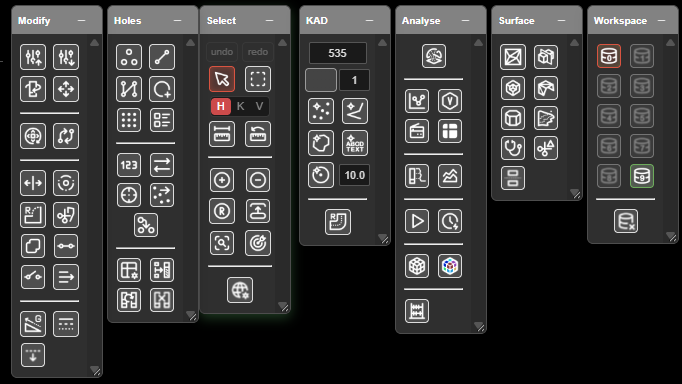
*Seven of the eight floating toolbars. The Connect toolbar is docked here, as a tab on the right edge of the viewport.*

| Toolbar | Purpose |
|---------|---------|
| **Select** | [Undo / redo, pointer and shape selection, H / K / V mode, ruler, protractor, zoom, reset view, section plane, find, orbit focus, Settings](../reference/select-toolbar.md) |
| **Holes** | [Place holes and patterns, pattern templates, renumber, reorder rows, insert holes, charging, radii from holes](../blast-design/holes-toolbar.md) |
| **Surface** | [Triangulate, surface intersection, Solid Boolean, Trimesh Boolean, extrude, contour, clean mesh, clip, horizon slice](../surfaces/surfaces-toolbar.md) |
| **Workspace** | [Switch between ten separate workspaces, or clear one](#workspace-toolbar) |
| **Analyse** | [Flyrock shroud, blast analysis shader, Voronoi options, monitor points, site law regression, hole section, compare surfaces, blast animation, time window, block models, blast quality](../analysis/analyse-toolbar.md) |
| **KAD** | [Drawing elevation / colour / size, points, lines, polygons, text, circles, roads and ramps](../kad/kad-toolbar.md) |
| **Modify** | [Assign surface / grade, hole bearing, move, transform, offset, radii, boolean, join, split, extend, grade line, simplify, snap to surface](../kad/modify-tools.md) |
| **Connect** | [Temporal mesh, tie connect tools, trunk branch, connector removal, electronic timing, harness wire, bake delay](../blast-design/connect-toolbar.md) |

---

## Workspace Toolbar

Kirra keeps ten separate workspaces, numbered **0** to **9**. Each is its own store of holes, drawings, surfaces, charging, timing and libraries, so you can keep different jobs apart. A new workspace opens empty — import a KAP or KAT file, or start building.

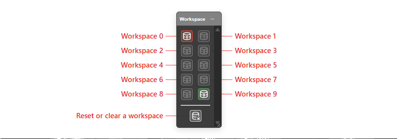
*The Workspace toolbar — Workspace 0 (red border) is the one this window is using.*

| Control | Purpose |
|---------|---------|
| **Workspace 0** … **Workspace 9** | Open that workspace. In a browser it opens in its own window (clicking the chip again brings that window forward). In the desktop app, this window switches to the chosen workspace after you confirm — unsaved changes are lost |
| **Reset or clear a workspace** | Opens **Reset a Workspace**: choose which workspace to clear, then click **Clear…** and confirm **Delete**. Everything in it is removed and this cannot be undone. If it is the workspace you are in, Kirra reloads once it is cleared. When leftover import files are taking up space, a **Clear Scratch** button also appears |

**Reading the chips:**

- A **red** border marks the workspace this window is using.
- A **green** border marks a workspace that holds data.
- A dimmed chip is empty.
- Hover over a chip for the same information in words.
- **Right-click** a chip to give it a name. The name shows in the window title and the chip's tooltip; leave it blank to clear it.

Some browsers cannot report which workspaces hold data. In that case no chip is marked and the reset dialog says so.

---

## Dockview Panels

Kirra uses **Dockview** for resizable, dockable, and pop-out panels.

| Panel | Purpose |
|-------|---------|
| **Viewport** | Main 2D canvas or 3D view — where you design and interact |
| **Explorer** | Data Explorer TreeView — hierarchical list of all loaded entities |

You can resize panels by dragging their edges, dock them in different positions, or pop them out into separate windows. Layout is persisted between sessions.

---

## Data Explorer (TreeView)

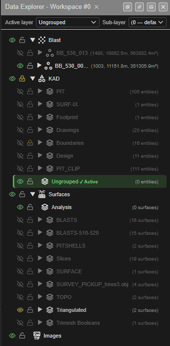
*The TreeView in the Explorer panel lists all loaded entities — holes, surfaces, KAD drawings, and layers.*

The TreeView is toggled by the **Data Explorer** button in the [App Navigation Bar](#app-navigation-bar).

### TreeView features

- **Visibility toggle** — show or hide individual entities via the row checkbox
- **Duplicate** — right-click to create a copy of an entity, a surface, a **KAD layer**
  (makes `<layer>_copy`) or a **KAD sub-layer folder** (makes `<folder>_copy` in the same
  layer), or a **whole blast** — see
  [Duplicating a whole blast](../blast-design/editing-holes.md#duplicating-a-whole-blast)
- **Context menu** — right-click for statistics, move-to-layer, split/join lines, delete, and more
- **Dock / popout** — the TreeView can be docked to the side, popped out, or collapsed

---

## Information Overlay

A persistent text overlay reports counts, cursor position, scene centroid, and build info.

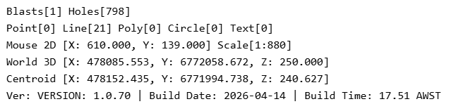
*The information overlay — counts, cursor position, world position, centroid, and version/build info.*

| Line | Meaning |
|------|---------|
| `Blasts[N] Holes[M]` | Number of blasts and total holes loaded |
| `Point[N] Line[N] Poly[N] Circle[N] Text[N]` | KAD entity counts by type |
| `Mouse 2D [X, Y] Scale[…]` | Cursor position in 2D and the current map scale |
| `World 3D [X, Y, Z]` | Cursor position in world coordinates (m). Reads `Snapped 3D` while the cursor is snapped to something |
| `Centroid [X, Y, Z]` | Scene centroid in world coordinates |
| `L1[…]` / `P1->P2[…]` | Ruler lengths and protractor angles, while those tools are in use |
| `Ver: …` | App version and build |

The overlay is rendered as plain text and stays visible while you work.

---

## 2D Canvas

The main 2D viewport shows your blast pattern in plan view.

| Action | How |
|--------|-----|
| **Pan** | Click and drag |
| **Zoom** | Scroll wheel (direction set on the **3D** tab of the Settings dialog) |
| **Rotate the plan view** | Shift + Alt + drag |
| **Select** | Left-click (the active H / K / V mode applies). A click on empty canvas clears the selection |
| **Add to selection** | Shift + click (Shift + click on a selected item removes it) |
| **Remove from selection** | Ctrl + click (Cmd + click on a Mac) |
| **Shape select** | Use the Polygon / Rectangle / Ellipse select tool in the [Select Toolbar](../reference/select-toolbar.md) |

---

## 3D View

Switch to 3D with the **2D / 3D** toggle in the App Navigation Bar.

| Action | How |
|--------|-----|
| **Pan** | Click and drag |
| **Orbit** | Alt + drag |
| **Camera roll** | Shift + Alt + drag |
| **Zoom** | Scroll wheel (zooms towards the cursor when Cursor Zoom is on) |
| **Context menu** | Right-click |

The 3D view uses the same coordinate space as 2D — no Z scaling or elevation transform.

### Orbit Focus

The **Orbit Focus** tool (in the [Select Toolbar](../reference/select-toolbar.md)) lets you click any point in the 3D scene to set it as the new orbit centre. See [3D View & Orbit Focus](../reference/3d-tools.md) for full details.

### Settings

The **3D Settings** button (globe-and-cog icon, at the bottom of the Select toolbar) opens the **Settings** dialog. Its **2D** tab holds the view sizes, snap tolerance and hillshade; its **3D** tab holds camera, scroll-wheel, lighting, orbit, axis lock, gizmo and text billboarding settings; its **Performance** tab holds import and triangle limits. See [Select Toolbar — Settings](../reference/select-toolbar.md#settings).

---

## Theme and Language

- **Theme** — the **Day / Night** button at the end of the left cluster switches between the dark and light theme
- **Language** — choose English, Chinese, French (France or Québec), Mongolian, Russian, or Spanish (Spain or Latin America) from the **Select Language** menu in the top bar, or from the **Language** group in the side panel. Kirra switches straight away, including on-screen legends and the Kirra Inbuilt printed plan. The [Blasting Glossary](../reference/blasting-glossary.md) lists the blasting terms used in each language

---

## Related topics

- [Select Toolbar](../reference/select-toolbar.md) — undo/redo, selection, measurement, view
- [Holes Toolbar](../blast-design/holes-toolbar.md) — hole placement and pattern generation
- [Surfaces Toolbar](../surfaces/surfaces-toolbar.md) — triangulation, boolean, mesh repair
- [KAD Toolbar](../kad/kad-toolbar.md) — vector drawing
- [Modify Toolbar](../kad/modify-tools.md) — transform, offset, boolean, join, split
- [Connect Toolbar](../blast-design/connect-toolbar.md) — surface connectors, electronic timing
- [Analyse Toolbar](../analysis/analyse-toolbar.md) — analytics and timing analysis
- [Supported File Formats](../reference/supported-formats.md) — full import / export matrix
- [Keyboard Shortcuts](../reference/keyboard-shortcuts.md)

---

*Next: [Your First Blast →](first-blast.md)*
