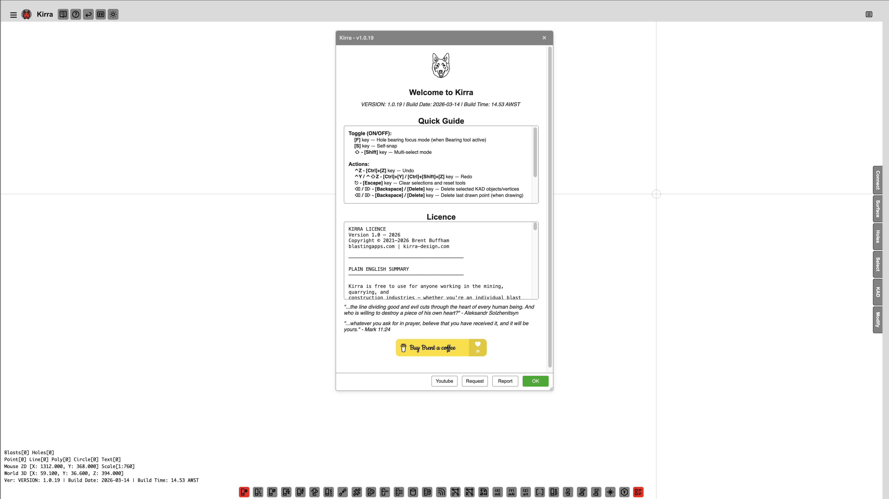

# Overview — What is Kirra?

**Kirra** is a web-based blasting pattern design application for mining, quarrying, and construction. It runs in any modern browser — no installation required. Simply open the application URL in Chrome (recommended), Firefox, Edge, or Safari and start designing blast patterns.

---

## Who Is Kirra For?

| Role | How Kirra Helps |
|------|-----------------|
| **Blast Engineer** | Design and optimise blast patterns, assign timing sequences, run vibration analysis, and export production-ready files |
| **Shot Firer / Blaster** | Review hole-by-hole charge instructions and timing diagrams before initiating |
| **Drill & Blast Contractor** | Import drill hole surveys, build charge decks, and export to downstream systems quickly |
| **Surveyor** | Import surfaces (DTM, OBJ, PLY), overlay GeoTIFF imagery, and work with real-world coordinates |
| **Researcher** | Use GPU/CPU blast analytics models, flyrock modelling, and surface boolean operations |

---

## Key Features

- **Combined 2D and 3D visualisation** — 2D canvas for plan view plus Three.js 3D view for elevation and terrain context
- **20+ file formats** — Import and export CSV, DXF, DTM/STR, OBJ, PLY, GLTF/GLB, IREDES, KML, SHP, LAS, GeoTIFF, and more
- **Surface management** — Import surfaces, run boolean operations, surface intersection, solid CSG, and section planes
- **Blast analytics** — 10 GPU/CPU models for vibration prediction, Voronoi rock distribution, and blast statistics
- **Flyrock modelling** — Flyrock shroud visualisation for safety planning
- **Charging system** — Build deck-loaded charge designs with stemming, boosters, and explosive products
- **Print to PDF** — Direct print or print from XLSX templates
- **Dockview panels** — Resizable, dockable, and pop-out panels for Viewport and Explorer
- **Dark and light themes** — Toggle between themes for comfortable viewing
- **Internationalisation** — English, Russian, and Spanish language support

---

## Coordinate System

Kirra uses **UTM-style real-world coordinates**:

| Axis | Meaning |
|------|---------|
| **X** | East (metres east) |
| **Y** | North (metres north) |
| **Z** | Elevation (metres altitude) |

Data is typically in UTM or custom mine grid. The canvas uses Y-up for North (+ve) and Y-down for South (-ve); West is X -ve and East is X +ve.

---

## Supported Data

| Data Type | Formats / Contents |
|-----------|--------------------|
| **Blast holes** | Collar, toe, grade, diameter, bearing, inclination, timing, charge info |
| **Surfaces** | DTM, STR, OBJ, PLY, GLTF/GLB — triangulated meshes for terrain and geology |
| **KAD drawings** | Points, lines, polygons, circles, text — vector overlays |
| **GeoTIFF imagery** | Georeferenced raster imagery for background context |

---

## Data Persistence

Kirra stores your data in **IndexedDB** — your browser’s local storage. Holes, surfaces, KAD drawings, and layer settings are saved automatically. No server upload is required; your data stays on your device.

> **Tip:** Clear your browser data or use a different browser profile if you need a fresh workspace.

---

## Screenshots

*The Welcome popup on startup shows version info, a quick guide, and licence details.*

---

*Next: [Interface Tour →](interface-tour.md)*
