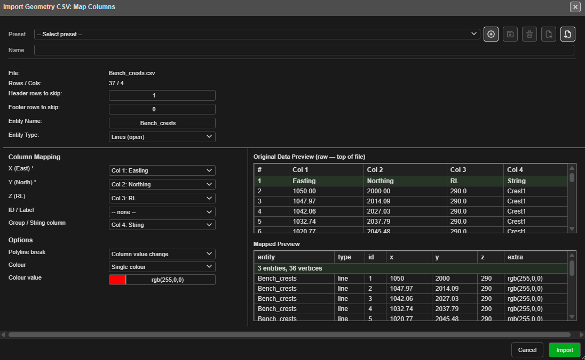

# Other CAD Formats

The **Drawings / CAD** tab of the Import dialog reads design files from the main mine
planning packages. DXF and Surpac have their own pages: [DXF Import](dxf.md) and
[Surpac STR / DTM](surpac-dtm-str.md).

| Row | Extensions | Creates |
|---|---|---|
| [**Geometry CSV**](#geometry-csv) | `.csv` / `.txt` | Points, lines, polygons, circles, text or a point cloud |
| [**DWG (experimental)**](#dwg-experimental) | `.dwg` | Drawings and 3DFACE surfaces |
| [**Vulcan ARCH_D**](#vulcan-arch_d) | `.arch_d` | Blast holes and drawings |
| [**Vulcan Design Database**](#vulcan-design-database) | `.dgd.isis` | Blast holes and drawings, layer by layer |
| [**Micromine STR**](#micromine-str) | `.str` | Lines, polygons and points |
| [**Deswik DUF**](#deswik-duf) | `.duf` | Lines and polygons (and surfaces when dropped) |
| [**12d Archive**](#12d-archive) | `.12da` / `.12daz` | Surfaces (TINs) and strings |

Vulcan ARCH_D, Micromine STR and Deswik DUF warn when the new data is more than 100 km
from what is already loaded — see [The Import Dialog](import-dialog.md#coordinate-check).
Each file's drawings go into one drawing layer named after the file.

---

## Geometry CSV

For survey strings, MWD and boretrack exports, and any other X, Y, Z text file. After you
pick the file, **Import Geometry CSV: Map Columns** asks how to read it:

*Easting, Northing and RL are detected from the headers. With **Lines (open)** and
**Polyline break** set to **Column value change** on the **String** column, the file
becomes three lines — the Mapped Preview shows "3 entities, 36 vertices".*

| Setting | What it does |
|---|---|
| **Header rows to skip:** / **Footer rows to skip:** | Lines to ignore at the top and bottom |
| **Entity Name:** | The name for what is imported |
| **Entity Type:** | **Points**, **Lines (open)**, **Polygons (closed)**, **Circles**, **Text**, **Point Cloud**, or **Read from Column** |
| **X (East) \***, **Y (North) \***, **Z (RL)**, **ID / Label** | Which column holds each value. X and Y are required |
| **Group / String column** | For lines and polygons: the column that says which string each point belongs to |
| **Polyline break** | How one line ends and the next begins: **None — one entity**, **Blank line**, **Column value change** or **Marker line (token)** (with its **Marker token**) |
| **Close polygon ring** | Close each polygon back to its first point |
| **Circle radius (m)** | The radius for circles, or a radius column |
| Colour | **Single colour**, **By value (colormap)**, **R,G,B,A columns** or **HEX / CSS column** |

Two previews show the raw file and how it will be read. A preset bar saves the settings
for files you import often. Click **Import**; **Geometry Imported** reports what was made.

Choosing **Point Cloud** goes on to the point-cloud import — see
[Surfaces and Point Clouds](surfaces-and-point-clouds.md#point-cloud).

A `.csv` dropped on the canvas asks what it holds; choose **Geometry** for this dialog.
Large dropped files are read in the background.

---

## DWG (experimental)

Reads AutoCAD's own binary drawing format, versions **R2010, R2013 and R2018**. Save
older drawings in one of those versions first, or export DXF — see [DXF Import](dxf.md).

| Read | Not yet |
|---|---|
| Lines, polylines (2D and 3D), circles, arcs, ellipses, points, text and multiline text | Blocks (INSERT) |
| 3DFACE meshes, as one surface | Layer names — everything comes in on layer 0 |

"Experimental" means it works on the drawings it has been tested with, but is not yet as
complete as DXF — the DWG's layer names are not read yet, so its drawings are not split by
layer. Importing the same DWG again adds a second copy, with `_(2)` on the names. If a DWG
does not come in cleanly, export DXF from your CAD package instead.

---

## Vulcan ARCH_D

Reads a Maptek Vulcan design file: blast holes and the drawings around them.

**Holes.** Vulcan holes are recognised by their Link / MVAR data or a "blast hole"
description. Each keeps its collar, grade and toe; holes with several intervals are
accepted. Holes are grouped into blasts by their Vulcan layer. Diameter and hole type come
from each hole's MVAR record, or from the file's blast summary.

If any hole is still without a diameter, **Vulcan ARCH_D — Drill Diameter** asks for one:
enter the **Diameter (mm):** and click **Apply**, or click **Keep 115 mm**. You can also
**Load specifications.dab** to read the diameters from the Vulcan specifications file.

Row, position, burden and spacing are worked out from the hole layout. If holes land on
top of existing ones, Kirra asks what to do.

**Drawings.** Other strings become lines, polygons or points; 2D and 3D text becomes text.
Colours follow Vulcan's standard colour numbers.

**Vulcan Import Complete** reports the holes and drawings imported.

---

## Vulcan Design Database

Reads a Maptek Vulcan design database (`.dgd.isis`) — many layers in one file. Blasts come
in with their Vulcan MVAR attributes. The database is read only; Kirra does not change it.

1. Pick the `.dgd.isis` file. **Importing Vulcan Design Database** runs; it can be
   cancelled.
2. **Import Vulcan design database — choose layers** lists every layer, with its
   **Entities**, **Points** and whether it holds a **Blast**. Tick **Load** for the layers
   you want, or **Load every layer**.
3. Optionally **Load specifications.dab** for hole diameters.
4. Click **Load**.

This import uses the browser's private file storage to read large databases. If the
browser does not provide it, Kirra says so.

---

## Micromine STR

Reads Micromine Extended Data string files.

- Points with the same string number that follow each other form one string.
- A string that returns to its first point becomes a closed polygon.
- Single points become point entities, one per string number.
- Colours are read from the file; strings without one are white.

There is no dialog. If the file turns out to be a Surpac string file, Kirra says so — use
the **Surpac** row instead.

A Micromine `.str` dropped on the canvas is recognised automatically.

---

## Deswik DUF

Reads Deswik design files: polylines and closed rings.

**Drop the file on the canvas** for the fullest import: large files are read in the
background, each Deswik layer path becomes its own drawing layer, and polyface meshes
come in as surfaces. The **Open** button reads the polylines and rings only.

---

## 12d Archive

Reads 12d Model text archives (`.12da`) and compressed archives (`.12daz`).

| Imported | Skipped |
|---|---|
| Strings: 2D, 3D, 4D, polyline, pipe, arc, circle, face, interface, text and super strings | Drainage, feature, alignment, pipeline, plot frame and LAS data |
| Surfaces: TINs, full and super TINs, and 3D primitives | |

**Importing 12d Archive** shows progress and can be cancelled. For a `.12daz`, or a
`.12da` over 1 GB, **Import 12d Archive — choose surfaces** lists each surface with its
point and triangle counts and the memory it needs; tick the ones to load and click
**Load selected**. Drawings always load.

---

## Related topics

- [The Import Dialog](import-dialog.md)
- [DXF Import](dxf.md)
- [Surpac STR / DTM](surpac-dtm-str.md)
- [Transform Import](transform-import.md) — for Geometry CSV in another coordinate system
