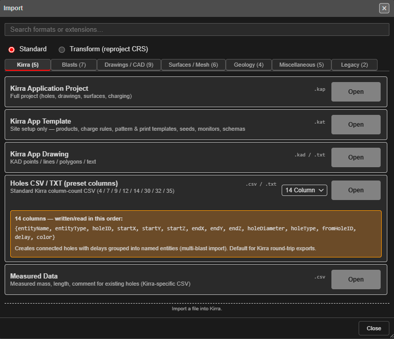
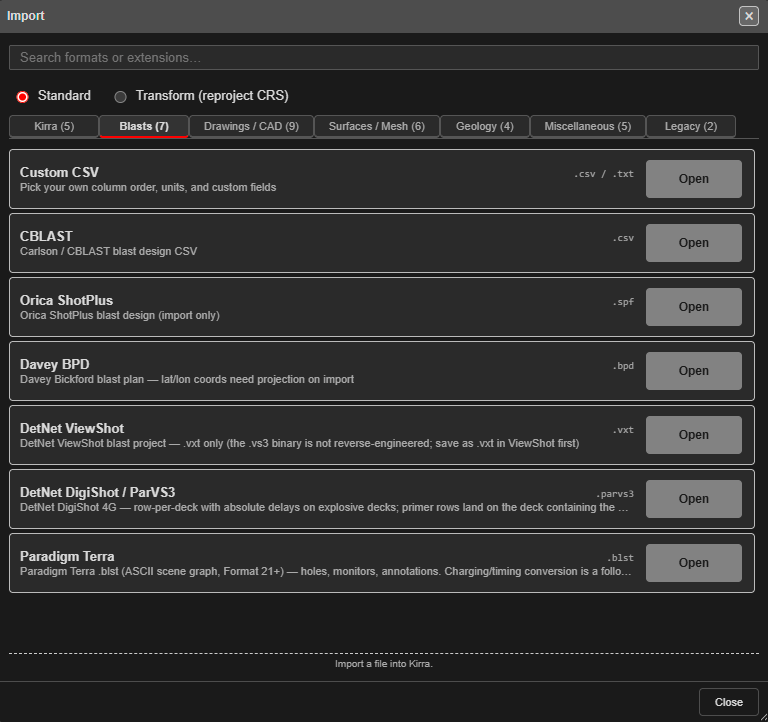
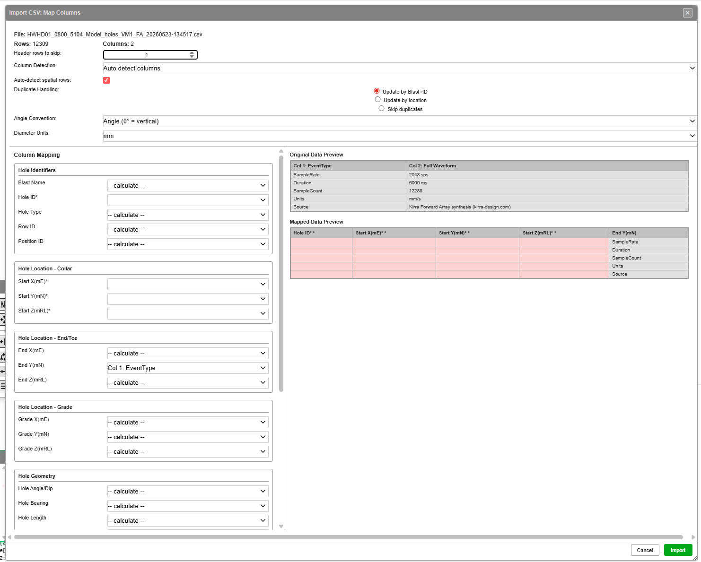

# CSV Import

Kirra reads blast holes from CSV files using its **BlastHole CSV** family — a set of fixed column layouts, told apart by how many columns the file has. Use **Custom CSV** if your file does not match one of them.

---

## How to Import a CSV

1. Open the **Import** dialog — see [The Import Dialog](import-dialog.md)
2. Stay on the **Kirra** tab
3. Click **Open** on **Holes CSV / TXT (preset columns)** and select your `.csv` or `.txt` file

Kirra works out the layout from the number of columns in each line, so you do not need to
choose one. The row's drop-down is a reference: pick a column count to see, in the note
under it, which columns that layout holds.

An **Importing Blast Data** progress bar runs, Kirra checks the holes against what is
already loaded (see [Checks on import](import-dialog.md#checks-on-import)), and a summary
reports the holes, rows, average burden and spacing.


*The Holes CSV / TXT row, with the 14-column layout shown in its note.*

If your file does not match any preset, switch to **Custom CSV** on the **Blasts** tab — see [Custom CSV Import](#custom-csv-import) below.

Files with 4, 7, 9 or 12 columns carry no blast name; their holes go into one blast
named `BLAST_` followed by a short code. Rename it afterwards.

---

## BlastHole CSV — accepted column counts

The parser dispatches strictly on column count. It accepts files with **4, 7, 9, 12, 14, 29, 30, 31, 32 or 35** columns; any other count is skipped with a warning (unless the file has a header row — see [Header rows](#header-rows)).

| Cols | Layout | Carries |
|------|--------|---------|
| **4** | `holeID, X, Y, Z` | Collar only — toe defaults to collar (dummy holes) |
| **7** | + `endX, endY, endZ` | Collar → toe vector |
| **9** | + `holeDiameter, holeType` | Diameter (mm) and hole type |
| **12** | + `fromHoleID, delay, color` | Tying / delay / colour (single entity) |
| **14** | `entityName, entityType, …` (rest as 12-col) | Multi-entity grouping — **recommended round-trip format** |
| **29 / 30** | Full design columns 1-24, then row / position / burden / spacing / curve | Full design without measured data |
| **31 / 32** | Columns 1-24, then measured length and mass, then row / position / burden / spacing | Design + measured length and mass |
| **35** | Columns 1-24, measured fields with timestamps, then row / position / burden / spacing / curve | **Complete** — every parsed field |

> **29- to 35-column files are not "14 + extras".** Cols 1-9 match the 14-col layout, but from col 10 onward the order diverges — grade, subdrill, and bench come **before** `holeDiameter`. See [29- to 35-Column Files](#29--to-35-column-files) for the exact order.

---

## 4-Column (Collar Only)

Creates collar-only holes — toe coordinates default to the collar position.

| Column | Field |
|--------|-------|
| 1 | `holeID` |
| 2 | `X` — collar Easting (m) |
| 3 | `Y` — collar Northing (m) |
| 4 | `Z` — collar Elevation (m) |

```
H001,477750.5,6771850.2,335.0
H002,477755.5,6771850.2,335.0
```

---

## 7-Column (Collar + Toe)

Full 3D hole geometry — collar plus toe.

| Column | Field |
|--------|-------|
| 1 | `holeID` |
| 2-4 | Collar `X / Y / Z` |
| 5-7 | Toe `endX / endY / endZ` |

```
H001,477750.5,6771850.2,335.0,477751.2,6771849.8,320.0
```

---

## 9-Column (+ Diameter + Type)

Adds hole diameter and hole-type classification.

| Column | Field |
|--------|-------|
| 1 | `holeID` |
| 2-4 | Collar `X / Y / Z` |
| 5-7 | Toe `endX / endY / endZ` |
| 8 | `holeDiameter` (mm) |
| 9 | `holeType` — e.g. `Production`, `Buffer`, `Presplit`, `Trim` |

---

## 12-Column (+ Timing + Colour)

Adds the timing connection back to its source hole, the delay, and a display colour.

| Column | Field |
|--------|-------|
| 1 | `holeID` |
| 2-4 | Collar `X / Y / Z` |
| 5-7 | Toe `endX / endY / endZ` |
| 8 | `holeDiameter` (mm) |
| 9 | `holeType` |
| 10 | `fromHoleID` — upstream hole in the timing chain |
| 11 | `delay` — milliseconds relative to `fromHoleID` |
| 12 | `color` — `#RRGGBB` hex, or a named colour like `red` / `blue` |

> **`fromHoleID` form:** in legacy single-entity files, just the holeID (e.g. `H001`). In multi-entity files (14-col), use `entityName:::holeID` (e.g. `Pattern_A:::H001`).

---

## 14-Column (Kirra Standard — Recommended)

Same fields as 12-col but prefixed with the entity name (blast pattern) and entity type. This is the recommended round-trip format.

| Column | Field |
|--------|-------|
| 1 | `entityName` — blast pattern name (e.g. `Pattern_A`) |
| 2 | `entityType` — `hole` for blast holes |
| 3 | `holeID` |
| 4-6 | Collar `X / Y / Z` |
| 7-9 | Toe `endX / endY / endZ` |
| 10 | `holeDiameter` (mm) |
| 11 | `holeType` |
| 12 | `fromHoleID` — use the `entityName:::holeID` form |
| 13 | `delay` (ms) |
| 14 | `color` |

```
Pattern_A,hole,H001,477750.5,6771850.2,335.0,477751.2,6771849.8,320.0,115,Production,,0,#FF0000
Pattern_A,hole,H002,477755.5,6771850.2,335.0,477756.2,6771849.8,320.0,115,Production,Pattern_A:::H001,25,#FF0000
```

---

## 29- to 35-Column Files

### Columns 1-24 (shared)

These files share the same first 24 columns. Grade, bench, length, angle, bearing and fire time are **recalculated** on import, so their columns can hold any value.

| Column | Field | Notes |
|--------|-------|-------|
| 1 | `entityName` | Blast pattern name |
| 2 | `entityType` | `hole` for blast holes (not read) |
| 3 | `holeID` | |
| 4-6 | `startX, startY, startZ` | Collar |
| 7-9 | `endX, endY, endZ` | Toe |
| 10-12 | `gradeX, gradeY, gradeZ` | Grade point — recalculated from subdrill |
| 13 | `subdrillAmount` | **Vertical** delta-Z (m), not along-hole |
| 14 | `subdrillLength` | Along-hole subdrill (m) (not read) |
| 15 | `benchHeight` | Bench height (m) (recalculated) |
| 16 | `holeDiameter` | mm |
| 17 | `holeType` | e.g. `Production` |
| 18 | `fromHoleID` | Upstream tying hole (use `entityName:::holeID`) |
| 19 | `delay` | **Relative** milliseconds. Accepts `na` / `n/a` / `null` / `nan` (case-insensitive) → stored as no delay, for the harness-wire / null-connector convention |
| 20 | `color` | `#RRGGBB` or named colour |
| 21 | `holeLength` | Calculated (m) (recalculated) |
| 22 | `holeAngle` | Angle from vertical (`0` = vertical) (recalculated) |
| 23 | `holeBearing` | Azimuth clockwise from North (recalculated) |
| 24 | `holeTime` | Hole fire time (recalculated) |

> **Two subdrill fields:** `subdrillAmount` is the **vertical** drop below grade (Δz). `subdrillLength` is the same value projected along the hole vector. Both are written on export so other software can use whichever convention it prefers.

### Columns 25 onward

| Column | 29 / 30 columns | 31 / 32 columns | 35 columns |
|--------|-----------------|-----------------|------------|
| 25 | `rowID` | `measuredLength` | `measuredLength` |
| 26 | `posID` | `measuredMass` | `measuredLengthTimeStamp` |
| 27 | `burden` | `rowID` | `measuredMass` |
| 28 | `spacing` | `posID` | `measuredMassTimeStamp` |
| 29 | `connectorCurve` | `burden` | `measuredComment` |
| 30 | (ignored) | `spacing` | `measuredCommentTimeStamp` |
| 31 | — | `connectorCurve` (32-column files only) | `rowID` |
| 32 | — | (ignored) | `posID` |
| 33 | — | — | `burden` (m) |
| 34 | — | — | `spacing` (m) |
| 35 | — | — | `connectorCurve` |

Empty `rowID` / `posID` parse as `null`. Holes with `null` or `0` row/pos are treated as unassigned and may be processed by smart row detection.

> **Caution — 30 and 32 Column exports:** Kirra's **30 Column** and **32 Column** exports write the measured fields (with timestamps) from column 25, which is the 35-column order, not the order the importer reads for 30- and 32-column files. Use **14 Column** or **35 Column** for Kirra-to-Kirra round trips.

For a full project save, prefer **KAP** — it carries every project state (charging, timing constructs, drawings, surfaces, layers) instead of just the holes.

---

## Header rows

A header row is detected when any of columns 4-6 (collar X/Y/Z) in one of the first three lines is non-numeric, and the line has at least 6 columns. If your file has a header that doesn't match this rule, the parser may treat it as a data row.

When a header row is present and the column count is **not** one of the accepted counts, Kirra maps the columns by their header names instead (the names Kirra itself writes, such as `holeID`, `startXLocation`, `holeDiameter`). With an accepted count, the column positions above still apply.

If you have an unusual header layout, use **Custom CSV** instead — it does header-driven field mapping.

---

## Custom CSV Import

If your CSV does not match a preset (different column order, different field names, extra columns), use **Custom CSV** on the **Blasts** tab of the Import dialog. The separator — comma, tab, semicolon and so on — is detected automatically.


*Custom CSV is the first entry on the Blasts tab — "Pick your own column order, units, and custom fields".*

1. Open the **Import** dialog
2. **Blasts** tab → **Custom CSV** → click **Open**
3. Choose your `.csv` file. (For a `.txt`, drop it onto the canvas and choose **Holes**.)
4. The **Import CSV: Map Columns** dialog opens — review the auto-detected mapping (or override manually) and click **Import**

### The Map Columns dialog


*Import CSV: Map Columns — file header, dialog-wide settings, column mapping (left), and live preview (right).*

The dialog shows the file name and row / column counts at the top, followed by dialog-wide settings, the column mapper, and a live preview.

#### Dialog-wide settings

| Control | Purpose |
|---------|---------|
| **Header rows to skip** | Number of rows to ignore at the top of the file (default 1) |
| **Column Detection** | **Auto detect columns** (match the header names — the default), **Use last used column order**, or **Manual - don't detect columns** |
| **Duplicate Handling** | Radio buttons — **Update by Blast+ID** (default), **Update by location** (0.01 m tolerance), **Skip duplicates** |
| **Angle Convention** | Dropdown — **Angle (0° = vertical)** for Kirra's native convention, or *Dip (0° = horizontal)* to convert (`90 − value`) |
| **Diameter Units** | Dropdown — `mm` (default), `m`, `in` — values are converted to mm on import |

#### Column Mapping panel

The left side groups Kirra fields by category. Each row has a dropdown — pick which **CSV column** in the file (`Col 1: <name>`, `Col 2: <name>`, …) supplies that Kirra field, or leave it as `-- calculate --` to let Kirra derive it from the other fields.

| Group | Fields |
|-------|--------|
| **Hole Identifiers** | Blast Name, **Hole ID** (required, marked with *), Hole Type, Row ID, Position ID |
| **Hole Location - Collar** | **Start X (mE)** *, **Start Y (mN)** *, **Start Z (mRL)** * (all required) |
| **Hole Location - End/Toe** | End X (mE), End Y (mN), End Z (mRL) |
| **Hole Location - Grade** | Grade X (mE), Grade Y (mN), Grade Z (mRL) |
| **Hole Geometry** | Hole Angle/Dip, Hole Bearing, Hole Length, Bench Height (m), Subdrill (m), Diameter |
| **Timing & Connections** | From Hole ID, Timing Delay (ms), Initiation Time, Tie Color |
| **Measured Values** | Measured Length, Measured Mass, Measured Comment |
| **Charging (decks & primers)** | Shown when the file has deck or primer columns — see [Charging columns](#charging-columns-v10270) |

Required fields are marked with **`*`** and shaded pink in the preview until mapped.

A preset bar at the top of the dialog saves a mapping, so a file from the same source
imports in one click next time.

#### Live preview panels (right side)

| Panel | Shows |
|-------|-------|
| **Original Data Preview** | Top of the source file with column names as Kirra read them |
| **Mapped Data Preview** | What each Kirra field will receive after the mapping is applied. Pink-highlighted cells are required fields that are not yet mapped |

#### Footer

| Button | Action |
|--------|--------|
| **Cancel** | Discard the mapping and close |
| **Import** *(green)* | Apply the mapping, run the parser, and load the holes |

### Header auto-detection

`CsvColumnAutoDetect.autoDetectColumns()` scans the header row, normalises each header (lowercase, alphanumeric only), and matches against a keyword list per Kirra field. Match priority:

1. **Exact match**
2. **Longest matching keyword**
3. **Earliest column** wins ties

Examples of headers Kirra recognises out of the box:

| Header in your CSV | Maps to |
|--------------------|---------|
| `Hole ID`, `HoleID`, `BlastHoleId` | `holeID` |
| `Easting`, `East`, `Collar X`, `Start X` | `startXLocation` |
| `Northing`, `North`, `Collar Y`, `Start Y` | `startYLocation` |
| `Elev`, `Elevation`, `RL`, `Collar Z` | `startZLocation` |
| `Bearing`, `Azimuth` | `holeBearing` |
| `Dip` | interpreted via `angle_convention` (dip-from-horizontal converts to Kirra's angle-from-vertical as `90 − value`) |
| `Diameter`, `Dia` | `holeDiameter` (with unit conversion) |

A bare `X`, `Y` or `Z` header is deliberately **not** matched: it would also match `EndX`,
`ToeX` and so on. Map those columns by hand. Any header Kirra does not recognise can be
mapped by hand in the dialog.

### Geometry priority

When a CSV provides multiple geometry specs at once, the parser picks the first match:

1. **Collar + Toe** coordinates (overrides L/A/B if both present)
2. **Collar + Length / Angle / Bearing + Subdrill** (forward calc)
3. **Toe + L/A/B + Subdrill** (reverse calc — collar back-derived from toe)
4. **Collar + L/A/B only** (subdrill defaults to 1)
5. **Collar only** (length = `benchHeight + subdrill`, angle = 0, bearing = 0)

Subdrill is always the **vertical Δz**, not along-hole.

### Smart row detection

For files without explicit `rowID` / `posID` (this always runs):

- **Alphanumeric IDs** (e.g. `A1, A2, B1`) — letter becomes the row, number becomes the position
- **Pure numeric** — fits holes to linear sequences using collar XY (tolerance `2 × diameter`)
- **Fallback** — auto-assigns when the pattern is unclear

### Duplicate handling

Configurable per import:

| Mode | Behaviour |
|------|-----------|
| `update-blast-hole` | Match on `entityName + holeID`, overwrite existing |
| `update-location` | Match on collar proximity (0.01 m tolerance), overwrite existing |
| `skip` | Intended to keep the existing hole and drop the incoming duplicate. **Currently duplicates are imported anyway** — use **Update by Blast+ID** until this is fixed |

### Time → delay back-calculation

If the CSV provides absolute `holeTime` but no `timingDelayMilliseconds`, Kirra walks the timing graph and derives each delay as `myTime − fromHoleTime`.

### Unit conversion

- **Diameter** — `m → mm` (× 1000) or `in → mm` (× 25.4) on import; reverse on export
- **Angle** — `dip-from-horizontal` (90 = horizontal) converts to Kirra's `angle-from-vertical` (0 = vertical) as `90 − value`

### NaN guard

Invalid coordinates **do not abort** the import:

- `end ← collar` (zero-length / dummy hole) when the toe is bad
- `grade ← collar` when the grade is bad
- The rows that fell back are listed in the browser console

### Charging columns (v1.0.270+)

When the first row has any `deck…[N]` or `primer…[N]` header (e.g. `deckType[1]`, `primerDepth[2]`), the dialog shows **Import charging (N decks, M primers per hole)**, ticked. Each hole's charging is rebuilt from the deck and primer cells, including verbatim `fx:` formula strings. Untick it to import the holes without charging; the slot list lets you check or change which columns feed each deck and primer.

Round-trip is full for design, formulas, and primer assignments — but live formula re-evaluation does not happen on import. The imported numeric values are the source of truth until a charge rule is next applied to the holes.

To see the exact charging columns Kirra writes, export a charged blast with **Custom CSV** — see [CSV Export](../exporting/csv-export.md).

---

## Measured Data

**Measured Data** on the **Kirra** tab updates holes you already have with what was
measured in the field: length, explosive mass and a comment, each with its time stamp.

The file has nine columns:

```
EntityName,EntityType,HoleID,MeasuredLength,LengthTimeStamp,MeasuredMass,MassTimeStamp,Comment,CommentTimeStamp
```

Each row is matched to an existing hole by blast name and hole ID. Rows with no matching
hole are ignored. A first line containing `EntityName` is treated as a header.

---

## Round-trip fidelity

| Round trip | Preserves | Loses |
|------------|-----------|-------|
| 14 → import → 14 | name, ID, collar/toe, diameter, type, tying, delay, colour | grade point, subdrill, measured fields, row/pos |
| 12 → import → 12 | as 14, except `entityName` is auto-assigned `BLAST_<hex>` | grade, subdrill, measured, row/pos |
| 35 → import → 14 → 35 | re-derives grade from subdrill (small rounding drift) | `rowID`, `posID`, `burden`, `spacing`, `connectorCurve` |
| 35 → import → 35 | everything the parser knows about | nothing |

For lossless round-trip across Kirra sessions, prefer **35-col** export — or [KAP](#) for the full project.

---

## Edge cases and parser quirks

- **Strict column count.** A 9-col file is unambiguous, but a hand-crafted file with the wrong count will parse as the wrong variant. Stick to the documented variants.
- **Embedded commas in quoted strings.** The parser splits on every comma — quoted fields are not recognised. Embedded commas inside quoted strings are not safe. If you need that, use Custom CSV.
- **BOM.** A UTF-8 byte-order mark is stripped by the browser when the file is read.
- **Locale numbers.** Comma-decimal locales (`12,5`) are **not** supported. Use period as the decimal separator.
- **Missing fields.** Sensible defaults: `holeDiameter = 0`, `holeType = "Undefined"`, `delay = 0`, `color = "red"`.

---

## Tips

- **Coordinate order** — Kirra expects Easting (X), Northing (Y), Elevation (Z). For other orders, use Custom CSV.
- **File encoding** — UTF-8 or ASCII. Other encodings may produce garbled text.
- **Decimal separator** — Period (`.`) only.
- **Units** — Coordinates in metres, diameter in millimetres, delays in milliseconds. Bare numbers, no unit suffixes.

---

## Related topics

- [CSV Export](../exporting/csv-export.md)
- [DXF Import](dxf.md)
- [Hole Properties Reference](../reference/hole-properties.md)
- [Coordinate System](../reference/coordinate-system.md)
- [Supported File Formats](../reference/supported-formats.md) — full import / export matrix
