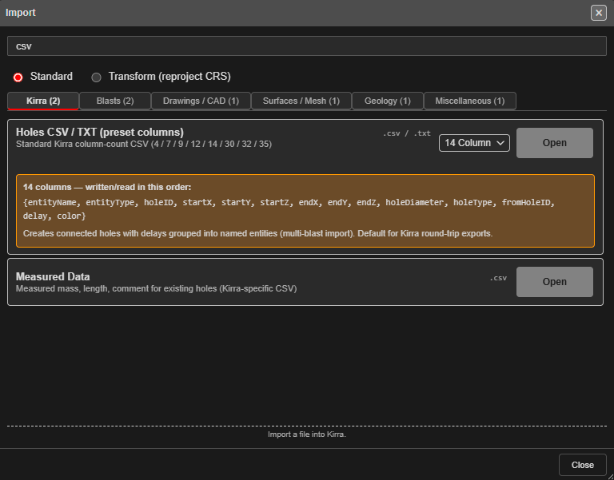
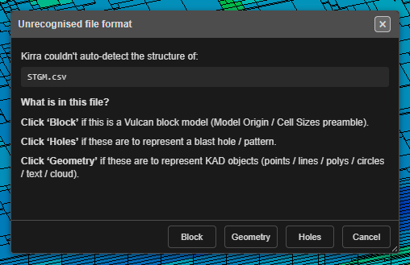
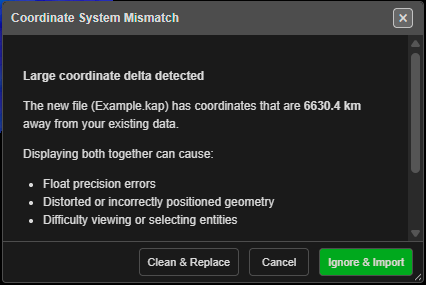

# The Import Dialog

Every file Kirra reads comes in through the **Import** dialog, or by dropping the file onto
the Kirra window. This page covers the dialog itself and the checks Kirra makes on every
import. Each format has its own page, linked from the table below.

---

## Open the Import dialog

- Click the **Import Export Print** button (the file icon) in the top bar and choose
  **Import**, or
- Open the left side panel (☰), and under **File Management** click **Import**.

If the dialog is already open, Kirra brings it to the front.

---

## Find your format

The formats are grouped into tabs. Each tab shows how many formats it holds.

| Tab | Formats | Details |
|---|---|---|
| **Kirra** | Kirra Application Project, Kirra App Template, Kirra App Drawing, Holes CSV / TXT (preset columns), Measured Data | [Kirra files](other-formats.md#kirra-files), [CSV Import](csv-formats.md) |
| **Blasts** | Custom CSV, CBLAST, Orica ShotPlus, Davey BPD, DetNet ViewShot, DetNet DigiShot / ParVS3, Paradigm Terra | [Blast Design Formats](blast-formats.md), [CSV Import](csv-formats.md#custom-csv-import) |
| **Drawings / CAD** | Geometry CSV, DXF, DWG (experimental), Vulcan ARCH_D, Vulcan Design Database, Surpac, Micromine STR, Deswik DUF, 12d Archive | [DXF](dxf.md), [Surpac](surpac-dtm-str.md), [Other CAD Formats](cad-formats.md) |
| **Surfaces / Mesh** | GeoTIFF / Image, OBJ / GLTF, Point Cloud, LAS Point Cloud, Vulcan .00t Triangulation, Datamine Surface | [Surfaces and Point Clouds](surfaces-and-point-clouds.md), [3D Mesh](3d-mesh.md) |
| **Geology** | Block Model — Datamine, Vulcan CSV, Vulcan BMF, Micromine | [Importing Block Models](../block-models/importing-block-models.md) |
| **Miscellaneous** | Borehole Telemetry, Epiroc Surface Manager, Wenco NAV, KML / KMZ, ESRI Shapefile | [Other Formats](other-formats.md) |
| **Legacy** | Datavis DBS, ShotPlan 3 | [Legacy formats](other-formats.md#legacy-formats) |

Click **Open** on a row — or anywhere on the row — and pick the file. Some rows have a
drop-down to choose a variant first, such as the Surpac row's **STR holes**, **STR** and
**DTM & STR**.

### Search

Type in **Search formats or extensions…** to filter every tab at once by name, description
or extension. Tabs with no match are hidden, and the counts show the matches.

### Standard and Transform

**Standard** lists every format. **Transform (reproject CRS)** lists only the formats that
can convert coordinates from another system as they import — see
[Transform (Reproject) Import](transform-import.md).

### Legacy formats

The **Legacy** tab reads files from software no longer in use, so you can open historic
blasts. Each row is marked as legacy.

### When the import finishes

A successful import closes the dialog. If something
went wrong, the dialog stays open with the message above the list — amber for a warning,
red for an error — so you can try another file or format.

---

## Drag and drop

You can drop files anywhere on the Kirra window instead of using the dialog. Kirra works
out the format from the file.

- **Several files at once.** Files that belong together are kept together: a Surpac `.str`
  and `.dtm` with the same name, a Datamine points and triangles pair, an `.obj` with its
  `.mtl` and images, and a Vulcan `.dgd.isis` with its `.isix`. Other files are imported
  one at a time.
- **CSV and TXT files** could hold blast holes, drawing geometry or a block model, so
  Kirra always asks:

  

  **Holes** opens the [Custom CSV](csv-formats.md#custom-csv-import) column mapping,
  **Geometry** the [Geometry CSV](cad-formats.md#geometry-csv) mapping, and **Block** the
  [block model](../block-models/importing-block-models.md) import.
- **A file Kirra does not recognise** is ignored, and the status bar says so.
- **Dropped files are never reprojected.** Use the Transform view of the dialog for that.

A few formats import more fully by one route than the other — each format's page says
when.

---

## Checks on import

Kirra checks new data before adding it, so a wrong file or a second copy does not quietly
spoil a design. Which checks run depends on the format.

### Coordinate check

If the new data is **100 km or more** from what is already loaded, the two are probably in
different coordinate systems. **Coordinate System Mismatch** asks what to do:

| Button | Result |
|---|---|
| **Ignore & Import** | Import anyway, alongside the existing data |
| **Clean & Replace** | Clear the existing data, then import |
| **Cancel** | Stop the import |

### Duplicate blast

If at least half of an incoming blast's hole IDs already exist, **Duplicate Hole Import
Detected** asks **How would you like to handle this?**:

- **Rename** the incoming blast (recommended), or
- **Skip exact duplicates** — drop incoming holes whose blast and hole ID already exist, or
- **Cancel the whole import**.

Click **Apply**, or **Cancel Import**.

### Holes on top of holes

If an incoming hole lands on top of an existing hole, **Hole Proximity Warning** offers
**Skip** (leave this hole out), **Ignore** (import it anyway), **Skip All** or **Cancel**. For a whole blast at once, the batch version
offers **Skip overlapping**, **Continue all** or **Cancel**.

---

## Related topics

- [Supported File Formats](../reference/supported-formats.md) — the full import and export
  list
- [Interface Tour — Import Dialog](../getting-started/interface-tour.md#import-dialog)
