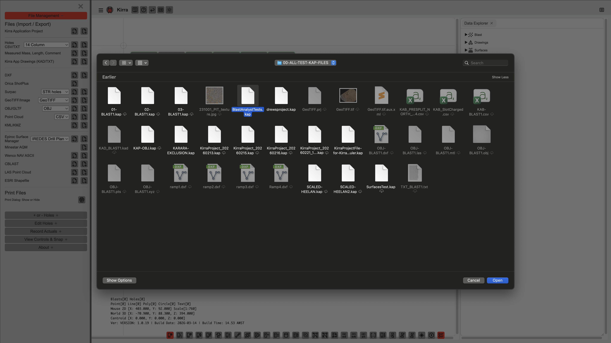
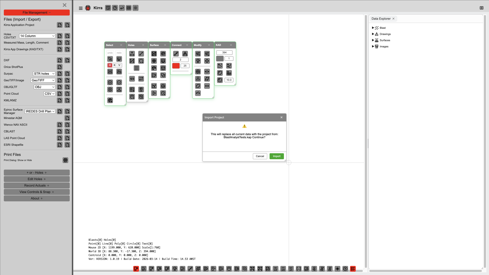

# Other Import Formats

Kirra supports a wide range of additional import formats beyond CSV, DXF, Surpac, and 3D meshes.

---

## IREDES XML (Epiroc)

Import drill plans from Epiroc drill rigs using the IREDES (Intelligent Rock Excavation Data Exchange Standard) XML format.

> **Coordinate Warning:** IREDES XML uses X for Northing and Y for Easting (opposite of standard convention). Kirra automatically swaps these on import.

---

## Maptek Vulcan ARCH_D *(new in v1.0.73)*

Import Vulcan design files in the text-based `FMT_4` ARCH_D format (`.arch_d`). The parser reads:

- **POLHED blocks** — either a **blast hole** (2 or 3 points sharing X/Y, with Link MVAR data) or a **KAD polyline** (polylines with `Attr_len` / `Attr_tem` attribute templates are treated as polylines, not holes)
- **TXTHED blocks** — text annotations, with font name preserved where present
- **Layer line** — the layer name becomes the imported entity name (falls back to `VULCAN_IMPORT`)

**Blast-hole geometry:** 3-point holes are interpreted as `collar → grade → toe` (sub-drilled); 2-point holes are interpreted as `collar → toe` with no sub-drill. Angle is computed from vertical (Kirra convention: 0° = vertical) and bearing from north clockwise.

**Summary metadata:** Where the file contains a Vulcan-style summary TXTHED (e.g. `Diameter: 0.076m`, `Burden:`, `Spacing:`), those values are extracted and applied to every imported hole. Otherwise the default hole diameter is 115 mm.

**Colours:** A small Vulcan index-palette (1 = red, 2 = green, 3 = blue, 5 = yellow, 23 = white, 220 = orange, 420 = cyan, 720 = magenta) is recognised; all other indices fall back to white.

**Round-trip:** Export is supported via `VulcanArchDWriter` so Kirra-authored files are readable by Vulcan and re-importable here.

---

## Orica ShotPlus SPF

Import blast hole data from Orica ShotPlus `.spf` files. The SPF format is a ZIP archive containing XML blast data. Import only -- export is not supported.

---

## Orica CBLAST CSV

Import CBLAST CSV files, which use 4 records per hole (HOLE, PRODUCT, DETONATOR, STRATA). Kirra parses the multi-record structure and consolidates it into standard blast hole objects with full charging data (decks, primers).

> **Product Name Matching:** CBLAST files contain product names (e.g. "ANFO 0820", "Stemming") but not product properties like density, VOD, or energy. To get accurate mass calculations, powder factor, SDoB, and other analytics, import a Kirra Charge Config ZIP that contains a `products.csv` with matching product names. **Product names in the CBLAST file must match exactly** (case-sensitive) with names in your charge config products — for example, if your CBLAST uses "ANFO 0820", your products.csv must also have "ANFO 0820", not "ANFO" or "Anfo 0820".

---

## KML / KMZ (Google Earth)

Import blast holes and geometry from Google Earth KML or KMZ files. Supports Placemarks with ExtendedData, polylines, polygons, and 3D geometry with altitude.

---

## Shapefile (ESRI)

Import ESRI Shapefiles (`.shp` with accompanying `.shx`, `.dbf`, and `.prj` files). Supports Point, PolyLine, and Polygon geometry types with Z variants.

---

## LAS / LAZ (LiDAR Point Cloud)

Import ASPRS LAS LiDAR files (versions 1.2, 1.3, 1.4). Supports point classification, intensity, RGB, and GPS time.

---

## Point Cloud (XYZ, PTS, PTX, CSV)

Import point cloud files in various text formats:

| Format | Extension | Description |
|--------|-----------|-------------|
| XYZ | `.xyz`, `.txt` | Space-separated X Y Z with optional R G B |
| PTS | `.pts` | Count header + X Y Z Intensity R G B |
| PTX | `.ptx` | Leica scanner format |
| CSV | `.csv` | Comma-separated X,Y,Z with optional R,G,B |

---

## GeoTIFF Imagery

Import georeferenced raster images (`.tif`, `.tiff`). Supports:
- Single-band elevation rasters
- RGB/RGBA imagery (orthophotos, aerial images)
- Geotransform metadata for coordinate mapping

Imported images appear as draped layers in both the 2D and 3D views.

---

## KAP (Kirra App Project)

*Opening a KAP (Kirra App Project) file loads the complete project.*

*Kirra may display a warning if the KAP file was created with a different version.*

Import a complete Kirra project from a `.kap` file. KAP is a ZIP archive containing:

| File | Contents |
|------|----------|
| `manifest.json` | Version, creation date, metadata |
| `holes.json` | All blast hole data |
| `drawings.json` | KAD drawing entities |
| `surfaces.json` | Surface points, triangles, and properties |
| `images.json` | GeoTIFF/imagery metadata |
| `products.json` | Explosive product definitions |
| `charging.json` | Charge configurations and deck data |
| `configs.json` | Application settings |
| `layers.json` | Layer definitions and visibility |
| `textures/` | Texture images for OBJ surfaces |
| `images/` | Imported GeoTIFF imagery |

---

## KAD (Kirra App Drawing)

Import Kirra's native drawing format (`.kad`). Contains point, line, polygon, circle, and text entities with coordinates, colours, and layer assignments.

---

## Wenco NAV

Import Wenco NAV ASCII files (`.nav`) containing TEXT, POINT, and LINE entities for fleet management integration.

---

## Epiroc Surface Manager

Import Epiroc Surface Manager coordinate files (`.geofence`, `.hazard`, `.sockets`, `.txt`). These use Y,X (Northing, Easting) coordinate ordering.

---

## Related Topics

- [CSV Import](csv-formats.md)
- [DXF Import](dxf.md)
- [Surpac DTM/STR](surpac-dtm-str.md)
- [3D Mesh Import](3d-mesh.md)
