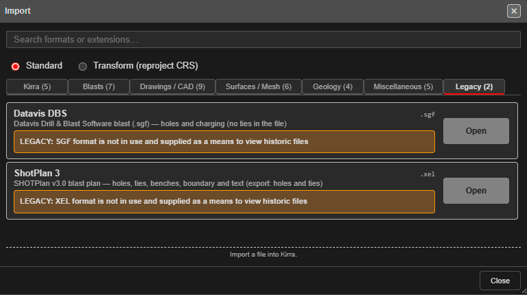

# Other Import Formats

This page covers Kirra's own files, the **Miscellaneous** tab and the **Legacy** tab of the
Import dialog. Other formats have their own pages — see [The Import Dialog](import-dialog.md)
for the full list.

| Looking for | See |
|---|---|
| ShotPlus, CBLAST, Davey, DetNet, Paradigm | [Blast Design Formats](blast-formats.md) |
| Vulcan ARCH_D and Design Database, DWG, Micromine, Deswik, 12d | [Other CAD Formats](cad-formats.md) |
| GeoTIFF, point clouds, LAS | [Surfaces and Point Clouds](surfaces-and-point-clouds.md) |
| IREDES drill plans | [Epiroc Surface Manager](#epiroc-surface-manager) below |

---

## Kirra files

### KAP (Kirra Application Project)

A `.kap` file is a complete Kirra project. It carries **everything**, so the person you
share it with can work exactly as you did:

| What | Includes |
|------|----------|
| **The blast** | Holes, blast groups, trunks and connections, timing constructs and firing groups, charged holes |
| **Drawings and surfaces** | KAD drawings and layers, surfaces (including textured and analysis surfaces), imagery |
| **Libraries** | Explosive products, charge rules, pattern templates, print templates, measured seeds, PPV monitors, block-model colour schemas |
| **Settings** | Your work settings — hole and text sizes, colours, snapping, CSV column order and export preferences, dialog presets and similar |

Settings that belong to **your computer** never travel: theme, language, and your
toolbar and panel layout stay as they are.

#### How the import is applied

1. **Import Project** asks you to confirm. It reminds you that, if you already have data,
   the next step lets you choose between merging and replacing. Click **Import**, or
   **Cancel** to stop.
2. If the project is more than 100 km from the data you already have, Kirra warns that the
   two may be in different coordinate systems — see
   [Checks on import](import-dialog.md#checks-on-import).
3. If your workspace already holds anything, **Import KAP File** asks
   **How should this import proceed?**:

   | Choice | Blast | Libraries | Settings |
   |--------|-------|-----------|----------|
   | **Merge** (the default) | Added to yours | Added to yours | Theirs |
   | **Replace data, merge libraries** | Theirs | Added to yours | Theirs |
   | **Replace data, keep my libraries** | Theirs | Yours, unchanged | Yours, unchanged |
   | **Replace everything** | Theirs | Theirs — yours are removed | Theirs |

   Click **Import**, or **Cancel Import**. An empty workspace is not asked; the project
   simply loads.

In a **Merge**, a hole whose blast name and hole ID you already have is not brought in
again.

When the import finishes, **Import Complete** lists everything that arrived. If the file
brought settings, the summary says so and **Kirra reloads when you click OK** so the
settings take effect — your project is already saved; choose **Continue Previous** to
carry on.

Settings that belong to **your computer** never travel: theme, language, and your toolbar
and panel layout stay as they are.

> **Note:** Project files saved by Kirra before version 1.1.32.112 carry print templates
> **without their spreadsheet**. Kirra skips those and keeps any template of the same name
> you already have. Ask the sender to save the project again, or load the template's
> `.xlsx` in the print dialog and **Save to Library**.

### KAT (Kirra App Template)

Import a **site template** from a `.kat` file. A KAT is everything a KAP carries
**except the blast** — no holes, drawings, surfaces, images, blast groups, trunks,
timing or firing groups. It brings a site's setup: explosive products, charge rules,
pattern and print templates, measured seeds, PPV monitors and parameters, colour
settings and work settings.

**Into an empty workspace**, the template simply loads. Nothing is asked.

**If the workspace already has anything in it** — a blast, drawings, surfaces, or
libraries such as products and templates — Kirra offers two choices:

- **Merge** — add the template's libraries to yours. Nothing of yours is lost, and your
  blast, drawings and hole-label edits are left alone.
- **Start Fresh** — clear the workspace completely, then load the template. This removes
  **everything** in the workspace first: holes, drawings, surfaces, products, charge
  rules, pattern and print templates, and colour schemas. Use it to set a workspace up
  from scratch for a site.

A template never reloads Kirra. Its settings take effect straight away, and a summary
lists everything that arrived.

### KAD (Kirra App Drawing)

A `.kad` (or `.txt`) file holds Kirra drawing entities — points, lines, polygons,
circles and text — with their coordinates and colours.

- The file's drawings go into one drawing layer named after the file; importing a file of
  the same name again creates `name_2` and so on.
- If an entity in the file has the same name as one you already have, its points are added
  to that existing entity.
- To read a KAD file in another coordinate system, use
  **Kirra App Drawing — Transform (reproject CRS)** — see [Transform Import](transform-import.md).

A dropped `.kad` imports directly. A dropped `.txt` asks what it holds instead — use the
**Open** button for a KAD saved as `.txt`.

---

## Miscellaneous

### Borehole Telemetry

Turns a downhole survey — depth, heading and inclination down each hole — into the path the
hole actually took. **Import Borehole Telemetry** asks:

| Setting | What it does |
|---|---|
| Blast / survey name | The name the paths are filed under |
| Hole ID, Depth, Heading, Angle columns | Which columns hold the survey |
| Angle convention | **Inclination (0° = vertical)** or **Dip (−90° = vertical)** |
| Collar position from | **Blast holes, by Hole ID**, **KAD points, by Point ID**, or **Columns in this file** |
| Path reconstruction | **Tangential (Boretrak)**, **Balanced tangential** or **Minimum curvature** |
| Heading offset (°) | Correct the survey heading, for example from magnetic to grid north |
| Line colour, Line width | How the paths are drawn |

Each hole's path becomes a drawing line named `BLAST[HOLE]`, in the **Telemetry** layer
with a sub-layer per blast. A report lists any holes whose collar could not be found. The
paths can then be used to measure burden on the drilled hole in the
[Hole Section View](../reference/section-views.md#hole-section-view).

Use the **Open** button — a dropped CSV asks what it holds, and telemetry is not one of the
choices.

### Epiroc Surface Manager

Reads Epiroc rig files. Choose the type in the row's drop-down:

| Choice | File | Creates |
|---|---|---|
| **IREDES Drill Plan** (default) | `.xml` | Blast holes, in a blast named after the file, with rows worked out automatically |
| **Geofence** | `.geofence` | Closed polygons |
| **Hazard** | `.hazard` | Closed polygons |
| **Socket** | `.sockets` | Points |

For geofences, hazards and sockets Kirra asks for the **Elevation (Z)** to place them at.
IREDES files store coordinates Y before X; Kirra swaps them.

A dropped `.xml` is read as an IREDES drill plan.

### Wenco NAV

Reads Wenco fleet management NAV files (text format). Text, points and lines become
drawings named after the file; triangle records become a surface. Binary NAV files are not
supported — export text NAV from Wenco.

### KML / KMZ

Reads Google Earth files. **Import KML/KMZ** asks:

| Setting | What it does |
|---|---|
| **Import As:** | **Blast Holes** or **Geometry (KAD)** |
| **Target Coordinate System:** | For latitude / longitude files: keep them, or project to an EPSG grid |
| **Default Values:** | The elevation to use where the file has none, and the blast name |

Hole details can be carried in a placemark's description as `{key:value}` pairs.

### ESRI Shapefile

Reads shapefiles: select the `.shp` together with its `.shx`, `.dbf`, `.prj` (and
`.cpg`) files, or a `.zip` holding them. Dropping the files — or the `.zip` — onto the
canvas works too. Points, multipoints, polylines and polygons are read, with their Z and M
variants; multipatch shapes are skipped.

**Import ESRI Shapefile** offers a projection for latitude / longitude files and a
**Master RL Offset (Optional)** to raise or lower everything by a fixed elevation.

---

## Legacy formats

### Datavis DBS (legacy)

> **Legacy format.** Datavis Drill & Blast Software `.sgf` files are no longer in use. Kirra reads them so that historic blasts can still be viewed. The Import dialog marks the row with an amber **LEGACY** note.

**Import ▸ Legacy ▸ Datavis DBS**, or drag a `.sgf` file onto the canvas. Import only.

| What is in the file | What Kirra makes of it |
|---|---|
| Blast holes | Blast holes in one blast named after the file. Hole ID, collar, toe, length, angle, bearing, diameter, burden, spacing and subdrill come straight across. The first word of the hole's design rule (for example **BUS** or **MPSS**) becomes its hole type |
| Decks | The hole's charging, collar to toe: stemming, air and explosive decks with their products and lengths |
| Primers | Each primer at its depth, with its booster and its downhole detonator and delay |
| Products | Added to the **Product Manager** with the density the file gives them, and the delay of each detonator. A product you already have with the same name is reused |
| Drill designs | A blast that was never charged imports its holes only, with hole type **Undefined** |

The import summary lists how many holes were charged and how many primers came in.

#### Primers the file places wrongly

Some files place the primers of holes with an air deck far below the hole, sometimes hundreds or thousands of metres down. This is an error in the file, not in the design. Kirra works out where each of those primers was designed to sit from the hole's decks, and puts it there.

A primer always ends up in an explosive deck. If the file places one just outside the charge (on a short toe charge, for example), Kirra moves it 5 mm inside the charge. The import summary counts the primers moved in either way.

#### No surface ties

The files hold no surface ties and no firing times. Each hole has its downhole detonator delay only, so the holes all fire on that delay. Tie the blast up in Kirra to time it.

#### Not imported

- Surface ties and firing times — the files hold none.
- Booster mass. Set it on the booster in the **Product Manager**.
- Surfaces and other drawing objects in the file.

---

### ShotPlan 3 (legacy)

> **Legacy format.** SHOTPlan v3.0 `.xel` files are no longer in use. Kirra reads them so that historic blast plans can still be viewed. The Import dialog marks the row with an amber **LEGACY** note.

**Import ▸ Legacy ▸ ShotPlan 3**, or drag a `.xel` file onto the canvas.

| What is in the file | What Kirra makes of it |
|---|---|
| Blast holes | Blast holes in one blast named after the plan's title (or the file name). Collar, diameter, length, angle from vertical and bearing come straight across. Hole numbers are kept, so ties still line up |
| Dummy holes | 0 m holes of type **Dummy** — a position with no hole drilled |
| Deleted holes | Skipped |
| Surface ties | Hole-to-hole ties, each with its delay. Where several ties reach one hole, the one whose signal arrives first is kept |
| Benches | A crest line and a toe line per bench, as drawings |
| Boundary | A closed polygon, as a drawing |
| Text | Text drawings, all in one entity |

Rows, positions, burden and spacing are worked out by Kirra after the holes arrive, the same as for any other imported blast.

#### Tie delays and colours

A ShotPlan plan names its surface connectors (`TLD 42`, `CD 17`, `MSC 175`) rather than storing their delays, so Kirra reads the delay from the name. A tie whose connector name carries no delay — detonating cord, or a millisecond downhole delay used on the surface — is imported at **0 ms** and listed in the import summary, so you can set it yourself.

Each tie is coloured:

1. **From your product library** — if a surface connector in your library has the same delay, the tie takes that product: its colour and its link to the product.
2. **Otherwise by delay** — 0 ms MediumVioletRed, 9 ForestGreen, 17 Gold, 25 Crimson, 33 DarkGrey, 42 LightSlateGrey, 50 RosyBrown, 65 RoyalBlue, 100 Orange, 125 Wheat, 150 Khaki, any other delay Indigo.

A 0 ms tie is never matched to a library product: 0 ms only comes from a connector whose delay could not be read.

#### Elevations

Many ShotPlan plans have no collar elevations. Those collars come in at **0 m**, and the import summary says how many. Set them afterwards, for example with **Assign Collar Elevation**.

#### Not imported

- Charging. The plan's decking table is not read.
- Downhole (in-hole) delays.
- Pattern definitions — the holes they made are imported; the pattern record is not.

---

## Related topics

- [The Import Dialog](import-dialog.md)
- [Supported File Formats](../reference/supported-formats.md)
- [CSV Import](csv-formats.md)
