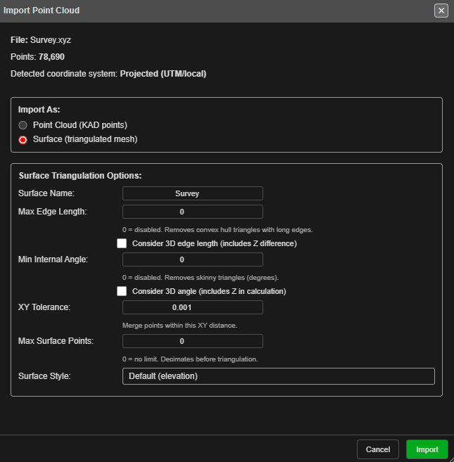
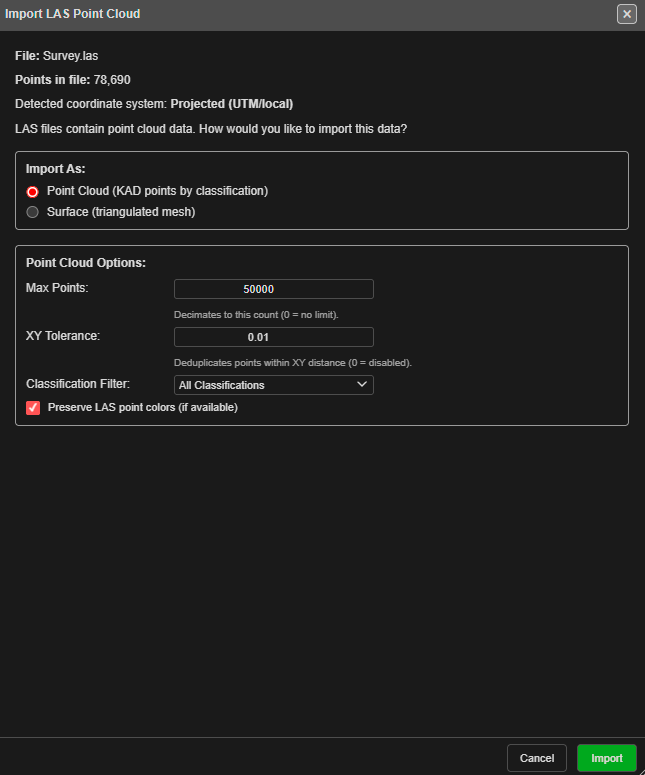

# Surfaces and Point Clouds

The **Surfaces / Mesh** tab of the Import dialog brings in terrain and survey data:
georeferenced images and elevation grids, point clouds, LiDAR, and triangulated
surfaces from Vulcan and Datamine.

| Row | Extensions | Becomes |
|---|---|---|
| [**GeoTIFF / Image**](#geotiff--image) | `.tif` / `.tiff` | An image, or an elevation surface |
| [**OBJ / GLTF**](3d-mesh.md) | `.obj` / `.gltf` / `.glb` | A surface (see [3D Mesh Import](3d-mesh.md)) |
| [**Point Cloud**](#point-cloud) | `.xyz` / `.csv` / `.pts` / `.ptx` | Points, or a surface built from them |
| [**LAS Point Cloud**](#las-point-cloud) | `.las` | Points by classification, or a surface |
| [**Vulcan .00t Triangulation**](#vulcan-00t-triangulation) | `.00t` | A surface |
| [**Datamine Surface**](#datamine-surface) | `.dm` (pt + tr) | A surface |

Surpac `.dtm` / `.str` and DXF `3DFACE` surfaces are on the **Drawings / CAD** tab — see
[Surpac DTM / STR](surpac-dtm-str.md) and [DXF Import](dxf.md).

---

## GeoTIFF / Image

Imports a georeferenced `.tif` or `.tiff`. What you get depends on the file:

- **Imagery** (three or more colour bands — an orthophoto or aerial image) becomes an
  image, drawn as a flat plane at one elevation in 3D and under your design in 2D.
- **Elevation** (one band — a DEM) becomes a triangulated surface. Very large rasters are
  sampled down to about a million points; empty cells are skipped.

Kirra decides from the file itself, whichever choice the row's drop-down shows.

**Latitude / longitude files.** If the image is in latitude and longitude, Kirra asks for
the coordinate system to convert it to, in **Coordinate System Conversion Required**:
choose an **EPSG Code:** (filter with **Southern UTM**, **Northern UTM** or **Non-UTM**),
or paste a **Custom Definition (Proj4 / WKT)**, and click **Transform**. Projected files
import without asking.

> A latitude / longitude image is converted by its corners, so it is stretched to fit
> rather than warped. Over a mine site the difference is small.

---

## Point Cloud

Imports a text point cloud: one point per line, X Y Z, optionally followed by colour.

| File | Layout |
|---|---|
| `.xyz` / `.txt` | X Y Z separated by spaces, optional R G B |
| `.csv` | X,Y,Z, optional R,G,B |
| `.pts` | A count line, then X Y Z intensity R G B |
| `.ptx` | A Leica scan, with its scanner position applied |
| `.ply` (text) | The vertices only |

After you pick the file, the **Import Point Cloud** dialog asks how to bring it in:

| Setting | What it does |
|---|---|
| **Import As:** | **Surface (triangulated mesh)** — the default — or **Point Cloud (KAD points)** |
| **Coordinate Transformation:** | Shown for a latitude / longitude file: **Keep as WGS84**, or **Transform to projected coordinates** with an **EPSG Code:** or **Custom Proj4:** |
| **Max Points:** | Point clouds: thin the cloud to this many points. 0 keeps them all |
| **XY Tolerance:** | Points closer than this in plan are treated as one |
| **Surface Name:** | The name of the new surface |
| **Max Edge Length:** | Surfaces: remove triangles with an edge longer than this — the long, thin triangles that bridge gaps and the outside of the cloud. 0 for no limit |
| **Min Internal Angle:** | Surfaces: drop sliver triangles thinner than this angle. 0 for no limit |
| **Max Surface Points:** | Surfaces: thin the cloud to this many points first. 0 keeps them all |
| **Surface Style:** | The surface's starting colours: Default (elevation), Hillshade, Viridis, Turbo, Parula, Cividis or Terrain |

Click **Import**. A surface is built in the background (**Creating Surface**). Point
clouds are coloured by elevation, blue low to red high.

Text files over 50 MB are read in pieces, under a **Reading large point cloud** progress
bar, so a large survey does not run the browser out of memory.

> A dropped `.csv` or `.txt` file asks whether it holds holes, geometry or a block model;
> use the **Point Cloud** row for a point cloud in CSV.

---

## LAS Point Cloud

Imports an ASPRS LiDAR `.las` file (versions 1.2 to 1.4). Compressed `.laz` files are not
supported — convert them to `.las` first.

The **Import LAS Point Cloud** dialog offers:

| Setting | What it does |
|---|---|
| **Import As:** | **Point Cloud (KAD points by classification)** — the default — or **Surface (triangulated mesh)** |
| **Classification Filter:** | **All Classifications**, or ground, vegetation, buildings or unclassified points only |
| **Max Points:** / **XY Tolerance:** | As for a point cloud |
| **Preserve LAS point colors (if available)** | Use the scanner's colours |
| **Max Surface Points:** | Surfaces: thin to this many points first. 500,000 is recommended for 3D |
| **Surface Style:** | As for a point cloud, plus **LAS Point Colors** |

**Ground Only** with **Surface** is the quick way to a bare-earth terrain from a LiDAR
survey.

A point cloud shows a preview of up to 500,000 points; Kirra reports how many points it
imported and how many are in the preview.

---

## Vulcan .00t Triangulation

Imports a Maptek Vulcan triangulation (`.00t`, one file). The surface keeps the colour
stored in the file, if it has one.

If the surface has more triangles than the 3D limit (2,000,000 by default — set on the
**Performance** tab of **Settings**), the **Large Surface** dialog offers:

| Choice | Result |
|---|---|
| **Render in 3D** | Draw it in full anyway |
| **Decimate** | Reduce it to **Target triangles:** |
| **Adjust Settings** | Open the setting to raise the limit |
| **2D Only** | Draw it in 2D, but not in 3D |

---

## Datamine Surface

A Datamine wireframe is two `.dm` files: points and triangles. Select **both** together
(hold **Ctrl**, or **Cmd** on a Mac). With only one, Kirra says the wireframe needs both
files. Kirra tells the two apart by their content, not their names.

When you drop the pair on the canvas instead, they are matched by name: `…pt.dm` with
`…tr.dm`.

---

## Drag and drop

Every format on this page can also be dropped onto the canvas, except `.csv` and `.txt`
(which ask what the file holds). Dropping never reprojects — use the Transform rows for
that.

---

## Related topics

- [The Import Dialog](import-dialog.md)
- [3D Mesh Import](3d-mesh.md)
- [Transform (Reproject) Import](transform-import.md)
- [Importing Surfaces](../surfaces/importing-surfaces.md)
- [3D View — performance tips](../reference/3d-tools.md#performance-tips)
