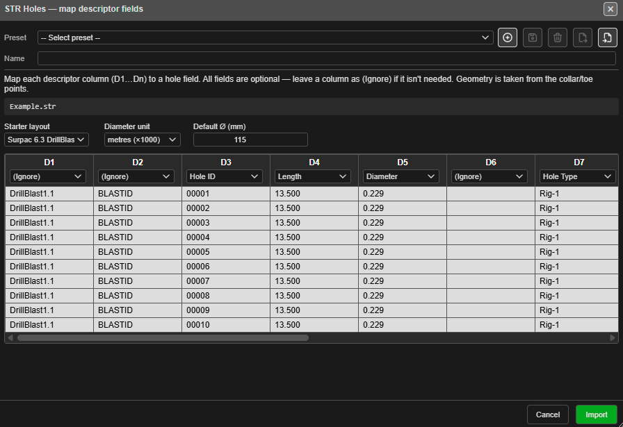
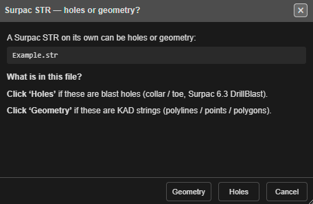

# Surpac STR / DTM Import

Kirra reads Surpac string (`.str`) and DTM (`.dtm`) files three ways: string files as
**blast holes**, string files as **drawings**, and a DTM with its string file as a
**surface**. All three are on the **Surpac** row of the Import dialog's
**Drawings / CAD** tab.

---

## How to import

1. Open the **Import** dialog and choose the **Drawings / CAD** tab — see
   [The Import Dialog](import-dialog.md).
2. On the **Surpac** row, choose from the drop-down:

   | Choice | Reads | Creates |
   |---|---|---|
   | **STR holes** (default) | A `.str` of drill holes | Blast holes |
   | **STR** | A `.str` of strings | Drawings (KAD lines, polygons and points) |
   | **DTM & STR** | A `.dtm` and its `.str` | A surface |

3. Click **Open** and select the file(s).

If the data is more than 100 km from what is already loaded, Kirra warns that the
coordinate systems may not match — see [The Import Dialog](import-dialog.md#coordinate-check).

---

## STR holes

Each hole in the string file is a collar point and a toe point. Surpac stores extra
information about each point in its **descriptor** fields (D1, D2 …), and different sites
put different things there — so Kirra asks what each one holds.

The **STR Holes — map descriptor fields** dialog lists every descriptor column with the
first rows of the file. For each, choose what it is: **Hole ID**, **Length**, **Diameter**,
**Subdrill**, **Dip**, **Angle**, **Bearing**, **Burden**, **Spacing**, **Hole Type**, or
**(Ignore)**.

*The **Surpac 6.3 DrillBlast** starter layout maps D3 to Hole ID, D4 to Length, D5 to Diameter and so on. Save your own mapping with the preset bar at the top.*

| Setting | What it does |
|---|---|
| **Starter layout** | Fill in the mapping from a common layout: **Survey (10-field)**, **Survey (5-field)** or **Surpac 6.3 DrillBlast** |
| **Diameter unit** | Whether the diameter descriptor is in **metres (×1000)** or **millimetres** |
| **Default Ø (mm)** | The diameter for holes with no diameter descriptor |

Click **Import**. The holes form one blast named after the file. If any land on top of
existing holes, Kirra asks what to do with them. Kirra reports how many holes it imported.

---

## STR (drawings)

Each string becomes a drawing entity:

- A string whose first and last points match (within 1 mm) becomes a closed **polygon**.
- Other strings become **lines**; single points become **points**.
- The name comes from the first descriptor (D1, or D2 when D1 is empty). Unnamed strings
  are called `Line_<string number>_0001`.
- The colour follows the Surpac string number.
- Strings longer than 10,000 points are split into parts.

All of the file's drawings go into one drawing layer named after the file. Text in the
descriptors is kept as point labels; no separate text entities are made.

---

## DTM & STR (surfaces)

A Surpac surface is two files:

| File | Contains |
|------|----------|
| `.str` | The points |
| `.dtm` | The triangles, by reference to those points |

Select **both** together — hold **Ctrl** (**Cmd** on a Mac) and click each. With only one,
Kirra reports **Missing Files**.

All the triangulations in the file are merged into **one surface**, drawn green with the
default elevation colours, in a surface layer named after the `.dtm`. If the surface has
more triangles than the 3D limit, Kirra offers to reduce it.

---

## Coordinate order

Surpac writes coordinates as **Northing (Y), Easting (X), Elevation (Z)** — the reverse of
the usual X, Y, Z. Kirra swaps them on import and export, so the data lands in the right
place without you doing anything.

Kirra reads both text and binary `.str` files.

---

## Drag and drop

You can drop Surpac files onto the canvas:

| Dropped | Result |
|---|---|
| A `.dtm` and `.str` with the **same name** | Imported as a surface |
| A `.dtm` alone | Kirra asks for its companion `.str` |
| A `.str` alone | Kirra asks **Surpac STR — holes or geometry?** — choose **Holes** or **Geometry** |

A Micromine `.str` dropped on the canvas is recognised and imported as Micromine — see
[Other CAD Formats](cad-formats.md#micromine-str).

---

## After import

A Surpac surface can be used for gradient colouring, boolean operations, assigning hole
grades, contours, GeoTIFF export and blast analytics. See
[Importing Surfaces](../surfaces/importing-surfaces.md).

---

## Exporting back to Surpac

In the **Export** dialog's **Surfaces / Mesh** tab, click **Save** on the
**Surpac Surface (STR + DTM)** row. One `.str` and `.dtm` pair is written for each visible
surface.

---

## Troubleshooting

| Problem | Fix |
|---------|-----|
| **Missing Files** | Select both the `.dtm` and the `.str` |
| A dropped `.dtm` is not imported | Drop it together with its `.str`, both with the same name |
| Holes have the wrong diameter | Check **Diameter unit** in the descriptor mapping |
| The data lands in the wrong place | Check the file really is Surpac (Y, X, Z); a Micromine `.str` belongs on the **Micromine STR** row |

---

## Related topics

- [The Import Dialog](import-dialog.md)
- [Other CAD Formats](cad-formats.md)
- [Importing Surfaces](../surfaces/importing-surfaces.md)
- [Coordinate System](../reference/coordinate-system.md)
