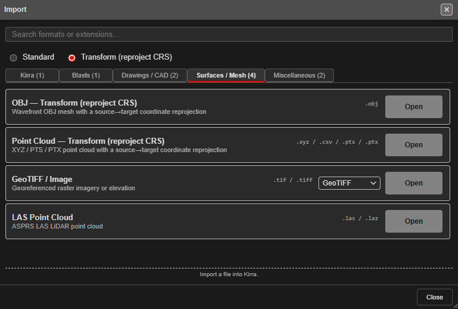

# Transform (Reproject) Import

Use a Transform import when a file is in a **different coordinate system** from your
project — for example a drone survey in latitude / longitude, or drawings on another
mine grid. Kirra converts the file's X and Y from the source system to your project's as
it imports. Z (elevation) is never changed.

---

## Find the Transform formats

At the top of the Import dialog, choose **Transform (reproject CRS)** instead of
**Standard**. The tabs then list only the formats that can be converted:

| Tab | Rows |
|---|---|
| **Kirra** | Kirra App Drawing — Transform (reproject CRS) |
| **Blasts** | Davey BPD |
| **Drawings / CAD** | DXF — Transform (reproject CRS), Geometry CSV — Transform (reproject CRS) |
| **Surfaces / Mesh** | OBJ — Transform (reproject CRS), Point Cloud — Transform (reproject CRS), GeoTIFF / Image, LAS Point Cloud |
| **Miscellaneous** | KML / KMZ, ESRI Shapefile |

The rows named **— Transform (reproject CRS)** ask for both coordinate systems. The others
(Davey BPD, GeoTIFF / Image, LAS Point Cloud, KML / KMZ, ESRI Shapefile) already handle
their own conversion when they import, and appear here so you can find them in one place.

Switching between **Standard** and **Transform** returns you to the first tab.

---

## Import with a transform

1. Choose **Transform (reproject CRS)**, open the tab, and click **Open** on the row.
2. Pick the file.
3. Kirra asks for two coordinate systems:
   - **Source CRS** — the system the file is in.
   - **Target CRS** — your project's system.

   For each, pick an **EPSG** code (filter the list by hemisphere) or paste a Proj4 or WKT
   definition. Both are required.
4. Click **Import** (or **Continue** for a point cloud or geometry CSV, which go on to their
   normal import dialog).

Kirra remembers the last pair you used for each format, so for a regular survey you only
choose them once.

| Row | After the transform |
|---|---|
| **OBJ — Transform** | The OBJ imports as a surface. Select its `.mtl` and images too to keep the texture. Only `.obj` — not GLTF or GLB |
| **Point Cloud — Transform** | Opens the **Import Point Cloud** dialog — see [Point Cloud](surfaces-and-point-clouds.md#point-cloud). Also reads Leica `.ptx` and `.asc` |
| **DXF — Transform** | Imports like a normal DXF; several files can be picked |
| **Geometry CSV — Transform** | Opens the column-mapping dialog |
| **Kirra App Drawing — Transform** | Imports the `.kad` / `.txt` drawing |

---

## Notes

- Any pair of systems works: grid to grid, or latitude / longitude to a projected grid.
- Files dropped onto the canvas are never transformed. Use the Import dialog.
- Only X and Y change. If the two systems use different vertical datums, adjust the
  elevations separately.

---

## Related topics

- [The Import Dialog](import-dialog.md)
- [Surfaces and Point Clouds](surfaces-and-point-clouds.md)
- [3D Mesh Import](3d-mesh.md)
- [Coordinate System](../reference/coordinate-system.md)
