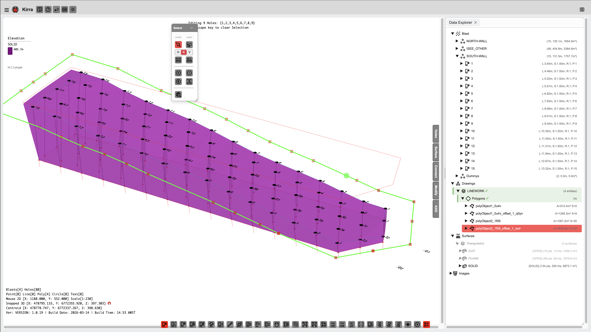

# Drawing Points, Lines, and Polygons

KAD (Kirra App Drawing) entities are the vector drawing objects in Kirra -- points, lines, polygons, text, and circles. They are used for design boundaries, annotations, blast outlines, and input to surface operations like extrude and boolean.



---

## KAD Entity Types

| Type | Description |
|------|-------------|
| **Point** | Single coordinate with colour and marker |
| **Line** | Open polyline (series of connected vertices) |
| **Polygon** | Closed polyline (automatically closes back to the first vertex) |
| **Text** | Text label placed at a coordinate with configurable font height |
| **Circle** | Circle entity with centre point and radius |

---

## Drawing Tools

The KAD drawing tools are available in the floating toolbar on the right side of the canvas.

### Adding Points

1. Select the **Point** tool
2. Click on the canvas to place points
3. Each click creates a new point entity

### Drawing Lines

1. Select the **Line** tool
2. Click to place vertices
3. Each click adds a vertex to the current polyline
4. Press **Escape** to finish the line
5. Press **Backspace/Delete** to remove the last placed vertex

### Drawing Polygons

1. Select the **Polygon** tool
2. Click to place vertices
3. The polygon preview shows the closing edge back to the first vertex
4. Press **Escape** to finish and close the polygon
5. Press **Backspace/Delete** to remove the last placed vertex

### Adding Text

1. Select the **Text** tool
2. Click on the canvas to place the text anchor point
3. Enter the text content in the dialog
4. Text is placed with configurable font height and colour

---

## Entity Properties

Each KAD entity has the following properties:

| Property | Description |
|----------|-------------|
| Entity Name | Group name (related entities share a name) |
| Entity Type | point, line, poly, circle, or text |
| Point ID | Unique identifier for each vertex |
| Coordinates | X (Easting), Y (Northing), Z (Elevation) |
| Colour | Display colour |
| Line Width | Line thickness for lines and polygons |
| Visible | Show/hide toggle |
| Closed | Whether the entity forms a closed shape |

---

## TreeView

KAD entities appear in the TreeView (Data Explorer) with the node ID format:

```
entityType⣿entityName⣿element⣿pointID
```

Right-click a KAD entity in the TreeView for options including:
- Show Statistics (length, area, perimeter, bounding box)
- Move to Layer
- Split Line / Join Lines
- Delete

---

## KAD Statistics

Right-click a KAD entity and select **Show Statistics** to see:

| Entity Type | Statistics |
|-------------|-----------|
| Lines | Vertex count, segment count, total length, bounding box |
| Polygons | Vertex count, segment count, perimeter, enclosed area, bounding box |
| Points | Point count, bounding box, centroid |

---

## Split and Join Lines

Split and Join are available from the **Modify toolbar** as dedicated tools with full dialog support, or from the right-click context menu.

- **Split**: Click the Split button in the Modify toolbar, select a line or polygon, then click on vertices to mark split points. Supports multi-point splitting -- select several vertices before executing the split. See [Modify Toolbar -- Split KAD Lines](modify-tools.md#split-kad-lines) for full details.
- **Join**: Click the Join button in the Modify toolbar, pick two lines, and they are joined end-to-end. Options include weld tolerance, close as polygon, and delete originals. See [Modify Toolbar -- Join KAD Lines](modify-tools.md#join-kad-lines) for full details.

---

## Related Topics

- [Modify Toolbar](modify-tools.md) -- Transform, Offset, Radii, Reorder, Boolean, Join, Split tools
- [Extrude, Boolean, and Section Plane](advanced-tools.md)
- [Interface Tour](../getting-started/interface-tour.md)
- [DXF Export](../exporting/dxf-export.md)
