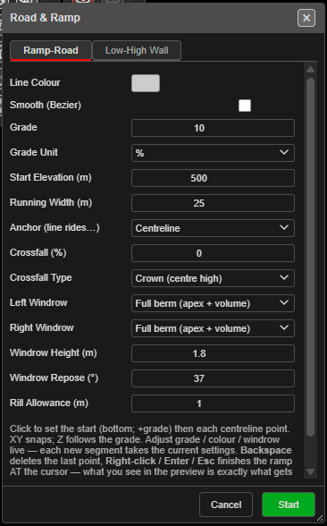
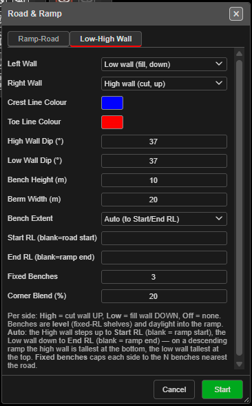

# KAD Toolbar

The **KAD** (Kirra App Drawing) toolbar groups the controls for drawing vector entities — points, lines, polygons, text labels, and circles — and for setting their default drawing properties. It is one of the floating toolbars on the right side of the Kirra workspace.

KAD entities are Kirra's vector drawing layer: design boundaries, annotations, blast outlines, and input to surface operations like extrude and boolean.

---

## Toolbar Overview

*The KAD toolbar with all controls labelled.*

The KAD toolbar contains the following controls:

| Control | Type | Purpose |
|---------|------|---------|
| **Elevation Z** | Input | Z elevation (RL) used when placing new KAD entities |
| **KAD Color** | Picker | Colour applied to new KAD entities |
| **Point and Line Size** | Input | Line width or point size for new entities |
| **Add KAD Points** | Tool | Place point entities by clicking |
| **Add KAD Line** | Tool | Draw an open polyline |
| **Add KAD Polygon** | Tool | Draw a closed polygon |
| **Add KAD Text** | Tool | Place a text label; supports `fx:` formulas |
| **Add KAD Circle** | Tool | Place a circle entity at the click point |
| **Circle Radius (m)** | Input | Radius (m) for the next circle drawn |
| **Roads and Ramps** | Tool | Digitise a graded road / ramp centreline and generate ramp strings *(work in progress)* |

---

## Elevation Z

The Z elevation (reduced level) assigned to new KAD entities. The screenshot shows **532**. All vertices placed by the drawing tools take this Z unless overridden by snap-to-surface or 3D pick.

### How to use

- Click the **Elevation Z** input
- Enter the elevation in metres
- New entities are placed at this Z until you change it

> **Note:** Existing entities are not affected when you change the Elevation Z. Only newly placed vertices use the new value.

---

## KAD Color

The colour applied to new KAD entities. The picker swatch shows the current colour.

### How to use

1. Click the colour swatch
2. Pick a colour
3. New points, lines, polygons, text, and circles use this colour until changed

---

## Point and Line Size

A single field that controls the **line width** for lines, polygons and circles, and the **size** for points. The screenshot shows **1**.

### How to use

- Click the field (tooltip **Point and Line Size**) and enter a whole number from 1 to 1000
- For lines, polygons and circles: line width in screen pixels
- For points: the size of the square point marker in screen pixels (drawn at least 2 pixels wide so a size of 1 stays visible)
- Text is not affected — text size is set separately

---

## Add KAD Points

Places individual point entities at click positions.

### How to use

1. Click the **Add KAD Points** button on the KAD toolbar
2. Click on the canvas to place a point
3. Each click creates a new point entity at the current **Elevation Z**
4. Press `Escape` or change tool to finish

---

## Add KAD Line

Draws an open polyline — a chain of connected vertices.

### How to use

1. Click the **Add KAD Line** button on the KAD toolbar
2. Click to place vertices in sequence
3. Press `Backspace` (or `Delete`) to undo the last vertex
4. Press `Escape` (or double-click) to finish the line

### Notes

- Lines are *open* — they do not close back to the first vertex
- Use **Add KAD Polygon** if you need a closed boundary
- Existing lines can be joined with the [Join KAD Lines](modify-tools.md#join-kad-lines) tool in the Modify toolbar

---

## Add KAD Polygon

Draws a closed polygon — like a line, but the last vertex connects back to the first.

### How to use

1. Click the **Add KAD Polygon** button on the KAD toolbar
2. Click to place vertices
3. Press `Backspace` (or `Delete`) to undo the last vertex
4. Press `Escape` (or double-click) to close the polygon

### Notes

- Polygons are auto-closed — you do not need to click on the first vertex
- Polygons feed [Extrude](advanced-tools.md), [KAD Boolean](modify-tools.md#kad-boolean), and [Radii](modify-tools.md#radii-create-radii-polygons) operations

---

## Add KAD Text

Places a text label at a click point. Text accepts plain strings **and** `fx:` formulas evaluated against hole / pattern data.

### How to use

1. Click the **Add KAD Text** button on the KAD toolbar
2. Click on the canvas to place the text anchor
3. Enter the text in the input that appears
4. Press `Enter` to commit

### Formulas

Text can be calculated as it is placed:

- Text starting with `fx:` is evaluated as a **blast summary formula** — the same engine as the print templates — against the loaded blast data
- Text starting with `=` is evaluated as basic maths

| Text entered | Result |
|---------|--------|
| `fx:sum(holeLength[i])` | Total drilled length of the holes |
| `fx:"Holes: "&count(holeID[i])` | A label such as *Holes: 120* |
| `=5+3` | 8 |
| `=sqrt(16)` | 4 |

If a formula cannot be evaluated, a popup explains the error so you can correct it. Graphic formulas (maps, legends, north arrows) only work in print templates, not in KAD text.

See the [Print Formula Reference](../printing/pdf-print.md) for the full list of variables and functions, and the [Formula Engine](../formula-help/formula-engine.md) page for how the three formula engines differ.

---

## Add KAD Circle

Places a circle entity centred on the click point, with radius set by the **Circle Radius** input.

### How to use

1. Set the radius in **Circle Radius** (see below)
2. Click the **Add KAD Circle** button on the KAD toolbar
3. Click on the canvas to place the circle centre
4. Each click creates a new circle at the current radius

### Notes

- Circles are first-class KAD entities — they survive save/load and export to DXF
- For circular polygons around holes (with control over vertex count and starburst), use [Radii](modify-tools.md#radii-create-radii-polygons) in the Modify toolbar instead

---

## Circle Radius (m)

The radius (in metres) used by the next circle drawn. The screenshot shows **10.0**.

### How to use

- Click the **Circle Radius** input
- Enter the radius in metres
- The next click of **Add KAD Circle** uses this radius

---

## Roads and Ramps

Digitises a graded **road or ramp centreline** and generates ramp strings (crest / toe / batter lines) from it — the start of a haul-ramp design workflow.

> **Work in progress:** this tool is marked as work-in-progress in the current version. Expect its behaviour and options to change.

*The Road & Ramp dialog, Ramp-Road tab.*

*The Low-High Wall tab: per-side cut and fill walls, benches and berms.*

### How to use

1. Click the **Roads and Ramps** button on the KAD toolbar — the **Road & Ramp** dialog opens
2. Set the road on the **Ramp-Road** tab and, if needed, the walls on the **Low-High Wall** tab
3. Click **Start**
4. Click the start point (the bottom of the ramp for a positive grade), then each centreline point — XY snaps, Z follows the grade
5. Right-click, press `Enter` or press `Escape` to finish the ramp at the cursor; **Cancel** discards it

While digitising:

- Hold `Space` to snap each point to a whole-metre elevation
- Press `Backspace` (or `Delete`) to remove the last point
- Changes to grade, colour or windrow apply live — each new segment takes the current settings

The finished strings are created on a layer named **RAMP**. The dialog remembers your last-used settings.

### Ramp-Road tab

| Field | Default | Notes |
|-------|---------|-------|
| **Line Colour** | Cyan | Colour of the road strings |
| **Smooth (Bezier)** | Off | Smooths the centreline |
| **Grade** | 10 | A grade of 0 gives a flat road; a negative grade digitises downhill from the top |
| **Grade Unit** | % | **%**, **degrees** or **1:N** |
| **Start Elevation (m)** | 0 | Elevation of the first point |
| **Running Width (m)** | 25 | Trafficable width |
| **Anchor (line rides…)** | Centreline | Whether your digitised line is the **Centreline**, **Left edge** or **Right edge** |
| **Crossfall (%)** | 0 | Cross slope of the running surface |
| **Crossfall Type** | Crown (centre high) | **None**, **Crown (centre high)**, **Fall left** or **Fall right** |
| **Left Windrow** / **Right Windrow** | Off | **Off**, **Space allowance (flat)** or **Full berm (apex + volume)** |
| **Windrow Height (m)** | 1.8 | |
| **Windrow Repose (°)** | 37 | |
| **Rill Allowance (m)** | 1.0 | |

### Low-High Wall tab

| Field | Default | Notes |
|-------|---------|-------|
| **Left Wall** / **Right Wall** | Off | **High wall (cut, up)**, **Low wall (fill, down)** or **Off** |
| **Crest Line Colour** / **Toe Line Colour** | Yellow / light blue | |
| **High Wall Dip (°)** | 65 | Batter angle of a high wall |
| **Low Wall Dip (°)** | 37 | Batter angle of a low wall |
| **Bench Height (m)** | 10 | |
| **Berm Width (m)** | 10 | |
| **Bench Extent** | Auto (to Start/End RL) | **Auto** steps the high wall up to **Start RL** and the low wall down to **End RL**; **Fixed benches** caps each side to the benches nearest the road |
| **Start RL (blank=road start)** / **End RL (blank=ramp end)** | Blank | |
| **Fixed Benches** | 3 | Used when **Bench Extent** is **Fixed benches** |
| **Corner Blend (%)** | 35 | |

Benches are level shelves that daylight into the ramp.

---

## Related topics

- [Drawing Points, Lines, and Polygons](drawing-tools.md) — extended drawing guide with snapping and editing
- [Modify Toolbar](modify-tools.md) — transform, offset, radii, boolean, join, split
- [Extrude, Boolean, and Section Plane](advanced-tools.md) — 3D operations on KAD entities
- [Select Toolbar](../reference/select-toolbar.md) — selection modes (H / K / V) for KAD
- [Interface Tour](../getting-started/interface-tour.md) — workspace overview
