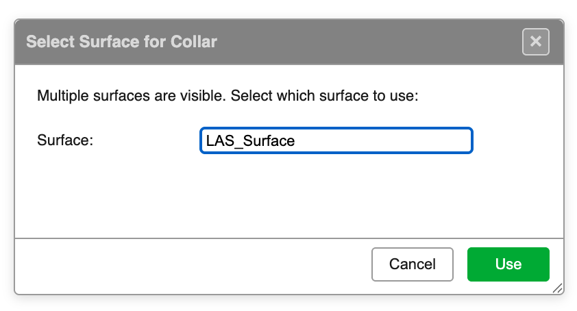
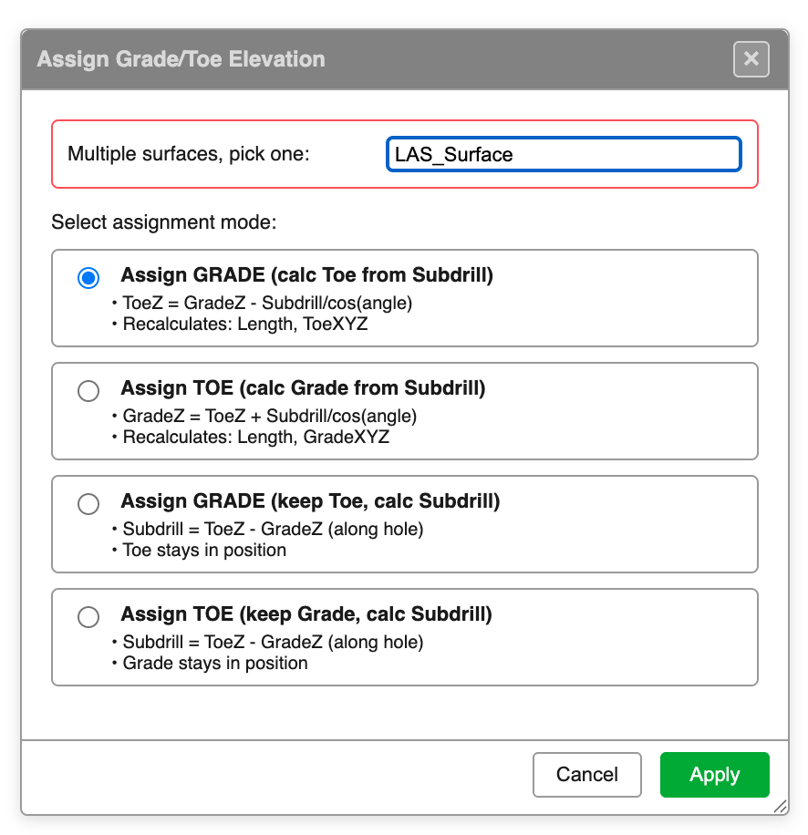
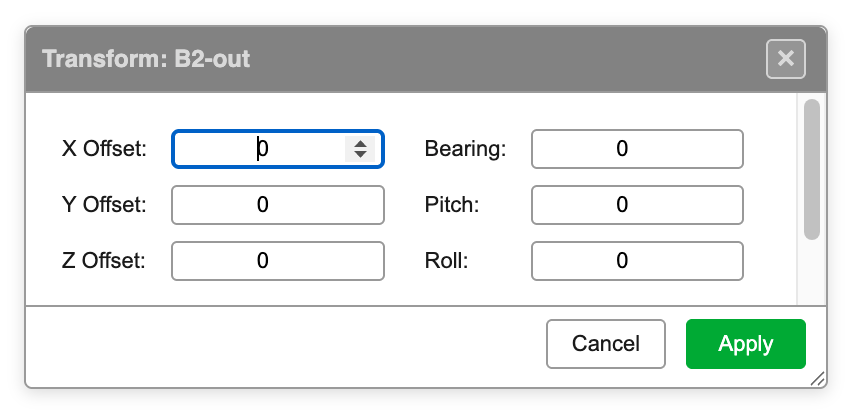
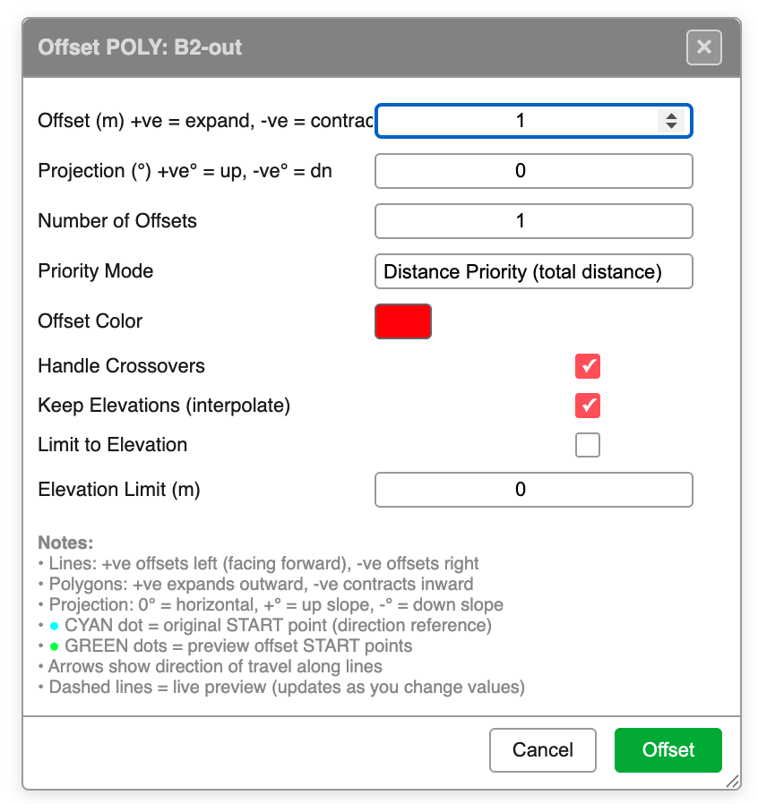
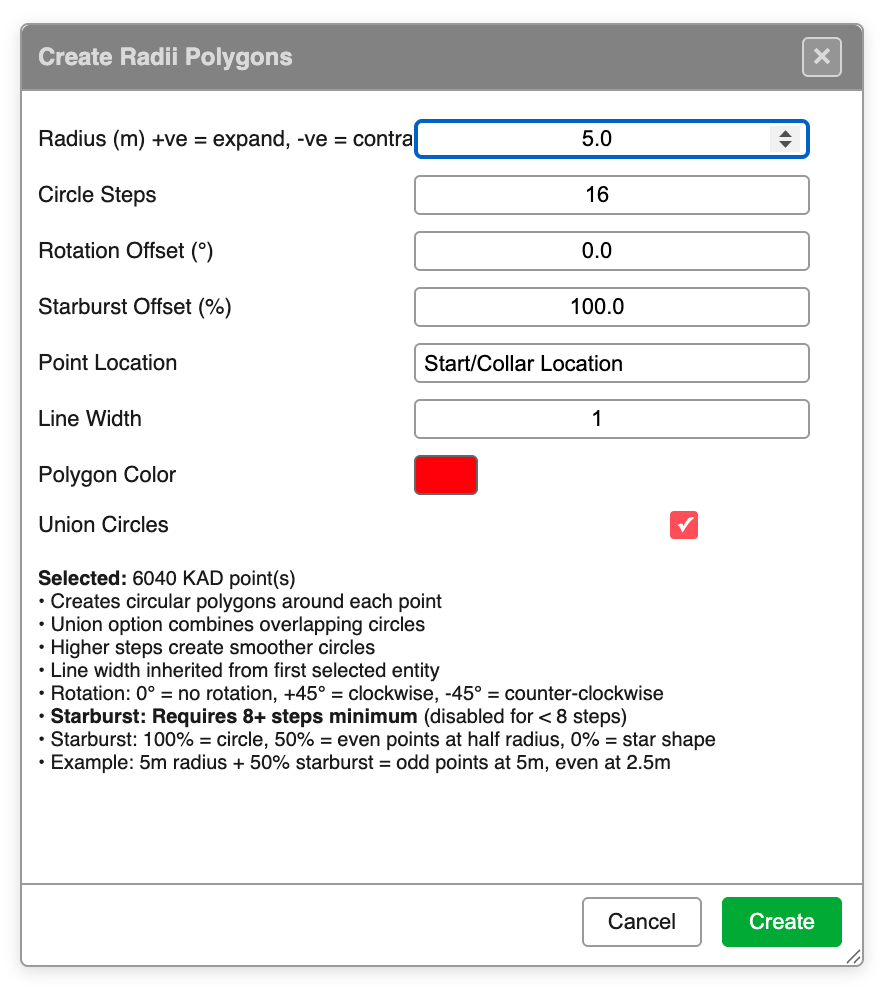
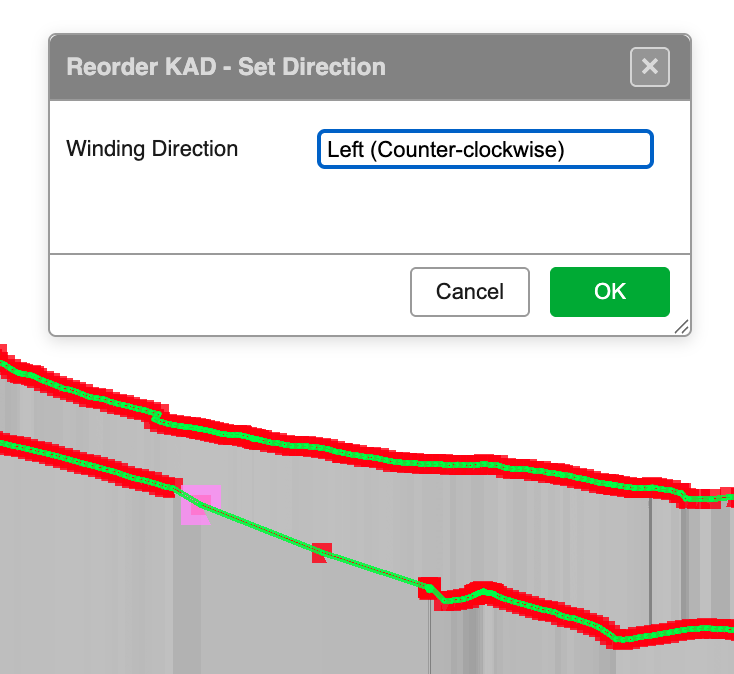
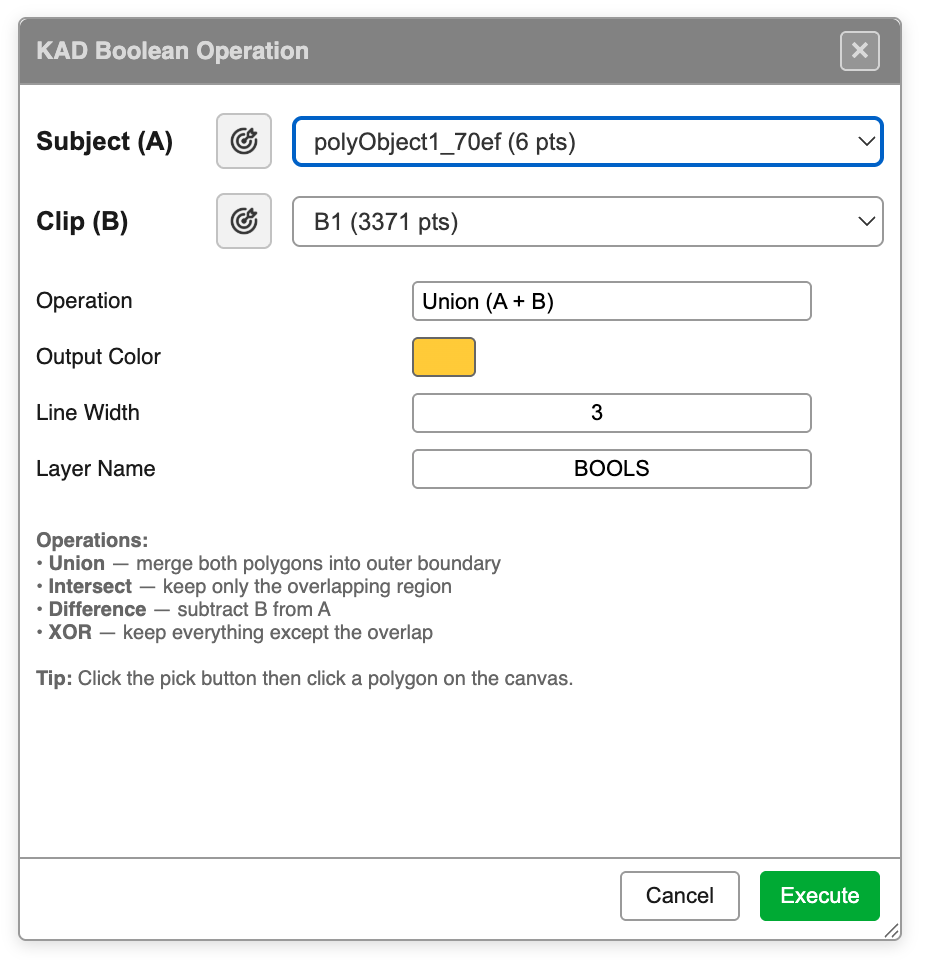
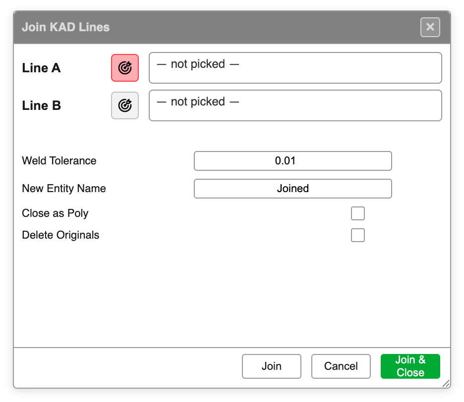
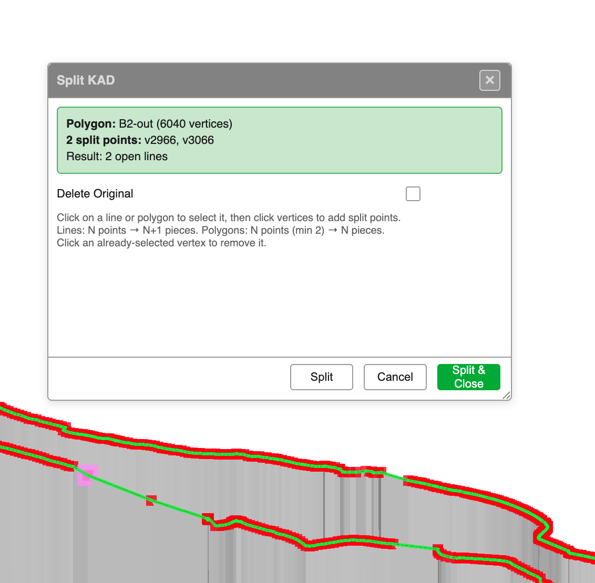

# Modify Toolbar

The Modify toolbar provides tools for transforming, editing, and manipulating blast holes and KAD entities. It is one of the six floating toolbars available on the right side of the Kirra workspace.

---

## Toolbar Overview

The Modify toolbar contains the following tools:

| Tool | Type | Description |
|------|------|-------------|
| **Assign Surface** | Interactive | Set collar elevation from a loaded surface |
| **Assign Grade/Toe** | Dialog | Set grade or toe elevation from a surface with multiple assignment modes |
| **Hole Bearing** | Interactive | Change hole bearing by dragging |
| **Move** | Interactive | Move selected holes or KAD entities |
| **Transform KAD** | Dialog | Translate and rotate KAD entities by offset and bearing/pitch/roll |
| **Offset KAD** | Dialog | Offset lines and polygons inward or outward |
| **Radii** | Dialog | Create circular polygons around selected holes or KAD points |
| **Reorder KAD Points** | Dialog | Change the start vertex and winding direction of lines/polygons |
| **KAD Boolean** | Dialog | 2D boolean operations (union, difference, intersection, XOR) on polygons |
| **Join KAD Lines** | Dialog | Join two lines end-to-end into a single entity |
| **Split KAD Lines** | Dialog | Split a line or polygon at one or more vertices |

---

## Assign Surface (Collar)

Sets the collar (start) elevation of selected blast holes by interpolating Z values from a loaded surface.

### How to Use

1. Select the blast holes to update
2. Click the **Assign Surface** button in the Modify toolbar
3. If multiple surfaces are loaded, a dialog prompts you to choose one
4. Collar Z values are interpolated from the surface at each hole's XY position
5. Hole lengths and toe positions are recalculated

### Notes

- If no surface is loaded, a manual elevation input is offered
- Only visible surfaces appear in the selection list
- XY coordinates remain unchanged; only Z is updated

---

## Assign Grade/Toe Elevation

Sets grade or toe elevation from a loaded surface, with four assignment modes that control how related hole attributes are recalculated.

### Assignment Modes

| Mode | Description | Recalculates |
|------|-------------|-------------|
| **Assign GRADE (calc Toe from Subdrill)** | GradeZ is set from the surface. ToeZ = GradeZ - Subdrill/cos(angle) | Length, ToeXYZ |
| **Assign TOE (calc Grade from Subdrill)** | ToeZ is set from the surface. GradeZ = ToeZ + Subdrill/cos(angle) | Length, GradeXYZ |
| **Assign GRADE (keep Toe, calc Subdrill)** | GradeZ is set from the surface. Toe stays in position. Subdrill = ToeZ - GradeZ (along hole) | Subdrill |
| **Assign TOE (keep Grade, calc Subdrill)** | ToeZ is set from the surface. Grade stays in position. Subdrill = ToeZ - GradeZ (along hole) | Subdrill |

### How to Use

1. Select the blast holes to update
2. Click the **Assign Grade** button in the Modify toolbar
3. Choose a surface (if multiple are loaded)
4. Select the assignment mode
5. Click **Apply**

---

## Hole Bearing

Interactively changes the bearing of selected blast holes by dragging on the canvas.

### How to Use

1. Select the blast holes to update
2. Click the **Hole Bearing** button in the Modify toolbar
3. Click and drag on the canvas to set the bearing angle
4. The bearing is calculated from the drag direction (0° = North, clockwise)

---

## Move

Moves selected blast holes or KAD entities to a new position by dragging.

### How to Use

1. Select the holes or KAD entities to move
2. Click the **Move** button in the Modify toolbar
3. Click and drag on the canvas to move the selection
4. Release to place at the new position

---

## Transform KAD

Translates and rotates selected KAD entities by specified offsets and angles.

### Parameters

| Parameter | Description |
|-----------|-------------|
| **X Offset** | Horizontal (Easting) displacement in metres |
| **Y Offset** | Vertical (Northing) displacement in metres |
| **Z Offset** | Elevation displacement in metres |
| **Bearing** | Rotation about the Z axis (degrees) |
| **Pitch** | Rotation about the X axis (degrees) |
| **Roll** | Rotation about the Y axis (degrees) |

### How to Use

1. Select the KAD entities to transform
2. Click the **Transform KAD** button in the Modify toolbar
3. Enter the offset and rotation values
4. Click **Apply**

---

## Offset KAD

Offsets KAD lines and polygons inward or outward by a specified distance, creating new parallel entities.

### Parameters

| Parameter | Description |
|-----------|-------------|
| **Offset (m)** | Distance to offset. Positive expands (outward for polygons, left for lines), negative contracts |
| **Projection (°)** | Slope angle for offset. 0° = horizontal, positive = up slope, negative = down slope |
| **Number of Offsets** | How many parallel offsets to create (1 or more) |
| **Priority Mode** | Distance Priority (total distance) or other modes |
| **Offset Color** | Color for the new offset entities |
| **Handle Crossovers** | Automatically resolve self-intersections in the offset result |
| **Keep Elevations** | Interpolate Z values from the original entity |
| **Limit to Elevation** | Constrain the offset to a fixed elevation |

### Notes

- Lines: positive offset goes left (facing the direction of travel), negative goes right
- Polygons: positive expands outward, negative contracts inward
- Arrows show the direction of travel along lines
- Dashed lines provide a live preview as you change values
- A cyan dot marks the original start point; green dots mark offset start points
- The dialog remembers the last used parameters between executions

### How to Use

1. Select a line or polygon entity
2. Click the **Offset KAD** button in the Modify toolbar
3. Configure the offset parameters
4. Click **Offset**

---

## Radii (Create Radii Polygons)

Creates circular polygons around selected blast holes or KAD points.

### Parameters

| Parameter | Description |
|-----------|-------------|
| **Radius (m)** | Circle radius. Positive expands, negative contracts |
| **Circle Steps** | Number of vertices in each circle (more steps = smoother) |
| **Rotation Offset (°)** | Rotate the circle. 0° = no rotation, +45° = clockwise, -45° = counter-clockwise |
| **Starburst Offset (%)** | 100% = circle, 50% = even points at half radius, 0% = star shape |
| **Point Location** | Which hole point to use: Start/Collar Location or other options |
| **Line Width** | Width of the polygon outline |
| **Polygon Color** | Color for the generated polygons |
| **Union Circles** | Combine overlapping circles into a single polygon |

### Notes

- Starburst requires 8 or more circle steps (disabled for fewer)
- Starburst example: 5m radius + 50% starburst = odd points at 5m, even points at 2.5m
- Line width is inherited from the first selected entity
- The dialog shows the count of selected KAD points

### How to Use

1. Select blast holes or KAD point entities
2. Click the **Radii** button in the Modify toolbar
3. Configure the radius and options
4. Click **Create**

---

## Reorder KAD Points

Changes the start vertex and winding direction of KAD line and polygon entities. Useful for controlling the direction of offset operations and ensuring consistent polygon winding.

### How to Use

1. Select a line or polygon entity
2. Click the **Reorder KAD Points** button in the Modify toolbar
3. Click on the vertex you want to become the new start point
4. Choose the winding direction: Left (Counter-clockwise) or Right (Clockwise)
5. Click **OK**

### Notes

- The new start point affects where offset operations begin
- Winding direction determines which side is "inside" for polygons
- Useful before running Offset KAD to control the offset direction

---

## KAD Boolean

Performs 2D boolean operations on KAD polygon entities. Supports Union, Intersection, Difference, and XOR operations.

### Parameters

| Parameter | Description |
|-----------|-------------|
| **Subject (A)** | The primary polygon (pick from canvas or dropdown) |
| **Clip (B)** | The clipping polygon (pick from canvas or dropdown) |
| **Operation** | Union (A + B), Intersect, Difference (A - B), or XOR |
| **Output Color** | Color for the result polygon |
| **Line Width** | Width of the result polygon outline |
| **Layer Name** | Target layer for the output |

### Operations

- **Union** -- merge both polygons into the outer boundary
- **Intersect** -- keep only the overlapping region
- **Difference** -- subtract B from A
- **XOR** -- keep everything except the overlap

### How to Use

1. Click the **KAD Boolean** button in the Modify toolbar
2. Click the pick button next to Subject (A) and click a polygon on the canvas
3. Click the pick button next to Clip (B) and click another polygon
4. Select the operation
5. Click **Execute**

---

## Join KAD Lines

Joins two KAD lines end-to-end into a single entity.

### Parameters

| Parameter | Description |
|-----------|-------------|
| **Line A** | First line (pick from canvas) |
| **Line B** | Second line (pick from canvas) |
| **Weld Tolerance** | Maximum distance between endpoints to join (default: 0.01) |
| **New Entity Name** | Name for the joined entity (default: "Joined") |
| **Close as Poly** | Close the result into a polygon |
| **Delete Originals** | Remove the original lines after joining |

### How to Use

1. Click the **KAD Join Lines** button in the Modify toolbar
2. Click the pick button next to Line A and click a line on the canvas
3. Click the pick button next to Line B and click another line
4. Configure options (entity name, close as poly, delete originals)
5. Click **Join** to join and keep the dialog open, or **Join & Close** to join and close

### Notes

- The dialog remembers checkbox states between executions
- Endpoints are automatically matched by proximity

---

## Split KAD Lines

Splits a KAD line or polygon at one or more selected vertices, creating separate entities from the pieces.

### How to Use

1. Click the **KAD Split Lines** button in the Modify toolbar
2. Click on a line or polygon on the canvas to select it
3. Click on vertices along the entity to mark split points
4. Click an already-selected vertex to deselect it
5. The dialog shows a live preview of the split result
6. Optionally check **Delete Original** to remove the source entity
7. Click **Split** to split and keep the dialog open, or **Split & Close** to split and close

### Split Behaviour

| Source Type | Split Points | Result |
|-------------|-------------|--------|
| Line | N points | N+1 open lines |
| Polygon | N points (min 2) | N closed pieces or open lines |

### Notes

- The status banner shows the selected entity name, vertex count, split point count, and expected result
- The dialog remembers the Delete Original checkbox state between executions
- Multi-point split support allows splitting at several vertices in a single operation

---

## Recent Changes (March 2026)

The following improvements were made to the Modify toolbar tools in recent updates:

- **Offset KAD**: The dialog now remembers the last used parameter values (offset amount, projection angle, number of offsets, color, etc.) across executions
- **Split KAD Lines**: Major refactor with multi-point split support -- select multiple vertices before splitting. The dialog remembers checkbox states and provides improved status feedback
- **Join KAD Lines**: The dialog now remembers checkbox states (Close as Poly, Delete Originals) between executions
- **KAD Drawing**: Point ID labels and drawing are now restricted to the selected KAD entity, improving clarity and performance when working with large datasets

---

## Related Topics

- [Drawing Points, Lines, and Polygons](drawing-tools.md)
- [Extrude, Boolean, and Section Plane](advanced-tools.md)
- [Interface Tour](../getting-started/interface-tour.md)
- [Hole Properties Reference](../reference/hole-properties.md)
