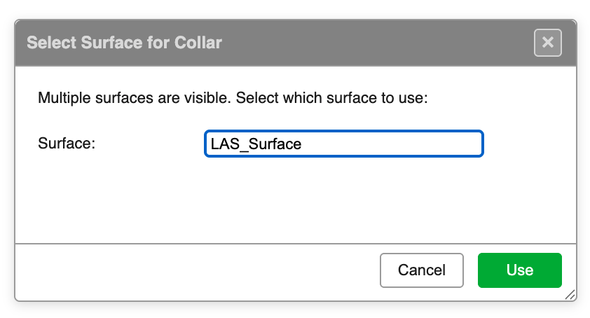
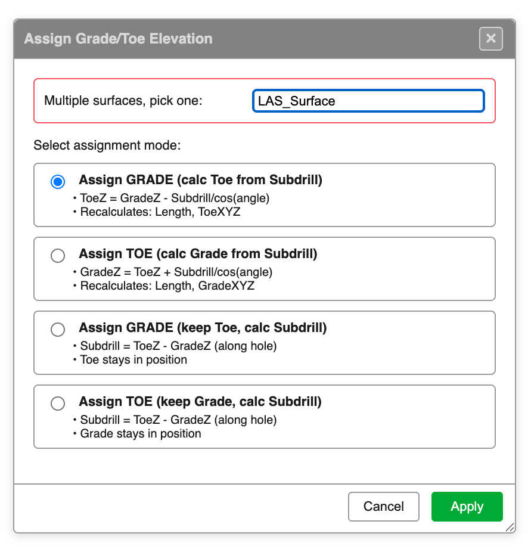
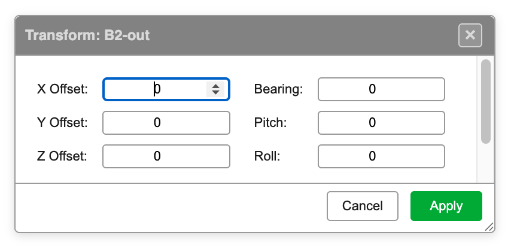
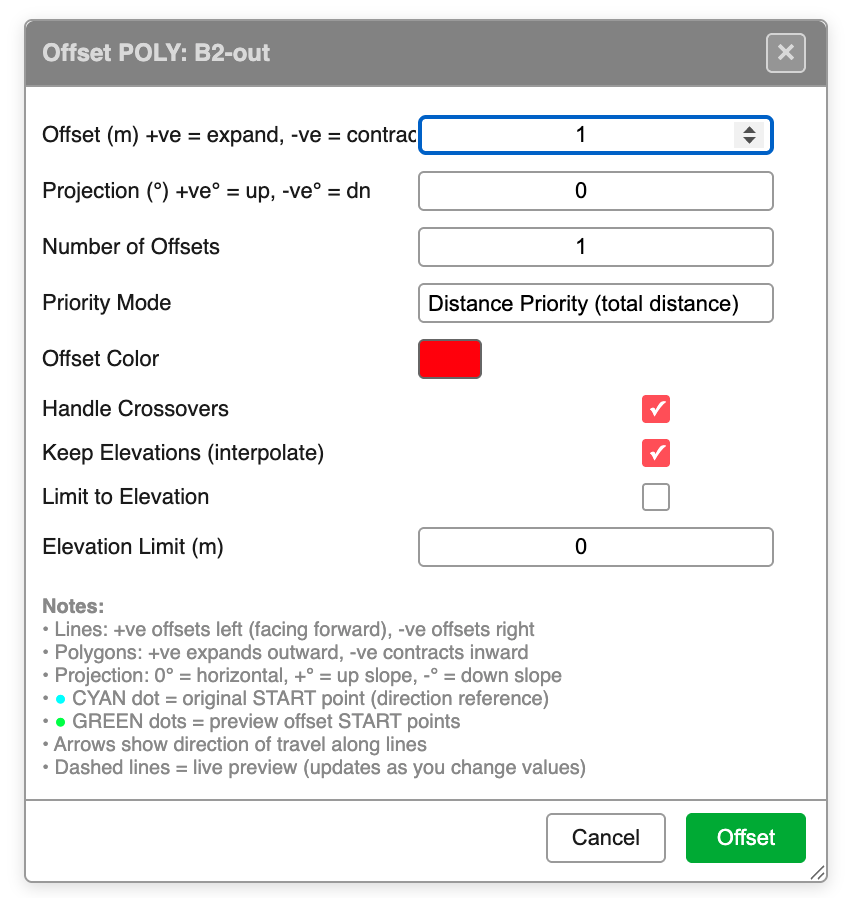
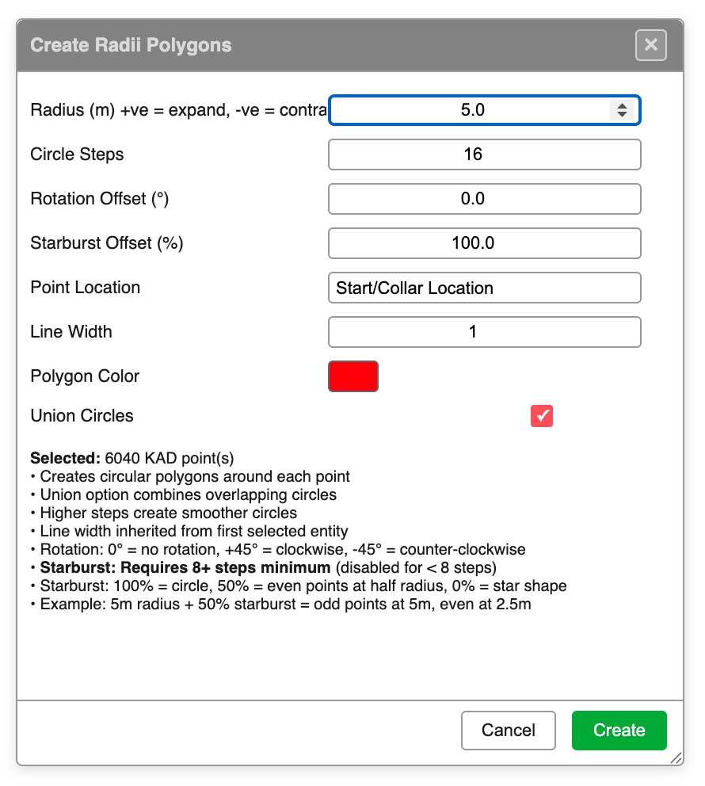
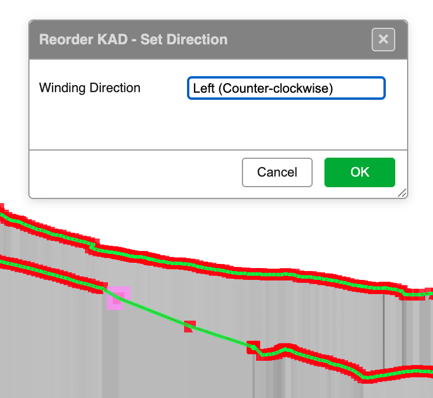
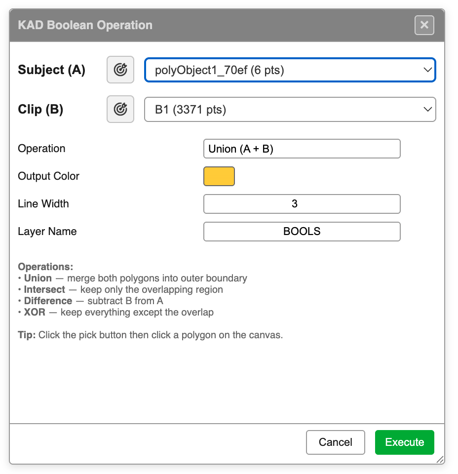
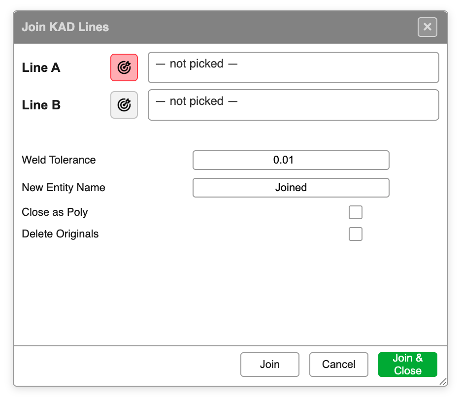
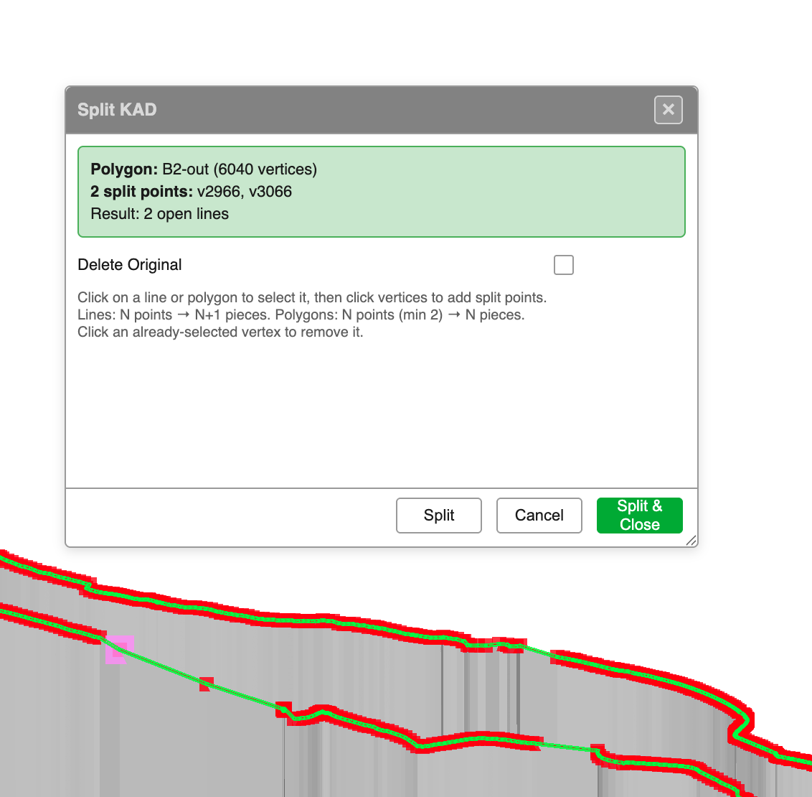

# Modify Toolbar

The Modify toolbar provides tools for transforming, editing, and manipulating blast holes and KAD entities. It is one of Kirra's eight floating toolbars.

---

## Toolbar Overview

The Modify toolbar contains the following tools:

| Tool | Type | Description |
|------|------|-------------|
| **Assign Surface** | Interactive | Set collar elevation from a loaded surface |
| **Assign Grade/Toe** | Dialog | Set grade or toe elevation from a surface with multiple assignment modes |
| **Hole Bearing** | Interactive | Change hole bearing by dragging |
| **Move** | Interactive | Move selected holes or KAD entities |
| **Transform KAD** | Dialog | Translate and rotate KAD entities by offset and bearing/pitch/roll |
| **Offset KAD** | Dialog | Offset lines and polygons inward or outward |
| **Radii** | Dialog | Create circular polygons around selected holes or KAD points |
| **Router-Chamfer** | Interactive | Create routed or chamfered edge transitions on selected geometry |
| **Clip-KAD** | Interactive | Clip selected KAD objects against a boundary polygon |
| **Reorder KAD Points** | Dialog | Change the start vertex and winding direction of lines/polygons |
| **KAD Boolean** | Dialog | 2D boolean operations (union, difference, intersection, XOR) on polygons |
| **Join KAD Lines** | Dialog | Join two lines end-to-end into a single entity |
| **Split KAD Lines** | Dialog | Split a line or polygon at one or more vertices |
| **Extend Line to Boundary** | Interactive | Extend the end of a line until it reaches a chosen boundary entity |
| **Grade Line** | Interactive | Set a constant slope (grade) along a selected line |
| **Simplify RDP** | Interactive | Reduce a line/polygon's vertex count with the Ramer–Douglas–Peucker algorithm |
| **Snap Objects to Surface** | Dialog | Drape KAD objects onto a surface so their elevations follow the ground |

---

## Assign Surface (Collar)

Sets the collar (start) elevation of selected blast holes by interpolating Z values from a loaded surface.

### How to Use

1. Select the blast holes to update
2. Click the **Assign Surface** button in the Modify toolbar
3. If multiple surfaces are loaded, a dialog prompts you to choose one
4. Collar Z values are interpolated from the surface at each hole's XY position
5. Hole lengths and toe positions are recalculated

### Notes

- If no surface is loaded, a manual elevation input is offered
- Only visible surfaces appear in the selection list
- XY coordinates remain unchanged; only Z is updated

---

## Assign Grade/Toe Elevation

Sets grade or toe elevation from a loaded surface, with four assignment modes that control how related hole attributes are recalculated.

### Assignment Modes

| Mode | Description | Recalculates |
|------|-------------|-------------|
| **Assign GRADE (calc Toe from Subdrill)** | GradeZ is set from the surface. ToeZ = GradeZ - Subdrill/cos(angle) | Length, ToeXYZ |
| **Assign TOE (calc Grade from Subdrill)** | ToeZ is set from the surface. GradeZ = ToeZ + Subdrill/cos(angle) | Length, GradeXYZ |
| **Assign GRADE (keep Toe, calc Subdrill)** | GradeZ is set from the surface. Toe stays in position. Subdrill = ToeZ - GradeZ (along hole) | Subdrill |
| **Assign TOE (keep Grade, calc Subdrill)** | ToeZ is set from the surface. Grade stays in position. Subdrill = ToeZ - GradeZ (along hole) | Subdrill |

### How to Use

1. Select the blast holes to update
2. Click the **Assign Grade** button in the Modify toolbar
3. Choose a surface (if multiple are loaded)
4. Select the assignment mode
5. Click **Apply**

---

## Hole Bearing

Interactively changes the bearing of selected blast holes by dragging on the canvas.

### How to Use

1. Select the blast holes to update
2. Click the **Hole Bearing** button in the Modify toolbar
3. Click and drag on the canvas to set the bearing angle
4. The bearing is calculated from the drag direction (0° = North, clockwise)

---

## Move

Moves selected blast holes or KAD entities to a new position by dragging.

### How to Use

1. Select the holes or KAD entities to move
2. Click the **Move** button in the Modify toolbar
3. Click and drag on the canvas to move the selection
4. Release to place at the new position

---

## Transform KAD

Translates and rotates selected KAD entities by specified offsets and angles.

### Parameters

| Parameter | Description |
|-----------|-------------|
| **X Offset** | Horizontal (Easting) displacement in metres |
| **Y Offset** | Vertical (Northing) displacement in metres |
| **Z Offset** | Elevation displacement in metres |
| **Bearing** | Rotation about the Z axis (degrees) |
| **Pitch** | Rotation about the X axis (degrees) |
| **Roll** | Rotation about the Y axis (degrees) |

### How to Use

1. Select the KAD entities to transform
2. Click the **Transform KAD** button in the Modify toolbar
3. Enter the offset and rotation values
4. Click **Apply**

---

## Offset KAD

Offsets KAD lines and polygons inward or outward by a specified distance, creating new parallel entities.

### Parameters

| Parameter | Description |
|-----------|-------------|
| **Offset (m)** | Distance to offset. Positive expands (outward for polygons, left for lines), negative contracts |
| **Projection (°)** | Slope angle for offset. 0° = horizontal, positive = up slope, negative = down slope |
| **Number of Offsets** | How many parallel offsets to create (1 or more) |
| **Priority Mode** | Distance Priority (total distance) or other modes |
| **Offset Color** | Colour for the new offset entities |
| **Handle Crossovers** | Automatically resolve self-intersections in the offset result |
| **Keep Elevations** | Interpolate Z values from the original entity |
| **Limit to Elevation** | Constrain the offset to a fixed elevation |

### Notes

- Lines: positive offset goes left (facing the direction of travel), negative goes right
- Polygons: positive expands outward, negative contracts inward
- Arrows show the direction of travel along lines
- Dashed lines provide a live preview as you change values
- A cyan dot marks the original start point; green dots mark offset start points
- The dialog remembers the last used parameters between executions

### Where the output lands

`Design → Offsets`, named `<source>_Offset_<distance>m_<uid>` — for example
`Crest_Offset_5m_p7q1`. See [Layer Organisation](layer-organisation.md).

### How to Use

1. Select a line or polygon entity
2. Click the **Offset KAD** button in the Modify toolbar
3. Configure the offset parameters
4. Click **Offset**

---

## Radii (Create Radii Polygons)

Creates circular polygons around selected blast holes or KAD points.

### Parameters

| Parameter | Description |
|-----------|-------------|
| **Radius (m)** | Circle radius. Positive expands, negative contracts |
| **Circle Steps** | Number of vertices in each circle (more steps = smoother) |
| **Rotation Offset (°)** | Rotate the circle. 0° = no rotation, +45° = clockwise, -45° = counter-clockwise |
| **Starburst Offset (%)** | 100% = circle, 50% = even points at half radius, 0% = star shape |
| **Point Location** | Which hole point to use: Start/Collar Location or other options |
| **Line Width** | Width of the polygon outline |
| **Polygon Color** | Colour for the generated polygons |
| **Union Circles** | Combine overlapping circles into a single polygon |

### Notes

- Starburst requires 8 or more circle steps (disabled for fewer)
- Starburst example: 5m radius + 50% starburst = odd points at 5m, even points at 2.5m
- Line width is inherited from the first selected entity
- The dialog shows the count of selected KAD points

### Where the output lands

`Boundaries → Radii → Polygons`, named `<blast>_Radii_<radius>m_<uid>` — for example
`Blast01_Radii_300m_k3f9`.

- Rotation and starburst are appended when they are not at their defaults:
  `Blast01_Radii_300m_R45_S50_k3f9`
- Using the toe instead of the collar names it `RadiiToe`
- Selecting holes from more than one blast names the source `Selection`
- Running the tool again adds to the *same* `Boundaries → Radii` folder

See [Layer Organisation](layer-organisation.md).

### How to Use

1. Select blast holes or KAD point entities
2. Click the **Radii** button in the Modify toolbar
3. Configure the radius and options
4. Click **Create**

---

## Router-Chamfer

Creates routed (rounded) or chamfered (bevelled) edge transitions on selected KAD geometry — softening sharp corners on a polygon or line.

### Parameters

The **Router / Chamfer** palette stays open while you pick corners.

| Parameter | Description |
|-----------|-------------|
| **Corner Style** | **Round (arc / router)** or **Chamfer (straight bevel)** |
| **Radius (m)** | Size of the rounding or bevel (default 2) |
| **Arc Segments** | Number of segments in each rounded corner, 1–64 (default 8). Disabled for chamfers |

### How to Use

1. Click the **Router-Chamfer** button in the Modify toolbar — the **Router / Chamfer** palette opens
2. Click corner vertices of a line or polygon on the canvas (click again to deselect) — the palette shows the **Selected corners** count and a cyan preview
3. Set the corner style, radius and arc segments
4. Click **Apply** — each selected corner is replaced by rounded (or chamfered) vertices
5. Select more corners, or right-click twice quickly to exit (a single right-click clears the current selection)

### Notes

- The end points of open lines cannot be rounded — pick interior corners
- If the radius is too large to fit a corner, it is reduced to fit and the status bar reports the corners affected
- **Close** closes the palette

---

## Clip-KAD

Clips selected KAD objects against a boundary polygon in plan view, keeping the portion inside or outside the boundary, or splitting at it. The 2D drawing counterpart to the surface **Clip Surface** tool.

### How to Use

1. Select the KAD entities to clip using the Select toolbar (Pointer or Polygon select, with KAD selection on)
2. Click the **Clip-KAD** button in the Modify toolbar — the **Clip KAD** dialog opens and shows a live count of the selected objects
3. Choose the **Clip polygon** from the list, or click the target button beside it and then click a closed polygon on the canvas
4. Choose the **Mode**: **Keep inside**, **Keep outside** or **Dissect (split, keep both)**
5. Click **Execute** — the dialog stays open for further clips; **Close** closes it

### Notes

- The selected objects are replaced in place, and the clip can be undone
- Lines and polygons are split at the boundary; points and text are kept, dropped or split per vertex; circles are kept or dropped whole, based on their centre
- Clipped pieces stay on the same layer as the object they were cut from

---

## Reorder KAD Points

Changes the start vertex and winding direction of KAD line and polygon entities. Useful for controlling the direction of offset operations and ensuring consistent polygon winding.

### How to Use

1. Select a line or polygon entity
2. Click the **Reorder KAD Points** button in the Modify toolbar
3. Click on the vertex you want to become the new start point
4. Choose the winding direction: Left (Counter-clockwise) or Right (Clockwise)
5. Click **OK**

### Notes

- The new start point affects where offset operations begin
- Winding direction determines which side is "inside" for polygons
- Useful before running Offset KAD to control the offset direction

---

## KAD Boolean

Performs 2D boolean operations on KAD polygon entities. Supports Union, Intersection, Difference, and XOR operations.

### Parameters

| Parameter | Description |
|-----------|-------------|
| **Subject (A)** | The primary polygon (pick from canvas or dropdown) |
| **Clip (B)** | The clipping polygon (pick from canvas or dropdown) |
| **Operation** | Union (A + B), Intersect, Difference (A - B), or XOR |
| **Output Color** | Colour for the result polygon |
| **Line Width** | Width of the result polygon outline |
| **Sub-layer Name** | Sub-layer under `Analysis` for the output (default `Booleans`) |

### Operations

- **Union** -- merge both polygons into the outer boundary
- **Intersect** -- keep only the overlapping region
- **Difference** -- subtract B from A
- **XOR** -- keep everything except the overlap

### Where the output lands

`Analysis → Booleans`, named `<subject>_<Operation>_<uid>` — for example
`Poly01_Union_f5g7`. Type a different **Sub-layer Name** to file it under
`Analysis → <your name>` instead. See [Layer Organisation](layer-organisation.md).

### How to Use

1. Click the **KAD Boolean** button in the Modify toolbar
2. Click the pick button next to Subject (A) and click a polygon on the canvas
3. Click the pick button next to Clip (B) and click another polygon
4. Select the operation
5. Click **Execute**

---

## Join KAD Lines

Joins two KAD lines end-to-end into a single entity.

### Parameters

| Parameter | Description |
|-----------|-------------|
| **Line A** | First line (pick from canvas) |
| **Line B** | Second line (pick from canvas) |
| **Weld Tolerance** | Maximum distance between endpoints to join (default: 0.01) |
| **New Entity Name** | Name for the joined entity (default: "Joined") |
| **Close as Poly** | Close the result into a polygon |
| **Delete Originals** | Remove the original lines after joining |

### How to Use

1. Click the **KAD Join Lines** button in the Modify toolbar
2. Click the pick button next to Line A and click a line on the canvas
3. Click the pick button next to Line B and click another line
4. Configure options (entity name, close as poly, delete originals)
5. Click **Join** to join and keep the dialog open, or **Join & Close** to join and close

### Notes

- The dialog remembers checkbox states between executions
- Endpoints are automatically matched by proximity

---

## Split KAD Lines

Splits a KAD line or polygon at one or more selected vertices, creating separate entities from the pieces.

### How to Use

1. Click the **KAD Split Lines** button in the Modify toolbar
2. Click on a line or polygon on the canvas to select it
3. Click on vertices along the entity to mark split points
4. Click an already-selected vertex to deselect it
5. The dialog shows a live preview of the split result
6. Optionally check **Delete Original** to remove the source entity
7. Click **Split** to split and keep the dialog open, or **Split & Close** to split and close

### Split Behaviour

| Source Type | Split Points | Result |
|-------------|-------------|--------|
| Line | N points | N+1 open lines |
| Polygon | N points (min 2) | N closed pieces or open lines |

### Notes

- The status banner shows the selected entity name, vertex count, split point count, and expected result
- The dialog remembers the Delete Original checkbox state between executions
- Multi-point split support allows splitting at several vertices in a single operation

---

## Extend Line to Boundary

Extends the end of a selected line until it reaches a chosen boundary entity (another line or a polygon edge), so two strings meet cleanly at an intersection.

### How to Use

1. Click the **Extend Line to Boundary** button in the Modify toolbar
2. Click the line you want to extend, near the end to extend
3. Click the boundary entity to extend to
4. The line is lengthened to the intersection point

---

## Grade Line

Sets a **constant slope (grade)** along a span of a line between two points you pick — useful for drains, batters and haul-grade strings. Points outside the span are not changed. Closed polygons are not supported.

### Parameters

| Parameter | Description |
|-----------|-------------|
| **Mode** | **Grade from start (apply slope)** — the start point keeps its Z and the span tilts towards the end at the grade you type. **Interpolate start → end** — the start and end keep their Z and the span is straightened between them |
| **Span** | Read-only: the picked points and how many points the span covers |
| **Grade (+ve = up, -ve = dn)** | The slope to apply (default 10). In Interpolate mode it shows the computed grade instead |
| **Grade Unit** | **Degrees (°)**, **Slope (%)** or **Ratio (1:N)** (default %). Switching unit converts the value |

### How to Use

1. Click the **Grade Line (set constant slope)** button in the Modify toolbar
2. Click the start point on a line
3. Click the end point on the same line — the **Grade LINE** dialog opens, with a live preview labelling the new Z values
4. Choose the mode and grade
5. Click **Apply Grade**
6. Pick another span, or right-click to exit

---

## Simplify RDP

Reduces the vertex count of a line or polygon using the **Ramer–Douglas–Peucker** algorithm, removing points that don't materially change the shape — handy for cleaning up dense survey strings or digitised boundaries.

### How to Use

1. Click the **Simplify RDP** button in the Modify toolbar — an active-mode banner appears
2. Click a line or polygon to simplify it
3. Repeat on other entities as needed
4. **Right-click** to exit the tool

Clicking a line or polygon opens the **Simplify** dialog for it:

| Parameter | Description |
|-----------|-------------|
| **Tolerance (m)** | Maximum distance a point may sit from the simplified line before it is kept (default 0.5, steps of 0.01). Larger tolerance = fewer points |
| **3D-aware simplification** | On: keeps points that deviate in X, Y and Z, preserving crests, toes and grade breaks. Off (default): simplifies in plan view only |
| **Z value for kept points** | **Nearest original point's Z (exact)** or **Weighted-distance average Z (smoother)** |
| **Preview colour** | Colour of the live preview |

Click **Apply** to simplify the entity. The dialog remembers your last settings.

---

## Snap Objects to Surface

Drapes KAD objects onto a surface — each point is moved up or down to the surface elevation at its XY position. Points that fall off the surface keep their elevation.

### Parameters

| Parameter | Description |
|-----------|-------------|
| **Surface** | The surface to snap to — choose from the visible surfaces, or click the target button and pick it on the canvas |
| **Objects** | **Selected objects** or **All visible objects**. The target button adds an object picked on the canvas to the list |
| **Method** | **Intersect and add points** — lines and polygons gain a vertex wherever they cross a surface triangle edge, so they follow the ground between their own points. **Use existing points only** — only the points already there move |

Points, text and circles always move their own point, whichever method is chosen.

### How to Use

1. Make sure the surface is visible
2. Select the KAD objects to snap (recommended) — or choose **All visible objects** in the dialog
3. Click the **Snap Objects to Surface** button in the Modify toolbar
4. Choose the surface and method; remove any object from the list with its bin button
5. Click **Apply** — a message reports how many objects and points were snapped and added

### Notes

- Only visible objects and visible surfaces are used
- Objects change in place, and the whole snap can be undone in one step

---

## Recent Changes (August 2026)

- **Generated output is now organised by discipline.** Radii, Offset, KAD Boolean and the other generating tools file their results into `Boundaries`, `Design`, or `Analysis` with a sub-layer per tool, instead of dropping everything into the active drawing layer. See [Layer Organisation](layer-organisation.md)
- **Generated entities are named `Source_Kind_parameter_uid`** — `Blast01_Radii_300m_k3f9` instead of `RAD-SRTk3f9`
- **KAD Boolean's "Layer Name" is now "Sub-layer Name"** — it names the folder under `Analysis` rather than a top-level layer

---

## Related Topics

- [Layer Organisation](layer-organisation.md) -- where generated output lands and how it is named
- [Drawing Points, Lines, and Polygons](drawing-tools.md)
- [Extrude, Boolean, and Section Plane](advanced-tools.md)
- [Interface Tour](../getting-started/interface-tour.md)
- [Hole Properties Reference](../reference/hole-properties.md)
