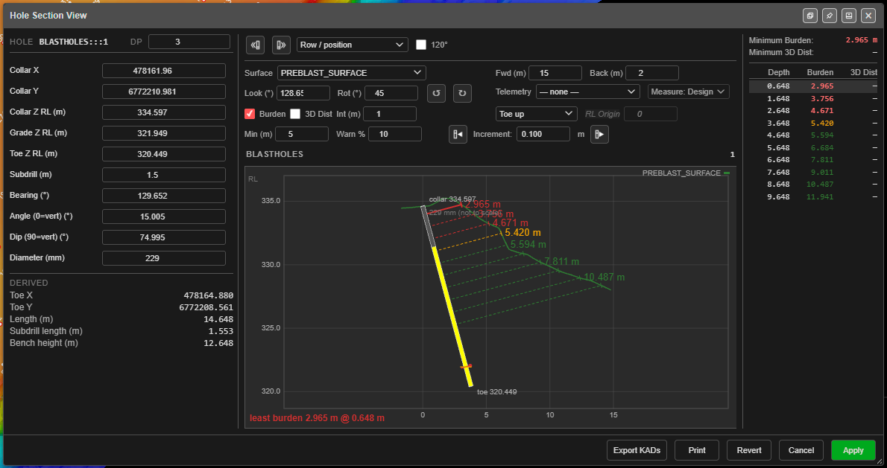

# Section Views

A section shows your design side-on, so you can read what a plan view hides: hole depths
against the bench, burden to the face, the layers a pattern passes through, and the decks
inside a hole. Kirra has three section views, each for a different job.

| Section view | Where | Use it to |
|---|---|---|
| [**Section Plane**](#section-plane) | **Select** toolbar | Slice the whole 3D scene — holes, drawings, surfaces, images and block models — and step the slice through the pattern |
| [**Hole Section View**](#hole-section-view) | **Analyse** toolbar → **Hole Section Tool** | Check one hole's burden to the face, and adjust the hole while you watch |
| [**Deck Builder section**](#deck-builder-section) | Charging → **Deck Builder** | See and edit the decks inside a hole, collar to toe |

---

## Section Plane

The Section Plane cuts a **slice** through everything loaded and hides what is outside
it. You choose where the slice sits and how thick it is, then step it through the
pattern.

*A Two Points section across the front of a blast: the face profile, the angled front-row holes and the vertical holes behind them. The grid is **Show Section Plane**.*

### Take a section

1. Click **Section Plane** on the **Select** toolbar.
2. Tick **Enable Section Plane**. The view switches to 3D — a section is a 3D view.
3. Choose the **Plane**:

   | Plane | The slice |
   |---|---|
   | **Two Points** | Runs vertically through two points you click |
   | **Segment** | Runs vertically along a line you click |
   | **XY (Elevation)** | Horizontal, stepping up and down |
   | **YZ (East-West)** | Vertical, stepping east and west |
   | **XZ (North-South)** | Vertical, stepping north and south |

4. For **Two Points**, click the start point, then the end point. For **Segment**, click
   a line you have drawn. Press **Esc** or right-click to cancel a pick.

The view turns to look along the section. The direction you clicked or drew the line in
sets which way the view faces; the reverse button beside the **Plane** list looks the
other way.

### Set the thickness and step through

- **Look Forward** and **See Behind** set how far either side of the section line stays
  visible. Both default to **1**, a 2 m slice. For the **XY**, **YZ** and **XZ** planes the
  same two boxes are labelled by axis, for example **+Y** and **-Y**.
- **Position** moves the slice off the section line; **0** sits on it.
- **Step Increment** is how far each step moves. Step with the double-chevron buttons either side
  of **Position**, or **Page Up** / **Page Down**. Hold **Shift** to land on exact multiples of the step.
- **Rotation** tilts the slice away from vertical.

### Choose what is cut

**Clip** sets which kinds of data the section applies to: **Blasts**, **KAD**,
**Surfaces**, **Images** and **Blocks** (block models). Untick one to keep it whole while
the rest is sliced — for example, keep the topography whole while slicing the holes.

### Draw on the section

By default a section is for **looking**: tools still work in plan. Tick **Draw on plane**
to make the section the plane the tools work in — offset, extend, hole set-out, move,
Design Plane tagging and triangulation. It needs **Enable Section Plane** and the 3D view.

While it is on, a warning across the top of the dialog reads *WORK PLANE ACTIVE*. Untick
**Draw on plane** to go back to working in plan. It is never remembered between sessions.

**Show Section Plane** draws a grid on the section so you can see the plane you are
looking at. The grid spacing is the **Step Increment**.

### Finish

**Close** leaves the dialog; the section stays on while **Enable Section Plane** is
ticked. **Reset** returns the settings to their defaults.

Full reference: [3D View — Section Plane](3d-tools.md#section-plane).

---

## Hole Section View

The Hole Section View is a section through **one hole**, measured against a surface —
usually the face. It shows the burden in front of the hole all the way down, and lets you
edit the hole and see the effect before you commit it.

*A front-row hole measured against the pre-blast surface with **Burden** on and **Min (m)** set to 5: red below the minimum, amber within the warning band, green beyond. The table on the right lists the burden at each depth.*

### Check a hole's burden

1. Select a hole, or a group of holes.
2. Click **Hole Section Tool** on the **Analyse** toolbar.
3. Choose the **Surface** that is the face.
4. Tick **Burden**, **3D Dist**, or both.

The section shows the hole and the surface profile, with the burden measured at
intervals down the hole. The panel on the right reports the **Minimum Burden** and
**Minimum 3D Dist**.

### The section

| Control | What it does |
|---|---|
| **Surface** | The surface the burden is measured to. |
| **Fwd (m)** / **Back (m)** | How far the section reaches in front of and behind the collar. |
| **Look (°)** | The bearing the section is cut along. It starts at the hole's own bearing — change it when the face is not where the hole points. |
| **Rot (°)** and the rotate buttons | How far each press of the rotate buttons turns the section. Set 180 to flip it in one press. |

### Measuring the burden

| Control | What it does |
|---|---|
| **Burden** | Burden in front of the hole, on the hole's own bearing. |
| **3D Dist** | The shortest distance to the face in any forward direction. Slower than **Burden**. |
| **120°** | Widens the **3D Dist** search from 90° to 120° off the hole bearing, to find a face to the side or slightly behind — a corner hole. |
| **Int (m)** | The sample interval down the hole. A larger interval can step over the tightest point. |
| **Collar down** / **Toe up** / **RL origin** | Where the samples are anchored. **RL origin** samples at fixed elevations, set by **RL Origin**, so every hole is sampled at the same levels. |
| **Min (m)** | The minimum acceptable burden. Burden below it shows **red**, within the warning band **amber**, and above it **green**. Leave at 0 for no colour bands. |
| **Warn %** | The width of the amber band above the minimum. |
| **Telemetry** | A KAD layer of surveyed hole paths. The path nearest this hole's collar is used. |
| **Measure: Design** / **Measure: Telemetry** | Measure from the design hole, or from the surveyed path. A surveyed hole bends, and its burden is measured square to the bend. |

### Adjust the hole

The left panel holds the hole: **Collar X**, **Collar Y**, **Collar Z RL (m)**, **Grade Z
RL (m)**, **Toe Z RL (m)**, **Subdrill (m)**, **Bearing (°)**, **Angle (0=vert) (°)** or
**Dip (90=vert) (°)**, and **Diameter (mm)**. **Derived** shows the toe position, length,
subdrill length and bench height that follow. **DP** sets the decimal places shown.

Edits are **staged**: the section redraws with the change, marked *staged - not applied*,
but the hole itself is not changed yet.

- The move buttons either side of **Increment** nudge the hole **toward** or **away from**
  the face along its bearing, by the increment.
- **Apply** commits the staged changes to the hole. It can be undone.
- **Revert** discards them.

Kirra will not apply a move that puts the collar on top of another hole.

### Step through a group

With a group selected, **Previous hole** and **Next hole** step through it, in the order
chosen beside them: **Row / position**, **Numerical** or **Alphanumerical**. Apply or
revert a hole's staged changes before moving on.

### Print and export

- **Print** builds a PDF of the section.
- **Export KADs** saves the burden paths as KAD drawings.

---

## Deck Builder section

The **Deck Builder** shows the hole being charged as a 2D section, collar at the top and
toe at the bottom, with every deck drawn in place.

- Drag a product from the **Product Palette** onto the section to add a deck.
- Click a deck to select it and edit its properties.
- Drag a boundary between decks to resize them. This overrides any formula on that deck.

Full reference: [Deck Builder](../charging/deck-builder.md).

---

## Which one?

- **"Is this hole too close to the face?"** — Hole Section View, with **Burden** or
  **3D Dist** and a **Min (m)**.
- **"What does the whole pattern look like across this line?"** — Section Plane,
  **Two Points** or **Segment**.
- **"Where are the holes against the geology at this bench?"** — Section Plane with
  **Blocks** clipped, or a [bench slice](../block-models/load-block-model-dialog.md#bench-slices)
  of the block model.
- **"Is the stemming and charge right in this hole?"** — Deck Builder.

---

See also: [Select Toolbar](select-toolbar.md) · [Analyse Toolbar](../analysis/analyse-toolbar.md) ·
[3D View & Orbit Focus](3d-tools.md) · [Deck Builder](../charging/deck-builder.md)
