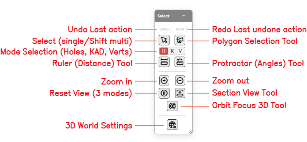
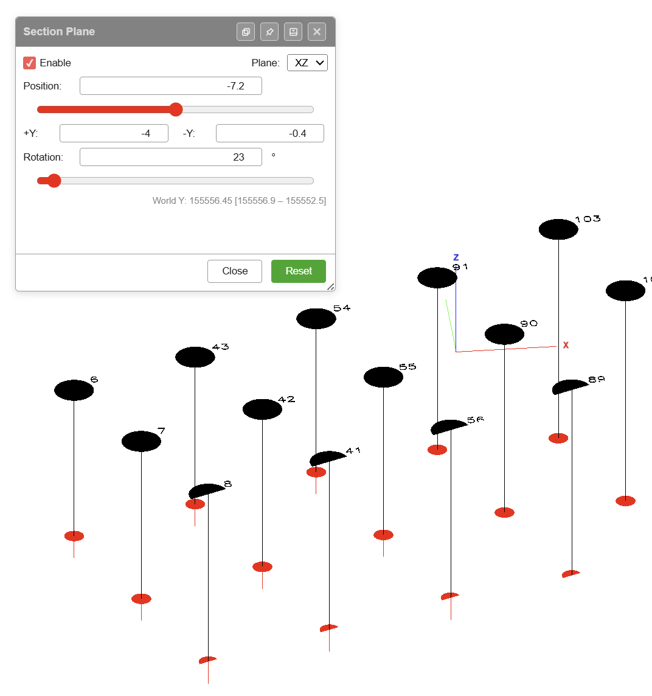
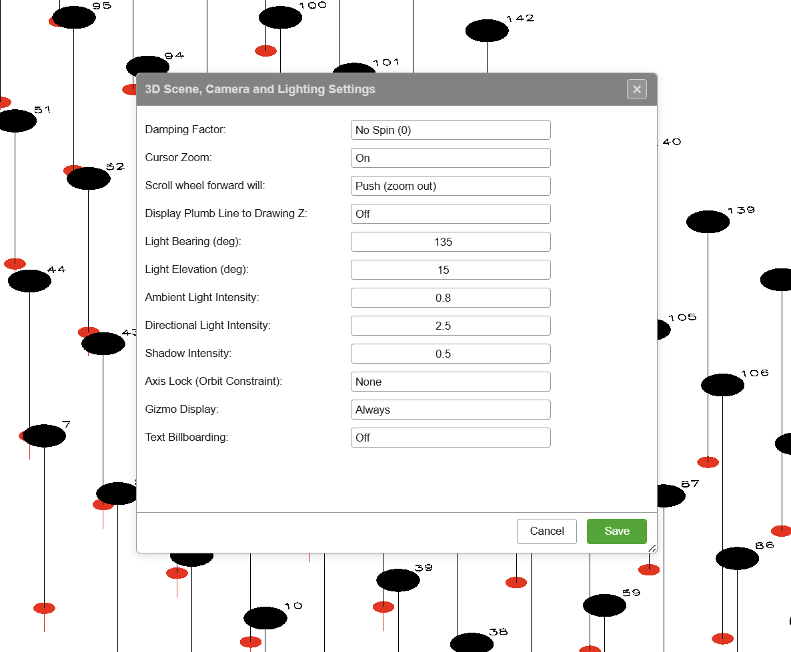

# Select Toolbar

The Select toolbar groups the workspace-wide tools for selecting entities, measuring distances and angles, controlling the view, and setting the selection mode. It is the first of the six floating toolbars on the right side of the Kirra workspace.

Despite the name, this toolbar is not only about selection — undo/redo, zoom, reset view, section view, orbit focus, and 3D world settings all live here because they apply across every other tool.

---

## Toolbar Overview

*The Select toolbar with all thirteen controls labelled.*

The Select toolbar contains the following controls:

| Control | Type | Purpose |
|---------|------|---------|
| **Undo** | Action | Reverse the last action |
| **Redo** | Action | Re-apply the last undone action |
| **Select (single / Shift multi)** | Mode | Standard click-to-select; Shift+click to add to the selection |
| **Polygon Selection Tool** | Mode | Lasso-select entities by drawing a polygon on the canvas |
| **Mode Selection (H / K / V)** | Toggle | Constrain selection to **H**oles, **K**AD entities, or **V**ertices |
| **Ruler (Distance) Tool** | Measurement | Measure the distance between two points on the canvas |
| **Protractor (Angles) Tool** | Measurement | Measure the angle formed by three points |
| **Zoom In** | View | Zoom the viewport in by one step |
| **Zoom Out** | View | Zoom the viewport out by one step |
| **Reset View** | View | Reset the camera to a default view (three modes) |
| **Section View Tool** | View | Slice the 3D scene with a section plane |
| **Orbit Focus 3D Tool** | View | Click a point in the 3D scene to set it as the new orbit centre |
| **3D World Settings** | Dialog | Open renderer configuration — renderer mode, instanced rendering, LOD overrides, simplification thresholds |

---

## Undo

Reverses the last editing action. Undo covers hole placement, hole edits, pattern generation, deletions, transforms, charging changes, and KAD edits. *[VERIFY: full list of undoable actions]*

### How to Use

- Click the **undo** button on the Select toolbar, or press `Ctrl+Z`

See [Keyboard Shortcuts](keyboard-shortcuts.md) for all undo/redo shortcuts.

---

## Redo

Re-applies the last action that was undone.

### How to Use

- Click the **redo** button on the Select toolbar, or press `Ctrl+Y` (or `Ctrl+Shift+Z`)

---

## Select (Single / Shift Multi)

The default selection mode. Click entities on the canvas to select them; hold `Shift` to add or remove entities from the current selection.

### How to Use

1. Click the **Select** button on the Select toolbar
2. Click any entity on the canvas to select it
3. Hold `Shift` and click additional entities to add them to the selection
4. Click on empty canvas to clear the selection *[VERIFY: click-to-deselect behaviour]*

### Selection Mode Interaction

The **Mode Selection** toggle (H / K / V) determines which entity types this tool can select — see [Mode Selection](#mode-selection-h--k--v) below.

---

## Polygon Selection Tool

Lasso-selects entities by drawing a polygon on the canvas. Every entity whose position falls inside the polygon is selected.

### How to Use

1. Click the **Polygon Selection** button on the Select toolbar
2. Click points on the canvas to trace the polygon outline
3. Double-click to close the polygon and commit the selection
4. All entities inside the polygon are selected, subject to the active H/K/V mode

---

## Mode Selection (H / K / V)

A three-way toggle that constrains which entity types selection tools pick up. This is one of the most important settings in the workspace — the wrong mode is a common reason a click seems to do "nothing".

| Mode | Selects |
|------|---------|
| **H** | Holes only |
| **K** | KAD entities only (points, lines, polygons, circles, text) |
| **V** | KAD vertices only (does not select hole collars) |

### How to Use

- Click the **H**, **K**, or **V** letter on the Select toolbar to set the active mode
- The active mode is highlighted
- Selection tools (Select, Polygon Selection) respect the active mode

> **Tip:** If a click isn't selecting what you expect, check the H/K/V toggle first.

---

## Ruler (Distance) Tool

Measures the straight-line distance between two points on the canvas.

### How to Use

1. Click the **Ruler** button on the Select toolbar
2. Click the first point
3. Click the second point
4. The distance is displayed in a floating overlay panel that follows the mouse

---

## Protractor (Angles) Tool

Measures the angle formed by three points — vertex in the middle, arms to either side.

### How to Use

1. Click the **Protractor** button on the Select toolbar
2. Click the first arm point
3. Click the vertex (the corner of the angle)
4. Click the second arm point
5. The angle is displayed in a floating overlay panel that follows the mouse

---

## Zoom In

Zooms the viewport in by one step, centred on the current view.

### How to Use

- Click the **Zoom In** button on the Select toolbar, or use the mouse wheel

> **Note:** Mouse-wheel direction is controlled by the **Scroll wheel forward will** setting in [3D World Settings](#3d-world-settings). The **Cursor Zoom** setting in the same dialog determines whether the wheel zooms towards the cursor or the screen centre.

---

## Zoom Out

Zooms the viewport out by one step.

### How to Use

- Click the **Zoom Out** button on the Select toolbar, or use the mouse wheel in the opposite direction to Zoom In

---

## Reset View (Three Modes)

Resets the camera. Behaviour depends on the active viewport (2D or 3D) and on how many times you click the button in succession.

### 3D View

| Click | Result |
|-------|--------|
| **1st click** | Top-down view, keeps the current zoom |
| **2nd click** | Extents of the visible data |
| **3rd click** | Extents of all data (visible or not) |

### 2D View

| Click | Result |
|-------|--------|
| **1st click** | North up, extents of the visible data |
| **2nd click** | Extents of all data (visible or not) |

### How to Use

- Click the **Reset View** button once for the first mode
- Click again to progress through the remaining modes

---

## Section View Tool

Slices the 3D scene with a section plane so you can see inside surfaces or cut through a pattern. Useful for inspecting hole depths against terrain, deck configurations inside a bench, and multi-level pit designs.

*The Section Plane dialog — in this example an XZ plane is active at Y = -7.2 with +Y = -4 and -Y = -0.4, rotated by 23°. Holes either side of the clip are hidden.*

### Dialog Options

| Option | Purpose |
|--------|---------|
| **Enable** | Turns the section plane on or off |
| **Plane** | Chooses the clip plane: **XY** (horizontal slab), **YZ** (vertical, normal along X), or **XZ** (vertical, normal along Y) |
| **Position** | Distance of the plane along its normal axis. Text input plus a slider. The world-coordinate value and range are shown beneath the slider (e.g. *World Y: 155556.45 [155556.9 – 155552.5]*) |
| **+/- axis widths** | Two fields that set the slab thickness either side of the plane. Labels change with the plane: **+Z / -Z** for XY, **+X / -X** for YZ, **+Y / -Y** for XZ |
| **Rotation** | Rotates the clip plane by the entered angle (degrees). Text input plus a slider |
| **Close** | Closes the dialog. The plane stays active if **Enable** is still ticked |
| **Reset** | Returns the plane to its default position, widths, and rotation |

### Clip Planes

| Plane | Orientation | Typical Use |
|-------|------------|-------------|
| **XY** | Horizontal slab | Elevation slice — set Position (Z), then +Z and -Z widths to define slab thickness |
| **YZ** | Vertical, normal along X | Cross-section facing east–west |
| **XZ** | Vertical, normal along Y | Cross-section facing north–south |

### How to Use

1. Click the **Section View** button on the Select toolbar
2. The Section Plane dialog opens
3. Tick **Enable**
4. Choose the **Plane** (XY, YZ, or XZ)
5. Set **Position** to place the plane along its normal axis
6. Set the two width fields to define how much of the scene stays visible either side of the plane
7. Use **Rotation** to tilt the plane as needed
8. Click **Close** to leave the dialog (the plane stays active), or **Reset** to return to defaults

---

## Orbit Focus 3D Tool

Click any point in the 3D scene to set it as the new orbit centre. This is the most effective way to inspect specific blast holes or surface features up close — the camera rotates around your chosen focus point instead of the scene origin.

### How to Use

1. Switch to 3D view (2D/3D toggle in the top bar)
2. Click the **Orbit Focus** button on the Select toolbar
3. Click any point in the 3D scene to set it as the orbit centre
4. Alt+drag to orbit around the new centre

See [3D View & Orbit Focus](3d-tools.md) for the full 3D navigation reference.

---

## 3D World Settings

Opens the **3D Scene, Camera and Lighting Settings** dialog — the configuration for camera behaviour, lighting, gizmos, and 3D display preferences.

*The 3D World Settings dialog groups camera, lighting, and display options.*

### Dialog Options

| Option | Purpose |
|--------|---------|
| **Damping Factor** | Camera motion damping — e.g. *No Spin (0)* disables inertial spin after an orbit drag |
| **Cursor Zoom** | When **On**, the mouse wheel zooms towards the cursor position instead of the screen centre |
| **Scroll wheel forward will** | Direction of wheel-forward — **Push (zoom out)** or the opposite. Flip this if the wheel direction feels inverted |
| **Display Plumb Line to Drawing Z** | Draws a plumb line from each entity down to the drawing Z elevation when **On** |
| **Light Bearing (deg)** | Compass bearing of the directional light (0 = North, clockwise) |
| **Light Elevation (deg)** | Elevation angle of the directional light above the horizon |
| **Ambient Light Intensity** | Strength of the ambient (fill) light |
| **Directional Light Intensity** | Strength of the directional (sun) light |
| **Shadow Intensity** | Strength of cast shadows |
| **Axis Lock (Orbit Constraint)** | Constrains orbit motion to a specific axis — **None** leaves orbit fully free |
| **Gizmo Display** | When to show the XYZ axis gizmo — e.g. **Always** |
| **Text Billboarding** | When **On**, text labels always face the camera |

### Buttons

| Button | Action |
|--------|--------|
| **Save** | Applies the settings and closes the dialog |
| **Cancel** | Discards any changes and closes the dialog |

### How to Use

1. Click the **3D World Settings** button on the Select toolbar
2. Adjust any of the options above
3. Click **Save** to apply, or **Cancel** to discard

---

## Related Topics

- [Interface Tour](../getting-started/interface-tour.md) — workspace overview
- [Keyboard Shortcuts](keyboard-shortcuts.md) — undo/redo and navigation shortcuts
- [3D View & Orbit Focus](3d-tools.md) — full 3D navigation reference
- [Holes Toolbar](../blast-design/holes-toolbar.md) — placing holes and generating patterns
- [Modify Toolbar](../kad/modify-tools.md) — transforming entities after selection
- [Editing Holes](../blast-design/editing-holes.md) — uses of the Select modes
