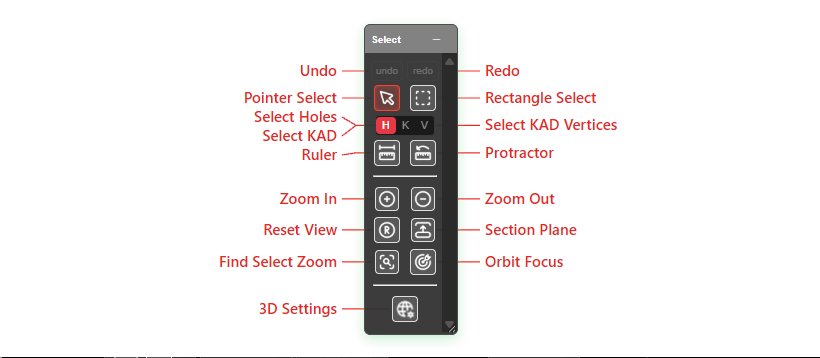
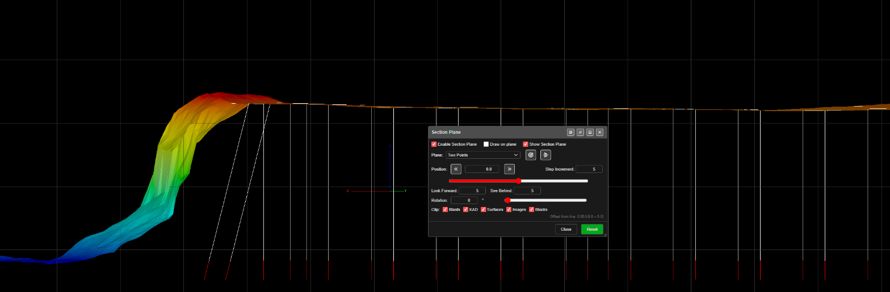
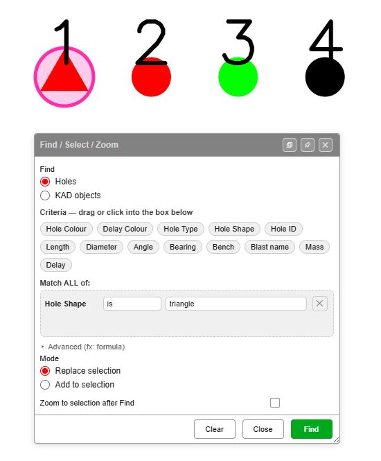
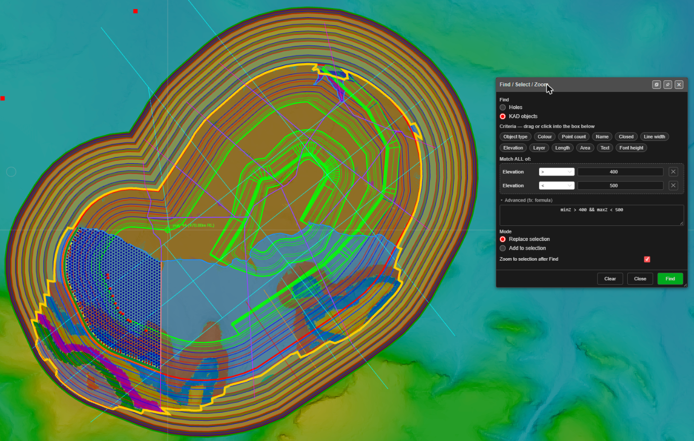
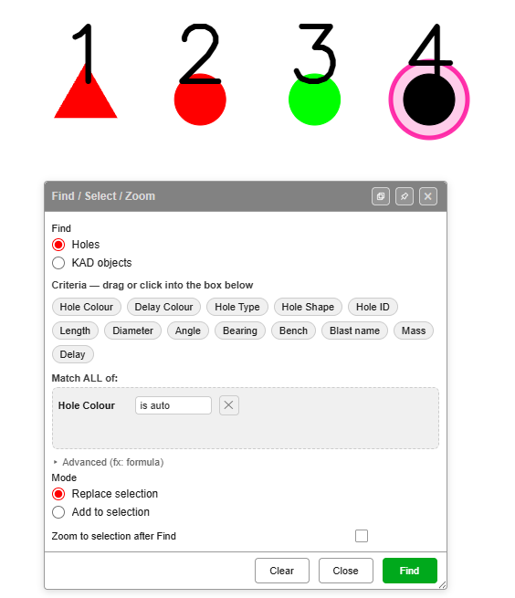

# Select Toolbar

The Select toolbar groups the workspace-wide tools for selecting entities, measuring distances and angles, controlling the view, and setting the selection mode. It is one of the eight floating toolbars in the Kirra workspace.

Despite the name, this toolbar is not only about selection — undo/redo, zoom, reset view, section plane, orbit focus, and the Settings dialog all live here because they apply across every other tool.

---

## Toolbar Overview


*The Select toolbar with its controls labelled.*

The Select toolbar contains the following controls:

| Control | Type | Purpose |
|---------|------|---------|
| **Undo** | Action | Reverse the last action |
| **Redo** | Action | Re-apply the last undone action |
| **Pointer Select** | Mode | Click to select; Shift+click to add, Ctrl+click to remove. This is Kirra's home tool |
| **Polygon Select** | Mode | Select everything inside a shape you draw — a polygon, rectangle or ellipse (right-click the button to choose) |
| **Mode Selection (H / K / V)** | Toggle | Constrain selection to **H**oles, **K**AD entities, or KAD **V**ertices |
| **Ruler** | Measurement | Measure the distance between points on the canvas |
| **Protractor** | Measurement | Measure the angle formed by three points |
| **Zoom In** | View | Zoom the viewport in by one step |
| **Zoom Out** | View | Zoom the viewport out by one step |
| **Reset View** | View | Reset the camera — click repeatedly to step through three modes |
| **Section Plane** | View | Slice the scene with a section plane |
| **Find Select Zoom** | Dialog | Search holes / KAD by criteria (colour, shape, ID, type, length, bearing, mass, delay…), combine criteria, then zoom to the result |
| **Orbit Focus** | View | Click a point in the 3D scene to set it as the new orbit centre |
| **3D Settings** | Dialog | Open the **Settings** dialog — 2D view sizes and snap tolerance, 3D camera and lighting, and performance limits |

---

## Undo

Reverses the last editing action. Undo covers adding, deleting, moving and editing holes; inserting holes; adding, deleting, moving and editing KAD entities and their vertices; KAD transforms; trunk changes; and adding, editing or deleting surfaces. Kirra keeps the last 20 actions.

### How to Use

- Click the **undo** button on the Select toolbar, or press `Ctrl+Z` (`Cmd+Z` on a Mac)

See [Keyboard Shortcuts](keyboard-shortcuts.md) for all undo/redo shortcuts.

---

## Redo

Re-applies the last action that was undone.

### How to Use

- Click the **redo** button on the Select toolbar, or press `Ctrl+Y` (or `Ctrl+Shift+Z`)

---

## Pointer Select

The default selection tool. Kirra always returns to Pointer Select when another tool finishes or is cancelled, so it is never left with no tool active.

### How to Use

1. Click the **Pointer Select** button on the Select toolbar
2. Click any entity on the canvas to select it
3. Hold `Shift` and click more entities to add them to the selection — Shift+click on an entity that is already selected removes it
4. Hold `Ctrl` (`Cmd` on a Mac) and click an entity to remove it from the selection
5. Click on empty canvas to clear the selection

Switching from Polygon Select to Pointer Select keeps the current selection.

### Selection Mode Interaction

The **Mode Selection** toggle (H / K / V) determines which entity types this tool can select — see [Mode Selection](#mode-selection-h--k--v) below.

---

## Polygon Select

Selects every entity inside a shape you draw on the canvas. **Right-click** the button to choose the shape:

| Shape | How to draw it |
|-------|----------------|
| **Polygon** | Click each vertex, then double-click to close |
| **Rectangle** | Click one corner, then the opposite corner |
| **Ellipse** | Click one corner, then the opposite corner of its bounding box |

The button's icon and tooltip change to show the chosen shape, and the choice is remembered. Picking a shape from the right-click menu also turns the tool on.

### How to Use

1. Click the **Polygon Select** button on the Select toolbar (right-click it first to change the shape)
2. Draw the shape on the canvas
3. Everything inside it is selected, subject to the active H / K / V mode

Hold `Shift` while you finish the shape to add to the current selection, or `Ctrl` (`Cmd` on a Mac) to remove from it.

---

## Mode Selection (H / K / V)

A three-way toggle that constrains which entity types selection tools pick up. This is one of the most important settings in the workspace — the wrong mode is a common reason a click seems to do "nothing".

| Mode | Selects |
|------|---------|
| **H** | Holes only |
| **K** | KAD entities only (points, lines, polygons, circles, text) |
| **V** | KAD vertices only (does not select hole collars) |

### How to Use

- Click the **H**, **K**, or **V** letter on the Select toolbar to set the active mode
- The active mode is highlighted
- Selection tools (Select, Polygon Selection) respect the active mode

> **Tip:** If a click isn't selecting what you expect, check the H/K/V toggle first.

---

## Ruler

Measures the distance between two points on the canvas.

### How to Use

1. Click the **Ruler** button on the Select toolbar
2. Click the first point
3. Click the second point
4. A floating panel beside the cursor shows the two elevations (**Z1**, **Z2**), the **Plan** and **Total** distance, **ΔZ**, **Dip** and **Slope**

Click again to start a new measurement.

---

## Protractor

Measures the angle formed by three points — vertex in the middle, arms to either side.

### How to Use

1. Click the **Protractor** button on the Select toolbar
2. Click the first arm point
3. Click the vertex (the corner of the angle)
4. Click the second arm point
5. The angle is displayed in a floating panel beside the cursor

---

## Zoom In

Zooms the viewport in by one step, centred on the current view.

### How to Use

- Click the **Zoom In** button on the Select toolbar, or use the mouse wheel

> **Note:** Mouse-wheel direction is controlled by the **Scroll wheel forward will** setting on the **3D** tab of the [Settings](#settings) dialog. The **Cursor Zoom** setting on the same tab decides whether the wheel zooms towards the cursor or the screen centre.

---

## Zoom Out

Zooms the viewport out by one step.

### How to Use

- Click the **Zoom Out** button on the Select toolbar, or use the mouse wheel in the opposite direction to Zoom In

---

## Reset View (Three Modes)

Resets the camera. Each click in quick succession moves to the next mode; after a pause of about a second and a half the next click starts again at the first mode. The button's tooltip names the mode the next click will apply.

### 3D View

| Click | Result |
|-------|--------|
| **1st click** | Plan view — looks straight down, keeps the current zoom |
| **2nd click** | Extents of the visible data |
| **3rd click** | Extents of all data (visible or not) |

### 2D View

| Click | Result |
|-------|--------|
| **1st click** | North up (rotation cleared) |
| **2nd click** | Extents of the visible data |
| **3rd click** | Extents of all data (visible or not) |

Reset View also clears any orbit centre set with [Orbit Focus](#orbit-focus).

---

## Section Plane

Slices the scene with a section plane so you can see inside surfaces or cut through a pattern. Useful for inspecting hole depths against terrain, deck configurations inside a bench, and multi-level pit designs.


*The Section Plane dialog, sectioning across the front of a blast.*

### How to Use

1. Click the **Section Plane** button on the Select toolbar
2. Tick **Enable Section Plane** (the view switches to 3D)
3. Choose the **Plane** — **Two Points**, **Segment**, **XY (Elevation)**, **YZ (East-West)** or **XZ (North-South)**
4. Set the slice thickness either side of the plane, then step it with **Position**
5. Click **Close** to leave the dialog (the section stays on while **Enable Section Plane** is ticked), or **Reset** to return to the defaults

See [3D View — Section Plane](3d-tools.md#section-plane) for every option, and
[Section Views](section-views.md) for how it compares with the Hole Section View.

---

## Find Select Zoom

Opens the **Find / Select / Zoom** dialog — search for holes or KAD objects by one or more criteria, select the matches, and zoom the viewport to them. Handy for isolating a subset of a large blast (for example, every triangle-shaped hole, or every hole with a delay over a threshold).

Criteria are **chips**: click (or drag) one from the palette into the **Match ALL of** box, then set its comparison. Add as many as you need — a hole must satisfy **all** of them to be found.


*Hole Shape **is** triangle — hole 1 is the only triangle in the pattern, and it is the only one selected.*

### Criteria for Holes

| Chip | Compares | Notes |
|--------|----------|-------|
| **Hole Colour** | The colour the hole is **drawn** in | Colour well, or sample one off the pattern with the target-arrow button. Also **is auto** / **is not auto** — see below |
| **Delay Colour** | The delay / connector swatch | A different thing from Hole Colour. This is the colour the ties and delay text take |
| **Hole Type** | Production, Batter, Buffer, Presplit… | Lists only the types present |
| **Hole Shape** | circle, triangle, square, cross, diamond | Lists only the shapes present. A hole that was never given a shape is a circle, and is found as one |
| **Hole ID** | Hole name, as text or as a number | **text** matches `A1` exactly; **number** compares the trailing digits, so `> 10` finds `B11` |
| **Length**, **Diameter**, **Angle**, **Bearing**, **Bench** | Numeric | Angle is degrees from vertical; bearing is degrees from north |
| **Blast name** | The blast the hole belongs to | is / is not / contains |
| **Mass** | Explosive kilograms from the charging system | `0` finds uncharged holes |
| **Delay** | Hole delay, milliseconds | `0` finds holes with no delay set |

### Criteria for KAD objects

Switch **Find** to **KAD objects** for a different palette:

| Chip | Compares | Notes |
|--------|----------|-------|
| **Object type** | point, line, poly, circle, text | |
| **Colour** | The object's colour | Colour well, or sample one with the target-arrow button |
| **Point count** | Number of vertices | `= 2` finds two-point lines |
| **Name** | The object's name | is / is not / contains |
| **Closed** | Closed or open | |
| **Line width** | Numeric | |
| **Elevation** | Every point of the object | See below |
| **Layer** | The KAD layer it sits on | Lists only layers that hold something. Unlayered objects are **Ungrouped** |
| **Length** | Plan length, metres | A closed polygon's length is its perimeter; a circle's is its circumference |
| **Area** | Plan area, square metres | Closed polygons and circles only; open lines are `0` |
| **Text** | A text object's words | is / is not / contains |
| **Font height** | A text object's font height | |

Length and Area are measured in plan, the same as the **L=** and **A=** figures in the tree.

### Elevation

**Elevation** looks at every point of the object, not just the first:

| Comparison | Finds |
|------------|-------|
| **>** / **>=** | Objects lying entirely above that RL |
| **<** / **<=** | Objects lying entirely below that RL |
| **=** | Objects flat at exactly that RL — contours, bench lines |
| **≠** | Everything not flat at that RL |

Add **Elevation** twice for a band: **> 400** and **< 500** finds everything lying between RL 400 and RL 500. An RL of `0` is a real elevation and is found like any other.


*Elevation **>** 400 and Elevation **<** 500 — the strings lying wholly inside that band are selected (green). Advanced shows the formula the two chips compiled.*

To find strings that **cross** an RL — some points above, some below — use Advanced:

```
fx:minZ < 300 && maxZ > 300
```

### Hole Colour, Delay Colour, and "is auto"

A hole carries **two** colours and they are not interchangeable:

- **Hole Colour** is the collar glyph — what you see on the canvas.
- **Delay Colour** is the connector and delay-text swatch, set by the **Delay Colour** control on the hole's Additional tab.

Searching one will not find the other, so pick the chip that matches what you are looking at.

A hole does not have to carry a colour of its own. Left on **auto** it takes the theme's contrast colour — white on a dark background, black on a light one — and there is no colour you could type that would name that set. The **is auto** comparison finds them:


*Hole Colour **is auto** — holes 1, 2 and 3 were each given a colour, so only hole 4 is still taking the theme's black.*

Sampling an auto hole with the target-arrow button switches the chip to **is auto** for you, rather than picking up the black or white it happens to be showing.

### Advanced (fx: formula)

Expand **Advanced (fx: formula)** to see the predicate the chips compiled, and to edit it by hand. It is the same language as a live [blast group formula](../formula-help/blast-group-formulas.md) — for example:

```
fx:holeShape == "triangle" && holeLength > 10
```

For KAD objects, Advanced can use `minZ` and `maxZ` (lowest and highest point), `layer`, `length`, `area`, `text` and `fontHeight`, alongside the original `entityType`, `colour`, `pointCount`, `name`, `closed` and `lineWidth`.

### How to Use

1. Click the **Find Select Zoom** button on the Select toolbar
2. Choose **Holes** or **KAD objects**
3. Click a criterion chip to drop it into the **Match ALL of** box
4. Set its comparison and value — repeat for as many criteria as you need
5. Choose **Replace selection** or **Add to selection**
6. Tick **Zoom to selection after Find** if you want the view to follow
7. Click **Find**

Use **Clear** to empty the criteria box and start again.

---

## Orbit Focus

Click any point in the 3D scene to set it as the new orbit centre. This is the most effective way to inspect specific blast holes or surface features up close — the camera rotates around your chosen focus point instead of the scene origin.

### How to Use

1. Switch to 3D view (2D/3D toggle in the top bar)
2. Click the **Orbit Focus** button on the Select toolbar
3. Click any point in the 3D scene to set it as the orbit centre
4. Alt+drag to orbit around the new centre

See [3D View & Orbit Focus](3d-tools.md) for the full 3D navigation reference.

---

## Settings

The **3D Settings** button (globe-and-cog icon, at the bottom of the Select toolbar) opens the
**Settings** dialog — **2D**, **3D** and **Performance** tabs. Every field, its default and
when it applies are in [Settings](../working-in-kirra/settings.md).

---

## Related Topics

- [Interface Tour](../getting-started/interface-tour.md) — workspace overview
- [Keyboard Shortcuts](keyboard-shortcuts.md) — undo/redo and navigation shortcuts
- [3D View & Orbit Focus](3d-tools.md) — full 3D navigation reference
- [Holes Toolbar](../blast-design/holes-toolbar.md) — placing holes and generating patterns
- [Modify Toolbar](../kad/modify-tools.md) — transforming entities after selection
- [Editing Holes](../blast-design/editing-holes.md) — uses of the Select modes
