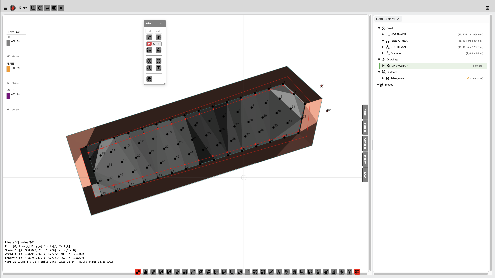
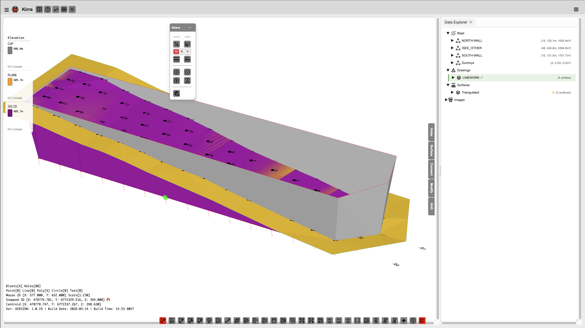
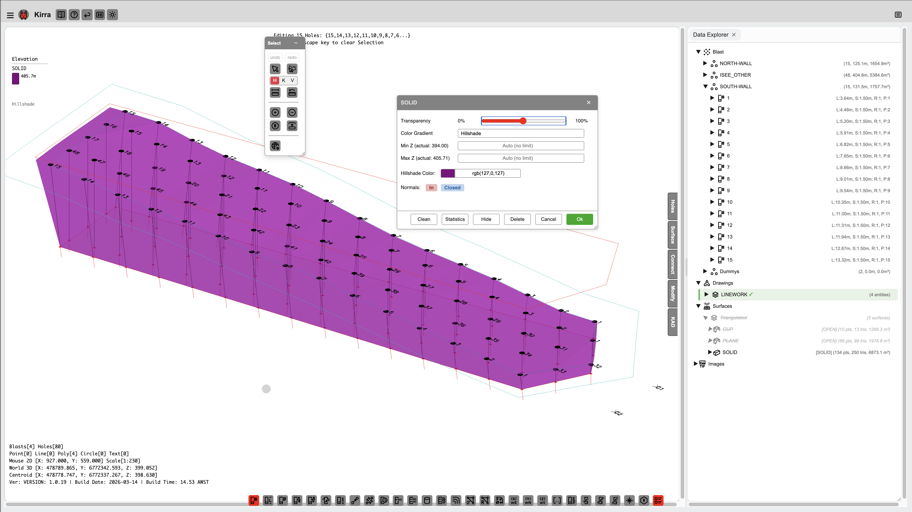

# Importing Surfaces

Kirra supports importing 3D surfaces from multiple formats. Surfaces are used for terrain visualisation, grade control, blast analytics overlays, boolean operations, contour generation, and GeoTIFF export.

*An imported surface displayed in the 2D canvas view with triangulation visible.*

*The same surface in the 3D view showing elevation colouring.*

---

## Supported Surface Formats

| Format | Extensions | Source |
|--------|-----------|--------|
| **Surpac DTM/STR** | `.dtm` + `.str` | Surpac, Vulcan, MineSight |
| **Wavefront OBJ** | `.obj` (+ `.mtl` + textures) | Photogrammetry, CAD, Blender |
| **PLY** | `.ply` | 3D scanners, photogrammetry |
| **GLTF/GLB** | `.gltf`, `.glb` | 3D viewers, Blender, analysis persistence |
| **DXF 3DFACE** | `.dxf` | AutoCAD triangulated surfaces |

---

## How to Import

1. Click **File > Import**
2. Select your surface file(s)
   - For Surpac: select both `.dtm` and `.str` together
   - For OBJ with textures: Kirra prompts for MTL and texture images
3. The surface appears in the TreeView and both 2D/3D views
4. Data is saved to IndexedDB and persists across browser sessions

---

## After Import

Once imported, you can:

- **Apply gradients** -- Change the colour scheme (elevation, hillshade, viridis, texture, etc.)
- **Adjust transparency** -- Set surface opacity
- **Set elevation limits** -- Clamp colour mapping to a specific Z range
- **Right-click in 3D** -- Access surface properties, gradient options, and context menu
- **Apply grade control** -- Use the surface elevation to set blast hole grade positions
- **Run blast analytics** -- Overlay vibration or damage models on the surface
- **Generate contours** -- Create elevation contour lines as KAD polylines
- **Boolean operations** -- Combine, subtract, or intersect surfaces

---

## Surface Properties

| Property | Description |
|----------|-------------|
| Name | Filename or user-defined name |
| Visible | Show/hide toggle |
| Gradient | Colour scheme (default, hillshade, viridis, texture, etc.) |
| Transparency | Opacity level (0 = invisible, 1 = solid) |
| Min Limit | Minimum elevation for colour mapping |
| Max Limit | Maximum elevation for colour mapping |

Access surface properties by right-clicking the surface in the TreeView or in the 3D view.

*Right-click a surface in the 3D view to access properties, gradient options, and more.*

---

## Related Topics

- [Surface Gradients](gradients.md)
- [Boolean & CSG](boolean-csg.md)
- [Mesh Editing](mesh-editing.md)
- [Contours](contours.md)
- [Surpac DTM/STR Import](../importing/surpac-dtm-str.md)
- [3D Mesh Import](../importing/3d-mesh.md)
