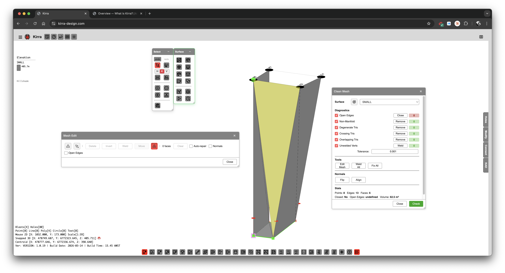

# Mesh Editing & Clean Mesh

Kirra provides interactive mesh editing and automated mesh repair tools for loaded surfaces.

*The Clean Mesh dialog showing diagnostics and repair tools for surface mesh quality.*

---

## Mesh Edit Tool (Edit Mesh)

The **Mesh Edit** workflow edits **triangulated surfaces** you already have in Kirra (DTM/STR, OBJ without live texture-only path, generated meshes, etc.). It runs **only in the 3D view** and opens a dockable **FloatingDialog** titled **Mesh Edit** with a compact toolbar (~700×170 px) plus an inline progress strip while the mesh is indexed.

**Implementation:** `src/tools/MeshEditTool.js` — exposes `window.startMeshEditMode(surfaceId)` and `window.cancelMeshEditMode()`.

### Requirements and limits

| Rule | Detail |
|------|--------|
| **3D view** | If Three.js is not initialised, Kirra prompts you to switch to **3D**. |
| **Surface must have triangles** | Empty surfaces cannot be opened in mesh edit. |
| **Textured OBJ workflow** | **Textured OBJ meshes** (`isTexturedMesh` with `threeJSMesh`) are **not supported** for mesh edit — use non-textured triangulated surfaces or convert workflow accordingly. |
| **One surface at a time** | Starting mesh edit on another surface **cancels** the previous session. |
| **Persistence** | Structural edits trigger **`saveSurfaceToDB`** and surface cache invalidation; the TreeView refreshes after heavy operations. |

### How to start

1. **Surface toolbar** — Use the **Mesh Edit** tool (`ToolManager` id `meshEditTool` / element `meshEditTool`), **or**
2. **Clean Mesh dialog** — Click **Edit Mesh** to jump straight into mesh edit for that surface (`CleanMeshDialog.js`).

On start, Kirra builds a **triangle soup**, maps Three.js faces ↔ surface triangle indices, optional **wireframe**, **vertex→triangle** spatial index, and **hover/selection** overlays. Large meshes show a short **loading** progress (building index map, wireframe, overlays).

### Selection modes

| Mode | Shortcut | Picking | Multi-select |
|------|-----------|---------|--------------|
| **Face** | **F** (when no sub-mode) | **Raycast** on the surface mesh — click a triangle | **Shift+click** toggles faces in the selection set |
| **Vertex** | **V** | **Screen-space** nearest vertex within ~**20 px** (magenta points) | **Shift+click** toggles vertices |

**Escape** — First clears an active **sub-mode**; then clears face or vertex selection; if nothing is selected, **exits Mesh Edit** entirely (same as **Close** on the dialog).

**Ctrl+A** (**Cmd+A** on macOS) — **Select all** faces (face mode) or **all unique vertices** (vertex mode).

### Toolbar actions (left to right)

| Control | What it does |
|---------|----------------|
| **Face / Vertex** | Switches between triangle picking and vertex picking (see shortcuts **F** / **V**). |
| **Delete** | **Face mode:** removes selected triangles (and prunes orphaned `points` so 2D snap does not see ghosts). **Vertex mode:** deletes **every triangle that uses any selected vertex**. Uses **UndoManager** for undo/redo. |
| **Invert** | Swaps two corners of each selected triangle (**winding / normal flip**) for those faces only. |
| **Weld** | **Vertex mode only**, **2+** vertices — merges selected positions to their **centroid** and rewires triangles (**W**). |
| **Move** | **Vertex mode** — **M** toggles **move sub-mode**: pick a vertex, then **drag**; motion is constrained to an **adjacent plane** derived from neighbour triangles. |
| **Insert** | **I** — **Insert sub-mode:** pick **three** positions in the 3D view (raycast on mesh); **Enter** commits a **new triangle** when three picks are stored. |
| **Polygon select** | **P** — Draw a **2D screen-space polygon** over the viewport; on completion, selects all triangles whose centres fall inside the polygon (**face mode**) or vertices inside (**vertex mode**). **Shift+double-click** to **add** to the existing selection. |
| **Clean orphan vertices** | Removes `points` entries not referenced by any triangle (scissors icon). |
| **Selection count** | Shows `N face(s)` or `N vert(s)`. |
| **Clear** | Clears the current selection (faces or vertices). |
| **Auto-repair** | Checkbox — after **delete**, optionally runs **boundary capping** (`capBoundaryLoopsSequential` from mesh repair helpers) to seal open loops. |
| **Normals** | Checkbox — toggles **normal arrows** overlay (MeshLine) for inspection. |
| **Open Edges** | Checkbox — toggles **pink fat-line** overlay of boundary edges. |

### Keyboard summary

| Key | Action |
|-----|--------|
| **F** / **V** | Face / Vertex mode (when not in a sub-mode) |
| **Del** / **Backspace** | Delete selected faces or all triangles touching selected vertices |
| **Ctrl+A** | Select all (faces or vertices) |
| **W** | Weld (vertex mode, 2+ verts) |
| **M** | Toggle move sub-mode (vertex mode) |
| **I** | Toggle insert-triangle sub-mode |
| **P** | Toggle polygon-select sub-mode |
| **Enter** | Confirm insert when three picks are ready |
| **Escape** | Exit sub-mode → clear selection → close Mesh Edit |

### After editing

- **Undo / Redo** — Destructive edits are pushed to the global **UndoManager** (`DeleteTrianglesAction`, `InvertTrianglesAction`, `InsertTrianglesAction`, etc.).
- **Close** — The dialog **Close** button calls **`cancelMeshEditMode()`**, which tears down overlays, listeners, and the floating toolbar.

For automated repair (degenerate tris, weld all, self-intersection removal), continue with **Clean Mesh** below.

---

## Clean Mesh

The Clean Mesh tool provides automated diagnostics and one-click repair for common mesh quality issues.

### How to Access

Right-click a surface in the TreeView and select **Clean Mesh**.

### Diagnostics

The dialog displays real-time statistics before and after each operation:

| Diagnostic | Description |
|------------|-------------|
| **Open Edges** | Boundary edges not shared by two triangles |
| **Non-Manifold** | Edges shared by more than two triangles |
| **Degenerate Tris** | Zero-area or near-zero-area triangles |
| **Crossing Tris** | Triangles that intersect other triangles in the same surface |
| **Overlapping Tris** | Near-duplicate triangles with opposing normals |
| **Unwelded Verts** | Vertices within snap tolerance that should be merged |

### Quick Fix Tools

| Tool | Description |
|------|-------------|
| **Edit Mesh** | Opens the interactive Mesh Edit tool |
| **Weld All** | Merges all vertices within snap tolerance |
| **Fix All** | Runs the full repair pipeline (degenerate removal, weld, crossing cleanup, overlap removal) |

### Normal Controls

| Operation | Description |
|-----------|-------------|
| **In** | Set normals to point inward |
| **Out** | Set normals to point outward |
| **Flip** | Reverses winding order of all triangles |
| **Align** | Propagates consistent winding from a seed triangle across the mesh |

Normal controls are also available from the TreeView context menu (right-click a surface).

### Individual Repair Operations

| Operation | Description |
|-----------|-------------|
| Remove Degenerate Triangles | Deletes zero-area and near-zero-area triangles |
| Remove Duplicate Triangles | Finds and removes triangles sharing the same vertices |
| Remove Self-Intersections | Detects and removes crossing triangles |
| Weld Vertices | Merges vertices within configurable tolerance |
| Remove Isolated Vertices | Cleans up orphaned vertices |
| Fix Winding Order | Ensures consistent triangle winding |
| Remove Sliver Triangles | Removes extremely thin triangles based on aspect ratio |

---

## Typical Mesh Repair Workflow

1. Import a surface
2. Right-click in TreeView > **Clean Mesh**
3. Review the diagnostics (open edges, non-manifold, degenerate, etc.)
4. Click **Fix All** for automated repair, or address issues individually
5. Use **Align** normals if lighting looks wrong
6. Verify diagnostics show improved counts

---

## Related Topics

- [Importing Surfaces](importing-surfaces.md)
- [Boolean & CSG](boolean-csg.md)
- [Surface Gradients](gradients.md)
