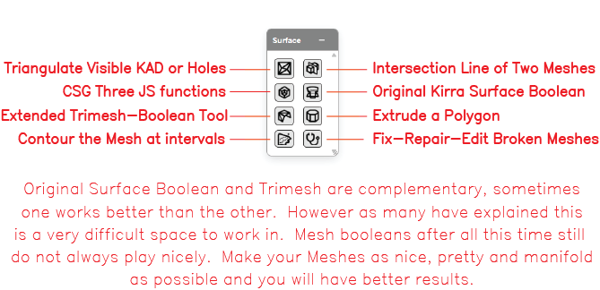
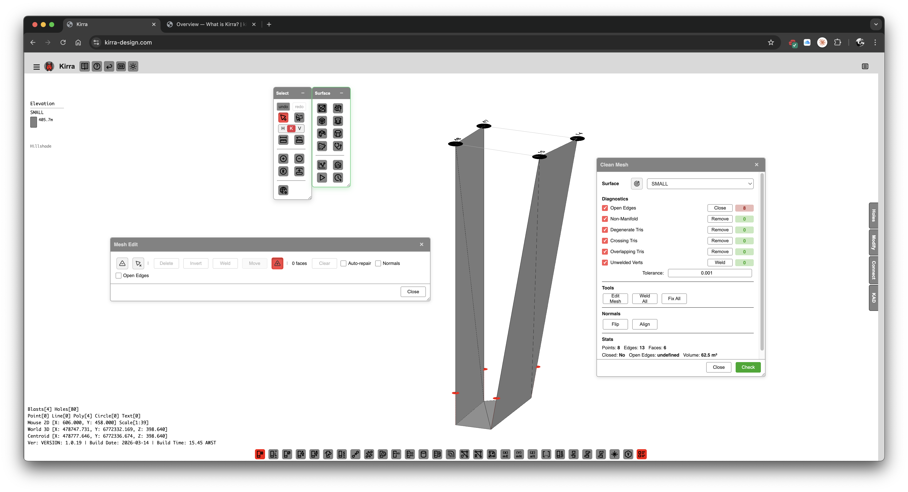
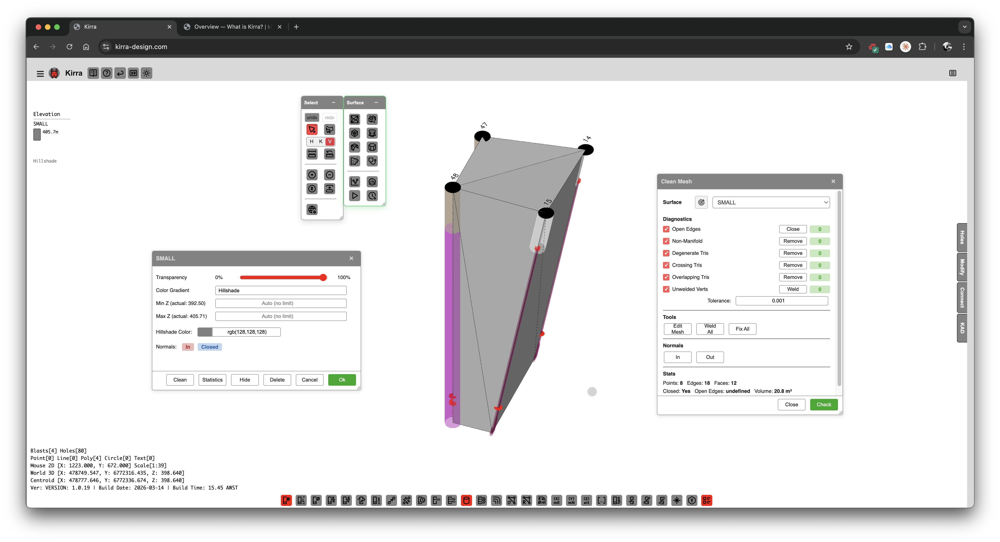

# Surfaces Toolbar

The **Surface** toolbar groups the controls for building, modifying, and repairing triangulated surface meshes — triangulation, mesh intersection, boolean operations (two engines), extrude, contour, and mesh repair. It is one of the floating toolbars on the right side of the Kirra workspace.

---

## Toolbar Overview

*The Surface toolbar with all controls labelled.*

The Surface toolbar contains the following controls:

| Control | Type | Purpose |
|---------|------|---------|
| **Triangulate Visible KAD or Holes** | Dialog | Build a triangulated surface from visible KAD entities or hole collars |
| **Intersection Line of Two Meshes** | Tool | Compute and draw the intersection polyline between two surface meshes |
| **CSG Three JS functions** | Dialog | Original Three.js CSG boolean operations (union / difference / intersect) |
| **Original Kirra Surface Boolean** | Dialog | Kirra's first-generation surface boolean engine |
| **Extended Trimesh-Boolean Tool** | Dialog | Newer Trimesh-Boolean engine (v0.3.0) running in a Web Worker |
| **Extrude a Polygon** | Dialog | Sweep a closed polygon to a target elevation to build a 3D solid |
| **Contour the Mesh at intervals** | Dialog | Generate contour lines at regular elevation intervals |
| **Fix-Repair-Edit Broken Meshes** | Dialog | Clean Mesh / Mesh Edit dialog — repair holes, remove self-intersections, edit vertices and triangles |

> *On open meshes, the Original Surface Boolean and Trimesh-Boolean engines are complementary — sometimes one engine succeeds where the other fails. Mesh booleans are difficult; make your meshes as clean and manifold as you can before running them.*

---

## Triangulate Visible KAD or Holes

Builds a triangulated surface from visible inputs — KAD polygons / lines / points, or blast hole collars.

### How to use

1. Make the input entities **visible** in the Data Explorer (only visible entities are considered)
2. Click the **Triangulate Visible KAD or Holes** button on the Surface toolbar
3. Choose the input set: visible KAD entities or hole collars
4. Configure triangulation options *[VERIFY: full options list]*
5. Click **Build** to generate the surface

See [Importing Surfaces](importing-surfaces.md) for surface-loading workflows and [Mesh Editing](mesh-editing.md) for cleanup after triangulation.

---

## Intersection Line of Two Meshes

Computes the polyline where two surface meshes intersect and draws it as a KAD line entity. Useful for slope-vs-design intersections, pit-shell vs topography, and toe / crest line extraction.

### How to use *[VERIFY: dialog vs direct two-mesh pick]*

1. Click the **Intersection Line of Two Meshes** button on the Surface toolbar
2. Pick Mesh A
3. Pick Mesh B
4. The intersection polyline is added as a KAD line entity

> *[SCREENSHOT NEEDED: Intersection Line dialog or workflow]*

---

## CSG Three JS functions

Original Three.js CSG boolean operations on closed solid meshes. Three operations:

| Operation | Result |
|-----------|--------|
| **Union** | A ∪ B — merged solid |
| **Difference** | A − B — A with B subtracted |
| **Intersect** | A ∩ B — only the overlap |

### How to use

1. Click the **CSG Three JS functions** button on the Surface toolbar
2. Pick Mesh A and Mesh B
3. Choose the operation
4. Click **Apply**

> **Note:** The Three.js CSG engine works best on **closed, manifold** solids. For open surfaces, use the Original Kirra Surface Boolean or the Trimesh-Boolean Tool.

See [Surface Boolean & CSG](boolean-csg.md) for the full reference.

---

## Original Kirra Surface Boolean

Kirra's first-generation surface boolean engine. Designed to work on **open surface meshes** (e.g. design surfaces with no roof), not just closed solids.

### How to use

1. Click the **Original Kirra Surface Boolean** button on the Surface toolbar
2. Pick Mesh A and Mesh B
3. Choose the operation (union, difference, intersect)
4. Click **Apply**

> *Original Surface Boolean and Trimesh-Boolean are complementary, sometimes one works better than the other.* Try the other engine if the first fails.

See [Surface Boolean & CSG](boolean-csg.md) for the full reference.

---

## Extended Trimesh-Boolean Tool

Kirra's newer boolean engine (Trimesh-Boolean v0.3.0), running in a **Web Worker** so it does not block the UI on large meshes.

### How to use

1. Click the **Extended Trimesh-Boolean Tool** button on the Surface toolbar
2. Pick Mesh A and Mesh B
3. Choose the operation
4. Click **Apply** — progress is reported as the worker runs

See [Surface Boolean & CSG](boolean-csg.md) for the full reference.

---

## Extrude a Polygon

Sweeps a closed KAD polygon up or down to a target elevation, producing a 3D solid mesh. Used for pit shells, bench solids, and design volumes.

### How to use

1. Select a closed KAD polygon
2. Click the **Extrude a Polygon** button on the Surface toolbar
3. Set the target elevation (or extrude depth)
4. Click **Apply** to produce the solid

See [Extrude, Boolean, and Section Plane](../kad/advanced-tools.md) for the full reference.

---

## Contour the Mesh at intervals

Generates contour lines (constant-elevation polylines) at regular intervals across a surface mesh.

### How to use

1. Click the **Contour the Mesh at intervals** button on the Surface toolbar
2. Pick the surface mesh
3. Set the **interval** in metres (e.g. 1.0 m)
4. Set the **base elevation** (the reference Z from which intervals are stepped)
5. Click **Generate** — contours are added as KAD line entities

See [Surface Contours](contours.md) for the full reference.

---

## Fix-Repair-Edit Broken Meshes

Opens the **Clean Mesh / Mesh Edit** dialog — repair self-intersections, fill holes, decimate, and interactively edit triangles and vertices.

### Capabilities

- Detect and remove self-intersections
- Fill small holes
- Remove unused vertices and duplicate triangles
- Decimate (reduce triangle count)
- Interactive triangle / vertex editing via the **MeshEditTool**
  - Delete triangles
  - Move vertices
  - Polygon-select triangles
  - Insert triangles

### How to use

1. Click the **Fix-Repair-Edit Broken Meshes** button on the Surface toolbar
2. Pick the mesh to repair
3. Run automated cleanup (self-intersection removal, hole fill)
4. Switch to interactive edit mode for hand-editing
5. Save the cleaned mesh

See [Mesh Editing](mesh-editing.md) for the full reference.

---

## Why two boolean engines?

> Original Surface Boolean and Trimesh-Boolean are complementary, sometimes one works better than the other. However as many have explained this is a very difficult space to work in. Mesh booleans after all this time still do not always play nicely. Make your meshes as nice, pretty and manifold as possible and you will have better results.
> *— in-app note on the Surface toolbar*

In practice:

- **CSG Three.js** — best for closed, well-formed solids
- **Original Surface Boolean** — best for open design surfaces with simple topology
- **Trimesh-Boolean (Extended)** — best for large or complex meshes (Web Worker, won't freeze the UI)

Try one, and if it fails, try the other engine on the same input before reaching for the mesh repair tool.

---

## Related topics

- [Importing Surfaces](importing-surfaces.md) — loading DTM, STR, OBJ, PLY, GLTF, etc.
- [Surface Boolean & CSG](boolean-csg.md) — boolean engine reference
- [Mesh Editing](mesh-editing.md) — Clean Mesh and MeshEditTool reference
- [Surface Contours](contours.md) — contour generation reference
- [Surface Gradients](gradients.md) — slope / aspect colouring
- [Extrude, Boolean, and Section Plane](../kad/advanced-tools.md) — 3D operations driven from KAD
- [Interface Tour](../getting-started/interface-tour.md) — workspace overview
