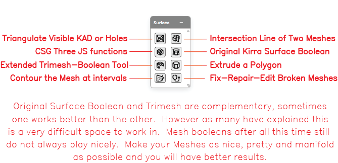
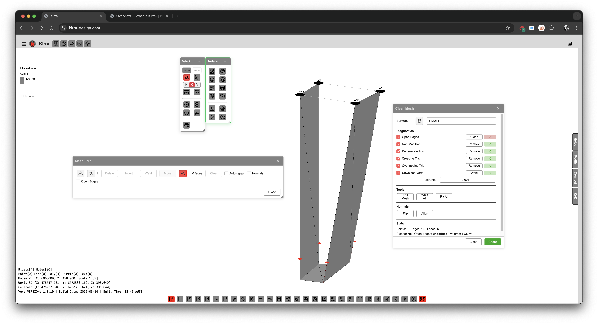
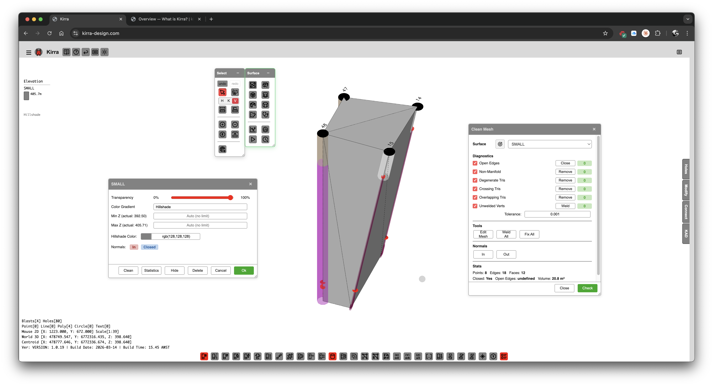
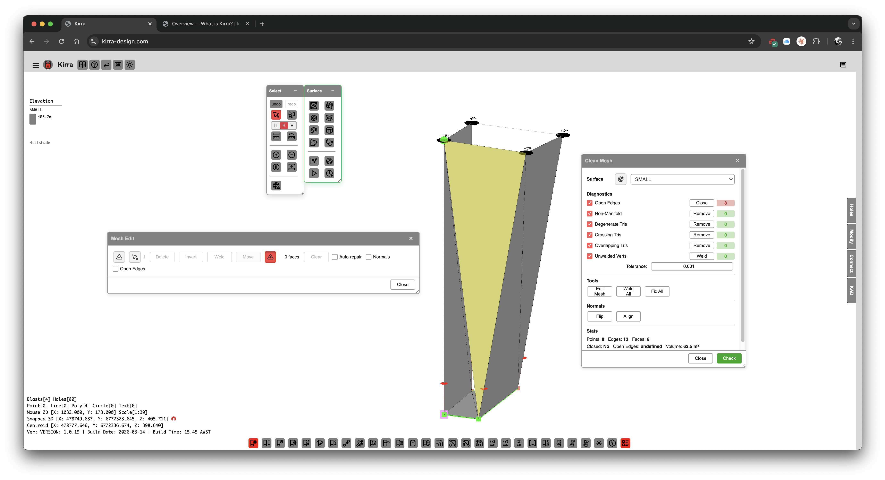

# Surfaces Toolbar

The **Surface** toolbar groups the controls for building, modifying, and repairing triangulated surface meshes — triangulation, mesh intersection, boolean operations (Solid CSG and Trimesh engines), extrude, contour, mesh repair, polygon clipping, and horizon slicing. It is one of the floating toolbars on the right side of the Kirra workspace.

---

## Toolbar Overview

*The Surface toolbar with all controls labelled.*

The Surface toolbar contains the following controls (left to right):

| Control | Type | Purpose |
|---------|------|---------|
| **Triangulate** | Dialog | Build a triangulated surface mesh from survey points or drawing data |
| **Surface Intersection** | Tool | Compute the intersection line(s) between two surface meshes |
| **Solid Boolean** | Dialog | Boolean union / intersect / subtract between closed solid volumes (Three.js CSG) |
| **Trimesh Boolean** | Dialog | Boolean operations directly between triangulated meshes (open-mesh capable, runs in a Web Worker) |
| **Extrude KAD to Solid** | Dialog | Sweep a closed KAD polygon vertically to build a 3D solid volume |
| **Contour Surface** | Dialog | Generate contour lines at regular elevation intervals |
| **Clean Mesh** | Dialog | Mesh diagnostics and repair — open edges, non-manifold, T-junctions, winding, normals, weld |
| **Clip Surface** | Dialog | Clip a surface or solid against a polygon (Single or Batch), keeping the inside or outside portion |
| **Solid Horizon Slice** | Dialog | Slice a closed solid into horizontal bands (a bench / horizon "egg-slicer") |

> *Mesh booleans are difficult; make your meshes as clean and manifold as you can before running them. If one engine fails on a given input, the other may still succeed.*

---

## Triangulate Visible KAD or Holes

Builds a triangulated surface from visible inputs — KAD polygons / lines / points, or blast hole collars.

### How to use

1. Make the input entities **visible** in the Data Explorer (only visible entities are considered)
2. Click the **Triangulate Visible KAD or Holes** button on the Surface toolbar
3. Choose the input set: visible KAD entities or hole collars
4. Configure triangulation options *[VERIFY: full options list]*
5. Click **Build** to generate the surface

See [Importing Surfaces](importing-surfaces.md) for surface-loading workflows and [Mesh Editing](mesh-editing.md) for cleanup after triangulation.

---

## Intersection Line of Two Meshes

Computes the polyline where two surface meshes intersect and draws it as a KAD line entity. Useful for slope-vs-design intersections, pit-shell vs topography, and toe / crest line extraction.

### How to use *[VERIFY: dialog vs direct two-mesh pick]*

1. Click the **Intersection Line of Two Meshes** button on the Surface toolbar
2. Pick Mesh A
3. Pick Mesh B
4. The intersection polyline is added as a KAD line entity

> *[SCREENSHOT NEEDED: Intersection Line dialog or workflow]*

---

## Solid Boolean

Three.js CSG boolean operations on closed solid meshes. Three operations:

| Operation | Result |
|-----------|--------|
| **Union** | A ∪ B — merged solid |
| **Difference** | A − B — A with B subtracted |
| **Intersect** | A ∩ B — only the overlap |

### How to use

1. Click the **Solid Boolean** button on the Surface toolbar
2. Pick Mesh A and Mesh B
3. Choose the operation
4. Click **Apply**

> **Note:** The Solid Boolean (CSG) engine works best on **closed, manifold** solids. For open surfaces, use the Trimesh Boolean tool.

See [Surface Boolean & CSG](boolean-csg.md) for the full reference.

---

## Trimesh Boolean

Kirra's mesh boolean engine, running in a **Web Worker** so it does not block the UI on large meshes. Unlike the Solid Boolean (CSG) path, Trimesh Boolean operates directly on triangulated meshes and can handle open surfaces, not only closed solids.

### How to use

1. Click the **Trimesh Boolean** button on the Surface toolbar
2. Pick Mesh A and Mesh B
3. Choose the operation
4. Click **Apply** — progress is reported as the worker runs

See [Surface Boolean & CSG](boolean-csg.md) for the full reference.

---

## Extrude a Polygon

Sweeps a closed KAD polygon up or down to a target elevation, producing a 3D solid mesh. Used for pit shells, bench solids, and design volumes.

### How to use

1. Select a closed KAD polygon
2. Click the **Extrude a Polygon** button on the Surface toolbar
3. Set the target elevation (or extrude depth)
4. Click **Apply** to produce the solid

See [Extrude, Boolean, and Section Plane](../kad/advanced-tools.md) for the full reference.

---

## Contour the Mesh at intervals

Generates contour lines (constant-elevation polylines) at regular intervals across a surface mesh.

### How to use

1. Click the **Contour the Mesh at intervals** button on the Surface toolbar
2. Pick the surface mesh
3. Set the **interval** in metres (e.g. 1.0 m)
4. Set the **base elevation** (the reference Z from which intervals are stepped)
5. Click **Generate** — contours are added as KAD line entities

See [Surface Contours](contours.md) for the full reference.

---

## Fix-Repair-Edit Broken Meshes

Opens the **Clean Mesh / Mesh Edit** dialog — repair self-intersections, fill holes, decimate, and interactively edit triangles and vertices.

### Capabilities

- Detect and remove self-intersections
- Fill small holes
- Remove unused vertices and duplicate triangles
- Decimate (reduce triangle count)
- Interactive triangle / vertex editing via the **MeshEditTool**
  - Delete triangles
  - Move vertices
  - Polygon-select triangles
  - Insert triangles

### How to use

1. Click the **Fix-Repair-Edit Broken Meshes** button on the Surface toolbar
2. Pick the mesh to repair
3. Run automated cleanup (self-intersection removal, hole fill)
4. Switch to interactive edit mode for hand-editing
5. Save the cleaned mesh

See [Mesh Editing](mesh-editing.md) for the full reference.

---

## Clip Surface

Clips a surface or solid against a **clip polygon**, keeping either the inside or the outside portion. The tool auto-detects whether the target is an open surface or a closed solid and caps the cut accordingly. It runs in **Single** mode (one target against one polygon) or **Batch** mode (apply the same clip across multiple targets).

*[SCREENSHOT NEEDED: confirm filename — capture the Clip Surface or Solid dialog]*

### How to use

1. Click the **Clip Surface** button on the Surface toolbar
2. Pick the surface or solid to clip
3. Pick (or choose) the clip polygon
4. Choose whether to keep the **inside** or the **outside** portion
5. Choose **Single** or **Batch** mode
6. Click **Apply**

> **Open surfaces** are clipped along the polygon boundary; **closed solids** are clipped and re-capped so the result stays a valid solid.

---

## Solid Horizon Slice

Slices a **closed solid** into horizontal bands at a chosen interval or band count, capping each band and saving it as its own named layer (for example, by RL range). Think of it as an egg-slicer for bench / horizon extraction.

*[SCREENSHOT NEEDED: confirm filename — capture the Solid Slice dialog]*

### How to use

1. Click the **Solid Horizon Slice** button on the Surface toolbar
2. Pick the closed solid to slice
3. Set either a slice **interval** (metres) or a target **band count**
4. Click **Apply** — each band is capped and added as its own named layer

> Requires a **closed solid**. Slice an open surface into a solid first (e.g. Extrude KAD to Solid, or close it in Clean Mesh) before slicing.

---

## Why two boolean engines?

> Mesh booleans are a very difficult space to work in — even after all this time they still don't always play nicely. The two engines are complementary: sometimes one works better than the other. Make your meshes as nice, pretty, and manifold as possible and you will have better results.

In practice:

- **Solid Boolean (CSG)** — best for closed, well-formed solids
- **Trimesh Boolean** — best for open surfaces and for large or complex meshes (Web Worker, won't freeze the UI)

Try one, and if it fails, try the other engine on the same input before reaching for the mesh repair tool.

> **Note:** Kirra's earlier *Original Surface Boolean* engine was retired — its role is now covered by **Trimesh Boolean**. If you have older notes or screenshots referencing it, use Trimesh Boolean instead.

---

## Related topics

- [Importing Surfaces](importing-surfaces.md) — loading DTM, STR, OBJ, PLY, GLTF, etc.
- [Surface Boolean & CSG](boolean-csg.md) — boolean engine reference
- [Mesh Editing](mesh-editing.md) — Clean Mesh and MeshEditTool reference
- [Surface Contours](contours.md) — contour generation reference
- [Surface Gradients](gradients.md) — slope / aspect colouring
- [Extrude, Boolean, and Section Plane](../kad/advanced-tools.md) — 3D operations driven from KAD
- [Interface Tour](../getting-started/interface-tour.md) — workspace overview
