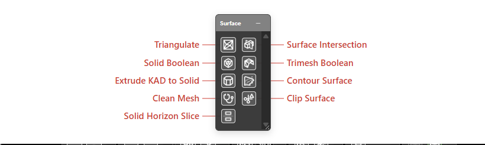
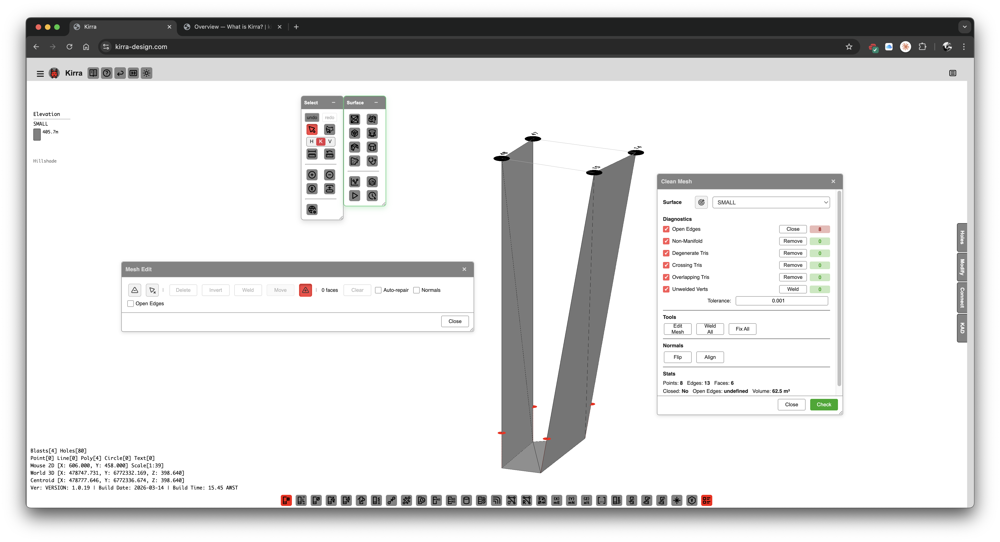
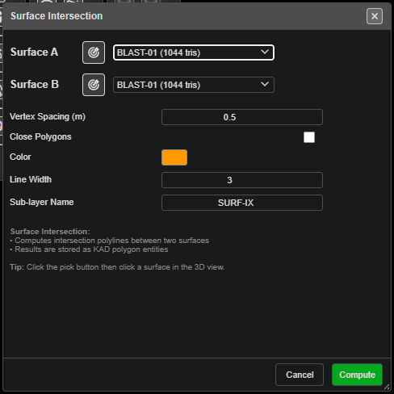
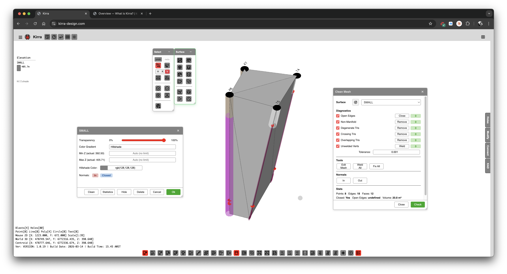
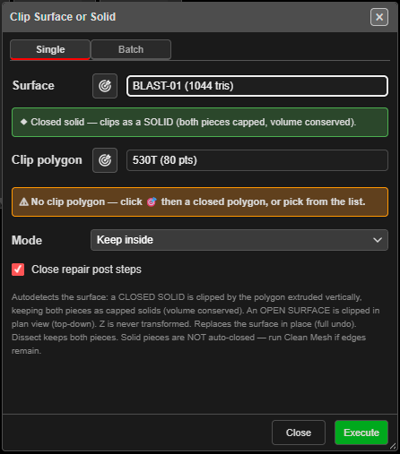
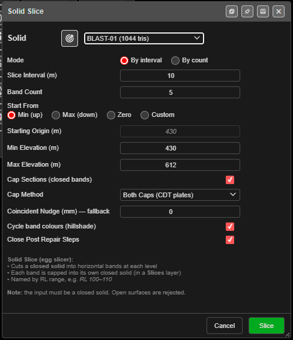
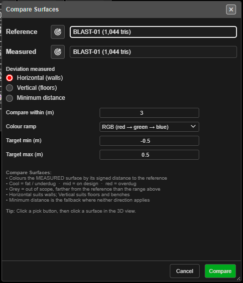

# Surfaces Toolbar

The **Surface** toolbar groups the controls for building, modifying, and repairing triangulated surface meshes — triangulation, mesh intersection, boolean operations (Solid Boolean and Trimesh Boolean), extrude, contour, mesh repair, polygon clipping, and horizon slicing. It is one of Kirra's eight floating toolbars.

---

## Toolbar Overview

*The Surface toolbar with all controls labelled.*

The Surface toolbar contains the following controls (left to right):

| Control | Type | Purpose |
|---------|------|---------|
| **Triangulate** | Dialog | Build a triangulated surface mesh from survey points or drawing data |
| **Surface Intersection** | Tool | Compute the intersection line(s) between two surface meshes |
| **Solid Boolean** | Dialog | Boolean union / intersect / subtract between closed solid volumes (CSG) |
| **Trimesh Boolean** | Dialog | Boolean operations directly between triangulated meshes (open-mesh capable, runs in the background) |
| **Extrude KAD to Solid** | Dialog | Sweep a closed KAD polygon vertically to build a 3D solid volume |
| **Contour Surface** | Dialog | Generate contour lines at regular elevation intervals |
| **Clean Mesh** | Dialog | Mesh diagnostics and repair — open edges, non-manifold, T-junctions, winding, normals, weld |
| **Clip Surface** | Dialog | Clip a surface or solid against a polygon (Single or Batch), keeping the inside or outside portion |
| **Solid Horizon Slice** | Dialog | Slice a closed solid into horizontal bands (a bench / horizon "egg-slicer") |

> *Mesh booleans are difficult; make your meshes as clean and manifold as you can before running them. If one engine fails on a given input, the other may still succeed.*

---

## Triangulate

Builds a triangulated surface from visible inputs — KAD polygons / lines / points, and/or blast hole points.

### How to use

1. Make the input entities **visible** in the Data Explorer (only visible entities are considered)
2. Click the **Triangulate** button on the Surface toolbar — the **Delaunay 2.5D Triangulation** dialog opens
3. Set the options (below)
4. Click **Create** to generate the surface

| Option | Default | Notes |
|--------|---------|-------|
| **Surface Name** | Surface_ followed by a number | |
| **Blast Hole Points** | None - Exclude blast holes | Or **Collar points (surface)**, **Grade points (mid-hole)**, **Toe points (bottom)** or **Measured length points (along hole)** |
| **KAD Breaklines** | Include as constraints | Or **Points only (no constraints)** |
| **Search Distance (XYZ duplicates)** | 0.001 | Points closer than this are treated as duplicates |
| **Minimum Internal Angle** | 0 | Removes sliver triangles below this angle; 0 = no culling. **Consider Angle in 3D?** measures it in 3D |
| **Max Edge Length** | 0 | Removes triangles with longer edges; 0 = no culling. **Consider 3D edge length?** measures it in 3D |
| **Surface Style** | Hillshade | Colour gradient for the new surface |
| **Boundary Clipping** | No boundary clipping | Or **Delete triangles outside polygon** / **Delete triangles inside polygon**, using a closed KAD polygon |

Very large inputs (over about 100,000 points) ask for confirmation first, as triangulation may take several minutes.

See [Importing Surfaces](importing-surfaces.md) for surface-loading workflows and [Mesh Editing](mesh-editing.md) for cleanup after triangulation.

---

## Surface Intersection

Computes the polyline where two surface meshes intersect and draws it as a KAD line entity. Useful for slope-vs-design intersections, pit-shell vs topography, and toe / crest line extraction.

### How to use

At least two surfaces must be loaded.

1. Click the **Surface Intersection** button on the Surface toolbar — the **Surface Intersection** dialog opens
2. Choose **Surface A** and **Surface B** from the lists, or click the pick button beside each and click a surface in the 3D view
3. Set the options:
   - **Vertex Spacing (m)** — simplification tolerance; 0 keeps every vertex (default 1.0)
   - **Close Polygons** — close the intersection polylines into polygons (default on)
   - **Color** and **Line Width** (default 3)
   - **Sub-layer Name** — the sub-layer under **Analysis** the lines are filed in (default **Intersections**)
4. Click **Compute** — the intersection is added as KAD entities

The dialog remembers your last settings.

*The Surface Intersection dialog.*

---

## Solid Boolean

CSG (constructive solid geometry) boolean operations on closed solid meshes:

| Operation | Result |
|-----------|--------|
| **Union (A + B)** | Merged solid |
| **Intersect (A ∩ B)** | Only the overlap |
| **Subtract (A - B)** | A with B removed |
| **Reverse Subtract (B - A)** | B with A removed |
| **Difference (A △ B / XOR)** | Everything except the overlap |

### How to use

1. Click the **Solid Boolean** button on the Surface toolbar — the **Solid Boolean (CSG)** dialog opens
2. Choose **Mesh A** and **Mesh B** (or pick them on the canvas)
3. Choose the **Operation** and the **Result Gradient**
4. Click **Execute**

> **Note:** The Solid Boolean (CSG) engine works best on **closed, manifold** solids. For open surfaces, use the Trimesh Boolean tool.

See [Solid and Trimesh Boolean](boolean-csg.md) for the full reference.

---

## Trimesh Boolean

Kirra's mesh boolean engine, running in the background so it does not block the interface on large meshes. Unlike Solid Boolean, Trimesh Boolean operates directly on triangulated meshes and can handle open surfaces, not only closed solids.

### How to use

1. Click the **Trimesh Boolean** button on the Surface toolbar — the **Trimesh Boolean — Select Surfaces** dialog opens
2. Choose **Surface A** and **Surface B** (or pick them on the canvas)
3. Choose **Split & Pick** (toggle the kept regions yourself) or **Quick Boolean** (one-click Union, Intersect, A−B or B−A)
4. Click **Split** — the surfaces are split into regions classified as inside or outside each other, with progress reported as it runs
5. In the **Trimesh Boolean — Pick Regions** dialog, keep the regions you want or pick the quick operation to preview it; misclassified triangles can be reassigned with **Reclassify**
6. Click **Apply** to merge the kept regions

See [Solid and Trimesh Boolean](boolean-csg.md) for the full reference.

---

## Extrude KAD to Solid

Sweeps a closed KAD polygon up or down by a set depth, producing a 3D solid mesh. Used for pit shells, bench solids, and design volumes.

### How to use

1. Click the **Extrude KAD to Solid** button on the Surface toolbar — the **Extrude KAD to Solid** dialog opens
2. Choose the **Polygon** from the list, or click the pick button and click it on the canvas
3. Set **Depth (m) +ve=up, -ve=down**, **Steps** and **Solid Color**
4. Click **Apply** to produce the solid

See [Extrude, Boolean, and Section Plane](../kad/advanced-tools.md) for the full reference.

---

## Contour Surface

Generates contour lines (constant-elevation polylines) at regular intervals across a surface mesh.

### How to use

1. Click the **Contour Surface** button on the Surface toolbar — the **Surface Contours** dialog opens
2. Choose the **Surface** (or pick it on the canvas)
3. Set the **Contour Interval (m)**
4. Set **Start From** — **Min (up)**, **Max (down)**, **Zero** or **Custom** (with a **Starting Origin (m)**) — and the **Min Elevation (m)** / **Max Elevation (m)** range
5. Click **Generate** — contours are added as KAD entities

See [Surface Contours](contours.md) for the full reference.

---

## Clean Mesh

Opens the **Clean Mesh** dialog — repair self-intersections, fill holes, decimate, and interactively edit triangles and vertices.

### Capabilities

- Detect and remove self-intersections
- Fill small holes
- Remove unused vertices and duplicate triangles
- Decimate (reduce triangle count)
- Interactive triangle / vertex editing via the **Mesh Edit** tool
  - Delete triangles
  - Move vertices
  - Polygon-select triangles
  - Insert triangles

### How to use

1. Click the **Clean Mesh** button on the Surface toolbar
2. Pick the mesh to repair
3. Run automated cleanup (self-intersection removal, hole fill)
4. Switch to interactive edit mode for hand-editing
5. Save the cleaned mesh

See [Mesh Editing](mesh-editing.md) for the full reference.

---

## Clip Surface

Clips a surface or solid against a **clip polygon**, keeping either the inside or the outside portion. The tool auto-detects whether the target is an open surface or a closed solid and caps the cut accordingly. It runs in **Single** mode (one target against one polygon) or **Batch** mode (apply the same clip across multiple targets).

*Clip Surface or Solid, Single tab.*

### How to use

1. Click the **Clip Surface** button on the Surface toolbar — the **Clip Surface or Solid** dialog opens
2. On the **Single** tab, choose the **Surface** to clip (the dialog reports whether it is a closed solid or an open surface)
3. Choose the **Clip polygon** from the list, or click the target button and click a closed polygon on the canvas
4. Choose the **Mode**: **Keep inside**, **Keep outside** or **Dissect (split, keep both)**
5. For solids, leave **Close repair post steps** on to close each piece after the cut
6. Click **Execute**

The **Batch** tab clips one closed **Solid** by many cutters (polygons or lines) in one pass — add each with **Add cutter**, choose a mode (**Dissect**, **Keep inside** or **Keep outside**) and optionally **Extend lines to fill gaps**.

> **Open surfaces** are clipped in plan view along the polygon boundary, with no caps; **closed solids** are clipped by the polygon extended vertically and both pieces are capped, so volume is conserved. The surface is replaced in place and the clip can be undone.

---

## Solid Horizon Slice

Slices a **closed solid** into horizontal bands at a chosen interval or band count, capping each band and saving it as its own named layer (for example, by RL range). Think of it as an egg-slicer for bench / horizon extraction.

*The Solid Slice dialog.*

### How to use

1. Click the **Solid Horizon Slice** button on the Surface toolbar — the **Solid Slice** dialog opens
2. Choose the **Solid** to slice (or pick it on the canvas)
3. Choose the **Mode** — **By interval** (set **Slice Interval (m)**, default 10) or **By count** (set **Band Count**, default 5)
4. Set **Start From** and the **Min Elevation (m)** / **Max Elevation (m)** range
5. Leave **Cap Sections (closed bands)** on to cap each band
6. Click **Slice** — each band is added as its own named layer

> Requires a **closed solid**. Slice an open surface into a solid first (e.g. Extrude KAD to Solid, or close it in Clean Mesh) before slicing.

---

## Compare Surfaces

Colours one surface by its **signed distance** to another — the design-versus-survey question. Cool = **fat / underdug** (rock left standing), the ramp midpoint = **on design**, red = **overdug**. Only the *measured* surface is recoloured; the reference is left alone.

*The Compare Surfaces dialog.*

### How to use

1. Click the **Compare Surfaces** button on the **Analyse** toolbar
2. Pick the **Reference** surface — the design
3. Pick the **Measured** surface — the survey
4. Choose the direction: **Horizontal (walls)**, **Vertical (floors)** or **Minimum distance**
5. Set **Compare within (m)** so surrounding topography is excluded
6. Click **Apply**

> Pick the direction that suits the ground you care about. On a near-vertical wall a vertical drop is meaningless — two surfaces a metre apart horizontally can share an elevation. On a flat bench the reverse is true. Each falls back to minimum distance where it does not apply, so the map stays complete either way.

> **Compare within (m)** matters more than it looks. On a real pair only ~21% of the survey lay within 5 m of the design — without a cutoff the colour range stretches to fit the surrounding topography and the wall detail washes out.

Full reference: [Compare Surfaces](compare-surfaces.md).

---

## Why two boolean engines?

> Mesh booleans are a very difficult space to work in — even after all this time they still don't always play nicely. The two engines are complementary: sometimes one works better than the other. Make your meshes as nice, pretty, and manifold as possible and you will have better results.

In practice:

- **Solid Boolean** — best for closed, well-formed solids
- **Trimesh Boolean** — best for open surfaces and for large or complex meshes (runs in the background, so it won't freeze the interface)

Try one, and if it fails, try the other engine on the same input before reaching for the mesh repair tool.

> **Note:** Kirra's earlier **Surface Boolean** tool has been retired — use **Trimesh Boolean** (or **Solid Boolean** for closed solids) instead. If you have older notes or screenshots referencing it, they no longer apply.

---

## Related topics

- [Importing Surfaces](importing-surfaces.md) — loading DTM, STR, OBJ, PLY, GLTF, etc.
- [Solid and Trimesh Boolean](boolean-csg.md) — boolean engine reference
- [Mesh Editing](mesh-editing.md) — Clean Mesh and Mesh Edit reference
- [Surface Contours](contours.md) — contour generation reference
- [Surface Gradients](gradients.md) — slope / aspect colouring
- [Extrude, Boolean, and Section Plane](../kad/advanced-tools.md) — 3D operations driven from KAD
- [Interface Tour](../getting-started/interface-tour.md) — workspace overview
