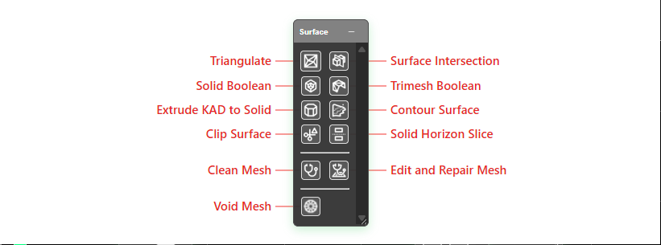

# Surfaces Toolbar

The **Surface** toolbar builds, cuts, combines and repairs triangulated surfaces and solids.
Open it from its tab on the right edge of the window.

*An earlier picture: the three point-cloud tools at the bottom have since moved to the Cloud toolbar, leaving Void Mesh.*

The buttons sit in three groups: the surface tools, then — below the first divider — the two
repair tools, then — below the second — **Void Mesh**.

> **Moved:** **Mesh and Cloud Alignment**, **Facets and Joint Sets** and **Fragments** are
> point-cloud tools, and now sit on the [Cloud toolbar](cloud-toolbar.md).

---

## The controls

| Control | What it does | Other ways to use it | Guide |
|---|---|---|---|
| **Triangulate** | Builds a surface from visible point clouds, points, lines and holes | Select a polygon first to clip to it | [Triangulate](triangulate.md) |
| **Surface Intersection** | Draws the line where two surfaces cross | Pick each surface in 3D | [Surface Intersection](surface-intersection.md) |
| **Solid Boolean** | Union, intersect or subtract two closed solids | Normals button fixes an input | [Solid Boolean](solid-boolean.md) |
| **Trimesh Boolean** | Splits two surfaces and keeps the pieces you choose | **Quick Boolean** tab; **Reclassify** | [Trimesh Boolean](trimesh-boolean.md) |
| **Extrude KAD to Solid** | Pushes a closed polygon into a solid | Select the polygon first | [Extrude KAD to Solid](extrude-kad-to-solid.md) |
| **Contour Surface** | Contour lines at a set interval | **Custom** start for bench RLs | [Contour Surface](contours.md) |
| **Clip Surface** | Cuts a surface or solid with a polygon | **Batch** tab for many cutters | [Clip Surface](clip-surface.md) |
| **Solid Horizon Slice** | Cuts a solid into horizontal bands | **By count** for equal bands | [Solid Horizon Slice](solid-horizon-slice.md) |

### Repair tools

| Control | What it does | Other ways to use it | Guide |
|---|---|---|---|
| **Clean Mesh** | Finds and repairs mesh faults across a whole surface | Right-click a surface → **Clean** | [Clean Mesh](clean-mesh.md) |
| **Edit and Repair Mesh** | Opens Edit Mesh: edit triangles by hand, and find and patch open loops | **Edit Mesh** in Clean Mesh | [Mesh Editing](mesh-editing.md) |

### Void Mesh

Below the second divider:

| Control | What it does | Other ways to use it | Guide |
|---|---|---|---|
| **Void Mesh** | Opens Triangulate with its **3D mesh (caves, voids)** method chosen | **Triangulate** → **Method** | [3D Triangulate](triangulate-3d.md) |

The other point-cloud tools — **Mesh and Cloud Alignment**, **Facets and Joint Sets** and
**Fragments** — are on the [Cloud toolbar](cloud-toolbar.md).

Not sure which boolean to use? See [Which Boolean?](boolean-csg.md)

---

## Working with one surface

Right-click a surface on the canvas — or choose **Properties** from its menu in the tree — to
open its properties. There you set the **Transparency**, **Color Gradient** and elevation
limits, see its area and volume, and reach **Check**, **Clean** and **Smoothing**.

The tree's surface menu adds **Convert to…** (faces, edges or points as KAD), **Footprint…**,
**Normals…** and **Statistics**. See [Importing Surfaces](importing-surfaces.md#surface-properties)
and [Surface Gradients](gradients.md).

---

## Elsewhere

| Tool | Toolbar | Guide |
|---|---|---|
| **Compare Surfaces** — colour a survey by its distance from the design | Analyse | [Compare Surfaces](compare-surfaces.md) |
| **KAD Boolean** — booleans on polygons | Modify | [KAD Boolean](../kad/boolean.md) |
| **Mesh and Cloud Alignment** — move a scan or mesh onto the grid, or onto another | Cloud | [Mesh and Cloud Alignment](mesh-cloud-alignment.md) |
| **Facets and Joint Sets** — rock-wall facets grouped into joint sets | Cloud | [Facets and Joint Sets](facets-joint-sets.md) |
| **Fragments** — rock sizes from a point cloud | Cloud | [Cloud Toolbar](cloud-toolbar.md) |

---

## Related

- [Importing Surfaces](importing-surfaces.md)
- [Surface Gradients](gradients.md)
- [Mesh Editing](mesh-editing.md)
- [Point Clouds](point-clouds.md)
- [Cloud Toolbar](cloud-toolbar.md)
