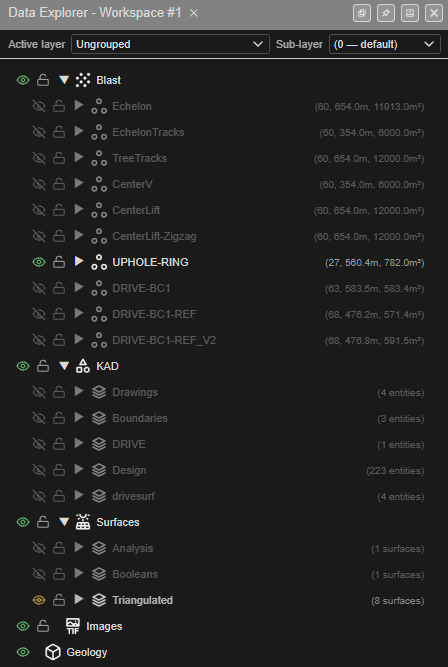
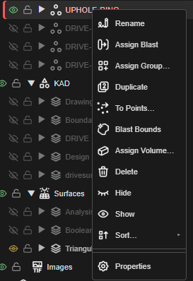

# Data Explorer

The **Data Explorer** lists everything loaded in the workspace — blasts and their holes, KAD
drawings, surfaces, images and geology — as a tree. Use it to show and hide things, lock
them, select them, and reach their right-click tools.

---

## Open the Data Explorer

Click **Data Explorer** at the right-hand end of the top bar. Click it again to close it.

*The Data Explorer. Grey rows are hidden; the eye icon is green on visible rows.*

The title reads **Data Explorer - Workspace #N** — the [workspace](workspaces.md) this window
is using.

### Window buttons

The four buttons at the right of the title bar:

| Button | What it does |
|--------|--------------|
| **Open in new window** | Pops the Data Explorer out into its own browser window |
| **Dock to edge** / **Undock** | Docks it to the edge of the window, or floats it again |
| **Collapse** / **Expand** | Folds it down to its title bar, or opens it again |
| **Close** | Closes it |

---

## What's in the tree

| Group | Holds |
|-------|-------|
| **Blast** | One row per blast, each holding its holes (and groups, if any) |
| **KAD** | Drawing layers, each holding points, lines, polygons, circles and text |
| **Surfaces** | Surface layers, each holding surfaces and solids |
| **Images** | Imported images such as GeoTIFFs |
| **Geology** | Block models |

Click the ▶ arrow to open a row, ▼ to close it.

### The grey text on each row

| Row | Example | Means |
|-----|---------|-------|
| Blast | `(60, 654.0m, 11913.0m³)` | Number of holes, total hole length, and blast volume (from **Assign Volume…**) |
| Drawing layer | `(4 entities)` | Number of drawings in the layer, including its sub-folders |
| Surface layer | `(8 surfaces)` | Number of surfaces in the layer |
| Group | `(12 holes)` | Number of holes in the group; **fx** marks a live (formula) group |

### Active layer

The bar at the top sets where **new** drawings and surfaces go:

- **Active layer** — the layer new work is added to. Choose **+ New Layer…** to make one.
- **Sub-layer** — the folder inside it. Choose **+ New Sub-layer…** to make one.

See [Layer Organisation](../kad/layer-organisation.md) for how layers and sub-layers nest.

---

## Show, hide and lock

Each row has two icons at its left.

| Icon | States | Click it to |
|------|--------|-------------|
| **Eye** | Visible · Hidden · Mixed (some of the contents hidden) | Show or hide the row and everything inside it |
| **Lock** | Unlocked · Locked · Some locked | Lock or unlock the row and everything inside it |

A **locked** item stays visible but cannot be selected or edited — use it to protect a
finished design while you work around it. Most right-click actions on a locked row first ask
**Unlock and …?**; **Delete** is refused until you unlock it.

> **Tip:** Hiding is the quickest way to work on one blast at a time. Exports also follow
> visibility — hide what you don't want in the file.

---

## Select in the tree

| Do this | Result |
|---------|--------|
| Click a row | Selects it |
| **Shift** + click | Selects the range of rows between |
| **Ctrl** + click (**Cmd** on a Mac) | Adds or removes one row |
| **Delete** or **Backspace** | Deletes the selected rows (see **Delete** below) |
| **Escape** | Clears the selection |

---

## Right-click menu

Right-click a row for its tools. The menu shows only the items that fit what you clicked.

*Right-clicking a blast.*

### Blasts and holes

| Item | What it does |
|------|--------------|
| **Rename** | Renames the blast, or the hole's ID. With several holes selected, moves them to a blast name you type |
| **Assign Blast** | Moves the holes to another blast |
| **Assign Group…** | Puts the holes into a named group |
| **Duplicate** | A blast: copies it as a new blast. Holes: copies them into a new blast |
| **To Points…** | Makes KAD points at the visible holes |
| **Blast Bounds** | Draws a red boundary polygon around each blast's visible holes (needs at least 3) |
| **Assign Volume…** | Chooses how the blast volume is worked out — for example *Burden × Spacing × hole length* |
| **Reset Connections** | (Holes only.) Removes the holes' ties: each hole is tied to itself, with zero delay and hole time |
| **Properties** | Opens the hole editor for the hole, holes or blast |

### Groups

| Item | What it does |
|------|--------------|
| **Edit Group…** | Changes the group's name, its manual or live mode, its formula and its members |
| **Remove from Group** | Takes the selected holes out of the group (not for live groups, whose members come from the formula) |
| **Remove Group** | Deletes the group. The holes stay |

### Drawings (KAD)

| Item | Shows on | What it does |
|------|----------|--------------|
| **Add Layer** | The **KAD** group | Creates a drawing layer |
| **Make Active** | A layer | Makes it the active layer (not a locked one) |
| **Rename** | A layer, folder or drawing | Renames it |
| **Duplicate** | A layer, folder or drawing | Copies it as `<name>_copy` |
| **Move to Layer** | A layer, folder or drawing | Moves it to another layer |
| **Circle to Polygon** | Circles only | Replaces each circle with a 36-sided polygon. **The circles are removed** |
| **Text to Poly** | Text only | Turns the text into line or polygon outlines. The text is kept |
| **Select objects/holes fully inside** | Polygons | Selects the holes — or drawings or vertices, by the H / K / V mode — wholly inside the polygon |
| **Statistics** | Lines, polygons, points | Opens a read-only table of the drawing's statistics |
| **Properties** | A drawing | Opens its editor |

### Surfaces

| Item | Shows on | What it does |
|------|----------|--------------|
| **Add Layer** | The **Surfaces** group | Creates a surface layer |
| **Make Active** | A layer | Makes it the active layer |
| **Duplicate** | A surface | Copies it |
| **Move to Layer** | A surface | Moves it to another layer |
| **Send to Image…** | Surfaces, a layer, or the group | Renders the surfaces as an image in **Images** |
| **Convert to…** ▸ **Faces** / **Edges** / **Points** | A surface | Makes KAD polygons (one per triangle), lines (one per edge) or points. Asks first if this would make more than 5,000 drawings |
| **Footprint…** ▸ **Ceiling** / **Floor** / **Edge** | A surface | Draws the outline at the highest elevation, the lowest, or along the real open edge |
| **Normals…** ▸ **Flip Normals** / **Align Normals** / **Normals Out** / **Normals In** / **Orient** | A surface | Flips, aligns (faces up), points a closed solid's faces out or in, or makes the winding consistent |
| **Statistics** | A surface | Opens a read-only **Surface Statistics** table |
| **Properties** | A surface | Opens the surface menu |

### Trunks

| Item | What it does |
|------|--------------|
| **Convert to Hole Ties** | Replaces the trunk with hole-to-hole ties. It asks first, and cannot be converted back |

### On everything

| Item | What it does |
|------|--------------|
| **Hide** / **Show** | Hides or shows the row and everything inside it |
| **Sort…** ▸ **0 → 9** / **9 → 0** / **A → Z** / **Z → A** | Re-orders the rows in the tree. Your data is not changed |
| **Delete** | Deletes the selection — see below |

### Delete

| Deleting | What happens |
|----------|--------------|
| Holes, drawings, vertices | Deleted; **Undo** (Ctrl+Z) brings them back. Deleting some holes of a blast asks **Renumber Holes?** |
| A layer | **Delete Layer(s)** asks: **Delete All** (the layer and its contents), **Keep Entities**, or **Cancel** |
| A trunk or block model | Asks to confirm |
| A surface or image | **Deleted straight away — no confirmation and no undo** |

> **Warning:** **Circle to Polygon**, **Remove Group**, **Reset Connections** and deleting a
> surface or image happen without a confirmation. Export a [KAP project](starting-and-saving.md#back-up-and-move-your-work)
> before large clean-ups.

---

## Troubleshooting

**A blast is in the tree but not on the canvas.**
Its eye is off (the row is grey). Click the eye.

**I can't select something on the canvas.**
It is locked — click its lock icon.

**My new drawing went onto the wrong layer.**
Check **Active layer** at the top of the Data Explorer before drawing.

---

## Related

- [Layer Organisation](../kad/layer-organisation.md)
- [Selection & Snapping](selection-and-snapping.md)
- [Editing Holes](../blast-design/editing-holes.md)
- [Mesh Editing](../surfaces/mesh-editing.md)
