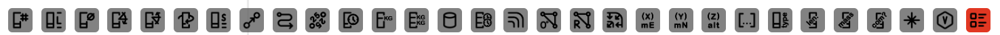
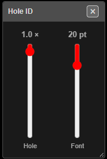

# Display Options

The row of buttons along the bottom of the window chooses what Kirra draws on and around
each hole — IDs, lengths, angles, times, charges, timing contours and more. Each button is
an on/off switch, and most have extra settings on a right-click.

*The display toolbar. A red button is on; grey is off. Hover over any button for its name.*

---

## Turn a label on or off

1. Find the button along the bottom of the window (hover to see its name).
2. Click it. The button turns red and the labels appear on every visible hole.
3. Click it again to turn the labels off.

Labels show in both the 2D and 3D views.

> **Tip:** Many labels at once soon clutter a dense pattern. Turn on only what you need for
> the task, and use **Hide** in the [Data Explorer](data-explorer.md) to show one blast at
> a time.

---

## The buttons

In order, left to right:

| # | Button | Shows |
|---|--------|-------|
| 1 | **Hole ID** | The hole's ID. On by default |
| 2 | **Hole Length** | Collar-to-toe length |
| 3 | **Hole Diameter** | Diameter (mm) |
| 4 | **Hole Angle** | Angle from vertical (0° = vertical) |
| 5 | **Hole Dip** | Dip, or mast angle (90° = vertical) |
| 6 | **Hole Bearing** | Bearing (0° = north, clockwise) |
| 7 | **Hole Subdrill** | Subdrill |
| 8 | **Ties** | Surface ties (connectors) between holes |
| 9 | **Channel Colours** | Draws ties in their harness channel colour, with each hole's sequence number and harness ID — see [Harness Wire Assignment](../charging/harness-wire-assignment.md) |
| 10 | **Delay Value** | The tie delay into each hole (ms) |
| 11 | **Hole Time** | Firing time (ms) |
| 12 | **Stemming Length** | Length of the inert decks (right-click to choose which — see below) |
| 13 | **Mass Per Hole** | Explosive mass in the hole |
| 14 | **Mass Per Deck** | Explosive mass in each deck |
| 15 | **Charges** | The charge decks down each hole |
| 16 | **Downhole Timing** | Deck timing labels (right-click to choose which — see below) |
| 17 | **Contours** | Timing contours — lines of equal firing time |
| 18 | **Slope** | The timing gradient over the pattern |
| 19 | **Relief** | Burden relief — how much has moved before each hole fires |
| 20 | **First Movement** | Arrows showing which way each area moves |
| 21 | **Hole X Location** | Collar easting |
| 22 | **Hole Y Location** | Collar northing |
| 23 | **Hole Z Location** | Collar elevation |
| 24 | **Row and Position** | Row and position IDs, or burden and spacing (right-click to choose) |
| 25 | **Hole Type** | Hole type (Production, Presplit …) |
| 26 | **Measured Length** | The recorded as-drilled length — see [Record Actuals](starting-and-saving.md#record-actuals) |
| 27 | **Measured Mass** | The recorded as-charged mass |
| 28 | **Comment** | The recorded comment |
| 29 | **KAD Point IDs** | The point number at each vertex of KAD drawings |
| 30 | **Voronoi** | Voronoi cells around the holes (right-click opens **Voronoi Options**) |
| 31 | **Legend** | The colour legend for the active display. On by default |

Contours, Slope, Relief and First Movement are explained in
[Timing Contours, First Movement and Relief](../blast-design/timing-contours.md). Voronoi
modes are explained in [PPV — Voronoi Modes](../analysis/ppv-voronoi-modes.md).

---

## Right-click a button to adjust it

Right-click a button to open a small popover beside it. The change applies straight away;
close the popover with its **×**.

*Right-clicking **Hole ID** opens sliders for the hole symbol size and the label font size.*

| Right-click on | Popover | Controls |
|----------------|---------|----------|
| **Hole ID** | Hole ID | **Hole** — size of the hole symbol (0.5–20 ×); **Font** — label size (1–100 pt) |
| **Hole Length** | Length | **Toe** — radius of the toe circle (0–30 m); **Font** |
| **Ties** | Tie Size | **Tie** — size of the tie arrows |
| **First Movement** | First Move | **Size** of the arrows, and their colour |
| **Contours** | Contour | **ms** — the contour interval (5–1,000 ms), plus the contour display and label options described in [Timing Contours](../blast-design/timing-contours.md) |
| **Hole Diameter**, **Hole Angle**, **Hole Dip**, **Hole Bearing**, **Hole Subdrill**, **Delay Value**, **Hole Time**, **Hole X / Y / Z Location**, **Hole Type**, **Measured Length**, **Measured Mass**, **Comment**, **KAD Point IDs** | Font Size | **Font** — every text label shares this one size |

The **Snap** button in the top bar has a popover too — see
[Selection & Snapping](selection-and-snapping.md#snapping).

### Buttons with a menu instead

Some buttons offer a choice rather than a slider. Pick an entry to set what the label
shows.

| Right-click on | Choices |
|----------------|---------|
| **Stemming Length** | **All**, **Stemming**, **Air**, **Water**, **StemGel**, **DrillCuttings** — which inert deck types the label adds up |
| **Row and Position** | **Row and Pos** (the IDs) or **Burden and Spacing** (the values) |
| **Downhole Timing** | **Downhole Deck Time**, **Load/Primer Offsets**, **Timing/Function Offsets**, **Deck Time and Primer**, **Deck Time and Timing** |
| **Mass Per Hole** / **Mass Per Deck** | **Include primer / booster mass** or **Exclude primer / booster mass** |
| **Voronoi** | Opens the **Voronoi Options** dialog |

The same sizes can also be set on the **2D** tab of the [Settings](settings.md) dialog.

---

## Troubleshooting

**A label is switched on but nothing shows.**
The hole has no value for it yet. Mass, charges and stemming need the hole to be charged;
times need ties; Measured Length / Mass / Comment need recorded actuals.

**Labels overlap and can't be read.**
Lower the font with a right-click on any text button, or turn off labels you don't need.

**The labels are on but a blast is missing.**
That blast is hidden. Show it from the [Data Explorer](data-explorer.md).

---

## Related

- [Timing Contours, First Movement and Relief](../blast-design/timing-contours.md)
- [Settings](settings.md) — default sizes on the 2D tab
- [Printing](../printing/pdf-print.md)
