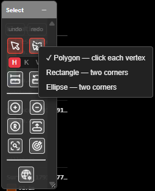
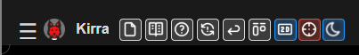

# Selection & Snapping

Most Kirra tools act on what is selected, and most drawing tools place points by snapping to
something already there. This page explains how selecting and snapping work everywhere in
Kirra. The button-by-button reference is in [Select Toolbar](../reference/select-toolbar.md).

---

## What can be selected: H / K / V

The **H / K / V** switch on the **Select** toolbar decides what a click or a shape picks up.

| Mode | Selects |
|------|---------|
| **H** — Select Holes | Holes |
| **K** — Select KAD | Whole KAD drawings — points, lines, polygons, circles, text |
| **V** — Select KAD Vertices | Individual vertices of KAD drawings |

> **Tip:** If a click selects nothing, check H / K / V first — it is the most common reason.

---

## Select by clicking

With **Pointer Select** active (it is the default tool):

| Do this | Result |
|---------|--------|
| Click an item | Selects it, replacing the selection |
| **Shift** + click | Adds the item — or removes it if it is already selected |
| **Ctrl** + click (**Cmd** on a Mac) | Removes the item from the selection |
| Click empty canvas | Clears the selection |
| **Escape** | Clears the selection (a second **Escape** also leaves the current tool) |

These work the same in the 2D and 3D views.

---

## Select by drawing a shape

**Polygon Select** picks everything inside a shape you draw. **Right-click** its button to
choose the shape — the choice is remembered.

| Shape | How to draw it |
|-------|----------------|
| **Polygon — click each vertex** | Click each corner, then double-click to close |
| **Rectangle — two corners** | Click one corner, then the opposite one |
| **Ellipse — two corners** | Click two opposite corners of the ellipse's box |

Hold **Shift** as you finish the shape to add to the selection, or **Ctrl** (**Cmd**) to
remove from it.

---

## Select from the Data Explorer or by criteria

- Click rows in the [Data Explorer](data-explorer.md) — **Shift** selects a range, **Ctrl**
  (**Cmd**) adds or removes one row.
- **Find Select Zoom** on the Select toolbar selects holes or drawings that match criteria —
  hole type, diameter, elevation and more — and zooms to them. See
  [Find Select Zoom](../reference/select-toolbar.md#find-select-zoom).

### Things you cannot select

A **locked** item stays visible but cannot be selected. Lock and unlock items with the lock
icon in the [Data Explorer](data-explorer.md#show-hide-and-lock).

---

## Snapping

When snapping is on, the cursor jumps to the nearest thing worth snapping to — a hole collar,
a drawing vertex, a surface — so points land exactly on existing work.

### Turn snapping on or off

Click **Snap** in the top bar. A red tint means snapping is on; it is on when Kirra starts.

### How close the cursor must be

**Right-click** **Snap** to open the **Snap** popover and drag **Radius** (0–100 screen
pixels). The same value is **Snap Tolerance (px)** on the **2D** tab of
[Settings](settings.md). The radius is in screen pixels, so it covers less ground as you zoom
in.

### What Kirra snaps to

When several things are inside the radius, Kirra takes the first in this list:

1. Hole collar
2. Hole grade
3. Hole toe
4. KAD point
5. KAD line vertex
6. KAD polygon vertex
7. Where two KAD segments cross (in plan)
8. KAD circle centre
9. KAD text position
10. A point along a KAD line
11. A point along a KAD polygon edge
12. Block model cell corner
13. Block model cell edge midpoint
14. Surface point
15. Surface face

While the cursor is snapped, the **World 3D** line in the information overlay reads
**Snapped 3D**.

### Self-snap

When you move KAD points, they normally ignore their own drawing. Hold **S** to let them snap
to other points of the same drawing.

---

## Troubleshooting

**Points won't snap where I expect.**
Something higher in the list above is inside the radius — zoom in, or lower the **Radius**.

**Snapping grabs things I don't want.**
Lower the radius, or turn **Snap** off for free placement.

**Clicking a hole does nothing.**
Check the **H / K / V** mode, and check the hole is not locked in the Data Explorer.

---

## Related

- [Select Toolbar](../reference/select-toolbar.md) — every button in detail
- [Keyboard Shortcuts & Mouse Controls](../reference/keyboard-shortcuts.md)
- [Views & Navigation](views-and-navigation.md)
