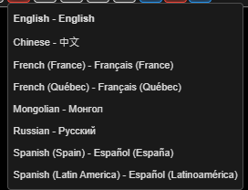
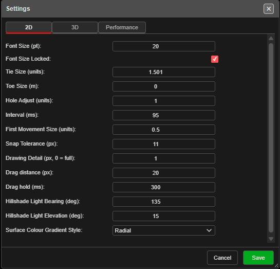
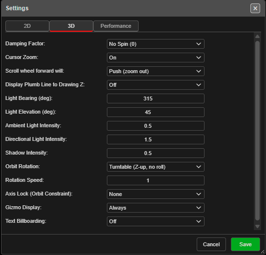
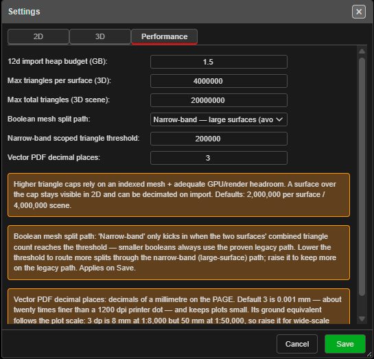

# Settings

This page covers the theme, the language, and the **Settings** dialog — label sizes, snap
tolerance, camera and lighting, and performance limits.

---

## Theme (light or dark)

Click **Toggle Dark Mode** — the sun / moon button at the end of the top bar. Kirra switches
straight away and remembers the choice in this browser.

---

## Language

Choose a language from **Select Language** in the top bar, or from the **Language** group in
the side panel (**☰**).

Kirra switches straight away and remembers the choice. Blasting terms are translated as
blasting terms, not word for word — see the [Blasting Glossary](../reference/blasting-glossary.md).
Parts of Kirra not yet translated show in English.

---

## The Settings dialog

Open **Settings** with the **3D Settings** button — the globe-and-cog at the bottom of the
**Select** toolbar. It opens on the **3D** tab.

| Tab | When changes apply |
|-----|--------------------|
| **2D** | **Straight away**, as you change each value. **Cancel** does not undo them |
| **3D** | When you click **Save** |
| **Performance** | When you click **Save** |

### 2D tab

| Setting | Default | What it does |
|---------|---------|--------------|
| **Font Size (pt)** | 14 | Size of labels on the canvas |
| **Font Size Locked** | On | **On**: labels stay the same size on screen as you zoom. **Off**: labels grow and shrink with the zoom (2D only) |
| **Tie Size (units)** | 3 | Size of the tie arrows |
| **Toe Size (m)** | 0 | Radius of the circle drawn at each toe |
| **Hole Adjust (units)** | 2 | Enlarges the hole symbols — at the default they are drawn at twice their true size |
| **Interval (ms)** | 100 | Interval between [timing contours](../blast-design/timing-contours.md) |
| **First Movement Size (units)** | 2 | Size of the first-movement arrows |
| **Snap Tolerance (px)** | 15 | How close, in screen pixels, the cursor must be to [snap](selection-and-snapping.md#snapping) |
| **Drawing Detail (px, 0 = full)** | 1 | In 2D, skips line vertices closer together than this on screen. 0 draws every vertex |
| **Drag distance (px)** | 5 | How far a press must move before it counts as a drag rather than a click |
| **Drag hold (ms)** | 300 | Not used by current versions |
| **Hillshade Light Bearing (deg)** | 135 | Direction of the light on hillshaded surfaces |
| **Hillshade Light Elevation (deg)** | 15 | Height of that light above the horizon |
| **Surface Colour Gradient Style** | Radial | **Radial**, **Default** or **Baycentric** |

Several of these are also on right-click popovers of the
[display buttons](display-options.md#right-click-a-button-to-adjust-it).

### 3D tab

| Setting | Default | What it does |
|---------|---------|--------------|
| **Damping Factor** | No Spin (0) | How long the view keeps turning after an orbit — **No Spin (0)**, **Low (0.3)**, **Medium (0.5)**, **High (0.7)**, **Max Spin (1)** |
| **Cursor Zoom** | On | **On** zooms towards the cursor; **Off** zooms towards the centre of the view |
| **Scroll wheel forward will** | Push (zoom in) | **Push (zoom in)** or **Push (zoom out)** |
| **Display Plumb Line to Drawing Z** | Off | Draws a vertical line from the cursor to the drawing elevation |
| **Light Bearing (deg)** | 135 | Direction of the main light (0 = north, clockwise) |
| **Light Elevation (deg)** | 15 | Height of the main light above the horizon |
| **Ambient Light Intensity** | 0.8 | Strength of the even, all-round light |
| **Directional Light Intensity** | 2.5 | Strength of the main light |
| **Shadow Intensity** | 0.5 | Strength of shading. 0 turns it off |
| **Orbit Rotation** | Turntable (Z-up, no roll) | **Turntable** keeps the horizon level; **Trackball (grab point)** turns about the point you grab; **Legacy (mouse delta)** is the older behaviour |
| **Rotation Speed** | 1 | How fast a drag orbits (−5 to 5). A negative value reverses the direction |
| **Axis Lock (Orbit Constraint)** | None | Limits orbiting to one motion — **None**, **Pitch (tilt up/down)**, **Bearing (swing around)**, **Spin (about view axis)** |
| **Gizmo Display** | Only When Orbit or Rotate | When to show the axis gizmo — **Always**, **Only When Orbit or Rotate**, **Never** |
| **Text Billboarding** | Off | Turns text to face the camera — **Off**, **On (Holes)**, **On (KAD)**, **On (All)** |

The screenshots show one user's values, not the defaults.

### Performance tab

| Setting | Default | What it does |
|---------|---------|--------------|
| **12d import heap budget (GB)** | 1.5 | Memory allowed when importing large 12d Archive files |
| **Max triangles per surface (3D)** | 2,000,000 | A surface with more triangles is not drawn in 3D. It still shows in 2D, and can be reduced on import |
| **Max total triangles (3D scene)** | 4,000,000 | Limit for all surfaces drawn in 3D together |
| **Boolean mesh split path** | Narrow-band | **Narrow-band — large surfaces** (avoids running out of memory) or **Legacy — full mesh** (small surfaces) |
| **Narrow-band scoped triangle threshold** | 200,000 | Booleans on fewer triangles than this always use the legacy path |
| **Vector PDF decimal places** | 3 | Decimals of a millimetre on the page in vector PDF plots. Raise it for large-scale plots that will be measured; files get bigger |

Higher triangle limits need a capable graphics card.

---

## Where settings are kept

Settings belong to this browser on this computer, not to a workspace — every workspace in
this browser uses the same settings.

Most of them also travel inside a **KAP** project, so a colleague who opens your project sees
your label sizes and 3D setup. **Snap Tolerance**, **Drag distance** and **Drag hold** stay on
your computer.

---

## Troubleshooting

**Labels are tiny / huge.**
Change **Font Size (pt)** on the 2D tab, or right-click any text [display button](display-options.md).

**The scroll wheel zooms the wrong way.**
Change **Scroll wheel forward will** on the 3D tab and click **Save**.

**A big surface shows in 2D but not in 3D.**
It has more triangles than **Max triangles per surface (3D)**. Raise the limit on the
Performance tab, or reduce the surface when importing it.

---

## Related

- [Display Options](display-options.md)
- [Views & Navigation](views-and-navigation.md)
- [3D View & Orbit Focus](../reference/3d-tools.md)
