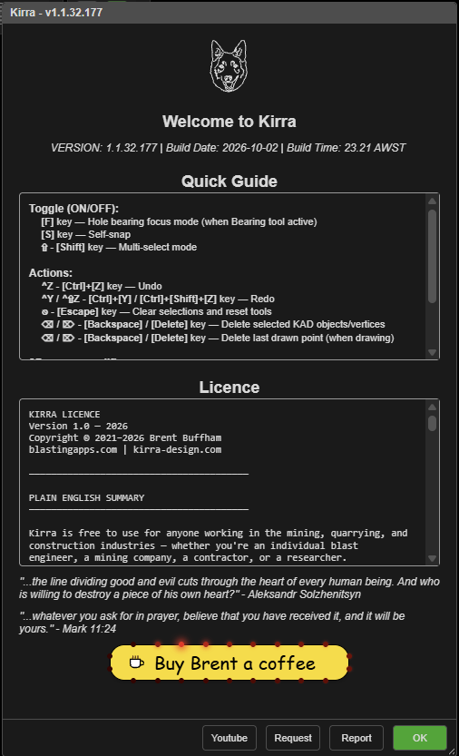
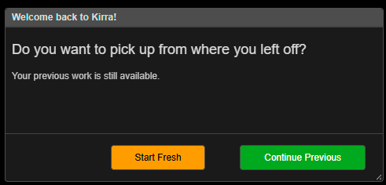
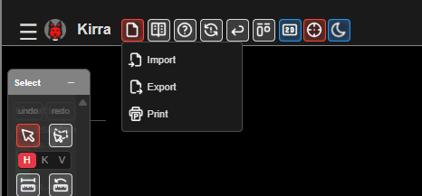
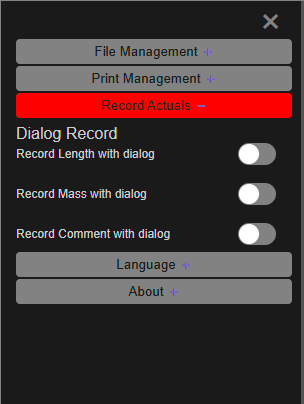

# Starting, Saving & Projects

Kirra saves your work as you go — there is no Save button for day-to-day work. This page
covers what happens when Kirra starts, how and where your work is kept, and how to back it
up or move it with a **KAP** project or **KAT** template.

---

## When Kirra starts

### Welcome to Kirra

Every start opens **Welcome to Kirra**. It shows the version and build date, a **Quick
Guide** to the main keys, and the licence.

| Button | What it does |
|--------|--------------|
| **OK** | Carries on into Kirra |
| **Report** | Opens your email program with a bug-report email to the developer, already filled in with the Kirra build and your browser |
| **Request** | Opens your email program with a feature-request email |
| **Youtube** | Opens the Kirra YouTube channel in a new tab |

Whichever button you click, Kirra then carries on starting. The dialog has no **×** — pick
a button.

> **Tip:** The version in the title (for example **Kirra - v1.1.32.332**) is the one to
> quote in a bug report.

### Welcome back to Kirra!

If the workspace already holds work, Kirra asks whether to pick it up again.

| Button | What it does |
|--------|--------------|
| **Continue Previous** | Loads the workspace's holes, drawings, surfaces and timing, and zooms to them |
| **Start Fresh** | **Deletes** the workspace's holes, drawings, surfaces, images, timing and layers, and starts empty. Your libraries — products, charge rules, pattern templates — are kept |

> **Warning:** **Start Fresh** is not "open a new file". It empties this workspace and
> cannot be undone. To start something new without losing your work, use an empty
> [workspace](workspaces.md) instead — or export a [KAP project](#back-up-and-move-your-work)
> first.

An empty workspace does not show this prompt.

### Move Your Project

The first time a newer version of Kirra opens work saved before workspaces existed, it
offers **Move Your Project**. **Move My Data** moves that work into the current workspace;
**Continue Without Moving** leaves it where it is.

---

## How your work is saved

- **Automatically.** About two seconds after a change, Kirra saves it. Changes still waiting
  are saved when you close the tab or switch away from it.
- **Into the current workspace.** Holes, drawings, surfaces, images, layers, charging,
  timing, products, charge rules and pattern templates are saved to the workspace this window
  is using.
- **In this browser, on this computer.** Nothing is uploaded. A different browser, a private
  window, or another computer does not see your work.
- **View preferences** — label sizes, colours and similar — are kept by the browser
  separately from the workspace.

There is no save indicator and nothing to switch on.

> **Warning:** Clearing your browser's "site data" or "cookies and site data" for Kirra
> deletes every workspace. Export a KAP project of anything you need to keep.

### Reload and Go Back

- **Reload** in the top bar reloads Kirra straight away. Your work is kept; you see
  **Welcome to Kirra** again.
- **Go Back** asks **Leave Kirra?** — **Leave** goes to blastingapps.com, **Stay** cancels.

---

## Back up and move your work

Two Kirra file types hold your work. Both are on the **Kirra** tab of the **Import** and
**Export** dialogs (top bar **Import Export Print**, or **File Management** in the side
panel).

| File | Holds | Use it to |
|------|-------|-----------|
| **Kirra Application Project** (`.kap`) | Everything in the workspace — blasts, drawings, surfaces, images, charging, timing and libraries | Back up a job, send it to someone, or move it to another workspace or computer |
| **Kirra App Template** (`.kat`) | Site setup only — products, charge rules, pattern and print templates, seeds, monitors, schemas | Set up a new workspace or a colleague with your site's standards |

### Save a project

1. Open **Import Export Print** ▸ **Export**.
2. On the **Kirra** tab, click **Save** on the **Kirra Application Project** row (or the
   **Kirra App Template** row).
3. Choose where to save the file.

### Open a project into a workspace with work in it

Opening a KAP into an empty workspace simply loads it. If the workspace already has work,
**Import KAP File** asks **How should this import proceed?**

| Option | Result |
|--------|--------|
| **Merge — add to what I have (nothing is lost)** | Adds the file's contents to the workspace |
| **Replace data, merge libraries — their blast, plus any products or templates it brings** | Replaces your blasts, drawings and surfaces with the file's; adds its libraries to yours |
| **Replace data, keep my libraries — their blast, my catalogue untouched** | Replaces your data with the file's; your libraries stay exactly as they are |
| **⚠ Replace everything — my products, templates and seeds are deleted** | Replaces data **and** libraries with the file's |

Click **Import**, or **Cancel Import** to stop.

A KAT asks **Import KAT — Site Template** — **How should these libraries be imported?**:

| Option | Result |
|--------|--------|
| **Merge — add these libraries to what is here (nothing is lost)** | Adds the template's libraries |
| **⚠ Start Fresh — clear this workspace, then load this template** | Empties the workspace, then loads the template |

If the file's coordinates are far from what is already loaded, Kirra first asks how to
handle that — see [Import Dialog](../importing/import-dialog.md).

More detail: [KAP and KAT import](../importing/other-formats.md) ·
[KAT export](../exporting/other-formats.md).

---

## Record Actuals

The **Record Actuals** group in the side panel (open it with **☰**) records as-drilled and
as-charged values against your design holes.

| Switch | Records |
|--------|---------|
| **Record Length with dialog** | Measured hole length |
| **Record Mass with dialog** | Measured explosive mass |
| **Record Comment with dialog** | A free-text comment |

1. Turn on one switch. Only one can be on at a time, and turning one on ends any other
   tool. Kirra also switches on the **Hole ID** label and the matching measured label.
2. In the **2D** view, click a hole.
3. Enter the value in the dialog that opens — for example *"Record the measured length of
   hole. Hole: A12"* — and confirm. The comment dialog starts with the last comment you
   entered.
4. Click the next hole. Turn the switch off when you are done.

Each value is saved on the hole with the date and time it was recorded. Hidden holes are
skipped. Show the values with the **Measured Length**, **Measured Mass** and **Comment**
buttons on the [display toolbar](display-options.md). To load measured values
from a file instead, see [CSV formats — Measured Data](../importing/csv-formats.md#measured-data).

---

## Troubleshooting

**My work has gone after reopening Kirra.**
Check you are in the same workspace (the window title and the red chip on the
[Workspace toolbar](workspaces.md)), and in the same browser. If you clicked **Start
Fresh**, that workspace was emptied — open your last KAP export.

**Kirra asked me to "Continue Previous" but I want a blank page.**
Click **Continue Previous**, then open an empty workspace from the Workspace toolbar.

---

## Related

- [Workspaces](workspaces.md)
- [Import Dialog](../importing/import-dialog.md)
- [Data Explorer](data-explorer.md)
