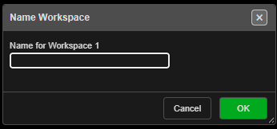
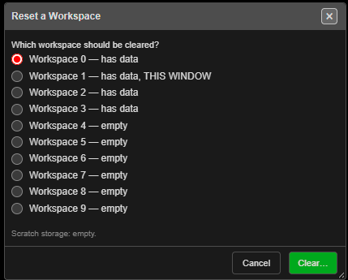

# Workspaces

Kirra keeps **ten separate workspaces**, numbered **0** to **9**. Each one is a complete,
separate store of holes, drawings, surfaces, charging, timing and libraries. Use them to
keep jobs apart — one blast per workspace, a test copy beside the real one, or a clean
workspace to try something without touching your work.

---

## Prerequisites

- Nothing. Workspace **0** is used unless you choose another.

---

## The Workspace toolbar

Open the **Workspace** toolbar from its tab on the right edge of the window.

*Ten workspace chips and, at the bottom, **Reset or clear a workspace**.*

**Reading the chips:**

| Chip | Means |
|------|-------|
| **Red** border | The workspace this window is using |
| **Green** border | Holds data |
| Dimmed | Empty |

Hover over a chip for the same information in words, for example
*"Workspace 2 — has data"*.

---

## Open another workspace

1. Click a workspace chip.
2. In a browser, the workspace opens **in its own window**. Clicking the same chip again
   brings that window forward rather than opening a second copy.
3. Work in it as normal. Each window saves to its own workspace.

Clicking the chip of the workspace you are already in shows **Already Here**.

> **Note:** If nothing opens, the browser blocked the new window and Kirra shows
> **Popup Blocked**. Allow pop-ups for Kirra and click the chip again.

**In the desktop app**, there is one window. Clicking a chip asks **Switch Workspace** —
*"Unsaved changes are lost."* Click **Switch** to change this window to that workspace, or
**Cancel**.

### Open a workspace from its address

Each workspace has its own address: add `?ws=` and the number to Kirra's address, for
example `?ws=3` for Workspace 3. Without it, Kirra opens Workspace 0. Bookmark an address to
go straight to a job.

---

## Name a workspace

1. **Right-click** a workspace chip.
2. In **Name Workspace**, type a name in **Name for Workspace N**.
3. Click **OK**.

The name shows in the window title and the chip's tooltip. Leave the field blank and click
**OK** to remove the name. Names are kept by this browser on this computer.

---

## Clear a workspace

Clearing removes **everything** in a workspace. It cannot be undone — export a
[KAP project](starting-and-saving.md#back-up-and-move-your-work) first if you may want any
of it again.

1. Click **Reset or clear a workspace** at the bottom of the Workspace toolbar.
2. In **Reset a Workspace**, choose the workspace under **Which workspace should be
   cleared?** Each line says whether it has data and which one is **THIS WINDOW**.
3. Click **Clear…**.
4. Read the confirmation — *"Holes, drawings, surfaces, charging, timing and every library
   in it are removed. This cannot be undone."* — and click **Delete**, or **Cancel**.

*Reset a Workspace. The line at the bottom reports the scratch storage.*

### What to expect

- Kirra shows **Cleared** when it is done.
- Clearing the workspace you are in reloads Kirra, empty.
- If the workspace is open in another window, Kirra shows **Still Open Elsewhere** — close
  that window first.

### Scratch storage

Large imports leave working files in the browser's scratch storage. The line at the bottom
of the dialog reports how much there is. When there are leftover files, a **Clear Scratch**
button appears — it removes only those files, not any workspace.

---

## Moving work between workspaces

Workspaces do not share data. To copy a job from one to another, export a **KAP** project
from the first and open it in the second. To copy only your site setup — products, charge
rules, templates — use a **KAT** template. See
[Starting, Saving & Projects](starting-and-saving.md#back-up-and-move-your-work).

---

## Troubleshooting

**A workspace I used yesterday looks empty.**
Check the window title and the red chip — you may be in a different workspace. Workspaces
are kept by the browser: a different browser, a private window, or clearing the browser's
site data shows empty workspaces.

**No chip is marked as having data.**
Some browsers cannot report which workspaces hold data. The reset dialog says so when this
happens.

---

## Related

- [Starting, Saving & Projects](starting-and-saving.md)
- [Data Explorer](data-explorer.md)
- [Interface Tour](../getting-started/interface-tour.md)
